# **HỌC VIỆN CÔNG NGHỆ BƯU CHÍNH VIỄN THÔNG ---------------------------- TỪ MINH PHƯƠNG**

GIÁO TRÌNH

**Hệ điều hành** PTIT

# **LỜI NÓI ĐẦU**

Hệ điều hành là thành phần quan trọng trong máy tính. Nắm vững kiến thức về hệ điều hành là cơ sở cho việc hiểu biết sâu sắc hệ thống máy tính nói chung. Chính vì vậy, kiến thức về hệ điều hành là phần kiến thức bắt buộc đối với chuyên gia công nghệ thông tin và các ngành liên quan.

Môn học Hệ điều hành là môn học cơ sở trong chương trình đào tạo đại học, cao đẳng ngành công nghệ thông tin. Kiến thức liên quan tới hệ điều hành bao gồm ba dạng chính. Thứ nhất, đó là kiến thức và kỹ năng về việc cài đặt, sử dụng, khai thác, đánh giá hệ điều hành một cách hiệu quả. Các kiến thức này rất cần thiết cho người sử dụng cũng như những chuyên gia về vận hành, phục vụ hạ tầng tính toán nói chung. Thứ hai, hệ điều hành được xem xét từ góc độ thiết kế và xây dựng. Đây là những kiến thức cần thiết cho chuyên gia về hệ thống hoặc những người sẽ tham gia thiết kế, xây dựng hệ điều hành. Thứ ba, đó là kiến thức về các khái niệm và nguyên lý chung về hệ điều hành như một thành phần quan trọng của hệ thống máy tính. Cần lưu ý rằng việc phân chia này là tương đối và các khối kiến thức có liên quan đến nhau.

Trong tài liệu này, kiến thức về hệ điều hành được trình bày theo dạng thứ ba với mục đích cung cấp kiến thức về các khái niệm và nguyên lý hoạt động của hệ điều hành, từ đây giúp người đọc có hiểu biết sâu hơn về hệ thống máy tính. Những nguyên lý và khái niệm trình bày trong tài liệu mang tính tổng quát cho hệ điều hành nói chung, thay vì dựa trên một hệ điều hành cụ thể. Tuy nhiên, để giúp người đọc có được liên kết giữa lý thuyết và thực tế, một số kỹ thuật trong hệ điều hành cụ thể sẽ được trình bày như những ví dụ minh họa, đặc biệt chú ý tới những hệ điều hành được sử dụng rộng rãi tại Việt Nam. PTIT

Các nội dung của giáo trình được trình bày thành bốn chương.

Chương 1 bao gồm những khái niệm chung về hệ điều hành, vai trò trong hệ thống máy tính, các thành phần chức năng và một số kiểu kiến trúc thông dụng. Chương 1 cũng tóm tắt quá trình hình thành và phát triển hệ điều hành, qua đó trình bày một số khái niệm và kỹ thuật quan trọng trong hệ điều hành hiện này cũng như một số xu hướng tính toán mới hình thành. Kết thúc chương là ví dụ một số hệ điều hành tiêu biểu.

Chương 2 trình bày về quản lý tiến trình trong hệ điều hành, tập trung vào quản lý tiến trình trong hệ thống với một CPU và nhiều tiến trình. Những nội dung chính của chương bao gồm: khái niệm tiến trình, trạng thái tiến trình, các thao tác và thông tin quản lý tiến trình, dòng thực hiện, vấn đề điều độ tiến trình, đồng bộ hóa các tiến trình đồng thời.

Chương 3 trình bày về quản lý bộ nhớ. Nội dung chính của chương 3 bao gồm: các vấn đề liên quan tới bộ nhớ và địa chỉ, một số kỹ thuật tổ chức chương trình, kỹ thuật phân chương, phân trang, phân đoạn bộ nhớ, khái niệm và cách tổ chức quản lý bộ nhớ ảo. Những khái niệm lý thuyết trình bày trong chương được minh họa qua hai ví dụ: hỗ trợ quản lý bộ nhớ trong vi xử lý Intel Pentium, và quản lý bộ nhớ trong hệ điều hành Windows XP.

Chương 4 trình bày về hệ thống file với những nội dung chính sau: khái niệm file và thư mục, các thao tác với file và thư mục, tổ chức bên trong của file và thư mục, vấn đề cấp phát và quản lý không gian lưu trữ của file, các vấn đề về độ tin cậy và an toàn bảo mật của hệ thống file. Chương 4 cũng bao gồm một số khái niệm quan trọng về tổ chức vào ra của máy tính và phân hệ quản lý vào/ra của hệ điều hành, trong đó trọng tâm là vào/ra với đĩa cứng máy tính.

Tài liệu được biên soạn từ kinh nghiệm giảng dạy học phần Hệ điều hành tại Học viện Công nghệ bưu chính viễn thông, trên cơ sở tiếp thu phản hồi từ sinh viên và đồng nghiệp của tác giả. Tài liệu có thể sử dụng làm tài liệu học tập cho sinh viên đại học, cao đẳng ngành công nghệ thông tin và các ngành liên quan, ngoài ra có thể sử dụng với mục đích tham khảo cho những người quan tâm tới hệ điều hành và hệ thống máy tính.

Trong quá trình biên soạn tài liệu, mặc dù tác giả đã có nhiều cố gắng song không thể tránh khỏi những thiếu sót. Ngoài ra, hệ điều hành là một lĩnh vực có nhiều thay đổi của khoa học máy tính đòi hỏi tài liệu về hệ điều hành phải được cập nhật thường xuyên. Tác giả rất mong muốn nhận được ý kiến phản hồi, góp ý cho các thiếu sót cũng như ý kiến về việc cập nhật, hoàn thiện nội dung của tài liệu.

Hà nội 12/2015

TÁC GIẢ

PTIT

# **MỤC LỤC**

- [Chương 1: Giới thiệu chung](#chương-1-giới-thiệu-chung) — tr. 8
  - [1.1. Các thành phần của hệ thống máy tính](#11-các-thành-phần-của-hệ-thống-máy-tính) — tr. 8
  - [1.2. Tổ chức phần cứng của máy tính](#12-tổ-chức-phần-cứng-của-máy-tính) — tr. 9
  - [1.3. Khái niệm hệ điều hành](#13-khái-niệm-hệ-điều-hành) — tr. 12
  - [1.4. Các dịch vụ do hệ điều hành cung cấp](#14-các-dịch-vụ-do-hệ-điều-hành-cung-cấp) — tr. 15
  - [1.5. Giao diện lập trình của hệ điều hành](#15-giao-diện-lập-trình-của-hệ-điều-hành) — tr. 17
  - [1.6. Quá trình phát triển và một số khái niệm quan trọng](#16-quá-trình-phát-triển-và-một-số-khái-niệm-quan-trọng) — tr. 19
  - [1.7. Cấu trúc hệ điều hành](#17-cấu-trúc-hệ-điều-hành) — tr. 24
  - [1.8. Một số hệ điều hành cụ thể](#18-một-số-hệ-điều-hành-cụ-thể) — tr. 34
  - [1.9. Câu hỏi và bài tập chương](#19-câu-hỏi-và-bài-tập-chương) — tr. 38

- [Chương 2: Quản lý tiến trình](#chương-2-quản-lý-tiến-trình) — tr. 40
  - 2.1. Các khái niệm liên quan đến tiến trình — tr. 40
  - 2.2. Luồng — tr. 48
  - 2.3. Điều độ tiến trình — tr. 57
  - 2.4. Đồng bộ hóa tiến trình đồng thời — tr. 67
  - 2.5. Câu hỏi và bài tập chương — tr. 89

- [Chương 3: Quản lý bộ nhớ](#chương-3-quản-lý-bộ-nhớ) — tr. 92
  - 3.1. Địa chỉ và các vấn đề liên quan — tr. 92
  - 3.2. Một số cách tổ chức chương trình — tr. 94
  - 3.3. Phân chương bộ nhớ — tr. 96
  - 3.4. Phân trang bộ nhớ — tr. 104
  - 3.5. Phân đoạn bộ nhớ — tr. 113
  - 3.6. Bộ nhớ ảo — tr. 115
  - 3.7. Đổi trang — tr. 119
  - 3.8. Cấp phát khung trang — tr. 126
  - 3.9. Tình trạng trì trệ — tr. 127
  - 3.10. Quản lý bộ nhớ trong Intel Pentium — tr. 128
  - 3.11. Quản lý bộ nhớ trong Windows 32 bit — tr. 131
  - 3.12. Câu hỏi và bài tập chương — tr. 132

- [Chương 4: Hệ thống file](#chương-4-hệ-thống-file) — tr. 134
  - 4.1. Khái niệm file — tr. 134
  - 4.2. Các phương pháp truy cập file — tr. 138
  - 4.3. Các thao tác với file — tr. 140
  - 4.4. Thư mục — tr. 142
  - 4.5. Cấp phát không gian cho file — tr. 149
  - 4.6. Quản lý không gian trên đĩa — tr. 155
  - 4.7. Tổ chức bên trong của thư mục — tr. 157
  - 4.8. Độ tin cậy của hệ thống file — tr. 159
  - 4.9. Bảo mật cho hệ thống file — tr. 162
  - 4.10. Hệ thống file FAT — tr. 164
  - 4.11. Tổ chức thông tin trên bộ nhớ thứ cấp — tr. 170
  - 4.12. Quản lý vào/ra — tr. 178
  - 4.13. Câu hỏi và bài tập chương — tr. 183

- Tài liệu tham khảo — tr. 185

<!-- Mục lục OCR cũ được giữ lại để đối chiếu, nhưng không hiển thị. -->

| CH ƯƠ | NG     | 1:   |       | GI Ớ  | I      | THI   | Ệ   | U  |       |        | CHUNG ......................................................................................8                                 |
|-------|--------|------|-------|-------|--------|-------|-----|----|-------|--------|-------------------------------------------------------------------------------------------------------------------------------|
| 1.1.  | CÁC    |      |       | THÀNH |        | PH    | Ầ   | N  |       | C Ủ    | A H Ệ TH Ố NG MÁY TÍNH..................................................8                                                     |
| 1.2.  | T Ổ    | CH   | Ứ     | C     | PH     | Ầ N   | C   |    | Ứ     | NG     | C Ủ A MÁY TÍNH ................................................................9                                              |
| 1.3.  | KHÁI   |      | NI    | Ệ M   | H      | Ệ     | Đ I |    | Ề     | U      | HÀNH....................................................................................12                                    |
| 1.4.  | CÁC    | D    | Ị     | CH    | V Ụ    |       | DO  |    | H     | Ệ Đ    | I Ề U HÀNH CUNG C Ấ P ...................................................15                                                   |
| 1.5.  | GIAO   |      | DI    | Ệ N   | L      | Ậ P   |     |    | TRÌNH |        | C Ủ A H Ệ Đ I Ề U HÀNH .....................................................17                                                |
| 1.6.  | QUÁ    |      |       | TRÌNH |        | PHÁT  |     |    |       | TRI Ể  | N VÀ M Ộ T S Ố KHÁI NI Ệ M QUAN TR Ọ NG ................19                                                                    |
| 1.7.  | C Ấ U  |      | TRÚC  |       | H      | Ệ Đ   | I   | Ề  | U     |        | HÀNH.....................................................................................24                                   |
|       | 1.7.1. | Các  |       | thành |        | ph    | ầ n |    | c     | ủ a h  | ệ đ i ề u hành..........................................................................24                                    |
|       | 1.7.2. | Nhân |       | c     | ủ a h  | ệ     | đ i | ề  | u     | hành   | ..........................................................................................28                                  |
|       | 1.7.3. | M    | ộ t   | s ố   | ki ể   | u c   | ấ   | u  |       | trúc   | h ệ đ i ề u hành.........................................................................30                                   |
| 1.8.  | M Ộ    | T S  | Ố     | H     | Ệ Đ    | I Ề   | U   |    |       | HÀNH   | C Ụ TH Ể ...........................................................................34                                        |
| 1.9.  | CÂU    | H    | Ỏ     | I     | VÀ     | BÀI   |     | T  | Ậ     | P      | CH ƯƠ NG ............................................................................38                                       |
| CH ƯƠ | NG     | 2:   |       | QU    | Ả N    | L     | Ý   |    | TI    | Ế N    | TRÌNH................................................................................40                                       |
| 2.1.  | CÁC    |      | KHÁI  |       | NI     | Ệ M   |     |    | LIÊN  |        | QUAN ĐẾ N TI Ế N TRÌNH.................................................40                                                     |
|       | 2.1.1. | Ti ế | n     |       | trình  | là    |     |    |       |        | gì.......................................................................................................40                   |
|       | 2.1.2. | Tr   | ạ ng  |       | thái   | c ủ   | a   | ti | ế     | n      | trình ........................................................................................41                              |
|       | 2.1.3. |      | Thông |       | tin    | mô    | t   | ả  | ti    | ế n    | trình......................................................................................43                                 |
|       | 2.1.4. | B ả  | ng    | và    |        | danh  |     |    | sách  | ti ế   | n trình .................................................................................44                                   |
|       | 2.1.5. | Các  |       | thao  |        | tác v | ớ   | i  | ti    | ế n    | trình .....................................................................................45                                 |
| 2.2.  | LU Ồ   |      |       |       |        |       |     |    |       |        | NG.........................................................................................................................48 |
|       | 2.2.1. | Lu   | ồ     | ng    | th ự   | c hi  | ệ   | n  |       | là gì  | ............................................................................................48                                |
|       | 2.2.2. | Ví   | d     | ụ đ   | a lu   | ồ     | ng  |    | trên  | h      | ệ th ố ng c ụ th ể ......................................................................49                                   |
|       | 2.2.3. | Tài  |       |       | nguyên | c ủ   | a   |    | ti    | ế n    | trình và lu ồ ng........................................................................53                                    |
|       | 2.2.4. | Ư u  | đ     | i ể   | m c    | ủ a   | mô  |    |       | hình   | đ a lu ồ ng .............................................................................54                                   |
|       | 2.2.5. | Lu   | ồ     | ng    | m ứ    | c ng  |     | ườ | i     | dùng   | và lu ồ ng m ứ c nhân .........................................................55                                             |
| 2.3.  | Đ I Ề  | U    | ĐỘ    | TI    | Ế N    |       |     |    |       |        | TRÌNH...............................................................................................57                        |
|       | 2.3.1. | Khái |       | ni    | ệ m    | đ i ề | u   |    | độ    |        | .................................................................................................57                           |
|       | 2.3.2. | Các  |       | d ạ   | ng đ   | i ề u |     | độ |       |        | ...................................................................................................58                         |
|       | 2.3.3. | Các  |       | tiêu  | chí    | đ     | i ề | u  |       | độ     | ...............................................................................................60                             |
|       | 2.3.4. | Các  |       | thu   | ậ t    | toán  |     | đ  | i ề   | u độ   | ...........................................................................................61                                 |
|       | 2.3.5. | Đ i  | ề u   | độ    | trên   |       | h ệ |    | th    | ố ng   | c ụ th ể .................................................................................65                                  |
| 2.4.  | ĐỒ     | NG   | B     | Ộ     | HÓA    |       | TI  | Ế  |       | N      | TRÌNH ĐỒ NG TH Ờ I ............................................................67                                             |
|       | 2.4.1. | Các  |       | v ấ n | đề     | đố    | i   | v  | ớ     | i ti ế | n trình đồ ng th ờ i.................................................................68                                       |

| 2.4.2.  |       | Yêu  |      | c ầ   | u     | v ớ  | i     | gi ả i      |       | pháp cho đ o ạ n nguy hi ể m..........................................................70                                    |
|---------|-------|------|------|-------|-------|------|-------|-------------|-------|-----------------------------------------------------------------------------------------------------------------------------|
| 2.4.3.  |       | Gi   | ả i  | thu   | ậ     | t    |       | Peterson    |       | ................................................................................................70                          |
| 2.4.4.  |       | Gi   | ả i  |       | pháp  |      | ph    | ầ n         | c ứ   | ng .............................................................................................72                          |
| 2.4.5.  | C     | ờ    |      | hi ệ  | u     |      |       | (semaphore) |       | .............................................................................................73                             |
| 2.4.6.  |       | M    | ộ t  | s ố   | bài   |      |       | toán        | đồ    | ng b ộ ........................................................................................76                           |
| 2.4.7.  |       |      |      |       |       |      |       |             |       | Monitor..................................................................................................................78 |
| 2.4.8.  | B     | ế    | t    | ắ     |       |      |       |             |       | c.....................................................................................................................81    |
| 2.5.    | CÂU   | H    | Ỏ    | I     | VÀ    |      | BÀI   | T           | Ậ     | P CH ƯƠ NG ............................................................................89                                   |
| CH ƯƠ   | NG 3: |      |      | QU    | Ả     | N    | L     | Ý           | B Ộ   | NH Ớ .......................................................................................92                              |
| 3.1. ĐỊ | A     | CH   | Ỉ    |       | VÀ    |      | CÁC   | V           | Ấ     | N ĐỀ LIÊN QUAN.................................................................92                                           |
| 3.1.1.  |       | V ấ  | n    | đề    |       | gán  | đị    | a           | ch ỉ  | .................................................................................................92                         |
| 3.1.2.  |       | Đị   | a    | ch    | ỉ lô  |      | gic   | và          | đị    | a ch ỉ v ậ t l ý ...............................................................................94                          |
| 3.2. M  | Ộ T   | S    | Ố    |       | CÁCH  |      |       | T Ổ         | CH    | Ứ C CH ƯƠ NG TRÌNH .........................................................94                                              |
| 3.2.1.  | T     | ả    | i    | trong |       |      | quá   |             | trình | th ự c hi ệ n.................................................................................94                            |
| 3.2.2.  |       | Liên |      | k     | ế t   | độ   | ng    | và          | th    | ư vi ệ n dùng chung..................................................................95                                     |
| 3.3.    | PHÂN  |      | CH   |       | ƯƠ    |      | NG    | B           | Ộ     | NH Ớ .........................................................................................96                            |
| 3.3.1.  |       | Phân |      | ch    |       | ươ   | ng    | c ố         | đị    | nh.............................................................................................97                           |
| 3.3.2.  |       | Phân |      | ch    |       | ươ   | ng    | độ          |       | ng.................................................................................................99                       |
| 3.3.3.  |       | Ph   | ươ   | ng    |       | pháp |       | k ề         | c ậ   | n ............................................................................................101                           |
| 3.3.4.  |       | Ánh  |      | x ạ   | đị    | a    | ch    | ỉ           | và    | ch ố ng truy c ậ p b ộ nh ớ trái phép.............................................102                                       |
| 3.3.5.  |       | Trao |      | đổ    | i     | gi   | ữ a   | b ộ         | nh    | ớ và đĩ a (swapping) .............................................................103                                       |
| 3.4.    | PHÂN  |      |      |       | TRANG |      | B     | Ộ           | NH    | Ớ ...........................................................................................104                            |
| 3.4.1.  |       | Khái |      | ni    | ệ     | m    |       | phân        |       | trang b ộ nh ớ ..............................................................................104                            |
| 3.4.2.  |       | Ánh  |      | x ạ   | đị    | a    | ch    | ỉ           |       | .....................................................................................................105                    |
| 3.4.3.  | T     | ổ    |      | ch ứ  | c     | b ả  | ng    |             | phân  | trang.....................................................................................108                               |
| 3.5.    | PHÂN  |      | Đ    | O     | Ạ N   |      | B Ộ   |             | NH    | Ớ .............................................................................................113                          |
| 3.5.1   |       | Khái |      | ni    | ệ     |      |       |             |       | m.............................................................................................................113           |
| 3.5.2.  |       | Ánh  |      | x ạ   | đị    | a    | ch    | ỉ           | và    | ch ố ng truy c ậ p trái phép.........................................................114                                    |
| 3.5.3.  |       | K ế  | t    | h ợ   | p     | phân |       | đ o         | ạ n   | v ớ i phân trang ......................................................................115                                  |
| 3.6. B  | Ộ     | NH   | Ớ    | Ả     |       |      |       |             |       | O...............................................................................................................115         |
| 3.6.1.  |       | Khái |      | ni    | ệ     | m    | b ộ   | nh          | ớ     | ả o ...........................................................................................115                          |
| 3.6.2.  | N     | ạ    | p    |       | trang |      | theo  |             | nhu   | c ầ u........................................................................................116                            |
| 3.7.    | ĐỔ I  |      |      |       |       |      |       |             |       | TRANG...............................................................................................................119     |
| 3.7.1.  | T     | ạ    | i    | sao   | ph    | ả    | i     | đổ i        |       | trang..........................................................................................119                          |
| 3.7.2.  |       | Các  |      | chi   | ế     | n l  | ượ    | c           | đổ i  | trang .....................................................................................120                              |
| 3.8. C  | Ấ P   |      | PHÁT |       |       |      | KHUNG |             |       | TRANG ...................................................................................126                                |

| 3.8.1.  |       | Gi   | ớ    | i    | h ạ  | n s  | ố l   | ượ    | ng    |       |       |   | khung.....................................................................................126                          |
|---------|-------|------|------|------|------|------|-------|-------|-------|-------|-------|---|------------------------------------------------------------------------------------------------------------------------|
| 3.8.2.  |       | Ph   | ạ    | m    | vi   | c ấ  | p     | phát  |       | khung |       |   | ......................................................................................127                              |
| 3.9.    | TÌNH  |      | TR   |      | Ạ    | NG   | TRÌ   |       | TR    | Ệ     |       |   | ............................................................................................127                        |
| 3.10.   | QU    | Ả    | N    | L    | Ý    | B    | Ộ     | NH    | Ớ     |       | TRONG |   | INTEL PENTIUM ..................................................128                                                    |
| 3.11.   | QU    | Ả    | N    | L    | Ý    | B    | Ộ     | NH    | Ớ     |       | TRONG |   | WINDOWS 32 bit...................................................131                                                   |
| 3.12.   | CÂU   |      | H    | Ỏ    | I    | VÀ   |       | BÀI   | T     | Ậ P   | CH    |   | ƯƠ NG ........................................................................132                                      |
| CH ƯƠ   | NG 4: |      |      | H    | Ệ    | TH   | Ố     | NG    |       |       |       |   | FILE.........................................................................................134                       |
| 4.1.    | KHÁI  |      | NI   | Ệ    | M    |      |       |       |       |       |       |   | FILE......................................................................................................134          |
| 4.1.1.  |       | File |      | là   |      | gì   |       |       |       |       |       |   | ?............................................................................................................134       |
| 4.1.2.  |       | Thu  |      | ộ    | c    | tính | c ủ   | a     |       |       |       |   | file...............................................................................................135                 |
| 4.1.3.  |       | C ấ  | u    |      | trúc |      |       |       |       |       |       |   | file.........................................................................................................137       |
| 4.2.    | CÁC   |      | PH   |      | ƯƠ   | NG   |       | PHÁP  |       |       | TRUY  |   | C Ậ P FILE.................................................................138                                         |
| 4.2.1.  |       | Truy |      |      | c ậ  | p tu | ầ n   | t ự   |       |       |       |   | ..................................................................................................138                  |
| 4.2.2.  |       | Truy |      |      | c ậ  | p tr | ự c   | ti    | ế p   |       |       |   | ................................................................................................138                    |
| 4.2.3.  |       | Truy |      |      | c ậ  | p d  | ự a   | trên  |       | ch ỉ  | s ố   |   | ......................................................................................139                              |
| 4.3.    | CÁC   |      |      | THAO |      |      | TÁC   | V     | Ớ I   |       |       |   | FILE......................................................................................140                          |
| 4.4. TH | Ư     | M    |      | Ụ    |      |      |       |       |       |       |       |   | C..................................................................................................................142 |
| 4.4.1.  |       | Khái |      |      | ni   | ệ m  | th    | ư     | m ụ   |       |       |   | c..............................................................................................142                     |
| 4.4.2.  |       | Các  |      |      | thao |      | tác   | v ớ i | th    | ư     | m ụ   |   | c.....................................................................................143                              |
| 4.4.3.  |       | C ấ  | u    |      | trúc | h    | ệ th  | ố     | ng    | th ư  | m     | ụ | c ..................................................................................144                                |
| 4.4.4.  |       | Tên  |      |      | đườ  | ng   | d ẫ   |       |       |       |       |   | n.....................................................................................................149              |
| 4.5. C  | Ấ P   |      | PHÁT |      |      |      | KHÔNG |       |       | GIAN  |       |   | CHO FILE....................................................................149                                        |
| 4.5.1.  |       | C ấ  | p    |      | phát |      | các   | kh    | ố i   | liên  | ti    | ế | p ..................................................................................150                                |
| 4.5.2.  | S     | ử    | d    | ụ    | ng   |      | danh  |       | sách  | k ế   | t n   | ố | i...................................................................................151                                |
| 4.5.3.  | S     | ử    | d    | ụ    | ng   |      | danh  |       | sách  | k ế   | t n   | ố | i trên b ả ng ch ỉ s ố ........................................................152                                     |
| 4.5.4.  | S     | ử    | d    | ụ    | ng   | kh   | ố i   | ch    | ỉ s   | ố     |       |   | .............................................................................................153                       |
| 4.6.    | QU Ả  | N    | L    | Ý    |      |      | KHÔNG |       |       | GIAN  |       |   | TRÊN ĐĨ A.....................................................................155                                      |
| 4.6.1.  |       | Kích |      |      | th   | ướ c | kh    | ố     |       |       |       |   | i...................................................................................................155                |
| 4.6.2.  |       | Qu   | ả    | n    | l ý  | các  |       | kh ố  | i tr  | ố ng  |       |   | ........................................................................................156                            |
| 4.7. T  | Ổ     | CH   | Ứ    | C    |      | BÊN  |       |       | TRONG |       | C Ủ   |   | A TH Ư M Ụ C..............................................................157                                          |
| 4.7.1.  |       |      | Danh |      |      | sách |       |       |       |       |       |   | ............................................................................................................157        |
| 4.7.2.  |       | Cây  |      |      | nh ị |      | phân  |       |       |       |       |   | .......................................................................................................157             |
| 4.7.3.  |       | B ả  |      | ng   | b    | ă m  |       |       |       |       |       |   | ............................................................................................................158        |
| 4.7.4.  | T     | ổ    |      | ch   | ứ    | c th | ư     | m ụ   | c c   | ủ a   | DOS   |   | (FAT).......................................................................158                                        |
| 4.7.5.  |       | Th   | ư    |      | m ụ  | c c  | ủ a   |       | Linux |       |       |   | .............................................................................................159                       |
| 4.8.    | ĐỘ    | TIN  |      | C    | Ậ    | Y    | C Ủ   | A     | H     | Ệ TH  | Ố     |   | NG FILE .....................................................................159                                       |

| 4.8.1.     | Phát |      | hi    | ệ n và lo ạ i tr ừ các kh ố i h ỏ ng .....................................................................159      |
|------------|------|------|-------|--------------------------------------------------------------------------------------------------------------------|
| 4.8.2.     | Sao  | d    | ự     | phòng.......................................................................................................160    |
| 4.9. B Ả   | O M  | Ậ    | T     | CHO H Ệ TH Ố NG FILE..........................................................................162                  |
| 4.9.1.     | S ử  | d    | ụ ng  | m ậ t kh ẩ u................................................................................................163    |
| 4.9.2.     | Danh |      | sách  | qu ả n l ý truy c ậ p .................................................................................163         |
| 4.10. H    | Ệ TH | Ố    | NG    | FILE FAT ............................................................................................164           |
| 4.10.1.    | Đĩ   | a    | lôgic | ............................................................................................................165    |
| 4.10.2.    | Boot |      |       | sector ........................................................................................................166 |
| 4.10.3.    | B    | ả ng |       | FAT..........................................................................................................168   |
| 4.10.4.    | Th   | ư    | m     | ụ c g ố c......................................................................................................169 |
| 4.11. T    | Ổ CH | Ứ    | C     | THÔNG TIN TRÊN B Ộ NH Ớ TH Ứ C Ấ P ............................................170                                 |
| 4.11.1.    |      | T    | ổ ch  | ứ c đĩ a c ứ ng............................................................................................170     |
| 4.11.2.    |      | Đ    | i ề   | u độ đĩ a .....................................................................................................174 |
| 4.12. QU   | Ả N  | L    | Ý     | VÀO/RA ................................................................................................178         |
| 4.12.1.    |      | Ph   | ầ     | n c ứ ng.......................................................................................................178 |
| 4.12.2.    |      | T    | ổ ch  | ứ c phân h ệ qu ả n l ý vào/ra .....................................................................179            |
| 4.12.3.    |      | Qu   | ả     | n l ý vào/ra m ứ c trên.................................................................................181        |
| 4.13. CÂU  | H    | Ỏ    | I     | VÀ BÀI T Ậ P CH ƯƠ NG ........................................................................183                  |
| TÀI LI Ệ U | THAM |      |       | KH Ả O......................................................................................................185    |
-->

## **CHƯƠNG 1: GIỚI THIỆU CHUNG**

## 1.1. CÁC THÀNH PHẦN CỦA HỆ THỐNG MÁY TÍNH

Một hệ thống máy tính nói chung có thể phân chia sơ bộ thành phần cứng và phần mềm. Phần cứng cung cấp các tài nguyên cần thiết cho việc tính toán, xử lý dữ liệu. Phần mềm gồm các chương trình quy định cụ thể việc xử lý đó. Để thực hiện công việc tính toán hoặc xử lý dữ liệu cụ thể cần có các chương trình gọi là chương trình ứng dụng. Có thể kể một số chương trình ứng dụng thường gặp như chương trình soạn thảo văn bản, chương trình trò chơi, hệ quản trị cơ sở dữ liệu, chương trình truyền thông v.v.

Phần cứng có thể biểu diễn như lớp dưới cùng, là cơ sở của toàn hệ thống. Đây là những thiết bị cụ thể như CPU, bộ nhớ, thiết bị nhớ ngoài, thiết bị vào/ra. Chương trình ứng dụng là lớp trên của hệ thống, là phần mà người dùng xây dựng nên và tương tác trong quá trình giải quyết các nhiệm vụ của mình. (Khái niệm người dùng ở đây bao gồm cả người sử dụng thuần tuý lẫn người viết ra các chương trình ứng dụng)

Ngoài phần cứng và trình ứng dụng, hệ thống máy tính còn có một thành phần quan trọng là hệ điều hành. Hệ điều hành là phần mềm đóng vai trò trung gian giữa phần cứng và người sử dụng cùng các chương trình ứng dụng của họ. Nhiệm vụ của hệ điều hành là làm cho việc sử dụng hệ thống máy tính được *tiện lợi* và *hiệu quả*. Các chương trình ứng dụng khi chạy đều cần thực hiện một số thao tác chung như điều khiển thiết bị vào/ra. Những thao tác phân phối và điều khiển tài nguyên chung như vậy sẽ được gộp chung lại trong phạm vi hệ điều hành. Nhờ có hệ điều hành, người dùng có thể dễ dàng tương tác và sử dụng máy tính, ví dụ bằng cách thông qua các giao diện đồ họa. Cũng nhờ có hệ điều hành, phần cứng của máy tính được quản lý và sử dụng hiệu quả hơn. PTIT

Việc sử dụng API có một số ưu điểm so với sử dụng trực tiếp lời gọi hệ thống.

- Thứ nhất, chương trình dễ dàng chuyển sang thực hiện trên hệ thống khác có cùng API. Khi hệ điều hành nâng cấp lời gọi hệ thống bằng cách thêm chức năng mới, chương trình gọi trực tiếp lời gọi hệ thống sẽ phải viết lại, trong khi chương trình sử dụng API thì không.
- Thứ hai, hàm API thường thực hiện thêm một số thao tác so với lời gọi hệ thống tương ứng. Ví dụ, khi thực hiện lời gọi hệ thống để tạo tiến trình mới, cần làm một số thao tác trước và sau khi lời gọi này. Hàm API tương ứng đã chứa sẵn đoạn mã thực hiện các thao tác này, do vậy chương trình gọi hàm API sẽ không phải tự thực hiện các thao tác.
- Thứ ba, hàm API thường hỗ trợ các phiên bản khác nhau của hệ điều hành và tự phát hiện phiên bản phù hợp. PTIT

Các lời gọi hệ thống và hàm API thường thuộc một trong các nhóm sau: quản lý tiến trình, quản lý file và thư mục, quản lý thiết bị, đảm bảo thông tin và liên lạc giữa các tiến trình. Trên hình 1.6 là ví dụ một số hàm API quan trọng trong thư viện Win32 API của Windows và POSIX cho Unix và Linux. Lưu ý rằng đây hình này chỉ liệt kê một số lượng nhỏ hàm API trong số hàm trăm hàm của hệ thống.

| POSIX  | Win32               | Mô t ả                                              |
|--------|---------------------|-----------------------------------------------------|
| fork   | CreateProcess       | T ạ o ti ế n trình m ớ i                            |
| execve | −                   | CreateProcess = fork + execve                       |
| exit   | ExitProcess         | K ế t thúc ti ế n trình                             |
| open   | CreateFile          | T ạ o m ớ i file ho ặ c m ở m ộ t file đ ã có       |
| close  | CloseHandle         | Đ óng m ộ t file đ ang m ở                          |
| read   | ReadFile            | Đọ c t ừ file                                       |
| write  | WriteFile           | Ghi ra file                                         |
| lseek  | SetFilePointer      | Di chuy ể n t ớ i m ộ t v ị trí c ụ th ể trong file |
| stat   | GetFileAttributeExt | Đọ c các thu ộ c tính c ủ a file                    |
| mkdir  | CreateDirectory     | T ạ o th ư m ụ c m ớ i                              |

| rmdir  | RemoveDirectory     | Xóa th ư m ụ c                     |
|--------|---------------------|------------------------------------|
| unlink | DeleteFile          | Xóa m ộ t file                     |
| Chdir  | SetCurrentDirectory | Thay đổ i th ư m ụ c hi ệ n th ờ i |

Hình 1.6. Ví dụ một số hàm API quan trọng của POSIX và Win32 API

## 1.6. QUÁ TRÌNH PHÁT TRIỂN VÀ MỘT SỐ KHÁI NIỆM QUAN TRỌNG

Các hệ điều hành ngày nay là những hệ thống phần mềm phức tạp thực hiện nhiều chức năng tinh vi liên quan tới quản lý tài nguyên và chương trình. Các tính năng và kỹ thuật được sử dụng trong hệ điều hành hiện đại không phải có ngay mà được xây dựng và hoàn thiện qua nhiều thế hệ hệ điều hành khác nhau. Do vậy, việc xem xét quá trình phát triển hệ điều hành cho phép hiểu rõ hơn khả năng và yêu cầu đối với một hệ điều hành hiện đại.

Trong phần này cũng trình bầy một số khái niệm quan trọng như đa chương trình, đa nhiệm, chia sẻ thời gian.

#### **Các hệ thống đơn giản**

Trong thời kỳ mới ra đời, từ giữa những năm 40 cho tới giữa những năm 50 thế kỷ trước, tốc độ xử lý của máy tính rất thấp, việc vào/ra được thực hiện thủ công và khó khăn. Việc nạp chương trình được thực hiện nhờ các công tắc, các mạch hàn sẵn (plugboard), bìa đục lỗ. Kết quả thực hiện được đưa ra máy in, trạng thái máy thể hiện trên các đèn tín hiệu. Trong thời kỳ này, lập trình viên tương tác trực tiếp với phần cứng, lập trình bằng các lệnh máy. Máy tính điện tử hế hệ này *chưa có hệ điều hành*. PTIT

## **Xử lý theo mẻ**

Từ giữa những năm 1950, phần cứng máy tính đã có những cải tiến quan trọng. Việc sử dụng bán dẫn cho phép giảm kích thước máy, tăng tốc độ xử lý cũng như giảm các hỏng hóc phần cứng. Việc nạp chương trình được thực hiện nhờ bìa đục lỗ vào các đĩa từ trước khi tải vào máy. Hệ điều hành đầu tiên cũng ra đời trong thời kỳ này.

Trong những thập niên đầu sau khi ra đời, giá thành máy tính rất đắt. Do đó, nhiệm vụ quan trọng là tận dụng hết công suất máy, giảm thời gian chờ đợi càng nhiều càng tốt. Một kỹ thuật cho phép tăng hiệu suất sử dụng máy là *xử lý theo mẻ* (batch processing), hay còn gọi là *xử lý theo lô*. Kỹ thuật này lần đầu tiên được hãng General Motors sử dụng trên máy tính 701 vào giữa những năm 1950.

Thay vì làm việc trực tiếp với máy tính, lập trình viên chuẩn bị chương trình trên bìa đục lỗ hoặc trên đĩa từ và giao cho các kỹ thuật viên. Đây là những người chuyên trách quản lý máy và được chuẩn bị để sử dụng máy hiệu quả nhất. Sau khi nhận được chương trình, kỹ thuật viên sẽ phân chương trình thành các *mẻ*. Mỗi mẻ bao gồm những chương trình có yêu cầu giống nhau, ví dụ các chương trình cần được dịch bằng bộ dịch FORTRAN được xếp vào cùng mẻ. Toàn bộ mẻ sau đó được nạp vào băng từ và được tải vào máy để thực hiện lần lượt.

Để có thể tự động hóa xử lý theo mẻ, một chương trình nhỏ gọi là *chương trình giám sát* (*monitor*) được giữ thường xuyên trong bộ nhớ. Mỗi khi một chương trình của mẻ kết thúc, chương trình giám sát tự động nạp chương trình tiếp theo của mẻ vào máy và cho phép chương trình này chạy. Việc tự động hoá giám sát và nạp chương trình còn giảm đáng kể thời gian chuyển đổi giữa hai chương trình trong cùng một mẻ do monitor có thể tự động nạp chương trình nhanh hơn kỹ thuật viên. Hiệu suất sử dụng CPU do đó được cải thiện đáng kể. Sau khi toàn bộ mẻ đã được thực hiện xong, kỹ thuật viên lấy băng từ chứa mẻ ra và nạp tiếp mẻ mới vào để thực hiện.

Trình giám sát (monitor) mô tả ở trên chính là *dạng đơn giản nhất của hệ điều hành* được tải vào và nằm thường trực trong bộ nhớ để quản lý việc thực hiện các chương trình khác. Bộ nhớ máy tính được phân thành hai vùng: một vùng chứa trình giám sát, và một vùng

chứa trình ứng dụng như minh họa trên hình 1.7. Hình 1.7: Bộ nhớ chứa trình giám sát (monitor) và chương trình ứng dụng

# **Đa chương trình**

Mặc dù việc xử lý theo mẻ cho phép giảm thời gian chuyển đổi giữa các chương trình ứng dụng xong hiệu suất sử dụng CPU vẫn tương đối thấp. Mỗi khi có yêu cầu vào/ra, CPU phải dừng việc xử lý dữ liệu để chờ quá trình vào ra kết thúc. Do tốc độ vào ra luôn thấp hơn tốc độ CPU rất nhiều nên CPU thường xuyên phải chờ đợi trong những khoảng thời gian dài. PTIT

Để hạn chế tình trạng nói trên, kỹ thuật *đa chương trình* (multiprogramming) được sử dụng. Hệ thống chứa đồng thời nhiều chương trình trong bộ nhớ (hình 1.8). Khi một chương trình phải dừng lại để thực hiện vào ra hệ điều hành sẽ chuyển CPU sang thực hiện một chương trình khác. Nếu số chương trình nằm trong bộ nhớ đủ nhiều thì hầu như lúc nào CPU cũng có việc để thực hiện, nhờ vậy giảm thời gian chạy không tải của CPU.

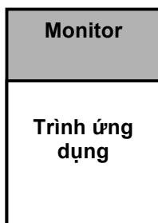

|    | H ệ | đ i ề | u      | hành |
|----|-----|-------|--------|------|
| B  | ộ   | nh    | ớ tr ố | ng   |
| Ch | ươ  | ng    | trình  | 3    |
| Ch | ươ  | ng    | trình  | 2    |
| Ch | ươ  | ng    | trình  | 1    |

Hình 1.8**:** Đa chương trình

Trên hình 1.9 là minh họa hiệu suất sử dụng thời gian CPU cho trường hợp đơn chương trình và đa chương trình với 3 chương trình cùng được tải vào bộ nhớ một lúc. Thời gian thực hiện chương trình xen kẽ với thời gian chờ đợi vào/ra. Dễ dàng nhận thấy, thời gian chờ đợi của CPU trong chế độ đa chương trình giảm đáng kể so với trong trường hợp đơn chương trình.

Trong trường hợp đa chương trình, hệ điều hành trở nên phức tạp hơn rất nhiều so với trường hợp đơn chương trình. Trước hết, cần quyết định xem bao nhiêu chương trình được tải vào bộ nhớ. Sau khi đã các chương trình đã ở trong bộ nhớ và sẵn sàng thực hiện (gọi là các tiến trình), hệ điều hành phải phân phối CPU cho các tiến trình. Việc phân phối CPU như vậy gọi là *điều độ tiến trình* hay *điều độ CPU* và sẽ được trình bầy chi tiết trong chương 2. Ngoài ra, hệ điều hành cần đảm bảo để tiến trình không xâm phạm vùng nhớ và tài nguyên đã cấp cho tiến trình khác.

Việc thực hiện đa chương trình đòi hỏi những sự hỗ trợ nhất định từ phần cứng, đặc biệt là khả năng vào/ra bằng ngắt và cơ chế DMA. Nếu không có cơ chế này, CPU sẽ phải trực tiếp điều khiển quá trình vào/ra thông tin và dữ liệu. Hiệu quả của đa chương trình do đó sẽ bằng không.

## **Chia sẻ thời gian và đa nhiệm**

Mặc dù đa chương trình cho phép sử dụng hiệu quả CPU và các tài nguyên khác của hệ thống, song kỹ thuật này không cho phép người dùng tương tác với hệ thống. Trong các máy tính thế hệ sau, các terminal cho phép người dùng làm việc trực tiếp với máy tính thông qua màn hình và bàn phím. Nhiều người dùng có thể nhập thông tin và lệnh từ bàn phím, kết quả sau đó được đưa trực tiếp ra màn hình. Đối với các hệ thống này, thời gian đáp ứng, tức là thời gian từ khi người dùng gõ lệnh cho tới khi máy tính phản xạ lại cần phải tương đối nhỏ. Kỹ thuật đa chương trình mô tả ở trên không đảm bảo được thời gian đáp ứng ngắn như vậy. Do vậy, một kỹ thuật khác gọi là *chia sẻ thời gian* được sử dụng. Các hệ thống đa chương trình có chia sẻ thời gian được gọi là hệ thống *đa nhiệm* (multitasking), theo đó các chương trình được gọi là các *nhiệm vụ* (task).

| Ch ờ đợ i                                 |      |      |      |                                        |
|-------------------------------------------|------|------|------|----------------------------------------|
| Ch ạ y                                    |      |      |      | Ch ạ y                                 |
| (a)                                       | Đơ   | n ch | ươ   | ng trình                               |
| Ch ờ                                      | đợ i |      |      | Ch ờ đợ i                              |
| Ch ươ ng trình A Ch ạ y Ch ờ              | đợ i |      |      | Ch ạ y Ch ờ đợ i                       |
| Ch ạ y Ch                                 | ờ    | đợ i |      | Ch ạ y Ch ờ đợ i                       |
| Ch ạ                                      | y    |      | Ch   | ờ đợ i Ch ạ y Ch ờ đợ i                |
| Ch ươ ng trình B                          |      |      |      |                                        |
| Ch ươ ng trình C Ch ờ đợ i                |      |      |      |                                        |
| Toàn h ệ th ố ng Ch ạ y A Ch ạ y B Ch ạ y | C    | Ch   | ờ đợ | i Ch ạ y A Ch ạ y B Ch ạ y C Ch ờ đợ i |
| (b)                                       | Đ    | a ch | ươ   | ng trình                               |
| H × nh 1.9: PTIT                          |      |      |      |                                        |
| Ch ế độ                                   | đơ   | n ch | ươ   | ng trình và đ a ch ươ ng trình         |

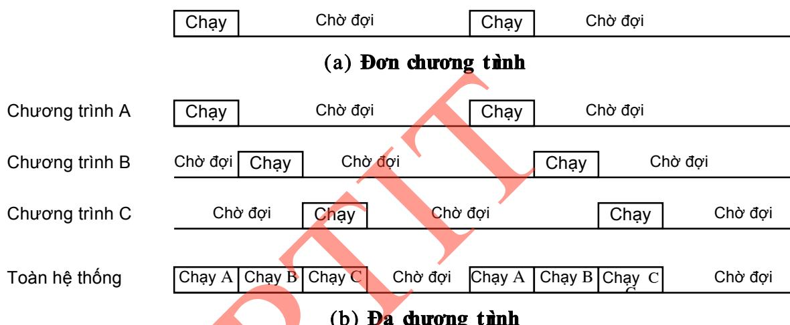

Chế độ đơn chương trình và đa chương trình

Chia sẻ thời gian có thể coi như đa chương trình cải tiến. CPU lần lượt thực hiện các công việc khác nhau trong những khoảng thời gian ngắn gọi là lượng tử thời gian. Do việc chuyển đổi giữa các công việc diễn ra với tần số cao và tốc độ CPU lớn nên thời gian đáp ứng nằm trong giới hạn có thể chấp nhận, tất cả người dùng đều có cảm giác máy tính chỉ thực hiện chương trình của mình.

Như vậy, trong chế độ chia sẻ thời gian, CPU được chia sẻ giữa những người dùng khác nhau tương tác trực tiếp với hệ thống. Hệ điều hành sử dụng các kỹ thuật đa chương trình và điều độ CPU để cung cấp CPU cho người dùng trong những khoảng thời gian ngắn. Mỗi người dùng sẽ có chương trình của mình (một hoặc nhiều) trong bộ nhớ. Các chương trình đang thực hiện như vậy được gọi là tiến trình. Hệ điều hành chuyển quyền sử dụng CPU giữa các tiến trình khác nhau.

Hệ điều hành hỗ trợ chia sẻ thời gian phức tạp hơn hệ điều hành đa chương trình đơn thuần rất nhiều. Để đảm bảo chia sẻ CPU, hệ điều hành phải có các cơ chế điều độ tiến trình phức tạp, cho phép đồng bộ hoá, đảm bảo liên lạc giữa các tiến trình, cũng như tránh tình trạng bế tắc.

## **Tính toán di động**

Một xu hướng mới của các hệ thống máy tính là tính toán di động, tức là môi trường tính toán trên các thiết bị cầm tay như điện thoại di động thông minh (smart phone), máy tính bảng (tablet computer), hay thiết bị trợ giúp cá nhân. Do sự phát triển của phần cứng, thiết bị di động dù có kích thước nhỏ nhưng có khả năng tính toán và lưu trữ thông tin khá mạnh, ngày càng gần với khả năng của máy tính thông thường. Ngoài các chức năng truyền thống như truyền thông, thư điện tử, duyệt web, thiết bị di động dần cung cấp thêm nhiều chức năng chụp ảnh, sách điện tử, chơi nhạc, video, chơi game, các ứng dụng văn phòng đơn giản, các chức năng dựa trên việc xác định vị trí của thiết bị (thông qua hệ thống định vị GPS) v.v. PTIT

Hệ điều hành cho các hệ thống tính toán di động thường chú trọng tới một số điểm khác biệt so với hệ điều hành thông thường. Trước hết, giao diện với người dùng cần thân thiện, giúp người dùng dễ dàng tương tác với thiết bị thông qua thiết bị vào/ra thông tin hạn chế hơn so với PC. Ví dụ điển hình là việc hỗ trợ rộng rãi màn hình cảm ứng đa điểm và bàn phím ảo. Một đặc điểm khác của hệ điều hành cho thiết bị dạng này là khả năng hỗ trợ các giao thức truyền thông như các giao thức không dây (wifi) hay giao thức truyền thông trong các mạng tế bào (cellular network) các thế hệ 2G, 3G, 4G, cũng như các ứng dụng phục vụ truyền thông, điển hình là thư điện tử, trình duyệt web, tin nhắn, thoại. Hệ điều hành cũng được thiết kế để tối ưu việc sử dụng năng lượng, tăng thời gian sử dụng pin.

Các hệ điều hành phổ biến nhất cho tính toán di động hiện nay là Android của Google, iOS của hãng Apple, và mới đây có thêm Windows phone của Microsoft.

## **Ảo hóa**.

Ảo hóa (virtualization) là kỹ thuật cho phép chạy một hệ điều hành trên một máy ảo, thay vì phải chạy trực tiếp trên phần cứng như thông thường. Máy ảo được tạo ra nhờ phần mềm chạy trên hệ điều hành khác, hoặc chạy trực tiếp trên phần cứng. Ví dụ, trên một máy tính đang chạy hệ điều hành Linux ta có thể chạy một máy ảo với hệ điều hành Windows và thực hiện các ứng dụng viết cho Windows trong máy ảo này. Hệ điều hành chạy trực tiếp trên phần cứng được gọi là *hệ chủ* (host). Một hệ chủ có thể hỗ trợ nhiều *máy ảo* (virtual machines), mỗi máy ảo tương ứng với một hệ điều hành khác.

Kỹ thuật ảo hóa cho phép chạy đồng thời nhiều hệ điều hành trên cũng một máy tính. Các hệ điều hành có thể khác nhau - như Windows và Linux - hoặc là các bản của cùng một hệ điều hành, ví dụ chạy nhiều bản Windows trên một máy. Nhờ vậy, trong trường hợp có nhiều ứng dụng được viết cho các hệ điều hành khác nhau, thay vì phải viết và dịch lại ứng dụng cho hệ điều hành đang chạy trên máy, ta có thể chạy các máy ảo với hệ điều hành tương ứng với ứng dụng.

Các hệ thống hỗ trợ ảo hóa thường có cấu trúc theo một trong hai dạng như trên hình 1.10. Phần quan trọng nhất là *hệ quản lý máy ảo* (virtual machine manager, còn gọi là virtual machine monitor, hay hypervisor). Theo dạng 1, hệ quản lý máy ảo chạy trực tiếp trên phần cứng như một hệ điều hành và tạo ra các máy ảo (virtual machines), mỗi máy ảo có thể chạy một hệ điều hành riêng rẽ gọi là hệ điều hành khách. Hệ cũng có thể chạy như một ứng dụng của hệ điều hành chủ theo kiến trúc dạng 2 và tạo ra các máy ảo (virtual machine), mỗi máy có thể chạy một hệ điều hành khách riêng rẽ. Hệ quản lý máy ảo chịu trách nhiệm liên lạc giữa các hệ điều hành trên máy ảo với CPU, quản lý việc sử dụng tài nguyên của các hệ điều hành này và ngăn chặn việc xâm nhập trái phép giữa các máy ảo khác nhau. Hiện nay, công nghệ và sản phẩm ảo hóa chủ yếu do hãng VMware và Microsoft cung cấp.

| ó th ể ch ạ y m ộ t h ệ đ i ề u hành khách riêng   | r ẽ |        |  | H | ệ qu ả n l ý máy ả o ch ị u trách nhi ệ m liên l     |
|----------------------------------------------------|-----|--------|--|---|------------------------------------------------------|
| i ữ a các h ệ đ i ề u hành trên máy ả o v ớ i CPU, |     | qu     |  | ả | n l ý vi ệ c s ử d ụ ng tài nguyên c ủ a các h ệ đ i |
| ành này và ng ă n ch ặ n vi ệ c xâm nh ậ p trái    |     | phép   |  |   | gi ữ a các máy ả o khác nhau. Hi ệ n nay, cô         |
| gh ệ và s ả n ph ẩ m ả o hóa ch ủ y ế u do hãng    |     | VMware |  |   | và Microsoft cung c ấ p.                             |
| ứ ng d ụ ng                                        |     |        |  |   |                                                      |
| ứ ng d ụ ng Trình                                  |     |        |  |   |                                                      |
| ứ ng d ụ ng                                        |     |        |  |   |                                                      |
| H ệ đ i ề u                                        |     |        |  |   |                                                      |
| H ệ đ i ề u                                        |     |        |  |   |                                                      |
| H ệ đ i ề u                                        |     |        |  |   |                                                      |
| Máy ả o Máy ả o Máy ả o                            |     |        |  |   |                                                      |
| H ệ qu ả n l ý máy ả o (virtual machine            |     |        |  |   |                                                      |
| monitor hypervisor)                                |     |        |  |   |                                                      |
| Ph ầ n c ứ ng                                      |     |        |  |   |                                                      |
|                                                    |     |        |  |   | ứ ng d ụ ng                                          |
|                                                    |     |        |  |   | ứ ng d ụ ng Trình                                    |
|                                                    |     |        |  |   | ứ ng d ụ ng                                          |
|                                                    |     |        |  |   | H ệ đ i ề u                                          |
|                                                    |     |        |  |   | H ệ đ i ề u                                          |
|                                                    |     |        |  |   | H ệ đ i ề u                                          |
|                                                    |     |        |  |   | Máy ả o Máy ả o Máy ả o                              |
|                                                    |     |        |  |   | H ệ qu ả n l ý máy ả o (virtual machine              |
|                                                    |     |        |  |   | monitor hypervisor)                                  |
|                                                    |     |        |  |   | H ệ đ i ề u hành ch ủ                                |
|                                                    |     |        |  |   | Ph ầ n c ứ ng                                        |

(a) Ảo hóa dạng 1: VMM chạy trực tiếp trên phần cứng

(b) Ảo hóa dạng 2: VMM chạy như một ứng dụng của hệ điều hành chủ

Hình 1.10: Kiến trúc hệ thống hỗ trợ ảo hóa

# **Điện toán đám mây**

năm gần đây và là một trong những xu hướng phát triển quan trọng của các hệ thống tính toán. Trong điện toán đám mây, việc tính toán, lưu trữ dữ liệu cũng như các chương trình ứng dụng được cung cấp qua mạng, chẳng hạn qua Internet, dưới dạng dịch vụ.

Ví dụ, dịch vụ đám mây của hãng Amazon cho phép người dùng thuê một máy tính với cấu hình do người dùng tự xác định. Thời gian thuê có thể từ một giờ tới hàng năm. Như vậy, thay vì mua một máy tính, người dùng có thể thuê máy tính từ dịch vụ Amazon elastic computing cloud (EC2) của Amazon trong khoảng thời gian cần thiết. Người dùng sau đó có thể chạy các chương trình của mình trên máy tính đã thuê và chỉ trả tiền cho thời gian thuê thay vì phải mua máy vĩnh viễn. Điểm quan trọng là máy tính do EC2 cung cấp thực chất là một máy ảo. Từ các server của mình, chương trình quản lý EC2 của Amazon sẽ sử dụng công nghệ ảo hóa để tạo ra một máy ảo có cấu hình như người dùng yêu cầu vào thời gian mà người dùng yêu cầu. Công nghệ này đảm bảo tính mềm dẻo và thuận lợi hơn nhiều so với việc mua hoặc thuê một máy tính thực.

Tương tự như vậy, thay vì mua một phần mềm, chẳng hạn Microsoft Office, người dùng có thể thuê phần mềm này trong một thời gian nhất định và chỉ trả tiền cho thời gian thuê. Office 365 của Microsoft là một ví dụ cho dạng dịch vụ phần mềm này.

Điện toán đám mây bao gồm ba dạng dịch vụ chính sau:

- SaaS: viết tắt của Software as a Service, có thể dịch là "phần mềm như một dịch vụ": cho thuê/cung cấp phần mềm ứng dụng qua mạng.
- PaaS, viết tắt của Platform as a Service, có thể dịch là "nền tảng như một dịch vụ": là hình thức cho thuê/cung cấp một tập phần mềm đã cài sẵn qua mạng, ví dụ hệ điều hành mạng + hệ quản trị cơ sở dữ liệu để làm máy chủ dữ liệu.
- IaaS, viết tắt của Infrastructure as a Service, có thể dịch là "hạ tầng như một dịch vụ": là dịch vụ cho thuê/cung cấp phần cứng (CPU, bộ nhớ ngoài) qua mạng. PTIT

Điện toán đám mây dựa trên một loạt công nghệ, trong đó quan trọng nhất là công nghệ ảo hóa. Các hệ thống điện toán đám mây có thể được xây dựng dựa trên hệ điều hành truyền thống, sau đó bổ sung các phần mềm thực hiện ảo hóa như hệ quản lý máy ảo (VMM) đã nhắc tới ở trên. Các hệ thống quản lý máy ảo cũng có thể tích hợp với hệ điều hành như trường hợp Windows Azure của Microsoft như thể hiện trên hình 10.a.

## 1.7. CẤU TRÚC HỆ ĐIỀU HÀNH

Hệ điều hành là một hệ thống phần mềm phức tạp được tạo thành từ nhiều thành phần đảm đương những nhiệm vụ hoặc cung cấp những dịch vụ khác nhau. Các thành phần được tổ chức và liên kết với nhau theo một cách nhất định để tạo ra hệ điều hành hoàn chỉnh. Từng thành phần cũng như cách tổ chức toàn bộ hệ thống có thể rất khác nhau, tùy vào hệ điều hành cụ thể. Cách tổ chức, liên kết các thành phần xác định cấu trúc của hệ điều hành. Trong phần này ta sẽ xem xét các thành phần thường có của một hệ điều hành tiêu biểu, sau đó xem xét một số kiểu cấu trúc thông dụng nhất.

Một hệ điều hành tiêu biểu thường có các thành phần thực hiện những nhiệm vụ sau:

#### **a. Quản lý tiến trình**

Một chương trình đang trong quá trình thực hiện được gọi là tiến trình. Điểm khác nhau cơ bản giữa chương trình và tiến trình ở chỗ chương trình là một thực thể tĩnh, có thể dưới dạng những bit, những byte ghi trên đĩa, còn chương trình là một thực thể động đang tiến hành việc tính toán, xử lý v.v. và được cung cấp một số tài nguyên như thời gian CPU, bộ nhớ v.v. (khái niệm tiến trình sẽ được xem xét kỹ trong các chương sau). Bản thân các tiến trình của hệ điều hành trong khi chạy cũng tạo ra các tiến trình.

Các công việc liên quan tới quản lý tiến trình bao gồm:

§ Tạo và xoá tiến trình (bao gồm cả tiến trình người dùng lẫn tiến trình hệ thống - tiến trình hệ điều hành). Lưu thông tin về các tiến trình. § Tạm dừng và khôi phục các tiến trình bị dừng. Một tiến trình bị dừng sẽ bị tạm không được thực hiện tiếp và có thể bị chuyển từ bộ nhớ trong ra đĩa. Khi được khôi phục, tiến trình sẽ thực hiện tiếp từ điểm bị dừng thay vì thực hiện lại từ đầu. Người sử dụng Linux có thể treo một tiến trình bằng cách sử dụng lệnh suspend. § Lập lịch cho các tiến trình (process scheduling), hay còn gọi là lập lịch cho CPU, là quyết định tiến trình nào được cấp phát CPU để chạy § Đồng bộ hoá các tiến trình: khi có nhiều tiến trình cũng tồn tại cần đảm bảo để các tiến trình được thực hiện sao cho không dẫn tới xung đột về tài nguyên hoặc có thể hợp tác với nhau để dẫn tới kết quả mong muốn. § Giải quyết các bế tắc, ví dụ như khi có xung đột về tài nguyên. § Tạo cơ chế liên lạc giữa các tiến trình. PTIT

## **b. Quản lý bộ nhớ**

Bộ nhớ (nếu không nói gì thêm thì được hiểu là bộ nhớ trong hay bộ nhớ sơ cấp, hay RAM) là nơi chứa các tiến trình và dữ liệu. Đây là tài nguyên quan trọng thứ hai sau CPU. Bộ nhớ là khối ô nhớ được nhóm lại thành các từ hay các byte và được đánh địa chỉ. Địa chỉ được sử dụng khi cần đọc hoặc ghi thông tin vào bộ nhớ. Trong những hệ điều hành đa nhiệm, nhiều tiến trình có thể cùng thực hiện một lúc và được chứa trong bộ nhớ.

Thành phần quản lý bộ nhớ của hệ điều hành thực hiện các công việc sau:

- Cấp phát, phân phối bộ nhớ cho các tiến trình.
- Tạo ra bộ nhớ ảo và ánh xạ địa chỉ bộ nhớ ảo vào địa chỉ bộ nhớ thực. Ngăn chặn các truy cập bộ nhớ không hợp lệ, chẳng hạn truy cập sang vùng bộ nhớ không thuộc tiến trình.
- Cung cấp và giải phóng bộ nhớ theo yêu cầu của các tiến trình.
- Quản lý không gian nhớ đã được cấp và không gian còn trống.

trao đổi thông tin giữa các tiến trình với thiết bị vào/ra. Nhờ có hệ điều hành, người dùng không phải quan tâm tới các chi tiết liên quan tới thiết bị vào/ra cụ thể. Việc điều khiển trực tiếp thiết bị do các chương trình điều khiển thiết bị (driver) thực hiện. Ngoài ra còn có các giao diện lớp trên driver do hệ điều hành cung cấp. Các thành phần này nằm trong hệ thống vào ra của hệ điều hành. Một nhiệm vụ khác của hệ vào ra là tăng hiệu quả trao đổi thông tin với thiết bị ngoại vi nhờ hệ thống vùng đệm (buffer) và bộ nhớ cache. Như vậy, phân hệ quản lý vào ra của hệ điều hành gồm các thành phần sau:

- Các driver cho thiết bị cụ thể.
- Giao diện cho driver ở mức cao hơn.
- Mô đun quản lý vùng đệm, cache.

#### **d. Quản lý file và thư mục**

Để tránh cho người dùng không phải quan tâm tới đặc điểm các thiết bị nhớ ngoài vốn khác nhau và đa dạng, hệ điều hành cho phép sử dụng một khái niệm lôgic khi lưu trữ thông tin trên các thiết bị nhớ này, đó là file. File là tập hợp các thông tin có liên quan đến nhau, là nơi có thể ghi thông tin vào hoặc đọc thông tin ra. Các chương trình và người dùng không cần quan tâm tới việc file được cất giữ trên bộ nhớ ngoài như thế nào. Hệ điều hành sẽ chịu trách nhiệm ánh xạ file lên các thiết bị nhớ này.

Khi số lượng file lớn tới một mức nào đó, cần có cơ chế tổ chức các file sao cho dễ tìm kiếm và sử dụng. Chẳng hạn, nếu so sánh mỗi file như một quyển sách, khi số sách tương đối lớn như trong thư viện, người ta cần phân loại sách theo thể loại, tác giả v.v. cho dễ tìm kiếm. Hệ điều hành phân chia các file thành các nhóm gọi là thư mục. Mỗi thư mục chứa các file có cùng một đặc điểm nào đó, ví dụ thư mục chứa các văn bản, thư mục chứa chương trình của cùng một hãng. PTIT

Hệ thống quản lý file và thư mục đảm nhiệm các chức năng chính sau:

§ Tạo, xoá file. § Tạo, xoá thư mục. § Cung cấp các chức năng thao tác với file và thư mục, ví dụ đọc/ghi file. § Ánh xạ file và thư mục sang bộ nhớ ngoài. § Sao lưu dự phòng các files.

#### **e. Hỗ trợ mạng và xử lý phân tán**

Một trong các xu hướng phát triển của các hệ thống tính toán hiện nay là kết hợp máy tính vào các mạng máy tính. Điều này cho phép trao đổi, chia sẻ thông tin giữa các máy, đồng thời tạo khả năng xử lý phân tán. Các máy tính được nối với nhau qua các môi trường truyền thông cho phép truyền thông tin và dữ liệu. Đối với những bài toán lớn, đòi hỏi tốc độ tính toán cao hoặc khả năng lưu trữ dữ liệu lớn có thể phân tán việc xử lý trên các máy tính đã được nối mạng. Xử lý phân tán cho phép tận dụng tài nguyên của các máy riêng lẻ để tạo nên một hệ thống tính toán có khả năng lớn hơn nhiều.

mạng, hỗ trợ các giao thức truyền thông, quản lý việc truyền thông, cân bằng tải.

## **f. Giao diện với người dùng**

Thành phần này được gọi bằng nhiều tên khác nhau như bộ dịch lệnh (command intepreter), vỏ (shell). Thực chất đây là giao diện giữa người dùng với hệ điều hành (cần phân biệt với các lời gọi hệ thống - system calls - là giao diện giữa các chương trình và hệ điều hành). Bộ dịch lệnh hay vỏ nhận lệnh từ người dùng và thực hiện các lệnh này, có thể bằng cách sử dụng dịch vụ do các phần khác của hệ điều hành cung cấp. Có thể lấy ví dụ các bộ dịch lệnh như **cmd.exe** của Windows, **bash** của Linux. Các lệnh được người dùng gõ trực tiếp dưới dạng văn bản. Số lượng lệnh có thể từ vài chục đến hàm trăm, từ những lệnh thông dụng như liệt kê thực mục (dir, ls), chép file (copy) tới những lệnh để thiết lập cấu hình mạng hoặc các thành phần khác của hệ thống. Trên hình 1.11 là ví dụ giao diện bộ dịch lệnh cmd.exe của Windows.

Hình 1.11. Bộ dịch lệnh cmd.exe của Windows

Trong các hệ điều hành hiện nay, bộ dịch lệnh thường được thay thế bằng các hệ giao diện đồ hoạ. Thay vì gõ các lệnh dưới dạng văn bản, người sử dụng làm việc với các đối tượng đồ hoạ như cửa sổ, biểu tượng rất trực giác và dễ hiểu. Các giao diện đồ họa thường được biết đến là **Windows Explorer** cho Windows (xem hình 1.12), **X windows** cho Linux.

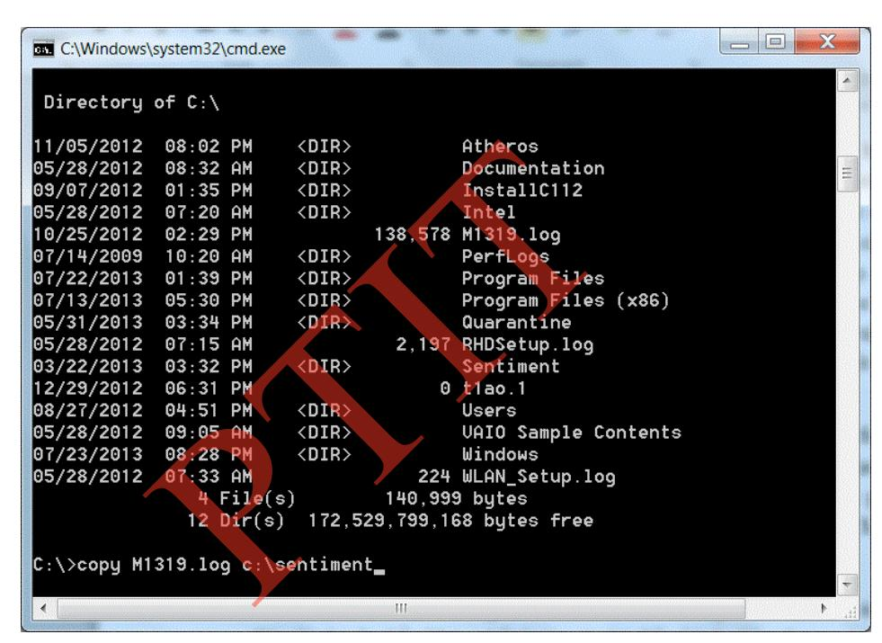

Hình 1.12. Giao diện đồ họa của Windows 8

#### **g. Các chương trình tiện ích và chương trình ứng dụng**

Hệ điều hành thường chứa sẵn một số chương trình tiện ích và chương trình ứng dụng. Đây là thành phần không bắt buộc của hệ điều hành. Các chương trình tiện ích cung cấp cho người dùng một số dịch vụ giúp cho việc sử dụng hệ thống dễ dàng, hiệu quả hơn. Chẳng hạn có các tiện ích giúp nén tệp, chép các tệp dài ra đĩa mềm, tiện ích giúp lưu trữ dữ liệu.

Các chương trình ứng dụng hay có trong thành phần của hệ điều hành là các chương trình dịch (trình dịch gcc dùng cho ngôn ngữ C, C++ của Linux), các chương trình soạn thảo văn bản (**Notepad** của Windows, **vi** của Linux), các chương trình trò chơi. Các bản phân phối hệ điều hành Linux (Linux distributions) do các tổ chức khác nhau cung cấp như RedHat, Ubuntu chứa các chương trình tiện ích và ứng dụng tương đối khác nhau. PTIT

Trong nhiều trường hợp, việc xác định chương trình nào là tiện ích, chương trình nào thuộc hệ điều hành không đơn giản do không có tiêu chí rõ ràng để phân biệt.

# **1.7.2. Nhân của hệ điều hành**

*Nhân (kernel) là phần cốt lõi, là phần thực hiện các chức năng cơ bản nhất, quan trọng nhất của hệ điều hành và thường xuyên được giữ trong bộ nhớ*.

Hệ điều hành là một hệ thống phức tạp, bao gồm nhiều thành phần, nhiều chương trình cấu thành. Vai trò của những thành phần rất khác nhau. Có những phần không thể thiếu, là cơ sở để cho toàn bộ hệ thống hoạt động, chẳng hạn như phần chịu trách nhiệm quản lý CPU, quản lý bộ nhớ. Bên cạnh đó, nhiều chương trình thành phần của hệ điều hành cung cấp các chức năng kém quan trọng hơn. Các chương trình này có thể cần cho một số người dùng nhất định trong một số cấu hình nhất định, xong lại không cần cho người dùng khác trong các trường hợp khác. Ví dụ, một người sử dụng máy tính nghiệp dư sẽ không cần tới các chương trình dịch do hệ điều hành cung cấp. Hay một máy tính không nối mạng sẽ không bao giờ cần tới các dịch vụ mạng của hệ điều hành.

Từ nhận xét trên, thay vì tải toàn bộ hệ điều hành - có thể chiếm rất nhiều chỗ - vào và chứa thường xuyên trong bộ nhớ, người ta chỉ chọn những thành phần quan trọng không thể thiếu được. Các phần này tạo thành nhân của hệ điều hành. Những phần còn lại không thuộc vào nhân có thể được tải vào và chạy khi cần thiết.

**Chế độ nhân và chế độ người dùng.** Thông thường, nhân của hệ điều hành được thực hiện trong *chế độ nhân*, hay còn gọi là *chế độ đặc quyền* (privilege mode), *chế độ hệ thống* (system mode). Trong khi đó, các chương trình khác như các trình ứng dụng được thực hiện trong *chế độ người dùng* (user mode), hay còn gọi là *chế độ bình thường* (normal mode). Máy tính hiện đại thường được thiết kế với hai chế độ thực hiện chương trình: *chế độ nhân* và *chế độ người dùng*. Chế độ nhân là chế độ mà chương trình thực hiện trong đó có đầy đủ quyền truy cập và điều khiển phần cứng máy tính, ví dụ có thể thay đổi nội dung tất cả các thanh ghi của CPU, hay có thể ghi vào bộ nhớ vật lý. Ngược lại, chương trình thực hiện trong chế độ người dùng bị hạn chế rất nhiều quyền truy cập và điều khiển phần cứng. Việc quy định chế độ cụ thể phụ thuộc vào một bit đặc biệt trong một thanh ghi của CPU: nếu bit này có giá trị bằng 0 thì chế độ là chế độ nhân, giá trị bit bằng 1 tương ứng với chế độ bình thường.

Việc phân biệt chế độ nhân và chế độ người dùng nhằm mục đích ngăn không cho chương trình ứng dụng vô tình hoặc cố ý thực hiện những thao tác làm ảnh hưởng tới hệ thống. Đây là điều kiện cần thiết để hệ thống máy tính hoạt động ổn định và hiệu quả.

Do nhân của hệ điều hành được thực hiện trong chế độ đặc quyền nên có toàn quyền kiểm soát và quản lý tài nguyên phần cứng. Trình ứng dụng phải thông qua nhân để có thể tiếp cận tài nguyên hệ thống. Ví dụ, khi cần thực hiện vào/ra thông tin, trình ứng dụng chạy trong chế độ người dùng không có quyền truy cập thiết bị ngoại vi để thực hiện vào ra. Thay vào đó, trình ứng dụng yêu cầu hệ điều hành thực hiện thao tác vào/ra thông qua lời gọi hệ thống. Khi đó, hệ thống chuyển từ chế độ người dùng sang chế độ nhân, mô đun vào/ra của hệ điều hành thực hiện yêu cầu này và trả lại kết quả cho trình ứng dụng (xem hình 1.13). Do việc truy cập tài nguyên phải thông qua hệ điều hành nên các yêu cầu không hợp lệ sẽ bị phát hiện và ngăn chặn. PTIT

Một vấn đề đặt ra khi thiết kế hệ điều hành là quyết định phần nào của hệ điều hành thuộc vào nhân, phần nào không. Nói cách khác, nhân phải gồm những gì? Nhân càng lớn, càng gồm nhiều thành phần thì càng đảm đương được nhiều chức năng, và do vậy không cần gọi thêm các thành phần khác. Tuy nhiên, nhân lớn thì chiếm nhiều bộ nhớ, ảnh hưởng tới không gian nhớ dành cho các chương trình ứng dụng. Ngoài ra, tổ chức nhân lớn ảnh hưởng tới tính mềm dẻo, do việc thay đổi bất cứ thành phần nào của hệ điều hành đòi hỏi phải thay đổi nhân. Việc thay đổi, bổ sung các thành phần của hệ điều hành sẽ dễ dàng hơn nếu các thành phần được tổ chức dưới dạng các mô đun riêng lẻ (các chương trình) không thuộc nhân và chỉ chạy khi cần thiết. Do vậy, khi thiết kế hệ điều hành cần cân nhắc giữa các ưu nhược điểm của hai cách tổ chức: 1) nhân lớn, nhiều chức năng; và 2) nhân nhỏ, chuyển chức năng cho các mô đun khác.

Trong phần tiếp theo, ta sẽ xem xét một số cách tổ chức nhân và hệ điều hành.

Hình 1.13. Việc thực hiện lời gọi hệ thống dẫn tới chuyển từ chế độ người dùng sang chế độ nhân và ngược lại

# **1.7.3. Một số kiểu cấu trúc hệ điều hành**

Các thành phần đã nêu ở phần trên cần được tổ chức, kết hợp với nhau theo một cách nào đó để tạo ra một hệ thống thống nhất là hệ điều hành. Trong phần này, ta sẽ xem xét một số kiểu cấu trúc hệ điều hành thường được sử dụng. PTIT

# **1.7.3.1. Cấu trúc nguyên khối**

*Cấu trúc nguyên khối* (monolithic), hay cấu trúc đơn giản, là cấu trúc trong đó toàn bộ các chương trình và dữ liệu của hệ điều hành có chung một không gian nhớ và do vậy có thể coi như một khối duy nhất. Hệ điều hành lúc đó trở thành một chương trình lớn, là tập hợp các thủ tục hay các chương trình con. Mỗi chương trình con có thể tự do gọi chương trình con khác khi cần thiết.

Cách tổ chức hệ điều hành như vậy cho ta hình ảnh tương tự với chương trình được viết theo kiểu lập trình cấu trúc, trong đó toàn bộ chương trình tạo thành từ các chương trình con, ví dụ chương trình viết trên ngôn ngữ C hay Pascal. Các chương trình con được dịch, sau đó liên kết thành một chương trình lớn. Việc che dấu thông tin hoàn toàn không có, tức là bất cứ chương trình con nào cũng có thể gọi chương trình con khác hoặc truy cập vào các dữ liệu chung của chương trình.

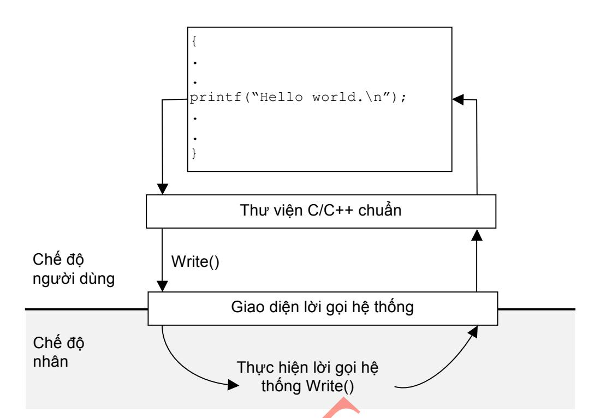

| trình        |   | ứ ng             |
|--------------|---|------------------|
| d            | ụ | ng               |
|              |   | trình ứ ng       |
|              |   | d ụ ng           |
|              |   | H ệ đ i ề u hành |
| Ch ế độ      |   |                  |
| ng ườ i dùng |   |                  |
| Ch ế độ đặ c |   |                  |
| quy ề n      |   |                  |

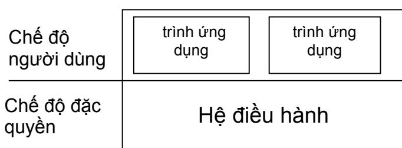

Khi chương trình ứng dụng cần dùng tới các dịch vụ của hệ điều hành, chương trình ứng dụng sẽ sử dụng lời gọi hệ thống do hệ điều hành cung cấp. Lời gọi hệ thống được chuyển cho chương trình con tương ứng của hệ điều hành thực hiện. Chương trình con này sẽ gọi thêm các chương trình con khác để thực hiện nhiệm vụ nếu cần thiết.

Ưu điểm lớn nhất của cấu trúc nguyên khối là tốc độ thực hiện cao. Do có chung không gian địa chỉ, việc truy cập dữ liệu hoặc gọi chương trình con cần thiết được thực hiện nhanh chóng, không phải chịu những phí tổn về thời gian và bộ nhớ (ngăn xếp) như khi chuyển đổi giữa những mô đun có không gian nhớ khác nhau (giữa các chương trình khác nhau).

Nhược điểm của cách tổ chức này là thiếu tính mềm dẻo và khó làm cho hệ thống có độ tin cậy cao. Do toàn bộ nhân là một chương trình lớn nên việc thay đổi bất cứ thành phần nào cũng ảnh hưởng tới toàn bộ nhân. Điều này làm cho hệ thống không mềm dẻo, khó thay đổi. Ngoài ra, do toàn bộ hệ điều hành là một khối, mỗi chương trình con trong khối lại có thể truy cập tới dữ liệu và chương trình con khác, việc xuất hiện lỗi sẽ làm cho cả hệ thống tê liệt. Việc liên kết các thành phần thành một khối lớn còn khiến cho nhân luôn có kích thước lớn. Kể cả các thành phần không cần đến cũng được tải vào bộ nhớ cùng với các thành phần khác.

Để khắc phục các nhược điểm nói trên, trong một số hệ điều hành cấu trúc khối, người ta tổ chức các mô đun có thể tải từ đĩa và gắn vào nhân khi cần thiết. Trong trường hợp không dùng tới có thể xoá các mô đun khỏi nhân. Tuy là các mô đun riêng nhưng khi đã được tải vào bộ nhớ, các mô đun này nhập vào với nhân thành một khối có cùng không gian địa chỉ. Điều này đảm bảo cho hệ điều hành giữ được cấu trúc nguyên khối mà vẫn không có các thành phần thừa. Một ví dụ cho cách tổ chức kiểu này là hệ điều hành Linux. PTIT

Cấu trúc của Linux được thể hiện trên hình 1.15. Nhân của Linux có thể mở rộng nhờ các mô đun. Các mô đun này được tải vào bộ nhớ khi cần và khỏi bộ nhớ khi không cần nữa. Chẳng hạn khi ta sử dụng đĩa CD-ROM, mô đun chịu trách nhiệm điều khiển vào ra với đĩa sẽ được tải vào bộ nhớ. Quá trình này không đòi hỏi khởi động lại máy để có thể sử dụng thiết bị mới thêm vào. Các mô đun được tải vào trong hai trường hợp: khi người dùng sử dụng các lệnh **insmod** và **rmmod** hoặc khi nhân cần các mô đun và tự tải vào cho mình. Sau khi được tải vào bộ nhớ, chương trình và dữ liệu của mô đun tải vào có cùng không gian nhớ với nhân. Các hàm chứa trong mô đun sẽ được các hàm khác của nhân "nhìn thấy" và gọi nếu cần. Nói cách khác mô đun và các thành phần khác của nhân tạo thành một "khối" nhân mới lớn hơn.

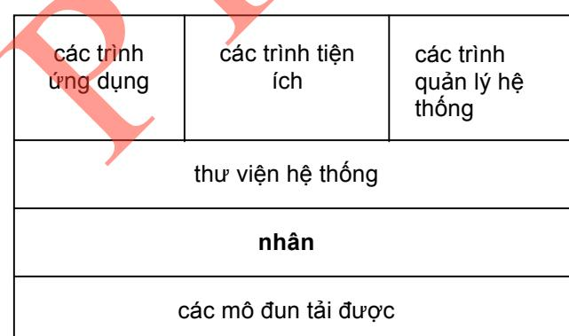

Hình 1.15: Cấu trúc hệ điều hành Linux

Cách tổ chức này cho phép tận dụng ưu thế về tốc độ của cấu trúc khối đồng thời đảm bảo cho nhân không chứa các phần thừa.

#### **1.7.3.2. Cấu trúc phân lớp**

Để việc xây dựng một hệ thống phần mềm lớn và phức tạp như hệ điều hành được đơn giản hơn, nguyên tắc thường được sử dụng là nguyên tắc mô đun hóa, theo đó toàn hệ thống được phân thành các mô đun sao cho từng mô đun có thể được phát triển, thay đổi, kiểm tra lỗi tương đối độc lập với các mô đun khác. Một trong các kiểu cấu trúc cho phép áp dụng nguyên tắc này là *cấu trúc phân lớp*.

Cấu trúc phân lớp là cấu trúc trong đó các thành phần của hệ điều hành được phân thành các lớp nằm chồng lên nhau hay tiếp xúc với nhau theo một thứ tự nhất định (hình 1.16). Lớp trên cùng (hay ngoài cùng) là lớp các chương trình ứng dụng, lớp dưới cùng (hoặc trong cùng) tương ứng với phần cứng. Việc liên lạc giữa các lớp được quy định sao cho mỗi lớp chỉ có thể liên lạc với lớp nằm kề bên trên và kề bên dưới.

Điểm đặc biệt của cấu trúc phân lớp là mỗi lớp chỉ có thể sử dụng dịch vụ do lớp nằm ngay bên dưới cung cấp. Dịch vụ này được cung cấp qua giao diện của lớp dưới, thường là dưới dạng các hàm mà lớp trên có thể gọi. Các chi tiết cụ thể của lớp dưới như cấu trúc dữ liệu, mã chương trình được che dấu khỏi lớp trên. Lớp trên chỉ quan tâm tới dịch vụ được cung cấp mà không cần quan tâm đến các chi tiết này. Như vậy, ta có thể thay đổi các lớp độc lập với nhau, chỉ cần đảm bảo giữ nguyên giao diện với lớp trên. Phần lớn các lớp chạy trong chế độ nhân hay chế độ đặc quyền.

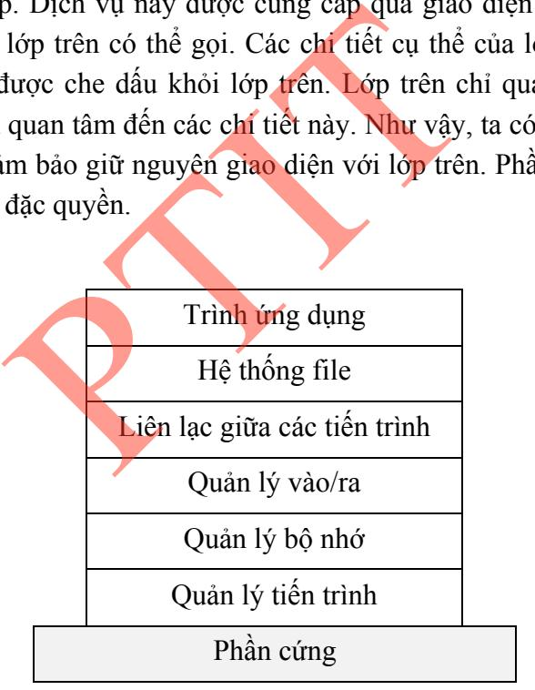

Hình 1.16. Ví dụ cấu trúc phân lớp

Một ưu điểm rõ nét của cấu trúc phân lớp là cấu trúc này cho phép thực hiện dò lỗi và hoàn thiện hệ điều hành một cách tương đối dễ dàng. Việc dò lỗi và hoàn thiện được thực hiện từ dưới lên trên. Trước tiên lớp dưới được kiểm tra độc lập với lớp trên. Sau khi đã chắc chắn lớp dưới không có lỗi, ta có thể chuyển sang kiểm tra lớp trên. Do các dịch vụ lớp dưới cung cấp cho lớp trên đã được kiểm tra, nên nếu xuất hiện lỗi, có thể tập trung tìm lỗi trong lớp trên. Quá trình tìm lỗi được thực hiện từ dưới lên trên như vậy cho tới khi tới lớp trên cùng của hệ thống.

Tuy nhiên, khó khăn thường gặp khi thiết kế hệ điều hành có cấu trúc phân lớp là việc xác định số lớp cũng như phân chia thành phần cụ thể của mỗi lớp là không dễ dàng. Do mỗi lớp chỉ có thể gọi lớp nằm ngay bên dưới, cần xác định và phân hoạch chính xác các lớp trên cơ sở chức năng và tương tác giữa các phần của hệ điều hành. Ví dụ, khối quản lý bộ nhớ ảo của hệ điều hành thường sao chép một phần không gian nhớ ảo lên đĩa. Như vậy, chương trình quản lý sao chép ra đĩa phải nằm ở lớp thấp hơn lớp có chứa khối quản lý bộ nhớ ảo. Có như vậy, khối quản lý bộ nhớ mới có thể sử dụng được dịch vụ sao chép này.

Một nhược điểm nữa của cấu trúc phân lớp là tốc độ tương đối thấp so với các kiểu cấu trúc khác. Mỗi khi chương trình ứng dụng yêu cầu thực hiện các thao tác (chẳng hạn vào/ra) thông qua lới gọi hệ thống. Yêu cầu này được truyền từ lớp trên xuống phần cứng thông qua các lớp trung gian. Trong quá trình truyền, mỗi lớp sẽ có các xử lý riêng của mình như thêm địa chỉ, tạo ra lời gọi lớp dưới thích hợp v.v. Kết quả là thời gian phục vụ của hệ thống sẽ tăng lên so với trường hợp không phân lớp.

Do các nhược điểm nêu trên, cấu trúc phân lớp hoàn toàn ít được sử dụng trong thời gian gần đây. Trong một số trường hợp, cấu trúc phân lớp cũng được sử dụng nhưng với số lượng lớp ít, mỗi lớp đảm nhiệm nhiều chức năng hơn (như hệ điều hành OS/2). Ngoài ra, cấu trúc phân lớp thường được sử dụng kết hợp với các kiểu cấu trúc khác (xem phần cấu trúc lai bên dưới). Cách tổ chức này cho phép tận dụng một phần ưu điểm của việc phân lớp đồng thời giảm được khó khăn trong khâu thiết kế và tổ chức tương tác giữa các lớp.

## **1.7.3.3. Cấu trúc vi nhân**

Một kiểu cấu trúc mới hơn và khá phổ biến khác là cấu trúc *vi nhân* (microkernel). Ở các hệ điều hành có cấu trúc kiểu này, phần nhân chỉ chứa các chức năng quan trọng nhất như quản lý tiến trình, quản lý bộ nhớ, liên lạc giữa các tiến trình. Các chức năng còn lại của hệ điều hành được tổ chức thành các mô đun khác, mỗi mô đun có thể là một chương trình riêng biệt. Các mô đun này có thể hoạt động trong chế độ đặc quyền như phần nhân hoặc như các chương trình ứng dụng thông thường. PTIT

Mỗi khi có yêu cầu cung cấp dịch vụ từ chương trình ứng dụng, chẳng hạn yêu cầu đọc hoặc ghi file, yêu cầu sẽ chuyển cho nhân. Nhân sẽ chuyển tiếp yêu cầu cho mô đun tương ứng thực hiện, trong trường hợp này là mô đun quản lý hệ thống file. Như vậy, nhiệm vụ của nhân khi đó chỉ là đảm bảo liên lạc giữa chương trình ứng dụng và mô đun cung cấp dịch vụ. Hình 1.17 cho ta hình dung về cấu trúc vi nhân và liên lạc giữa trình ứng dụng với các mô đun của hệ điều hành thông qua vi nhân.

Cách tổ chức này cho phép giảm tối thiểu kích thước nhân (từ đây sinh ra tên gọi vi nhân) cũng như kích thước các mô đun. Ưu điểm chính của cách tổ chức này là việc thiết kế, cài đặt, quản lý các mô đun sẽ dễ dàng và mềm dẻo hơn so với cấu trúc khối. Các mô đun có thể được xây dựng riêng biệt, sau đó tải vào khi có nhu cầu. Một ưu điểm khác là do đa số các mô đun chạy trong chế độ người dùng như các chương trình ứng dụng thông thường, khi các các mô đun này có lỗi sẽ không ảnh hưởng tới toàn bộ hệ điều hành. Lấy ví dụ mô đun làm nhiệm vụ quản lý đĩa và file. Việc xuất hiện sự cố trong mô đun này chỉ ảnh hưởng tới việc đọc ghi các file chứ không phá hoại toàn bộ hệ thống.

Nhược điểm của cấu trúc vi nhân là việc chuyển đổi giữa các mô đun đòi hỏi thời gian và tài nguyên hệ thống. Các mô đun chỉ có thể liên lạc với nhau theo những cơ chế liên lạc nhất định (thường là bằng cách chuyển thông điệp - message passing) chứ không thể trực tiếp gọi hàm và truy cập dữ liệu của mô đun khác. Cách liên lạc như vậy chậm hơn nhiều so với cách gọi hàm trực tiếp. Việc chuyển đổi giữa tiến trình khác nhau của các mô đun cũng cần các chi phí về thời gian và tài nguyên khác (cất giữ trạng thái tiến trình của mô đun này trước khi chuyển sang tiến trình của mô đun khác).

## **1.7.3.4. Cấu trúc lai**

Trên thực tế, các hệ điều hành thường được tổ chức bằng cách kết hợp các kiểu cấu trúc kể trên, thay vì hoàn toàn dựa trên một kiểu cấu trúc duy nhất. Cách kết hợp như vậy được gọi là cấu trúc lai. Như đã nhắc tới ở trên, cấu trúc cơ bản của Linux là cấu trúc nguyên khối, tuy vậy nhiều chức năng được tổ chức dưới dạng các mô đun tải được, cho phép dễ dàng thêm, bớt, bổ sung vào nhân. Như vậy, hệ thống có tốc độ nhanh của cấu trúc nguyên khối, trong khi vẫn sử dụng được nguyên tắc mô đun hóa để tăng tính mềm dẻo. Tương tự như vậy, mặc dù Windows có cấu trúc cơ bản dưới dạng vi nhân, rất nhiều thành phần của Windows vẫn hoạt động trong chế độ nhân và có chung không gian nhớ để không ảnh hưởng tới tốc độ. Một cách kết hợp thường được sử dụng khác là kết hợp cấu trúc phân lớp với cấu trúc vi nhân, như trong các hệ điều hành iOS. PTIT

## 1.8. MỘT SỐ HỆ ĐIỀU HÀNH CỤ THỂ

Việc lấy ví dụ từ những hệ điều hành cụ thể là rất cần thiết cho trình bày nội dung các phần tiếp theo (ngay trong các phần trên ta đã gặp một số ví dụ). Các ví dụ đã và sẽ sử dụng được lấy từ một số hệ điều hành thông dụng. Các hệ điều hành này có ứng dụng rộng rãi và một số được coi như những hệ điều hành tiêu chuẩn. Một trường hợp ngoại lệ cũng được nhắc đến là hệ điều hành MINIX. Mặc dù không có ứng dụng thực tế nhưng do kích thước nhỏ, đơn giản và mục đích các tác giả khi xây dựng MINIX là phục vụ đào tạo nên các ví dụ lấy từ MINIX rất phù hợp với nội dung cuốn sách này. Các hệ điều hành ví dụ sẽ được giới thiệu sơ lược trong phần này. Đặc điểm cụ thể và các giải pháp kỹ thuật của từng hệ điều hành có thể gặp trong nội dung các chương sau khi ta xem xét các vấn đề liên quan.

## **UNIX**

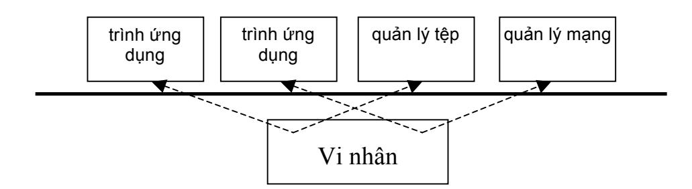

**Hình 1.17** Cấu trúc vi nhân

UNIX được Ken Thomson xây dựng tại phòng thí nghiệm Bell Laboratories của hãng AT&T vào cuối những năm bẩy mươi. Sau đó UNIX được Ken Thomson và Dennis Ritchie (tác giả ngôn ngữ C) viết lại chủ yếu bằng C. Trong số khoảng mười nghìn dòng mã của phiên bản đầu tiên này chỉ có khoảng một nghìn dòng viết trên assembly. Đây là hệ điều hành đầu tiên được viết gần như hoàn toàn trên ngôn ngữ bậc cao và điều này đã tạo cho UNIX khả năng dễ dàng chuyển đổi, có thể sử dụng cho nhiều kiến trúc máy tính khác nhau. Sau một thời gian sử dụng hiệu quả tại Bell Labs, hãng AT&T cho phép sử dụng UNIX vào mục đích nghiên cứu và giảng dạy tại các trường đại học của Mỹ, đồng thời cung cấp mã nguồn hệ điều hành này. Thực tế, UNIX là hệ điều hành được sử dụng rộng rãi nhất tại các trường đại học trong một thời gian dài. Việc "mở cửa" đối với UNIX như vậy đã tạo ra vô số sửa đổi và các phiên bản khác nhau. Phiên bản UNIX đáng chú ý nhất được xây dựng tại Đại học tổng hợp Caliornia ở Berkeley và có tên Berkeley Software Distribution (BSD). Phiên bản này chứa một số cải tiến quan trọng đối với UNIX như bộ nhớ ảo, hệ quản lý tệp tốc độ cao, hỗ trợ mạng và giao thức truyền thông TCP/IP.

Song song với các trường đại học, một số nhà sản xuất máy tính cũng xây dựng những phiên bản UNIX cung cấp cho máy tính của mình (chẳng hạn SUN Solaris, HP UNIX, IBM AIX). Các phiên bản này thường tương thích với UNIX ở mức độ người dùng với một số sửa đổi nhất định.

Từ khi ra đời, UNIX đã được sử dụng rộng rãi trong các nghiên cứu về hệ điều hành. Đa số giải pháp kỹ thuật cho các hệ điều hành sau này có nguồn gốc từ UNIX. Một số phần, chẳng hạn giao diện lập trình (system calls) của UNIX có mặt trong hầu hết các hệ điều hành hiện đại (với một số sửa đổi nào đó). Thành công của UNIX đã đem lại cho Ken Thomson giải thưởng Turing, giải thưởng lớn trong lĩnh vực điện tử, tin học mà trước đó chỉ được trao cho các sản phẩm phần cứng. PTIT

## **MINIX**

Sau một thời gian cung cấp mã nguồn và quyền sử dụng gần như miễn phí UNIX cho các trường đại học, hãng AT&T nhận ra giá trị thương mại của hệ điều hành này. Từ phiên bản 7 của UNIX, AT&T ngừng cung cấp quyền sử dụng mã nguồn, coi đây như bí mật của hãng. Việc không có giấy phép sử dụng UNIX gây ra nhiều khó khăn trong giảng dạy thực hành và nghiên cứu về hệ điều hành.

Trước tình hình trên, Andrew Tanenbaum, một giáo sư người Hà lan rất nổi tiếng trong các nghiên cứu về hệ điều hành, đã xây dựng một hệ điều hành và đặt tên là MINIX (mini-UNIX). MINIX được xây dựng với mục đích minh họa, phục vụ đào tạo, có thể sử dụng miễn phí và được cung cấp cùng mã nguồn. MINIX tương thích với UNIX phiên bản 7 trên quan điểm người dùng (người dùng sẽ thấy việc sử dụng và chạy chương trình trên MINIX rất giống với trên UNIX) song không sử dụng mã nguồn của UNIX mà được viết lại hoàn toàn.

So với UNIX, MINIX đơn giản hơn rất nhiều. Hệ điều hành này chủ yếu chứa những phần mang tính minh hoạ cho các giải pháp kỹ thuật về hệ điều hành. Mã nguồn do đó tương đối ngắn và được viết sao cho dễ đọc, dễ hiểu nhất. Một số lượng lớn các chú giải được cung cấp kèm với mã nguồn giúp cho việc nghiên cứu MINIX dễ dàng hơn. Cho đến nay phương châm phát triển MINIX vẫn là giữ cho hệ điều hành này nhỏ và dễ hiểu nhất đối với sinh viên.

Cũng như UNIX, MINIX được viết trên C và dễ dàng chuyển đổi giữa các kiến trúc máy tính khác nhau. Phiên bản đầu tiên được viết cho IBM PC, kiến trúc thông dụng nhất hiện nay. Sau đó MINIX đã được chuyển đổi thành công để chạy trên một số máy tính khác như Amiga, Macintosh, Sun SPARC. Ngay sau khi ra đời, MINIX đã thu hút được sự quan tâm của một số đông sinh viên, lập trình viên và người dùng.

#### **Linux**

Sau khi AT&T hạn chế sửa đổi và thương mại hoá UNIX, việc xây dựng hệ điều hành có các tính năng tương tự như UNIX xong không bị các hạn chế về bản quyền ràng buộc trở thành mục tiêu của một số sinh viên và các nhà nghiên cứu. MINIX là một sản phẩm khá thành công trong số này. Tuy nhiên, do mục đích của tác giả là giữ cho hệ điều hành càng đơn giản càng tốt, MINIX không trở thành một hệ điều hành đáp ứng được các nhu cầu của đa số người dùng máy tính.

Năm 1991, Linus Torvalds, sinh viên người Phần lan, đã phát triển phiên bản MINIX với ý đồ xây dựng một hệ điều hành thực thụ, có thể sử dụng rộng rãi và tương thích UNIX. Hệ điều hành này được đặt tên là Linux. Giống như MINIX, Linux được cung cấp hoàn toàn miễn phí cùng với mã nguồn. Tất cả những ai quan tâm có thể tham khảo và sửa đổi mã nguồn để tạo ra các phiên bản Linux hoàn chỉnh hơn, nhiều chức năng hơn. Thành công của các phiên bản đầu tiên cùng tính "mở" của Linux đã thu hút được một số lượng lớn lập trình viên tham gia sửa đổi, hoàn chỉnh hệ điều hành này. Các phiên bản của Linux được cung cấp theo các điều khoản của GNU General Public License, theo đó Linux được cung cấp miễn phí, cùng mã nguồn. Tất cả mọi người đều có quyền sửa đổi và được công nhận quyền tác giả đối với thành quả của mình nhưng không được phép thu tiền từ các sửa đổi đó. Một số lượng lớn chương trình ứng dụng cho Linux cũng được viết theo các điều kiện của GNU như vậy. PTIT

Đến nay, Linux là hệ điều hành kiểu UNIX được sử dụng rộng rãi nhất cho các máy tính để bàn và máy tính cá nhân. Linux tương thích với chuẩn POSIX 1003.1 (chuẩn lập trình cho UNIX) và chứa nhiều tính năng của các hệ UNIX System V, BSD 4.3. Tuy nhiên Linux được tối ưu hoá để có thể chạy trên các máy tính các nhân với các tài nguyên hạn chế.

## **MS-DOS**

MS-DOS là sản phẩm của hãng Microsoft và được trang bị cho những máy PC đầu tiên của IBM theo thoả thuận của hãng này. Để có thể chạy trên những máy tính các nhân thế hệ đầu với tài nguyên hạn chế, MS-DOS được xây dựng đơn giản và có ít chức năng hơn nhiều so với hệ điều hành cho các máy lớn. Tuy nhiên, thành công của máy tính IBM PC cùng với sự phổ biến của máy này đã đưa MS-DOS thành một trong những hệ điều hành được sử dụng rộng rãi trên thế giới.

Nhiều giải pháp kỹ thuật trong MS-DOS có nguồn gốc từ UNIX như giao diện lập trình (các lời gọi hệ thống), cấu trúc phân cấp của thư mục, bộ dịch lệnh. Một số chức năng khác hoàn toàn không có như bảo mật, hỗ trợ mạng, hỗ trợ nhiều tiến trình v.v.

Theo mức độ phát triển của máy tính các nhân, nhiều phiên bản MS-DOS đã ra đời để thích ứng với sự phát triển của phần cứng.

#### **Windows NT, 2000, XP, Vista, 7, 8**

Khi mới ra đời, máy tính cá nhân (PC) có các tài nguyên phần cứng rất hạn chế: CPU chậm, bộ nhớ nhỏ (thường dưới 1MB), không có hoặc chỉ có đĩa cứng dung tích bé v.v. Hệ điều hành MS-DOS đã được xây dựng để làm việc với các máy tính như vậy. Đây là một hệ điều hành đơn giản, nhiều chức năng được rút gọn. Càng về sau, khả năng máy tính các nhân càng được mở rộng. Tốc độ tính toán, dung tích bộ nhớ cùng nhiều thông số khác của PC bắt đầu có thể so sánh với máy tính lớn. MS-DOS, mặc dầu được cải tiến, dần dần trở nên không thích hợp. Cần có một hệ điều hành đầy đủ tính năng hơn, thích hợp với phần cứng mới.

Trước tình hình đó, hãng Microsoft đã xây dựng họ hệ điều hành Windows cho máy tính cá nhân. Windows NT (NT là viết tắt của new technology - công nghệ mới) là một thành viên của họ hệ điều hành này. Windows 2000, XP, Vista, 7 là các thành viên tiếp theo.

Phiên bản đầu tiên của Windows NT được phát hành năm 1993. Đây là hệ điều hành sử dụng nhiều kỹ thuật tiên tiến trong lĩnh vực hệ điều hành đã được phát triển cho đến thời điểm này, bao gồm cả các giải pháp lấy từ UNIX. So với MS-DOS, Windows NT và các phiên bản sau là hệ điều hành đa nhiệm, hỗ trợ mạng, có các chức năng bảo mật, có giao diện đồ họa dưới dạng cửa sổ và được dùng cho các ứng dụng trên PC yêu cầu độ ổn định cao.

#### **iOS**

iOS là hệ điều hành do hãng Apple phát triển cho các thiết bị điện thoại thông minh iPhone, máy tính bảng iPad và máy nghe nhạc iPod của hãng này. Phiên bản thương mại đầu tiên của iOS được giới thiệu vào năm 2007 và hiện nay đây là một trong những hệ điều hành thông dụng nhất cho thiết bị di động. Apple giữ độc quyền về hệ điều hành này và không cung cấp bản quyền để chạy iOS trên thiết bị của nhà sản xuất khác. PTIT

Cấu trúc iOS được tham khảo từ hệ điều hành MAC OS X của Apple, có bổ sung thêm một số chức năng đặc thù cho thiết bị di động như làm việc với màn hình cảm ứng đa điểm, hỗ trợ truyền thông, các thiết bị đo gia tốc, xác định tọa độ tích hợp, chế độ tiết kiệm năng lượng. Như các sản phẩm khác của Apple, tiêu chí đặt ra khi thiết kế iOS là giúp cho việc sử dụng thiết bị di động được thuận tiện, dễ dàng, thậm chí đối với người không biết nhiều về kỹ thuật. Đây là yếu tố quan trọng đảm bảo sự thành công cho hệ điều hành này. Apple cũng cung cấp công cụ cho phép các tổ chức và cá nhân khác xây dựng ứng dụng cho iOS (gọi là các *app*). Ứng dụng cho iOS được cung cấp qua Apple App Store.

Do đặc điểm của thiết bị di động, iOS hỗ trợ đa nhiệm ở mức hạn chế. Ngoài ứng dụng đang được kích hoạt, chỉ có một số ứng dụng khác được chạy và chia sẻ CPU như ứng dụng chơi nhạc, dịch vụ thông báo (khi có các sự kiện như tin nhắn, email), xác định vị trí và một số trường hợp khác. Bộ nhớ được iOS quản lý tự động, khi bộ nhớ đầy, các ứng dụng không hoạt động sẽ bị xóa khỏi bộ nhớ theo thứ tự vào trước ra trước.

#### **Android**

Android là hệ điều hành cho thiết bị di động thông dụng nhất hiện nay. Khởi đầu, Android do hãng Android xây dựng, sau đó Google mua lại hãng này và trở thành người sở hữu hệ điều hành này từ năm 2005. Android được giới thiệu lần đầu năm 2007 (cùng năm với iOS) và được cung cấp dưới dạng phần mềm nguồn mở theo đó mọi cá nhân và tổ chức có toàn quyền sử dụng vào mọi mục đích, kể cả thương mại. Ngoài thiết bị di động như điện thoại, máy tính bảng, Android được sử dụng cho rất nhiều loại thiết bị khác như máy ảnh số, TV, máy trò chơi và các thiết bị điện tử khác. Rất nhiều hãng sản xuất đồ điện tử sử dụng Android thay vì tự phát triển hệ điều hành cho thiết bị của mình.

Tương tự iOS, Android hỗ trợ các chức năng đặc trưng của thiết bị di động như giao diện qua màn hình cảm biến đa điểm, thiết bị định vị, xác định gia tốc. Google cũng tích hợp các dịch vụ nhận dạng giọng nói, các hệ thống hỏi đáp tự động cho hệ điều hành này.

Android được xây dựng dựa trên nhân của hệ điều hành Linux, bổ sung thêm các thư viện và API viết trên ngôn ngữ C++. Các ứng dụng cho Android viết trên Java và chạy trên nền application framework, thực chất là một tập các thư viện tương thích với Java. So với phiên bản nhân Linux gốc, nhân của Android bổ sung một số tính năng như phần tiết kiệm pin, song lại bỏ bớt một số thư viện của Linux. Phần quản lý bộ nhớ cũng được đơn giản hóa, theo đó khi không gian nhớ còn ít, những ứng dụng không hoạt động sẽ tự động bị xóa theo thứ tự vào trước ra trước.

Hiện nay, Android là một trong những hệ điều hành phát triển nhanh nhất nhờ dựa trên một cộng đồng nguồn mở lớn và tích cực.

#### 1.9. CÂU HỎI VÀ BÀI TẬP CHƯƠNG

- 1. Các chức năng chính của hệ điều hành là gì?
- 2. Dựa trên định nghĩa hệ điều hành, hãy cho biết trình duyệt Web có thể là một thành phần của hệ điều hành không?
- 3. Có phải bất kỳ hệ thống máy tính nào cũng cần có hệ điều hành không? Tại sao? Ở đây, hệ thống máy tính được hiểu rộng là bất cứ hệ thống nào có vi xử lý và bộ nhớ.
- 4. Một trong các yêu cầu đặt ra đối với hệ thống tính toán là yêu cầu về an toàn, tức là đảm bảo để các tiến trình không được xâm phạm các tài nguyên khi không được phép. Một hệ thống có thể đạt được yêu cầu về an toàn nếu không phân biệt chế độ người dùng và chế độ đặc quyền (chế độ nhân) không? Hãy giải thích câu trả lời bằng cách cho ví dụ.
- 5. Giả sử hệ thống có hai chế độ: chế độ đặc quyền và chế độ người dùng. Hãy cho biết các thao tác nào sau đây cần được thực hiện trong chế độ đặc quyền.
  - a. Xóa bộ nhớ.
  - b. Đọc đồng hồ thời gian thực (clock).
  - c. Đặt giờ cho bộ định thời gian (timer).
  - d. Cấm các ngắt.
  - e. Trao đổi thông tin trực tiếp với thiết bị vào/ra dữ liệu.
  - f. Chuyển từ chế độ người dùng sang chế độ đặc quyền.
- 6. So sánh ưu nhược điểm của các phương pháp xử lý theo mẻ, đa chương trình không PTIT

chia sẻ thời gian, và đa chương trình có chia sẻ thời gian (đa nhiệm).

- 7. Hãy giải thích lý do tại sao đa chương trình chỉ cho phép sử dụng CPU hiệu quả hơn nếu hệ thống có hỗ trợ truy cập bộ nhớ trực tiếp (DMA).
- 8. Lời gọi hệ thống dùng để làm gì? So sánh lời gọi hệ thống và hàm API của hệ điều hành.
- 9. Hãy phân biệt giao diện lập trình của hệ điều hành với giao diện người dùng.
- 10. Hãy liệt kê 10 dịch vụ cụ thể mà hệ điều hành thường cung cấp (chọn 10 dịch vụ bất kỳ).
- 11. Sự khác biệt của nhân với các phần còn lại của hệ điều hành là gì? Tại sao không nên làm nhân với quá nhiều thành phần.
- 12. Hãy phân thích ưu điểm của cấu trúc vi nhân so với cấu trúc nguyên khối và cấu trúc phân lớp.

## **CHƯƠNG 2: QUẢN LÝ TIẾN TRÌNH**

Hoạt động quan trọng nhất của máy tính là thực hiện các chương trình. Để phục vụ hoạt động này, hệ điều hành cần tạo môi trường cho chương trình thực hiện và quản lý các chương trình này. Một chương trình đang trong quá trình thực hiện được gọi là tiến trình. Chương này sẽ trình bày khái niệm về tiến trình và những vấn đề liên quan tới quản lý tiến trình của hệ điều hành.

# 2.1. CÁC KHÁI NIỆM LIÊN QUAN ĐẾN TIẾN TRÌNH

# **2.1.1. Tiến trình là gì**

Theo định nghĩa trực quan và đơn giản nhất, *tiến trình là một chương trình đang trong quá trình thực hiện*. Đa số máy tính hiện nay cho phép thực hiện nhiều chương trình khác nhau cùng một lúc. Ví dụ, ta có thể vừa chạy trình duyệt vừa soạn thảo văn bản và nhận thư điện tử. Máy tính cũng cho phép thực hiện nhiều bản khác nhau của một chương trình cùng một lúc, ví dụ, có thể thực hiện nhiều phiên bản khác nhau của trình duyệt web cùng một lúc để xem các trang web khác nhau. Việc sử dụng thuật ngữ tiến trình cho phép phân định rõ ràng chương trình trong những trường hợp như vậy, giúp cho việc quản lý của hệ điều hành dễ dàng hơn. PTIT

Có hai đặc điểm cho phép phân biệt tiến trình với chương trình. Thứ nhất, chương trình là một thực thể tĩnh, không thay đổi theo thời gian, trong khi tiến trình là thực thể động. Chương trình là tập hợp các lệnh và dữ liệu chứa trong file gọi là file chương trình hoặc file thực hiện được (executable), ví dụ file có đuôi exe của Windows. Các lệnh này không thay đổi theo thời gian. Trong khi đó, tiến trình là thực thể động bao gồm các lệnh, dữ liệu, ngăn xếp, con trỏ lệnh chỉ tới lệnh đang được thực hiện. Hầu hết các thành phần này đều thay đổi trong quá trình tiến trình tồn tại, ví dụ con trỏ lệnh luôn luôn thay đổi tùy thuộc vào lệnh thực hiện là lệnh nào. Ngay cả trong trường hợp hai tiến trình được sinh ra từ cùng một chương trình, mỗi tiến trình sẽ có con trỏ lệnh, dữ liệu, ngăn xếp khác với tiến trình kia.

Thứ hai, chương trình không sở hữu tài nguyên cụ thể, trong khi mỗi tiến trình được cấp một số tài nguyên như bộ nhớ để chứa tiến trình, các cổng và thiết bị vào/ra, các file mở, thời gian CPU để thực hiện lệnh. Như vậy, tiến trình là một khái niệm liên quan chặt chẽ tới khái niệm máy ảo. Có thể coi mỗi tiến trình được cấp một máy tính ảo và thực hiện trên máy tính ảo đó.

Một tiến trình thường bao gồm các thành phần sau

- *Các lệnh*, tức là các chỉ thị cho CPU thực hiện.
- Phần *dữ liệu* chứa các biến toàn cục.
- *Ngăn xếp* (stack) tiến trình: chứa các dữ liệu tạm thời, ví dụ khi gọi một hàm, các tham số cần thiết để khôi phục lại trạng thái trước khi gọi hàm sẽ được lưu vào ngăn xếp,

các tham số cần truyền cho hàm được gọi cũng được thêm vào ngăn xếp. Ngoài ra ngăn xếp còn chứa các biến cục bộ của hàm hoặc phương thức.

- *Thông tin về hoạt động hiện thời* của tiến trình: bao gồm nội dung con trỏ lệnh (program counter) trỏ tới tiếp theo của tiến trình, và nội dung các thanh ghi khác của CPU.
- *Heap*: đây là vùng bộ nhớ được cấp phát động trong quá trình thực hiện tiến trình, chẳng hạn khi tiến trình thực hiện hàm malloc() của ngôn ngữ C hay new của C++.

Tập hợp tất cả các thành phần trên của tiến trình tại một thời điểm được gọi là *ảnh của tiến trình*.

Tiến trình được sinh ra khi chương trình được tải vào bộ nhớ để thực hiện. Trong hệ thống có hai loại tiến trình. Loại thứ nhất là *tiến trình của người dùng* hay tiến trình ứng dụng, được sinh ra khi người dùng chạy chương trình ứng dụng, ví dụ bằng cách nháy chuột đúp vào biểu tượng chương trình như trong Windows. Loại thứ hai là các *tiến trình hệ thống*. Đây là tiến trình sinh ra từ những thành phần của hệ điều hành để thực hiện các công việc khác nhau của hệ thống. Có thể xem các tiến trình hiện thời của Windows bằng cách gọi "Task manager" (bấm Ctrl-Alt-Del) và vào Tab "Process". Tương tự như vậy, hệ điều hành Linux cho phép xem danh sách tiến trình bằng cách gõ lệnh **ps** từ giao diện dịch lệnh.

## **2.1.2. Trạng thái của tiến trình**

Là một thực thể động, tiến trình có thể thuộc những trạng thái khác nhau. Có nhiều cách phân biệt trạng thái tiến trình. Theo cách đơn giản nhất, tiến trình thuộc một trong hai trạng thái: *chạy* và *không chạy*. Chạy là khi các lệnh của tiến trình được CPU thực hiện và không chạy là trường hợp ngược lại, ví dụ khi CPU đang được phân phối cho tiến trình khác hoặc khi tiến trình phải dừng để chờ kết quả vào/ra. PTIT

Cách sử dụng hai trạng thái tiến trình là quá đơn giản và không đủ để phản ánh đầy đủ thông tin về trạng thái tiến trình. Các tài liệu về hệ điều hành thường phân biệt năm trạng thái khác nhau của tiến trình: *mới khởi tạo*, *sẵn sàng*, *chạy*, *chờ đợi*, *kết thúc*. Ý nghĩa cụ thể năm trạng thái như sau:

- Trạng thái **mới khởi tạo**: tiến trình đang được tạo ra. Hệ điều hành đã tạo ra các thông tin về tiến trình tuy nhiên tiến trình chưa được thêm vào danh sách những tiến trình được phép thực hiện. Thông thường, tiến trình ở trạng thái này chưa nằm trong bộ nhớ.
- Trạng thái **sẵn sàng**: tiến trình chờ được cấp CPU để thực hiện lệnh của mình.
- Trạng thái **chạy**: lệnh của tiến trình được CPU thực hiện. Với những máy tính có một CPU và CPU có một lõi, tại mỗi thời điểm chỉ có một tiến trình nằm trong trạng thái chạy.
- Trạng thái **chờ đợi**: tiến trình chờ đợi một sự kiện gì đó xảy ra, ví dụ chờ tín hiệu từ tiến trình khác hoặc chờ kết thúc quá trình vào/ra. Trạng thái chờ đợi còn được gọi là trạng thái *bị phong tỏa* (blocked).

- Trạng thái **kết thúc**: tiến trình không còn nằm trong danh sách các tiến trình được thực hiện nhưng vẫn chưa bị xóa. Tiến trình thuộc về trạng thái này sau khi đã thực hiện xong hoặc bị tiến trình khác kết thúc.

Việc sử dụng các trạng thái "mới khởi tạo" và "kết thúc" cho phép phân biệt rõ các bước trong quá trình tạo mới và kết thúc tiến trình. Hệ điều hành thường tạo ra tiến trình mới với hai bước. Bước một, hệ điều hành gán cho tiến trình số định danh, tạo ra các cấu trúc dữ liệu chứa thông tin về tiến trình. Bước hai, hệ điều hành thêm tiến trình vào danh sách các tiến trình được phép thực hiện bằng cách liên kết thông tin về tiến trình vào danh sách tương ứng. Trạng thái "mới khởi tạo" là trạng thái trước khi thực hiện bước hai.

Quá trình kết thúc tiến trình cũng bao gồm hai bước tương tự như tạo mới nhưng theo thứ tự ngược lại. Ở bước một, tiến trình bị chuyển khỏi danh sách các tiến trình đang thực hiện sau khi đã thực hiện xong hoặc do bị tiến trình khác kết thúc. Tuy nhiên, hệ điều hành vẫn giữ các thông tin về tiến trình và các thông tin này có thể được sử dụng chẳng hạn để thống kê thời gian chạy hoặc bộ nhớ đã sử dụng. Ở bước hai, hệ điều hành xóa toàn bộ thông tin về tiến trình và giải phóng các vùng bộ nhớ tương ứng. Trạng thái "kết thúc" là trạng thái trước khi thực hiện bước hai.

Mô hình năm trạng thái tiến trình là mô hình được sử dụng rộng rãi nhất trong các hệ điều hành, mặc dù tên gọi cụ thể từng trạng thái có thể thay đổi trong hệ điều hành cụ thể.

Hình 2.1. Sơ đồ chuyển đổi giữa các trạng thái của tiến trình

Lưu ý: Trong một số hệ điều hành, có thể chia nhỏ và phân biệt nhiều trạng thái hơn nữa. Chẳng hạn, một số hệ điều hành sử dụng thêm trạng thái treo (suspended), trong đó tiến trình tạm dừng toàn bộ việc thực hiện hoặc thậm chí tạm bị chuyển từ bộ nhớ ra đĩa.

**Ý nghĩa việc chuyển đổi giữa các trạng thái**. Việc chuyển trạng thái xảy ra trong những trường hợp nhất định. Sơ đồ chuyển đổi giữa các trạng thái được thể hiện trên hình 2.1. Ý nghĩa các chuyển đối trạng thái như sau:

- Mới khởi tạo → Sẵn sàng: tiến trình đã được khởi tạo xong và đã được tải vào bộ nhớ, chỉ chờ được cấp CPU để chạy, khi đó tiến trình sẽ được chuyển từ trạng thái mới sang trạng thái sẵn sàng. Trong trường hợp số lượng tiến trình lớn hơn số lượng CPU, tiến trình ở trạng thái sẵn sàng sẽ phải đợi cho tới khi được cấp CPU

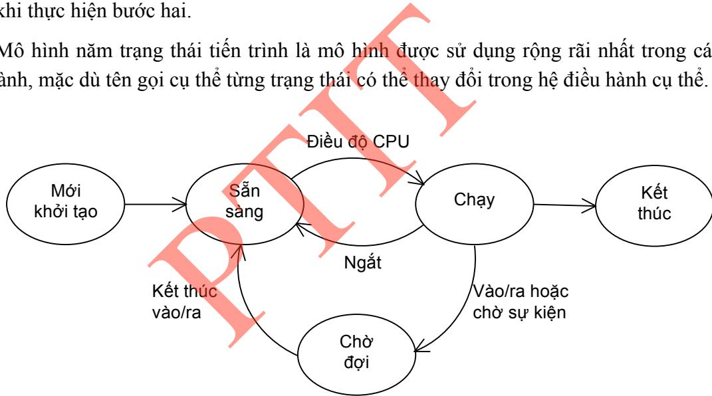

- Sẵn sàng → Chạy: do kết quả điều độ (phân phối CPU) của hệ điều hành, tiến trình được hệ điều hành cấp phát CPU và chuyển sang trạng thái chạy.
- Chạy → Sẵn sàng: hệ điều hành thu hồi CPU của tiến trình đang chạy và cấp phát CPU cho tiến trình khác do kết quả điều độ hoặc do xảy ra ngắt, tiến trình hiện thời chuyển sang trạng thái sẵn sàng và chờ được cấp CPU để chạy tiếp. Thông thường, việc này xẩy ra khi tiến trình đã thực hiện hết một khoảng thời gian nào đó trong các hệ thống chia sẻ thời gian và đồng hồ sinh ngắt để hệ điều hành có thể thu hồi CPU và chuyển sang chạy tiến trình tiếp theo.
- Chạy → Chờ đợi: tiến trình chuyển từ trạng thái chạy sang trạng thái chờ đợi (bị phong tỏa) nếu tiến trình có yêu cầu với hệ thống và phải chờ đợi đến khi yêu cầu được thỏa mãn. Trường hợp điển hình nhất là khi tiến trình gọi lời gọi hệ thống, chẳng hạn để vào/ra dữ liệu. Ví dụ, tiến trình đọc dữ liệu từ file bằng cách gọi lời gọi hệ thống đọc file. Lời gọi được chuyển cho hàm đọc file của hệ điều hành thực hiện. Trong khi yêu cầu này chưa được hoàn tất, tiến trình không thể thực hiện tiếp. Trong trường hợp này, tiến trình chuyển sang trạng thái chờ đợi hoặc còn gọi là trạng thái bị phong tỏa (blocked).
- Chờ đợi → Sẵn sàng: khi sự kiện được chờ đợi đã xảy ra, tiến trình sẽ được chuyển sang trạng thái sẵn sàng và chờ được phân phối CPU để chạy tiếp.
- Chạy → Kết thúc: tiến trình đã thực hiện xong, được chuyển sang trạng thái kết thúc trước khi chấm dứt sự tồn tại. PTIT

Trong một vòng đời của mình, tiến trình thường phải chuyển qua lại nhiều lần giữa các trạng thái "sẵn sàng", "chạy" và "chờ đợi" trước khi hoàn thành và chuyển sang trạng thái kết thúc.

# **2.1.3. Thông tin mô tả tiến trình**

Để có thể quản lý tiến trình, hệ điều hành cần có các thông tin về tiến trình đó. Thông tin về tiến trình được lưu trong một cấu trúc dữ liệu gọi là *khối quản lý tiến trình*, viết tắt là **PCB** (Process Control Block) (lưu ý là tên gọi của khối này có thể thay đổi tùy hệ điều hành cụ thể).

Thông tin về tiến trình chứa trong PCB phụ thuộc vào từng hệ điều hành cụ thể. Thông thường, PCB bao gồm các thông tin sau:

- **Số định danh của tiến trình**: tiến trình được gắn một số định danh PID (Process Indentifier) cho phép phân biệt với tiến trình khác. Số định danh này được hệ điều hành sử dụng để tìm vị trí tương ứng với tiến trình trong bảng tiến trình (xem phần sau), hoặc sử dụng để tham chiếu giữa các bảng khác nhau lưu thông tin liên quan đến tiến trình. Ví dụ, để quản lý các khối nhớ, hệ điều hành sử dụng số định danh để biết tiến trình nào đang được cấp một khối nhớ cụ thể.
- **Trạng thái tiến trình**: một trong năm trạng thái liệt kê ở phần trước.
- **Nội dung một số thanh ghi CPU**: nội dung một số thanh ghi quan trọng thường được giữ trong PCB như:

o *Thanh ghi con trỏ lệnh*: lưu địa chỉ của lệnh tiếp theo cần thực hiện o *Thanh ghi con trỏ ngăn xếp*: Mỗi tiến trình đều có ngăn xếp để lưu tham số và tình trạng hàm khi thực hiện lời gọi hàm/thủ tục của chương trình. Con trỏ ngăn xếp trỏ tới đỉnh ngăn xếp hiện thời của tiến trình. o *Các thanh ghi điều kiện và thanh ghi trạng thái:* chứa trạng thái sau khi thực hiện các phép tính lôgic hoặc số học (như tràn số, chia cho không, có phần bù…) o *Các thanh ghi đa dụng khác*: là các thanh ghi được dùng cho nhiều mục đích như chứa toán hạng, chứa kết quả phép tính, số lần lặp v.v.

Lý do phải lưu nội dung các thanh ghi này trong PCB là do tiến trình có thể bị chuyển khỏi trạng thái chạy để nhường chỗ cho tiến trình khác (chẳng hạn khi có ngắt). Khi tiến trình chạy trở lại, hệ điều hành sẽ sử dụng thông tin từ PCB để khôi phục lại nội dung các thanh ghi, cho phép tiến trình thực hiện lại từ trạng thái trước lúc bị dừng.

- **Thông tin phục vụ việc điều độ tiến trình**: bao gồm thông tin về mức độ ưu tiên của tiến trình so với các tiến trình khác, vị trí tiến trình trong các hàng đợi, và có thể các thông tin khác như lượng tài nguyên tiến trình đang sở hữu. Hệ điều hành sử dụng những thông tin này để điều độ, tức là quyết định thứ tự và thời gian được cấp CPU của tiến trình.
- **Thông tin về bộ nhớ của tiến trình**: hệ điều hành cần biết tiến trình nằm ở đâu trong bộ nhớ. Tùy mô hình tổ chức bộ nhớ cụ thể, thông tin loại này có thể gồm các bảng trang, bảng đoạn, địa chỉ cơ sở của tiến trình v.v.
- **Danh sách các tài nguyên khác**: bao gồm danh sách các file đang mở của tiến trình, các thiết bị vào/ra tiến trình đang sử dụng.
- **Thông tin thống kê phục vụ quản lý**: thông tin loại này thường được sử dụng phục vụ thống kê hoặc tính toán chi phí đối với các hệ thống dùng chung (như khi đi thuê máy tính) và bao gồm thông tin về thời gian sử dụng CPU, giới hạn thời gian, tài khoản của người sở hữu tiến trình v.v. PTIT

#### **2.1.4. Bảng và danh sách tiến trình**

PCB của các tiến trình được lưu trong bộ nhớ trong và có thể nằm ở những vị trí khác nhau. Do vậy, hệ điều hành cần lưu và có cách xác định vị trí các PCB. Để làm được điều này, hệ điều hành sử dụng bảng tiến trình chứa con trỏ tới PCB của toàn bộ tiến trình có trong hệ thống (xem hình 2.2). Vị trí cụ thể trong bảng được xác định nhờ số định danh của tiến trình.

Ngoài ra, để thuận tiện cho việc điều độ, PCB của các tiến trình đang có trong hệ thống được liên kết thành thành một số danh sách, mỗi danh sách bao gồm tiến trình có cùng trạng thái hoặc tiến trình đang cùng chờ đợi một tài nguyên nào đó. Ví dụ, PCB của tiến trình đang ở trạng thái sẵn sàng sẽ được liên kết vào *danh sách sẵn sàng*. Danh sách được quản lý nhờ hai con trỏ trỏ tới PCB đầu tiên và PCB cuối cùng trong danh sách, các PCB trong danh sách được liên kết với nhau (xem hình 2.3). Khi điều độ, hệ điều hành xem xét danh sách sẵn sàng để chọn ra tiến trình tiếp theo được cấp phát CPU.

Hình 2.2: Bảng tiến trình chứa con trỏ tới các PCB

Trên hình 2.3 là một số danh sách được hệ điều hành sử dụng như danh sách tiến trình sẵn sàng, danh sách tiến trình đang chờ đợi tài nguyên cụ thể nào đó.

Hình 2.3: Danh sách liên kết PCB thuộc các trạng thái khác nhau

### **2.1.5. Các thao tác với tiến trình**

Hoạt động quản lý tiến trình bao gồm một số công việc như tạo mới và kết thúc tiến trình, chuyển đổi giữa các tiến trình, điều độ, đồng bộ hóa, đảm bảo liên lạc giữa các tiến trình. Trong phần này, ta sẽ xem xét các thao tác tạo mới, kết thúc và chuyển đổi giữa các tiến trình. Những nội dung khác sẽ được xem xét trong các phần sau.

# **Tạo mới tiến trình**

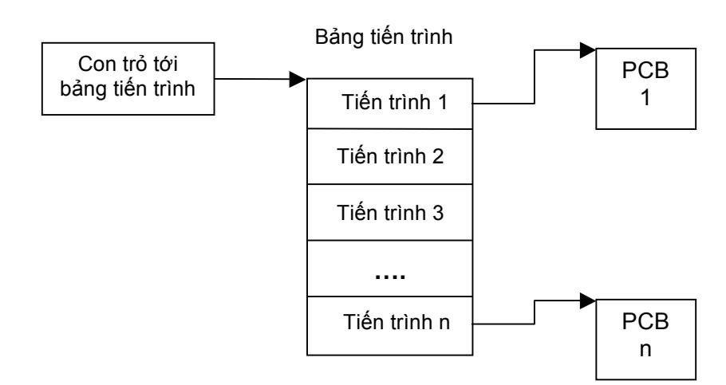

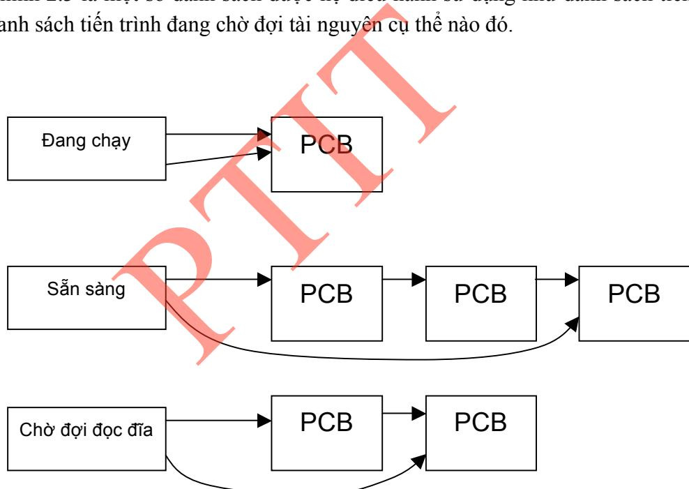

Một tiến trình có thể tạo ra tiến trình mới bằng cách gọi lời gọi hệ thống tương ứng của hệ điều hành. Khi người dùng chạy chương trình, trình dịch lệnh của hệ điều hành, ví dụ Windows Explorer, chính là tiến trình yêu cầu thực hiện lời gọi hệ thống để tạo mới tiến trình. Tiến trình được tạo mới gọi là tiến trình con, tiến trình tạo ra tiến trình con gọi là tiến trình cha. Nếu tiến trình con tiếp tục tạo ra tiến trình mới thì dần dần sẽ có một cây tiến trình.

Để tạo ra tiến trình mới, hệ điều hành thực hiện một số bước sau:

*a) Gán số định danh* cho tiến trình được tạo mới và tạo một ô trong bảng tiến trình.

- *b) Tạo không gian nhớ* cho tiến trình và PCB. Kích thước không gian nhớ được tính toán dựa trên thông tin về tiến trình mà hệ điều hành có. Tùy theo cách tạo mới, không gian nhớ của tiến trình con có thể chia sẻ hoặc không chia sẻ với tiến trình cha.
- *c) Khởi tạo PCB.* Hệ điều hành gán giá trị cho các thành phần của PCB. Đa số giá trị ban đầu được gán theo mặc định (ví dụ giá trị không), trừ số định danh tiến trình, con trỏ lệnh, con trỏ ngăn xếp và một số giá trị khác.
- *d) Liên kết PCB của tiến trình* vào các danh sách quản lý, ví dụ danh sách tiến trình mới khởi tạo, đặt con trỏ trong bảng tiến trình trỏ tới PCB.

Có hai kiểu tạo mới tiến trình khác nhau:

- Tiến trình con là một bản sao của tiến trình cha, tức là có cùng phần mã chương trình và phần dữ liệu. Cách này được thực hiện trong hệ điều hành UNIX bằng cách gọi lệnh fork().
- Tiến trình con được tạo thành từ một chương trình mới. Đây là cách tạo tiến trình được sử dụng trong Windows (bằng cách gọi lời gọi hệ thống CreateProcess()). PTIT

## **Kết thúc tiến trình**

Tiến trình có thể yêu cầu hệ điều hành kết thúc mình bằng cách gọi lời gọi hệ thống exit(). Tiến trình thường kết thúc khi đã thực hiện xong và được gọi là kết thúc bình thường. Ngoài ra, tiến trình có thể kết thúc trong một số trường hợp sau:

- Bị tiến trình cha kết thúc. Thông thường, tiến trình cha có quyền kết thúc tiến trình con do mình tạo ra và có thể sử dụng quyền này khi không cần tiến trình con nữa hoặc khi tiến trình con dùng quá nhiều tài nguyên. Khi tiến trình cha kết thúc, hệ điều hành cũng có thể xóa mọi tiến trình con và tiến trình hậu duệ của tiến trình cha.
- Do các lỗi. Có nhiều loại lỗi có thể dẫn tới tiến trình bị kết thúc như: lỗi truy cập vùng bộ nhớ hoặc thiết bị vào/ra không được phép truy cập; các lỗi số học như chia cho không, tràn số; lỗi vào/ra như khi ghi ra đĩa một số lần không thành công.
- Tiến trình yêu cầu nhiều bộ nhớ hơn so với lượng bộ nhớ hệ thống có thể cung cấp.
- Tiến trình thực hiện lâu hơn thời gian giới hạn. Tình huống này xảy ra đối với hệ thống nhiều người dùng như các siêu máy tính và đòi hỏi đăng ký trước thời gian chạy cho tiến trình. Giới hạn thời gian cũng có thể dùng với các hệ thống tương tác trực

tiếp và được tính bằng thời gian từ lúc người dùng yêu cầu cho tới khi tiến trình phản ứng lại.

- Do quản trị hệ thống hoặc hệ điều hành kết thúc. Ví dụ khi xảy ra các tình huống như bế tắc (xem phần về bế tắc).

# **Chuyển đổi giữa các tiến trình**

Trong quá trình thực hiện, CPU có thể được chuyển từ tiến trình hiện thời sang thực hiện tiến trình khác hoặc mô đun xử lý ngắt của hệ điều hành. Trong những trường hợp như vậy, hệ điều hành cần lưu giữ các thông tin về tình trạng của tiến trình hiện thời để có thể khôi phục và thực hiện lại tiến trình từ điểm bị dừng. Thông tin về tiến trình hiện thời được gọi là *ngữ cảnh* (context) của tiến trình, việc chuyển giữa tiến trình, do vậy, còn được gọi là *chuyển đổi ngữ cảnh*.

Việc chuyển tiến trình xảy ra trong hai trường hợp sau:

- 1) *Khi có ngắt*. Ngắt là kết quả của các sự kiện bên ngoài tiến trình (gọi là ngắt ngoài) hoặc do lỗi phát sinh trong bản thân tiến trình (gọi là ngắt trong).

Một số loại ngắt ngoài thông dụng bao gồm: ngắt do đồng hồ, được sinh ra do đồng hồ của hệ thống sau những khoảng thời gian nhất định và thường được sử dụng để phân phối CPU cho tiến trình khác sau khi tiến trình hiện thời đã chạy hết khoảng thời gian được phân bổ; ngắt vào/ra, ví dụ khi người dùng gõ bàn phím hoặc khi kết thúc đọc dữ liệu từ đĩa. PTIT

Ngắt trong là ngắt sinh ra khi có các lỗi nghiêm trọng hoặc những tình huống khiến tiến trình không thể thực hiện tiếp. CPU sẽ chuyển sang thực hiện mô đun xử lý lỗi của hệ điều hành.

- 2) *Khi tiến trình gọi lời gọi hệ thống*. Ví dụ tiến trình có thể gọi lệnh đọc file của hệ điều hành. Do kết quả các lệnh như vậy, hệ thống sẽ chuyển từ tiến trình gọi lời gọi hệ thống sang thực hiện hàm xử lý lời gọi hệ thống nằm trong thành phần hệ điều hành.

Như đã nói ở trên, ngữ cảnh của tiến trình được chứa trong PCB. Trước khi chuyển sang thực hiện tiến trình khác, ngữ cảnh (bao gồm nội dung các thanh ghi, thông tin về bộ nhớ …) được lưu vào PCB. Khi tiến trình được cấp phát CPU để thực hiện trở lại, ngữ cảnh sẽ được khôi phục từ PCB vào thanh ghi và những bảng tương ứng.

Vấn đề ở đây là ngữ cảnh phải bao gồm những thông tin nào ? Nói cách khác, thông tin nào phải được cập nhật và lưu vào PCB khi chuyển tiến trình? Tùy từng trường hợp cụ thể, những thông tin này có thể khác nhau.

Trong trường hợp đơn giản nhất, hệ thống chuyển sang thực hiện ngắt vào/ra, sau đó quay lại thực hiện tiếp tiến trình hiện thời. Ngữ cảnh cần lưu khi đó sẽ bao gồm những thông tin có thể bị hàm xử lý ngắt làm thay đổi, cụ thể là nội dung các thanh ghi và trạng thái CPU. Những thông tin này được lưu vào các vùng tương ứng trong PCB. Khi kết thúc ngắt, giá trị các thanh ghi và trạng thái CPU được cập nhật lại từ PCB và tiến trình có thể thực hiện lại từ vị trí trước khi bị ngắt.

Trong trường hợp phức tạp hơn, sau khi thực hiện ngắt, hệ thống có thể chuyển sang thực hiện tiến trình khác, chẳng hạn do kết quả điều độ tiến trình. Trong trường hợp như vậy, việc chuyển đổi ngữ cảnh sẽ bao gồm thêm một số thao tác khác như: thay đổi trạng thái tiến trình, cập nhật thông tin thống kê trong PCB, chuyển liên kết PCB của tiến trình vào danh sách ứng với trạng thái mới, cập nhật PCB của tiến trình mới được chọn, cập nhật nội dung thanh ghi và trạng thái CPU bằng thông tin lấy từ PCB của tiến trình mới được chọn.

Như vậy, để chuyển tiến trình, hệ thống cần thực hiện một số bước liên quan tới việc lưu và khôi phục ngữ cảnh. Việc chuyển tiến trình, do vậy, đòi hỏi thời gian cùng với tài nguyên hệ thống và có thể ảnh hưởng tới tốc độ nếu diễn ra quá thường xuyên.

#### 2.2. LUỒNG

*Luồng thực hiện* (*thread*), gọi tắt là *luồng*, là một khái niệm quan trọng trong các hệ điều hành hiện đại, có ảnh hưởng lớn tới việc tổ chức và quản lý tiến trình. Đây là thuật ngữ chưa có cách dịch thống nhất sang tiếng Việt. Tài liệu tiếng Việt hiện nay sử dụng một số thuật ngữ khác nhau cho luồng như: *luồng*, *dòng*, *tiểu trình*. Trong tài liệu này, các thuật ngữ vừa nhắc tới được sử dụng tương đương nhau cho khái niệm "thread".

#### **2.2.1. Luồng thực hiện là gì**

Trong phần trước, ta đã thấy tiến trình có thể được xem xét từ hai khía cạnh: thứ nhất, tiến trình là một đơn vị sở hữu tài nguyên, và thứ hai: tiến trình là một đơn vị thực hiện công việc tính toán xử lý.

Với vai trò sở hữu tài nguyên, tiến trình được cấp một số tài nguyên như bộ nhớ, các file mở, thiết bị vào/ra, mà tiến trình có thể dùng để phục vụ nhu cầu của mình.

Với vai trò đơn vị xử lý, tiến trình được cấp CPU để thực hiện các lệnh của mình. Khi cấp phát CPU, hệ điều hành sẽ quan tâm tới vai trò đơn vị xử lý của tiến trình, có thể độc lập với vai trò sở hữu tài nguyên. PTIT

Trong các hệ điều hành trước đây, mỗi tiến trình chỉ tương ứng với một đơn vị xử lý *duy nhất*. Các lệnh của tiến trình được thực hiện theo một thứ tự nào đó phụ thuộc vào chương trình, dữ liệu, và tình huống rẽ nhánh cụ thể trong khi thực hiện, nhưng mỗi thời điểm vòng đời của tiến trình chỉ có thể tương ứng với một điểm nhất định trong chuỗi lệnh được thực hiện. Điều này có nghĩa là tiến trình không thể thực hiện nhiều hơn một công việc cùng một lúc.

Hệ điều hành hiện đại thường cho phép tách riêng vai trò thực hiện lệnh của tiến trình. Mỗi đơn vị thực hiện của tiến trình, tức là một chuỗi lệnh được cấp phát CPU để thực hiện độc lập được gọi là một *luồng thực hiện*. Hệ điều hành hiện nay thường hỗ trợ *đa luồng* (multithreading), tức là cho phép nhiều chuỗi lệnh được thực hiện cùng lúc trong phạm vi một tiến trình (cần lưu ý, đối với máy tính với một CPU, tại mỗi thời điểm chỉ có một luồng được thực hiện, nhưng các luồng sẽ lần lượt được phân phối CPU tương tự cách chia sẻ thời gian giữa các tiến trình). Minh họa khái niệm luồng trong tiến trình được thể hiện trên hình 2.4.

Việc sử dụng nhiều luồng có thể minh họa qua một số trường hợp sau. Trình duyệt web thông dụng như Chrome, IE, hay Firefox đều cho phép vừa tải dữ liệu trang web về vừa hiển thị nội dung trang và phần ảnh để tránh cho người dùng không phải chờ đợi cho đến khi tải được toàn bộ dữ liệu. Để làm được điều này, trình duyệt được tổ chức thành một số luồng thực hiện song song với nhau. Trong khi một luồng đang tải dữ liệu thì luồng khác hiển thị dữ liệu đã nhận được.

Hình 2.4: Tiến trình và luồng

Một minh họa khác là những ứng dụng phải thực hiện đồng thời một số công việc tương tự nhau, chẳng hạn những hệ thống client-server trong đó một server phải phục vụ nhiều client. Lấy ví dụ hệ thống bán vé máy bay. Phần cài trên các đại lý (client) sẽ liên lạc với phần trung tâm (server) để nhận dữ liệu và gửi các yêu cầu đặt, giữ vé. Cùng một thời điểm có thể có rất nhiều client cùng liên lạc với server. Để phục vụ nhiều client cùng một lúc, trong các hệ thống không sử dụng đa luồng, server sẽ phải sinh ra rất nhiều tiến trình, mỗi tiến trình phục vụ một client. Đấy chính là cách những hệ thống trước đây sử dụng. Hiện nay, các hệ thống xây dựng trên hệ điều hành hiện đại sử dụng mô hình đa luồng để giải quyết vấn đề loại này. Tiến trình của server duy trì một luồng làm nhiệm vụ nhận yêu cầu từ phía client. Khi nhận được yêu cầu, server sẽ tạo ra một luồng mới và chuyển yêu cầu cho luồng này xử lý. Luồng nhận yêu cầu sau đó lại được giải phóng đề chờ nhận yêu cầu khác. Ưu điểm chính của cách tiếp cận nhiều luồng là quá trình tạo ra luồng mới nhanh hơn nhiều so với tạo ra tiến trình mới. Ngoài ra còn một số ưu điểm khác sẽ được phân tích trong phần sau. PTIT

## **2.2.2. Ví dụ đa luồng trên hệ thống cụ thể**

Để dễ hình dung về khái niệm đa luồng, trong phần này sẽ trình bầy ví dụ cụ thể về việc tạo ra luồng trong tiến trình khi lập trình đa luồng trên Java và lập trình đa luồng cho Windows sử dụng ngôn ngữ C++. Đây là các ví dụ đơn giản để tiện cho việc theo dõi và hiểu khái niệm.

#### **a. Đa luồng trong Java**

Ngôn ngữ Java được xây dựng với nhiều cơ chế hỗ trợ lập trình đa luồng, bao gồm việc tạo ra, quản lý, đồng bộ hóa các luồng trong tiến trình. Máy ảo Java đóng vai trò ánh xạ các luồng do thư viện ngôn ngữ tạo ra thành các luồng mức nhân (xem khái niệm luồng mức nhân ở phần sau) của hệ điều hành cụ thể, nhờ vậy các chương trình đa luồng viết trên Java có thể chạy trên nhiều hệ điều hành như Windows, Linux, Mac OS, Android.

Dưới đây là ví dụ một chương trình đa luồng viết trên Java (chương trình được viết đơn giản nhất với mục đích minh họa cách tạo ra luồng trong Java).

public class ThreadTest { public static void main(String [] args) { MyThread t1 = new MyThread(0, 300, 3); MyThread t2 = new MyThread(1, 300, 3); MyThread t3 = new MyThread(2, 300, 3); t1.start(); t2.start(); t3.start(); } } public class MyThread extends Thread { private int first, last, step; public MyThread(int s, int n, int m) { this.start = s; this.end = n; this.step = m; } public void run() { for(int i = this.first; i < this.last; i+=this.step) { System.out.println("[ID " +this.getId() + "] " + i); Thread.yield(); } } } PTIT

Hình 2.5: Ví dụ chương trình đa luồng đơn giản trên Java

Khi chạy, chương trình này in ra những dòng đầu tiên như sau (lưu ý: thứ tự in ra thực tế có thể thay đổi tùy thuộc vào lần chạy và máy tính cụ thể; ở đây chỉ gồm một phần kết quả được in ra):

> [ID 8] 0 [ID 9] 1 [ID 10] 2 [ID 8] 3 [ID 9] 4 [ID 8] 6 [ID 10] 5

Đoạn chương trình trên hoạt động như sau. Lớp MyThread kế thừa lớp Thread của Java, trong đó quan trọng nhất là MyThread thay thế phương thức run() bằng phương thức run() của mình. Đây là một trong hai cách tiêu chuẩn để tạo ra luồng trong Java. Phương thức run() là điểm vào của luồng.

Trong phương thức main(), chương trình tạo ra ba luồng MyThread theo hai bước: bước 1 là tạo ra ba đối tượng MyThread bằng các lệnh new MyThread, bước là cho các luồng chạy bằng cách gọi phương thức start. Khi gọi start, luồng tương ứng sẽ thực hiện, bắt đầu từ phần mã chứa trong hàm run.

Mỗi luồng trong ba luồng vừa được tạo ra in ra các số trong khoảng từ first tới last với bước nhẩy step cùng với số định danh của luồng được trả về bằng phương thức getID() của lớp Thread. Do ba luồng bắt đầu với giá trị first khác nhau nên luồng thứ nhất sẽ in các số 0, 3, 6, …, luồng thứ 2 in các số 1, 4, 7, …, và luồng thứ ba in ra 2, 5, 8, … Khi ba luồng chạy đồng thời, kết quả in ra của ba luồng sẽ trộn vào nhau cho kết quả như trên. Phương thức Thread.yield() được thêm vào để không luồng nào chạy trong thời gian quá lâu.

Bên cạnh cách tạo ra luồng bằng cách kế thừa class Thread và phủ quyết phương thức run() như ở trên, một kỹ thuật thông dụng nữa để tạo ra luồng trong Java là tạo ra lớp để triển khai giao diện Runnable và phương thức run() của giao diện này. Giao diện Runnable được định nghĩa như sau: PTIT

public interface Runnable { public abstract void run(); }

# **b. Ví dụ đa luồng trong Windows**

Windows là hệ điều hành hỗ trợ đa luồng. Giao diện lập trình Windows API chứa các hàm cho phép tạo ra và xác định tham số quản lý luồng. Ngoài ra, Windows API còn cung cấp các công cụ đồng bộ luồng.

Dưới đây là ví dụ chương trình tạo ra nhiều luồng sử dụng hàm CreateThread do Windows API cung cấp. Chương trình này có nội dung tương tự chương trình ví dụ đa luồng cho Java ở phần trên, trong đó tiến trình tạo ra ba luồng chạy đồng thời, mỗi luồng in ra các số trong khoảng từ start tới end. Chương trình được viết một cách đơn giản nhất để người đọc dễ theo dõi cách tạo ra luồng, và do vậy thiếu các phần về xử lý lỗi cũng như các chức năng nâng cao liên quan tới quản lý luồng trong Windows.

#include <windows.h> #include <stdio.h> struct thread\_data { int id; int start; int end;

int step; thread\_data(int \_id, int \_start, int \_end, int \_step) : id(\_id), start(\_start), end(\_end), step(\_step) {} }; DWORD WINAPI thread\_func(LPVOID lpParameter) { thread\_data \*td = (thread\_data\*)lpParameter; for (int i = td->start; i < td->end; i+= td->step){ printf("\n[id = %d]: %d", td->id, i); Sleep(1); } return 0; } void main(int argc, char \*\* argv) { CreateThread(NULL, 0, thread\_func, new thread\_data(0,0,300,3),0,0); CreateThread(NULL, 0, thread\_func, new thread\_data(1,1,300,3),0,0); CreateThread(NULL, 0, thread\_func, new thread\_data(2,2,300,3),0,0); getchar(); PTIT

}

Hình 2.6. Ví dụ chương trình đa luồng đơn giản trên Windows

Khi chạy, một phần kết quả được in ra có dạng như bên dưới (thứ tự in ra có thể thay đổi tùy vào lần chạy và hệ thống cụ thể; kết quả đầy đủ phải gồm các số nhỏ hơn 300).

> [id = 0]: 0 [id = 2]: 2 [id = 1]: 1 [id = 0]: 3 [id = 1]: 4 [id = 2]: 5 [id = 1]: 7 [id = 0]: 6 [id = 2]: 8 [id = 0]: 9 [id = 1]: 10

Chương trình làm việc như sau. Từ hàm main(), tiến trình chính gọi hàm CreateThread ba lần để sinh ra ba luồng. Trong các tham số của hàm CreateThread có con trỏ tới hàm thread\_func, là điểm bắt đầu của luồng tương ứng. Người lập trình có thể thay đổi hàm này để chạy các luồng khác nhau theo ý muốn. Một tham số khác của CreateThread chứa con trỏ tới tham số cần truyền cho luồng, ở đây là con trỏ tới cấu trúc dữ liệu thread\_data. Việc sử dụng cấu trúc này là cần thiết vì ở đây cần truyền cho mỗi luồng bốn tham số. Cấu trúc thread\_data được khai báo với ba tham số start, end, step là bắt đầu, kết thúc, và bước nhẩy cho vòng lặp, ngoài ra còn chứa thêm số định danh id để dễ phân biệt kết quả của mỗi luồng. Mỗi luồng khi chạy sẽ in ra id của mình cùng với các số trong khoảng start – end với cùng bước nhẩy là 3.

Lưu ý, trong chương trình trên, hàm Sleep() được thêm vào để các luồng có khoảng dừng nhỏ, nhờ vậy các luồng khác có thể chạy xen kẽ. Hàm Sleep() ở đây đóng vai trò tương tự Thread.yield() trong ví dụ với Java. Ngoài ra, thông thường luồng chính bắt đầu từ hàm main() phải chờ cho tới khi các luồng con kết thúc. Để cho đơn giản, ở đây sử dụng hàm getchar(). Người dùng sẽ đợi tới khi các luồng con in xong kết quả và kết thúc mới bấm phím để kết thúc luồng chính.

# **2.2.3. Tài nguyên của tiến trình và luồng**

Trong hệ thống cho phép đa luồng, tiến trình vẫn là đơn vị được hệ điều hành sử dụng để phân phối tài nguyên. Mỗi tiến trình và tất cả các luồng thuộc tiến trình đó sẽ sở hữu chung một số số tài nguyên bao gồm:

- Không gian nhớ của tiến trình. Đây là không gian nhớ lôgic, có thể là không gian nhớ ảo, được sử dụng để chứa phần chương trình (các lệnh), phần dữ liệu của tiến trình.
- Các tài nguyên khác như file do tiến trình mở, thiết bị hoặc cổng vào/ra.

Đến đây có sự khác biệt giữa tiến trình đơn luồng và tiến trình đa luồng như thể hiện trên hình 2.7.

Hình 2.7: Mô hình đơn luồng và đa luồng

Trong mô hình đơn luồng, tiến trình sẽ có khối quản lý tiến trình PCB chứa đầy đủ thông tin về trạng thái tiến trình, giá trị các thanh ghi. Tiến trình cũng có ngăn xếp của mình để chứa tham số và trạng thái hàm/thủ tục/chương trình con khi thực hiện chương trình con. Khi tiến trình thực hiện, tiến trình sẽ làm chủ nội dung các thanh ghi và con trỏ lệnh của

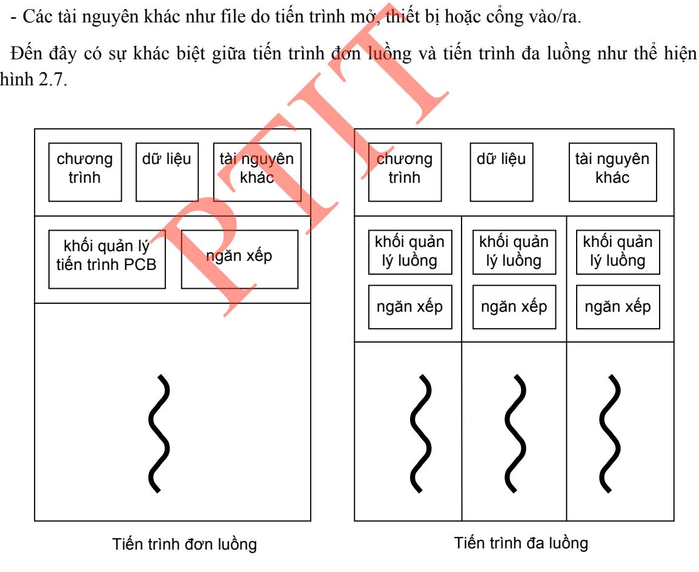

mình. Khi chuyển đổi tiến trình, những thông tin này sẽ được lưu vào PCB như đã nói ở trên.

Đối với mô hình đa luồng, do mỗi luồng có chuỗi thực hiện riêng của mình, mỗi luồng cần có khả năng quản lý con trỏ lệnh, nội dung thanh ghi. Luồng cũng có trạng thái riêng như chạy, bị khóa, sẵn sàng. Những thông tin này được chứa trong khối quản lý luồng, thay vì chứa trong PCB chung cho cả tiến trình. Ngoài ra, mỗi luồng còn có ngăn xếp riêng của mình, dùng để lưu các trạng thái, truyền tham số, chứa các biến tạm thời cho trường hợp thực hiện chương trình con.

Như vậy, trong mô hình đa luồng, tất cả luồng của một tiến trình chia sẻ không gian nhớ và tài nguyên của tiến trình đó. Các luồng có cùng không gian địa chỉ và có thể truy cập tới dữ liệu (các biến, các mảng) của tiến trình. Nếu một luồng thay đổi nội dung của biến nào đó, luồng khác sẽ nhận ra sự thay đổi này khi đọc biến đó. Nhờ cách tổ chức này, mô hình đa luồng có một số ưu điểm như sẽ phân tích trong phần sau.

## **2.2.4. Ưu điểm của mô hình đa luồng**

So với cách tổ chức tiến trình chỉ chứa một luồng, mô hình nhiều luồng trong một tiến trình có những ưu điểm chính sau đây:

- 1) **Tăng hiệu năng và tiết kiệm thời gian**. Việc tạo, xóa tiến trình đòi hỏi cấp phát, giải phóng bộ nhớ và tài nguyên của tiến trình, do vậy tốn thời gian. Do luồng dùng chung tài nguyên với tiến trình nên tạo và xóa luồng không đòi hỏi những công đoạn này, nhờ vậy tốn ít thời gian hơn nhiều. Việc chuyển đổi luồng cũng nhanh hơn chuyển đổi tiến trình, do ngữ cảnh của luồng ít thông tin hơn. Trong một số hệ điều hành, thời gian tạo mới luồng ít hơn vài chục lần so với tạo mới tiến trình.
- 2) **Dễ dàng chia sẻ tài nguyên và thông tin.** Các luồng của một tiến trình dùng chung không gian địa chỉ và tài nguyên. Tài nguyên dùng chung cho phép luồng dễ dàng liên lạc với nhau, ví dụ bằng cách ghi và đọc vào những biến (vùng bộ nhớ) chung.
- 3) **Tăng tính đáp ứng**. Tính đáp ứng (responsiveness) là khả năng tiến trình phản ứng lại với yêu cầu của người dùng hoặc tiến trình khác. Nhờ mô hình đa luồng, tiến trình có thể sử dụng một luồng đề thực hiện những thao tác đòi hỏi nhiều thời gian như đọc file dài, và sử dụng một luồng khác để tiếp nhận và xử lý yêu cầu của người dùng, nhờ vậy, tăng khả năng đáp ứng. Việc tăng tính đáp ứng rất quan trọng đối với hệ thống tương tác trực tiếp, tránh cho người dùng cảm giác tiến trình bị treo.
- 4) **Tận dụng được kiến trúc xử lý với nhiều CPU**. Trong hệ thống nhiều CPU, các luồng có thể chạy song song trên những CPU khác nhau, nhờ vậy tăng được tốc độ xử lý chung của tiến trình.
- 5) **Thuận lợi cho việc tổ chức chương trình**. Một số chương trình có thể tổ chức dễ dàng dưới dạng nhiều luồng thực hiện đồng thời. Điển hình là những chương trình bao gồm nhiều thao tác khác nhau cần thực hiện đồng thời, hay chương trình đòi hỏi vào/ra từ nhiều nguồn và đích khác nhau. Ví dụ, một chương trình thể hiện một vật chuyển động và phát ra âm thanh có thể tổ chức thành hai luồng riêng, một luồng chịu trách nhiệm phần đồ họa, một luồng chịu trách nhiệm phần âm thanh. PTIT

#### **2.2.5. Luồng mức người dùng và luồng mức nhân**

Ở trên, ta đã xem xét khái niệm luồng và lợi ích của việc sử dụng mô hình tiến trình với nhiều luồng. Tiếp theo ta sẽ xem xét vấn đề triển khai, cụ thể là luồng được tạo ra và quản lý như thế nào?

Nhìn chung, có thể tạo ra và quản lý luồng ở hai mức: mức người dùng và mức nhân. Luồng mức người dùng được tạo ra và quản lý không có sự hỗ trợ của hệ điều hành. Trong khi đó, luồng mức nhân được tạo ra nhờ hệ điều hành và được hệ điều hành quản lý. Luồng mức nhân còn được gọi là các tiểu trình để nhấn mạnh sự hỗ trợ trực tiếp của hệ điều hành tương tự như đối với tiến trình.

#### **a) Luồng mức người dùng**.

Luồng mức người dùng do trình ứng dụng tự tạo ra và quản lý, hệ điều hành không biết về sự tồn tại của những luồng như vậy. Để tạo ra luồng mức người dùng, trình ứng dụng sử dụng thư viện do ngôn ngữ lập trình cung cấp, ví dụ như khi lập trình trên Java. Thư viện hỗ trợ luồng thường bao gồm các hàm tạo, xóa luồng, đồng bộ luồng, thiết lập mức ưu tiên và điều độ luồng, hàm tạo liên lạc với luồng khác và hàm cho phép lưu/khôi phục ngữ cảnh của luồng.

Do hệ điều hành không biết về sự tồn tại của luồng mức người dùng, hệ điều hành vẫn coi tiến trình như một đơn vị duy nhất với một trạng thái tiến trình duy nhất. Việc phân phối CPU được thực hiện cho cả tiến trình thay vì cho từng luồng cụ thể (xem hình 2.8.a).

Việc sử dụng luồng mức người dùng có một số ưu điểm sau:

- Thứ nhất, do luồng được tạo ra và quản lý trong không gian người dùng nên việc chuyển đổi luồng không đòi hỏi phải chuyển sang chế độ nhân và do vậy tiết kiệm thời gian hơn.
- Thứ hai, trình ứng dụng có thể điều độ luồng theo đặc điểm riêng của mình, không phụ thuộc vào phương thức điều độ của hệ điều hành.
- Thứ ba, có thể sử dụng luồng mức người dùng cả trên những hệ điều hành không hỗ trợ đa luồng bằng cách bổ sung thư viện luồng mà các ứng dụng có thể dùng chung. PTIT

Bên cạnh đó, sử dụng luồng mức người dùng bị ảnh hưởng bởi một số nhược điểm dưới đây:

- Khi một luồng của tiến trình gọi lời gọi hệ thống và bị phong tỏa (tức là phải đợi cho tới khi thực hiện xong lời gọi hệ thống), thì toàn bộ tiến trình sẽ bị phong tỏa và phải đợi cho tới khi lời gọi hệ thống thực hiện xong. Như vậy, luồng mức người dùng không cho phép tận dụng ưu điểm về tính đáp ứng của mô hình đa luồng.
- Cách tổ chức này không cho phép tận dụng kiến trúc nhiều CPU. Do hệ điều hành phânphối CPU cho cả tiến trìnhchứ khôngphải từng luồng cụ thể nên tất cả các luồng của tiến trìnhphải chungnhaumột CPUthayvì thực hiện songsongtrênnhiều CPU khác nhau.

Có một số thư viện hỗ trợ luồng mức người dùng được sử dụng trên thực tế, trong đó có thể kể đến **Green threads** cho hệ điều hành Solaris và thư viện **GNU Portable threads**.

Hình 2.8: Mô hình sử dụng luồng mức người dùng và luồng mức nhân

#### **b) Luồng mức nhân**

Luồng mức nhân được hệ điều hành tạo ra và quản lý. Hệ điều hành sẽ cung cấp giao diện lập trình bao gồm một số lời gọi hệ thống mà trình ứng dụng có thể gọi để yêu cầu tạo/xóa luồng và thay đổi tham số liên quan tới quản lý luồng. Hệ điều hành Windows và Linux là hai ví dụ trong việc hỗ trợ luồng mức nhân như vậy.

Ưu điểm chủ yếu của luồng mức nhân là khắc phục được các nhược điểm của luồng mức người dùng. Cụ thể là việc sử dụng luồng mức nhân cho phép tăng tính đáp ứng và khả năng thực hiện đồng thời của các luồng trong cùng một tiến trình. Trên hệ thống với nhiều CPU, luồng mức nhân có thể được cấp CPU khác nhau để thực hiện song song.

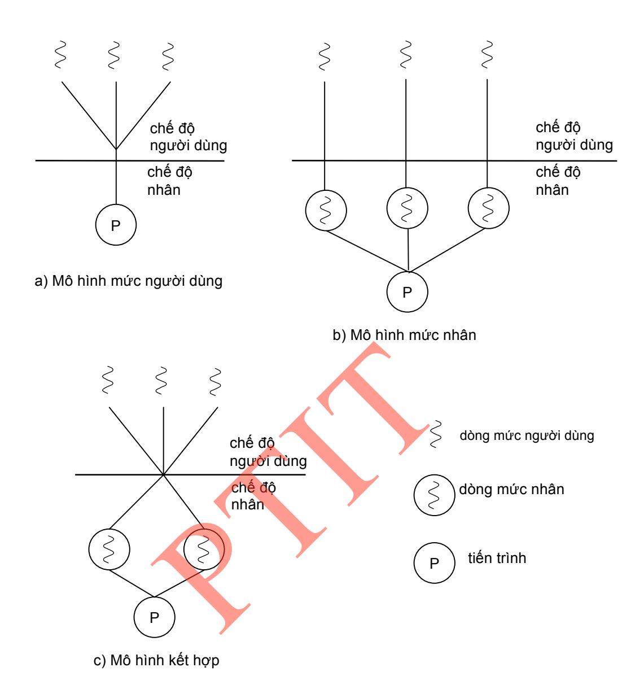

Nhược điểm chủ yếu của luồng mức nhân so với luồng mức người dùng là tốc độ. Việc tạo và chuyển luồng đòi hỏi thực hiện trong chế độ nhân và do vậy cần một số thao tác để chuyển từ chế độ người dùng sang chế độ nhân và ngược lại.

#### **c) Kết hợp luồng mức người dùng và luồng mức nhân**

Có thể kết hợp sử dụng luồng mức người dùng với luồng mức nhân. Theo cách tổ chức này, luồng mức người dùng được tạo ra trong chế độ người dùng nhờ thư viện. Sau đó, luồng mức người dùng được ánh xạ lên một số lượng tương ứng hoặc ít hơn luồng mức nhân. Số lượng luồng mức nhân phụ thuộc vào hệ thống cụ thể, chẳng hạn hệ thống nhiều CPU sẽ có nhiều luồng mức nhân hơn. Cũng có trường hợp hệ thống cho phép người lập trình điều chỉnh số lượng này.

Việc kết hợp luồng mức người dùng với luồng mức nhân cho phép kết hợp ưu điểm của hai phương pháp riêng lẻ. Trình ứng dụng có thể tạo ra rất nhiều luồng mức người dùng. Tùy thuộc vào số lượng CPU, một số luồng có thể chạy song song với nhau. Ngoài ra khi có luồng bị phong tỏa, hệ điều hành có thể phân phối CPU cho luồng khác thực hiện.

2.3. ĐIỀU ĐỘ TIẾN TRÌNH

# **2.3.1. Khái niệm điều độ**

Trong hệ thống cho phép đa chương trình, nhiều tiến trình có thể tồn tại và thực hiện cùng một lúc. Kỹ thuật đa chương trình có nhiều ưu điểm do cho phép sử dụng CPU hiệu quả, đồng thời đáp ứng tốt hơn yêu cầu tính toán của người dùng. Bên cạnh đó, đa chương trình cũng đặt ra nhiều vấn đề phức tạp hơn đối với hệ điều hành. Một trong những vấn đề cơ bản khi thực hiện đa chương trình là vấn đề *điều độ*. PTIT

*Điều độ* (scheduling) hay *lập lịch* là quyết định tiến trình nào được sử dụng tài nguyên phần cứng khi nào, trong thời gian bao lâu. Bài toán điều độ được đặt ra với mọi dạng tài nguyên khác nhau, chẳng hạn thiết bị vào/ra, CPU, bộ nhớ…, kể cả trong trường hợp có chia sẻ thời gian hay không. Trong phần này, chúng ta sẽ tập trung vào vấn đề điều độ đối với CPU, gọi là *điều độ CPU*, hay là *điều độ tiến trình*.

Đối với hệ thống bao gồm một CPU duy nhất, tại mỗi thời điểm chỉ một tiến trình được cấp CPU để thực hiện. Hệ điều hành có thể chờ cho tới khi tiến trình không sử dụng CPU nữa hoặc chủ động điều độ lại để chuyển CPU sang thực hiện tiến trình khác, tùy thuộc vào phương pháp điều độ cụ thể. Như vậy điều độ tiến trình là quyết định thứ tự và thời gian sử dụng CPU. Đối với hệ thống nhiều CPU, việc điều độ thường phức tạp hơn, và sẽ không được đề cập tới ở đây.

**Điều độ tiến trình và điều độ luồng**. Trong những hệ thống trước đây, tiến trình là đơn vị thực hiện chính, là đối tượng được cấp CPU, và việc điều độ được thực hiện đối với tiến trình. Hệ thống hiện nay thường hỗ trợ luồng. Trong trường hợp này, luồng mức nhân là đơn vị thực hiện được hệ điều hành cấp phát CPU chứ không phải tiến trình, và do vậy việc điều độ được hệ điều hành thực hiện trực tiếp với luồng. Tuy nhiên, thuật ngữ *điều độ tiến trình* vẫn được sử dụng rộng rãi và được hiểu tương đương với *điều độ luồng*, trừ khi có giải thích cụ thể.

#### **2.3.2. Các dạng điều độ**

#### **Điều độ dài hạn và ngắn hạn**

Trong một số hệ thống, điều độ tiến trình được phân chia thành một số mức khác nhau, bao gồm: *điều độ dài hạn*, *điều độ trung hạn*, và *điều độ ngắn hạn*. Theo như tên gọi, điều độ dài hạn được thực hiện cho những khoảng thời gian dài và ít diễn ra nhất. Ngược lại, điều độ ngắn hạn diễn ra thường xuyên, điều độ trung hạn chiếm vị trí ở giữa.

*Điều độ dài hạn* được thực hiện khi mới tạo ra tiến trình. Hệ điều hành quyết định xem tiến trình có được thêm vào danh sách đang hoạt động hay không. Nếu được chấp nhận, trong hệ thống sẽ thêm tiến trình mới. Ngược lại, tiến trình sẽ phải chờ tới thời điểm khác để được tạo ra và thực hiện. Điều độ dài hạn ảnh hưởng tới mức độ đa chương trình, tức là số lượng tiến trình tối đa trong hệ thống. Trong máy tính cá nhân, người dùng ít cảm nhận được ảnh hưởng của điều độ dài hạn do hầu hết tiến trình đều được chấp nhận tạo mới. Đối với những máy tính lớn được sử dụng chung, điều độ dài hạn đóng vai trò quan trọng và rõ ràng hơn.

*Điều độ trung hạn* là quyết định tiến trình có được cấp bộ nhớ để thực hiện không. Để thực hiện được, tiến trình cần được tải vào bộ nhớ hoàn toàn, hoặc một phần nếu sử dụng bộ nhớ ảo. Trong một số trường hợp như khi mới khởi tạo và bộ nhớ được nạp trang theo nhu cầu (xem phần kỹ thuật nạp trang trong chương sau), hay khi tiến trình bị trao đổi ra đĩa (swapping) để nhường chỗ cho tiến trình khác, hệ điều hành cần quyết định có cho phép tải tiến trình vào bộ nhớ để thực hiện không. Điều độ trung hạn cũng ảnh hưởng tới mức độ đa chương trình và được quyết định dựa trên mức độ ưu tiên cùng tình trạng hệ thống. Các tiến trình đã được tạo mới và được tải vào bộ nhớ do kết quả điều độ dài hạn và trung hạn được xếp vào hàng đời để điều độ ngắn hạn. PTIT

*Điều độ ngắn hạn* là quyết định tiến trình nào được cấp CPU để thực hiện. Việc điều độ ngắn hạn được thực đối với những tiến trình đang ở trạng thái sẵn sàng. Hệ điều hành lựa chọn một tiến trình đang trong bộ nhớ và sẵn sàng thực hiện để cấp phát CPU. Việc lựa chọn tiến trình được thực hiện theo một thuật toán nào đó.

Các dạng điều độ gắn liền với việc chuyển tiến trình tự trạng thái này sang trạng thái khác. Hình 2.9 minh họa quan hệ giữa trạng thái tiến trình và ba dạng điều độ trên.

Trong các phần tiếp theo, chúng ta chỉ xem xét vấn đề điều độ ngắn hạn. Vì vậy, nếu không nói gì thêm, điều độ tiến trình được hiểu là điều độ ngắn hạn hay điều độ CPU.

Hình 2.9: Các dạng điều độ

## **Điều độ có phân phối lại**

Tùy thuộc vào việc hệ điều hành có thể thực hiện điều độ khi một tiến trình đang sử dụng CPU hay không, ta phân biệt *điều độ không phân phối lại* (nonpreemptive) và *điều độ có phân phối lại* (preemptive).

*Điều độ có phân phối lại* là kiểu điều độ trong đó hệ điều hành có thể sử dụng cơ chế ngắt để thu hồi CPU của một tiến trình đang trong trạng thái chạy, tức là tiến trình đang sử dụng CPU để thực hiện lệnh của mình. Với kiểu điều độ này, hệ điều hành có thể phân phối lại CPU một cách chủ động, không cần chờ cho tới khi tiến trình đang chạy kết thúc hoặc chuyển sang trạng thái chờ đợi. PTIT

*Điều độ không phân phối lại* là kiểu điều độ trong đó tiến trình đang ở trạng thái chạy sẽ được sử dụng CPU cho đến khi xảy ra một trong các tình huống sau: tiến trình kết thúc, hoặc tiến trình phải chuyển sang trạng thái chờ đợi do thực hiện yêu cầu vào/ra hoặc lời gọi hệ thống, hoặc chờ đợi tín hiệu đồng bộ từ tiến trình khác. Điều độ không phân phối lại còn gọi lại *điều độ hợp tác* (cooperative), do việc điều độ chỉ có thể thực hiện khi tiến trình thể hiện thái độ hợp tác và nhường lại CPU do không cần dùng nữa. Trong trường hợp tiến trình không hợp tác và chiếm CPU vô hạn, ví dụ khi sử dụng vòng lặp vô hạn không chứa lời gọi hệ thống, các tiến trình khác sẽ không bao giờ được cấp CPU.

Các phiên bản đầu tiên của Windows là Windows 3.x sử dụng điều độ không phân phối lại. Windows 95, NT và các phiên bản sau sử dụng điều độ có phân phối lại, cho phép thực hiện đa chương trình và chia sẻ thời gian đúng nghĩa và tin cậy hơn.

So với điều độ không phân phối lại, điều độ có phân phối lại có nhiều ưu điểm hơn do hệ điều hành chủ động hơn, không phụ thuộc vào hoạt động của tiến trình. Chỉ có điều độ phân phối lại mới đảm bảo chia sẻ thời gian thực sự. Tuy nhiên, điều độ có phân phối lại đòi hỏi phần cứng phải có bộ định thời gian (timer) và một số hỗ trợ khác.

Bên cạnh đó, điều độ có phân phối lại cũng làm cho vấn đề quản lý tiến trình phức tạp hơn, đặc biệt trong trường hợp các tiến trình chia sẻ dữ liệu dùng chung hoặc có cạnh tranh về

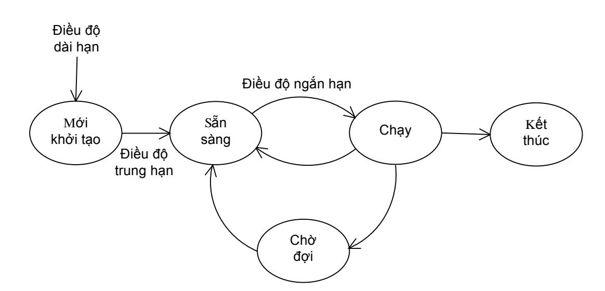

tài nguyên. Lấy ví dụ hai tiến trình cùng sử dụng một mảng dữ liệu chung. Do có phân phối lại, CPU có thể được thu hồi từ tiến trình thứ nhất để cấp cho tiến trình thứ hai khi chưa tiến trình thứ nhất chưa cập nhật xong dữ liệu. Nếu tiến trình thứ hai đọc dữ liệu khi đó sẽ nhận được dữ liệu không nhất quán.

#### **2.3.3. Các tiêu chí điều độ**

Các tiến trình trong trạng thái sẵn sàng được xếp vào hàng đợi chờ được điều độ, tức là chờ được cấp CPU để thực hiện. Hệ điều hành sử dụng thuật toán điều độ để lựa chọn tiến trình được cấp CPU tiếp theo. Mỗi thuật toán thường tốt cho một số trường hợp cụ thể tùy vào điều kiện hệ thống và tiêu chí điều độ.

Có nhiều tiêu chí được sử dụng khi điều độ CPU và đánh giá thuật toán. Một số tiêu chí chú trọng tới việc khai thác hiệu quả hệ thống trong khi một số tiêu chí tập trung nâng cao tính tiện lợi cho người dùng. Sau đây là một số tiêu chí thường sử dụng:

- **Lượng tiến trình được thực hiện xong**. Tiêu chí này được tính bằng số lượng tiến trình thực hiện xong trong một đơn vị thời gian. Trên thực tế, thời gian thực hiện tiến trình rất khác nhau, có tiến trình cần nhiều thời gian, có tiến trình ít hơn. Tuy nhiên, tiêu chí này mang tính trung bình và là một độ đo tính hiệu quả của hệ thống.
- **Hiệu suất sử dụng CPU**. Một trong những yêu cầu sử dụng hiệu quả hệ thống là cố gắng để CPU càng ít phải nghỉ càng tốt. Tỷ lệ phần trăm thời gian CPU trong trạng thái hoạt động thay đổi tùy hệ thống cụ thể.
- **Thời gian vòng đời trung bình tiến trình.** Được tính bằng thời gian từ lúc có yêu cầu khởi tạo tiến trình tới khi tiến trình kết thúc. Thời gian này bằng tổng thời gian tải tiến trình, thời gian chờ đợi, chạy, vào/ra dữ liệu.
- **Thời gian chờ đợi.** Tính bằng tổng thời gian tiến trình nằm trong trạng thái sẵn sàng và chờ được cấp CPU. Lưu ý rằng, thời gian chờ đợi lớn hay nhỏ chịu ảnh hưởng trực tiếp của thuật toán điều độ CPU.
- **Thời gian đáp ứng.** Đây là tiêu chí hướng tới người dùng và thường được sử dụng trong hệ thống tương tác trực tiếp. Đối với hệ thống như vậy, tiêu chí quan trọng là đảm bảo thời gian từ lúc nhận được yêu cầu cho tới khi hệ thống có phản ứng hay đáp ứng đầu tiên không quá lâu. PTIT

Trong số các tiêu chí nói trên, hai tiêu chí đầu tiên có giá trị càng lớn càng tốt, trong khi đó ba tiêu chí cuối là thời gian chờ đợi và thời gian đáp ứng càng nhỏ càng tốt. Riêng đối với thời gian đáp ứng, bên cạnh việc đảm bảo giá trị đáp ứng trung bình nhỏ cũng cần đảm bảo để không tiến trình nào có thời gian đáp ứng quá lâu.

Bên cạnh những tiêu chí nói trên, một yêu cầu quan trọng là đảm bảo tính ổn định của hệ thống, thể hiện qua việc giá trị tiêu chí trong từng trường hợp cụ thể không lệch quá xa so với giá trị trung bình của tiêu chí đó. Ngoài ra những tiến trình giống nhau cần được đối xử công bằng. Các yêu cầu này được thể hiện qua hai tiêu chí bổ sung sau:

- **Tính dự đoán được**. Vòng đời, thời gian chờ đợi, và thời gian đáp ứng của một tiến trình cụ thể phải ổn định, không phụ thuộc vào tải của hệ thống. Ví dụ, người sử dụng

phải nhận được đáp ứng từ hệ thống trong một thời gian chấp nhận được và không bị thay đổi lớn trong bất kể tình huống nào.

- **Tính công bằng**. Những tiến trình cùng độ ưu tiên phải được đối xử như nhau, không tiến trình nào bị đói tài nguyên hơn những tiến trình khác.

Trong phần sau, ta sẽ sử dụng những tiêu chí trên khi xem xét thuật toán điều độ cụ thể.

#### **2.3.4. Các thuật toán điều độ**

Nhiều thuật toán điều độ tiến trình được đề xuất và sử dụng trên thực tế. Sau đây là những thuật toán tiêu biểu hoặc thường gặp nhất.

## **a. Thuật toán đến trước phục vụ trước**

*Đến trước phục vụ trước* (First Come First Served – viết tắt là FCFS) là phương pháp điều độ đơn giản nhất, cả về nguyên tắc và cách thực hiện. Tiến trình yêu cầu CPU trước sẽ được cấp CPU trước.

Hệ điều hành xếp tiến trình sẵn sàng vào hàng đợi FIFO. Tiến trình mới được xếp vào cuối hàng đợi, khi CPU được giải phóng, hệ điều hành sẽ lấy tiến trình từ đầu hàng đợi và cấp CPU cho tiến trình đó thực hiện.

Mặc dù đơn giản và đảm bảo tính công bằng, FCFS có thời gian chờ đợi trung bình của tiến trình lớn do phải chờ đợi tiến trình có chu kỳ CPU dài trong trường hợp những tiến trình như vậy nằm ở đầu hàng đợi. Để minh họa, ta xét ví dụ: cho 3 tiến trình với thứ tự xuất hiện và độ dài chu kỳ CPU như sau: PTIT

| PT           |                    |
|--------------|--------------------|
| Ti ế n trình | Độ dài chu k ỳ CPU |
| P1           | 10                 |
| P2           | 4                  |
| P3           | 2                  |

Kết quả điều độ theo thuật toán FCFS thể hiện trên hình sau:

|    | 10 |    | 14 |
|----|----|----|----|
| 10 |    | 4  | 2  |
| P1 |    | P2 | P3 |

Thời gian chờ đợi của P1, P2, P3 lần lượt là 0, 10, và 14.

Thời gian chờ đợi trung bình = (0 + 10 + 14)/3 = 8.

Có thể thấy thời gian chờ đợi trung bình như vậy là rất lớn, chẳng hạn so với trường hợp tiến trình được cấp CPU theo thứ tự P3, P2, P1. Khi đó thời gian chờ đợi trung bình giảm xuống chỉ còn (6 + 2 + 0)/3 = 2,67.

Cần lưu ý rằng việc tăng thời gian chờ đợi CPU của tiến trình ảnh hưởng rất lớn tới hiệu suất chung của hệ thống do nhiều tiến trình phải dồn lại chờ một tiến trình trong khoảng thời gian quá lâu, dẫn tới tình trạng không tiến trình nào thực hiện được công việc của mình, kể cả vào ra. Kết quả là toàn hệ thống phải dừng lại chờ giải phóng CPU.

Thuật toán FCFS thông thường là thuật toán điều độ không phân phối lại. Sau khi tiến trình được cấp CPU, tiến trình đó sẽ sử dụng CPU cho đến khi kết thúc hoặc phải dừng lại để chờ kết quả vào ra. Để có thể sử dụng được trong những hệ thống chia sẻ thời gian, thuật toán đến trước phục vụ trước được cải tiến để thêm cơ chế phân phối lại. Ta sẽ xem xét thuật toán điều độ như vậy trong một phần sau.

## **b. Điều độ quay vòng**

*Điều độ quay vòng* (round robin - RR) là phiên bản sửa đổi của FCFS được dùng cho các hệ chia sẻ thời gian. Điều độ quay vòng tương tự FCFS nhưng có thể cơ chế phân phối lại bằng cách sử dụng ngắt của đồng hồ. Hệ thống định nghĩa những khoảng thời gian nhỏ gọi là *lượng tử thời gian* (time quantum) hay *lát cắt thời gian* (time slice) có độ dài từ vài mili giây tới vài trăm mili giây tùy vào cấu hình cụ thể. Tiến trình sẽ lần lượt được cấp CPU trong những khoảng thời gian như vậy trước khi bị ngắt và CPU được cấp cho tiến trình khác.

Giống như FCFS, tiến trình sẵn sàng được xếp vào hàng đợi sao cho tiến trình đến sau được thêm vào cuối hàng. Khi CPU được giải phóng, hệ điều hành đặt thời gian của đồng hồ bằng độ dài lượng tử, lấy một tiến trình ở đầu hàng đợi và cấp CPU cho tiến trình.

Sau khi được cấp CPU, tiến trình chuyển sang trạng thái chạy. Nếu tiến trình kết thúc chu kỳ sử dụng CPU trước khi hết thời gian lượng tử, tiến trình sẽ giải phóng CPU và trả lại quyền điều khiển cho hệ điều hành. Trong trường hợp ngược lại, khi hết độ dài lượng tử, đồng hồ sẽ sinh ngắt. Tiến trình đang thực hiện phải dừng lại và quyền điều khiển chuyển cho hàm xử lý ngắt của hệ điều hành. Hệ điều hành thực hiện việc chuyển đổi ngữ cảnh và chuyển tiến trình về cuối hàng đợi sau đó chọn một tiến trình ở đầu và lặp lại quá trình trên. PTIT

Điều độ quay vòng cho phép cải thiện thời gian đáp ứng của tiến trình so với FCFS nhưng vẫn có thời gian chờ đợi trung bình tương đối dài. Sau đây là minh họa cho phương pháp điều độ này với ba tiến trình P1, P2, P3 lấy từ ví dụ ở phần trước và lượng tử thời gian có độ dài bằng 2.

|    | 2  | 4  | 6  | 8  | 10 | 12 | 14 |
|----|----|----|----|----|----|----|----|
| 2  | 2  | 2  | 2  | 2  | 2  | 2  | 2  |
| P1 | P2 | P3 | P1 | P2 | P1 | P1 | P1 |

Thời gian chờ đợi của P1, P2, P3 lần lượt là 6, 6, và 4.

Thời gian chờ đợi trung bình = (6 + 6 + 4)/3=5,33.

Một vấn đề quan trọng khi điều độ quay vòng là lựa chọn độ dài lượng tử thời gian. Nếu lượng tử ngắn, thời gian đáp ứng sẽ giảm. Tuy nhiên, việc chuyển đổi tiến trình diễn ra thường xuyên đòi hỏi nhiều thời gian hơn cho việc chuyển đổi ngữ cảnh. Độ dài lượng tử nên lựa chọn lớn hơn thời gian cần thiết để tiến trình thực hiện một thao tác tương tác tiêu biểu hoặc. Ngược lại, lượng tử càng lớn càng tốn ít thời gian chuyển đổi giữa các tiến trình nhưng tính đáp ứng cũng kém đi. Khi lượng tử lớn tới một mức nào đó, điều độ quay vòng sẽ trở thành FCFS.

# **c. Điều độ ưu tiên tiến trình ngắn nhất**

Một phương pháp điều độ cho phép giảm thời gian chờ đợi trung bình là điều độ ưu tiên *tiến trình ngắn nhất trước* (Shortest Process First - SPF), hay còn có các tên gọi khác như công việc ngắn nhất trước (Shortest Job Fist), tiến trình ngắn nhất tiếp theo (Shortest Process Next). Phương pháp điều độ này lựa chọn trong hàng đợi tiến trình có chu kỳ sử dụng CPU tiếp theo ngắn nhất để phân phối CPU. Trong trường hợp có nhiều tiến trình với chu kỳ CPU tiếp theo bằng nhau, tiến trình đứng trước sẽ được chọn.

Ưu điểm lớn nhất của SPF so với FCFS là thời gian chờ đợi trung bình nhỏ hơn nhiều. Xét ví dụ điều độ cho các tiến trình như ở phần trên nhưng sử dụng SPF.

|    | 2 |    | 6 |    |
|----|---|----|---|----|
| 2  |   | 4  |   | 10 |
| P3 |   | P2 |   | P1 |

Thời gian chờ đợi trung bình = (6 + 2 +0)/3 = 2,67.

Mặc dù điều độ ưu tiên tiến trình ngắn nhất có thời gian chờ đợi trung bình tối ưu, phương pháp này rất khó sử dụng trên thực tế do đòi hỏi phải biết trước độ dài chu kỳ sử dụng CPU tiếp theo của tiến trình. Có hai cách để giải quyết phần nào khó khăn này. Cách thứ nhất được áp dụng đối với hệ thống xử lý theo mẻ như tại các trung tâm tính toán hiệu năng cao hiện nay. Quản trị hệ thống căn cứ vào thời gian đăng ký tối đa do lập trình viên cung cấp để xếp những ứng dụng có thời gian đăng ký ngắn hơn lên trước. Lưu ý, đây là thời gian thực hiện cả ứng dụng chứ không phài một chu kỳ sử dụng CPU cụ thể. PTIT

Cách thứ hai là dự đoán độ dài chu kỳ sử dụng CPU tiếp theo. Cách dự đoán đơn giản nhất là dựa trên độ dài trung bình các chu kỳ CPU trước đó để dự đoán độ dài chu kỳ tiếp theo và ra quyết định cấp CPU.

Điều độ ưu tiên tiến trình ngắn nhất trước là điều độ không có phân phối lại. Nếu một tiến trình được cấp CPU, tiến trình sẽ thực hiện cho tới khi không cần CPU nữa, kể cả trong trường hợp xuất hiện tiến trình mới với chu kỳ sử dụng CPU ngắn hơn chu kỳ CPU còn lại của tiến trình đang thực hiện. Trong phần tiếp theo ta sẽ xem xét việc thêm cơ chế phân phối lại cho điều độ ưu tiên tiến trình ngắn nhất trước.

## **d. Điều độ ưu tiên thời gian còn lại ngắn nhất**

Phiên bản ưu tiên tiến trình ngắn nhất có thêm cơ chế phân phối lại được gọi là điều độ *ưu tiên thời gian còn lại ngắn nhất trước* (Shortest Remaining Time First – SRTF). Khi một tiến trình mới xuất hiện trong hàng đợi, hệ điều hành so sánh thời gian còn lại của tiến trình đang chạy với thời gian còn lại của tiến trình mới xuất hiện. Nếu tiến trình mới xuất hiện có thời gian còn lại ngắn hơn, hệ điều hành sẽ thu hồi CPU của tiến trình đang chạy và phân phối cho tiến trình mới.

Để minh họa cho phương pháp điều độ này, ta xét ví dụ sau với ba tiến trình có chu kỳ CPU và thời gian xuất hiện trong hàng đợi như sau:

| Ti ế n trình | Th ờ i đ i ể m xu | ấ t hi ệ n Độ dài chu k ỳ CPU |
|--------------|-------------------|-------------------------------|
| P1           | 0                 | 8                             |
| P2           | 0                 | 7                             |
| P3           | 2                 | 4                             |

Kết quả điều độ sử dụng SRTF được thể hiện trên biểu đồ sau:

| 0  | 2  | 6  | 11 |
|----|----|----|----|
| 2  | 4  | 5  | 8  |
| P2 | P3 | P2 | P1 |

Cũng giống như điều độ ưu tiên tiến trình ngắn nhất, điều độ ưu tiên thời gian còn lại ngắn nhất có thời gian chờ đợi trung bình nhỏ nhưng đòi hỏi hệ điều hành phải dự đoán được độ dài chu kỳ sử dụng CPU của tiến trình. So với điều độ quay vòng, việc chuyển đổi tiến trình diễn ra ít hơn và do vậy không tốn nhiều thời gian chuyển đổi ngữ cảnh.

#### **e. Điều độ có mức ưu tiên**

Theo phương pháp này, mỗi tiến trình có một mức ưu tiên. Tiến trình được ưu tiên hơn sẽ được cấp CPU trước. Các tiến trình có mức ưu tiên như nhau được điều độ theo nguyên tắc FCFS.

Có thể thấy hai phương pháp STF và SRTF ở trên là trường hợp riêng của điều độ có mức ưu tiên trong đó tiến trình có thời gian chu kỳ CPU hoặc thời gian chu kỳ CPU còn lại ngắn hơn được ưu tiên hơn. Trong trường hợp tổng quát, mức ưu tiên được xác định theo nhiều tiêu chí khác nhau như yêu cầu bộ nhớ, hạn chế thời gian… Mức ưu tiên cũng có thể do người quản trị hệ thống xác định dựa trên mức độ quan trọng của tiến trình. PTIT

Hệ điều hành quy định mức ưu tiên dưới dạng số nguyên trong một khoảng nào đó, ví dụ từ 0 đến 31. Tuy nhiên, không có quy tắc chung về việc mức ưu tiên cao tương ứng với số nhỏ hay số to. Một số hệ điều hành coi số 0 ứng với mức ưu tiên cao nhất trong khi một số hệ điều hành sử dụng 0 cho mức ưu tiên thấp nhất.

Ví dụ sau minh họa cho điều độ có mức ưu tiên, trong đó 0 ứng với mức ưu tiên cao nhất và các số lớn hơn tương ứng với mức ưu tiên thấp hơn.

|    | Ti ế n trình | M ứ c ư u tiên |
|----|--------------|----------------|
|    | P1           | 4              |
|    | P2           | 1              |
|    | P3           | 3              |
| P2 | P3           | P1             |

Điều độ có mức ưu tiên vừa trình bày ở trên là điều độ không phân phối lại. Tuy nhiên có thể thêm cơ chế phân phối lại cho phương pháp này. Nếu tiến trình mới xuất hiện có mức ưu tiên cao hơn tiến trình đang chạy, hệ điều hành sẽ thu hồi CPU và phân phối cho tiến trình mới.

#### **f. Điều độ với nhiều hàng đợi**

Các phương pháp điều độ trình bày ở trên đều làm việc với một hàng đợi duy nhất chứa tiến trình ở trạng thái sẵn sàng. Tất cả tiến trình đều được điều độ theo cùng một thuật toán giống nhau. Trên thực tế, tiến trình có thể phân chia thành nhiều loại với đặc điểm, độ quan trọng và nhu cầu sử dụng CPU khác nhau, mỗi loại có thể đòi hỏi phương pháp điều độ riêng. Lấy ví dụ trong máy tính cá nhân, trình soạn thảo bảng tính và bảng tính đòi hỏi tương tác trực tiếp trong khi tiến trình quản lý in và quét virut trên đĩa là tiến trình nền. Hai loại tiến trình này đòi hỏi thời gian đáp ứng khác nhau và do vậy cần có mức ưu tiên cũng như cách điều độ khác nhau.

*Điều độ với nhiều hàng đợi* là phương pháp điều độ trong đó tiến trình được phân chia thành nhiều loại tùy theo đặc điểm và độ ưu tiên. Mỗi loại được xếp trong một hàng đợi riêng và được điều độ theo một phương pháp phù hợp với đặc điểm của loại tiến trình đó. Thông thường, tiến trình tương tác trực tiếp được điều độ theo phương pháp quay vòng RR trong khi tiến trình nền được điều độ FCFS.

Trên 2.10 là một ví dụ điều độ với nhiều hàng đợi.

Do có nhiều loại tiến trình nên cần xác định mức độ ưu tiên cho từng loại, chẳng hạn tiến trình tương tác trực tiếp có mức ưu tiên cao hơn tiến trình nền. Giữa các hàng đợi với nhau có thể điều độ theo hai cách sau. Cách thứ nhất là điều độ theo mức ưu tiên có phân phối lại. Tiến trình ở hàng đợi với mức ưu tiên thấp hơn phải nhường cho tiến trình ở hàng đợi với mức ưu tiên cao chạy trước. Nếu có tiến trình mới với mức ưu tiên cao hơn xuất hiện, tiến trình đang chạy phải nhường CPU. Cách thứ hai là cấp cho mỗi hàng đợi một khoảng thời gian nhất định (có thể phụ thuộc vào mức ưu tiên). Tiến trình trong từng hàng đợi được điều độ theo phương pháp của hàng đợi của mình trong khoảng thời gian được cấp đó. PTIT

Hình 2.10. Ví dụ điều độ với nhiều hàng đợi

# **2.3.5. Điều độ trên hệ thống cụ thể**

## **Điều độ trong Windows**

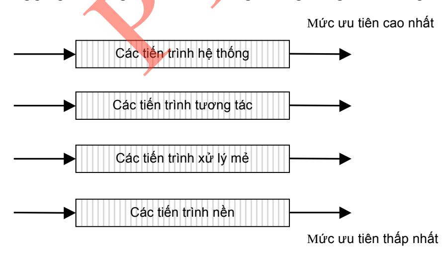

Windows là hệ điều hành hỗ trợ đa luồng, do vậy CPU được điều độ ở mức luồng. Trong các phiên bản đầu, tức là tới trước Win 95, điều độ là không phân phối lại. Các phiên bản từ Win 95 điều độ luồng *dựa trên mức ưu tiên* và *có phân phối lại*, tức là luồng có thể bị thu hồi CPU cả khi đang ở trong trạng thái chạy.

Mỗi luồng trong Windows được gán một mức ưu tiên dùng cho điều độ. Có tất cả 32 mức ưu tiên nằm trong khoảng từ không (thấp nhất) tới 31 (cao nhất). Chỉ duy nhất một luồng có mức ưu tiên bằng không là luồng của hệ điều hành có nhiệm vụ xóa nội dung tất cả các trang nhớ trống về không và luồng này được thực hiện khi không có luồng nào khác có nhu cầu chạy.

Windows xếp các luồng có cùng mức ưu tiên vào cùng một hàng đợi. Các luồng trong cùng hàng đợi được điều độ theo phương pháp *quay vòng*. Trước tiên, hệ thống phân phối CPU cho các luồng có mức ưu tiên cao nhất. Nếu không có luồng nào trong số đó sẵn sàng để chạy, Windows sẽ chuyển sang cấp CPU cho hàng đợi gồm các luồng với mức ưu tiên cao tiếp theo. Trong lúc một luồng đang chạy, nếu một luồng ở mức ưu tiên cao hơn có yêu cầu CPU, luồng đang chạy sẽ bị ngắt ngay, bất kể lượng tử thời gian của tiến trình đó đã hết chưa, để nhường CPU cho tiến trình có mức ưu tiên cao hơn mới xuất hiện.

32 mức ưu tiên được nhóm thành sáu nhóm, mỗi nhóm bao gồm một dải mức ưu tiên. Mức ưu tiên của luồng được xác định dựa trên hai thông tin: 1) luồng thuộc nhóm ưu tiên nào; và 2) độ ưu tiên của luồng so với trung bình của nhóm. PTIT

**Các nhóm ưu tiên**. Windows xác định sáu nhóm ưu tiên như sau:

IDLE\_PRIORITY\_CLASS BELOW\_NORMAL\_PRIORITY\_CLASS NORMAL\_PRIORITY\_CLASS ABOVE\_NORMAL\_PRIORITY\_CLASS HIGH\_PRIORITY\_CLASS REALTIME\_PRIORITY\_CLASS

Có thể đặt nhóm ưu tiên cho luồng sử dụng lời gọi hệ thống SetPriorityClass, hoặc đặt bằng tay từ giao diện đồ họa của Task Manager. Theo mặc định, luồng thuộc nhóm ưu tiên NORMAL\_PRIORITY\_CLASS. Luồng có mức ưu tiên IDLE\_PRIORITY\_CLASS là luồng làm các công việc nền như screen saver. Các luồng không được khuyến cáo đặt mức ưu tiên ở mức REALTIME\_PRIORITY\_CLASS vì khi có luồng với mức ưu tiên như vậy chạy, các luồng khác sẽ không nhận được CPU để chạy, kể cả các luồng xử lý tín hiệu từ chuột, bàn phím.

**Mức ưu tiên trong nhóm**. Mỗi nhóm bao gồm một số mức ưu tiên. Các luồng thuộc một nhóm ưu tiên có thể thay đổi mức ưu tiên cụ thể tùy vào mức ưu tiên tương đối trong nhóm. Các mức ưu tiên tương đối trong nhóm bao gồm:

THREAD\_PRIORITY\_IDLE THREAD\_PRIORITY\_LOWEST THREAD\_PRIORITY\_BELOW\_NORMAL THREAD\_PRIORITY\_NORMAL THREAD\_PRIORITY\_ABOVE\_NORMAL THREAD\_PRIORITY\_HIGHEST THREAD\_PRIORITY\_TIME\_CRITICAL

Mức ưu tiên cụ thể của luồng được xác định bằng cách kết hợp mức ưu tiên cơ sở của nhóm với mức ưu tiên tương đối trong nhóm. Quy tắc kết hợp được thể hiện trên bảng 2.1, trong đó các cột là các nhóm ưu tiên, các hàng là mức ưu tiên tương đối trong nhóm. Các ô chứa mức ưu tiên cụ thể tương ứng với mỗi hàng và cột.

Bảng 2.1. Mức ưu tiên của luồng Windows dựa trên nhóm và mức ưu tiên tương đối

|               | Realtime class | High | class Above Normal class | Normal class | Below Normal class | Idle class |
|---------------|----------------|------|--------------------------|--------------|--------------------|------------|
| Time_critical | 31             | 15   | 15                       | 15           | 15                 | 15         |
| Highest       | 26             | 15   | 12                       | 10           | 8                  | 6          |
| Above_normal  | 25             | 14   | 11                       | 9            | 7                  | 5          |
| Normal        | 24             | 13   | 10                       | 8            | 6                  | 4          |
| Below_normal  | 23             | 12   | 9                        | 7            | 5                  | 3          |
| Lowest        | 22             | 11   | 8                        | 6            | 4                  | 2          |
| Idle          | 16             | 1    | 1                        | 1            | 1                  | 1          |

Bên cạnh việc sử dụng mức ưu tiên, Windows còn phân biệt giữa các tiến trình đang được chọn, tức là tiến trình có cửa sổ nằm trên cùng, với các tiến trình còn lại. Tiến trình đang được chọn sẽ được tăng lượng tử thời gian lên khoảng 3 lần so với các tiến trình khác cùng mức ưu tiên và do vậy sẽ được nhận CPU trong khoảng thời gian dài hơn. PTIT

# 2.4. ĐỒNG BỘ HÓA TIẾN TRÌNH ĐỒNG THỜI

Trong những hệ thống cho phép nhiều tiến trình và/hoặc nhiều dòng cùng tồn tại, do mối quan hệ trực tiếp hoặc gián tiếp giữa các tiến trình, nhiều vấn đề phức tạp có thể phát sinh so với trường hợp chỉ có một tiến trình. Những tiến trình cùng tồn tại được gọi là *tiến trình đồng thời* (concurrent process) hay còn được gọi là *tiến trình tương tranh*. Vấn đề quản lý tiến trình đồng thời hay quản lý tương tranh là vấn đề quan trọng đối với hệ điều hành nói riêng và khoa học máy tính nói chung.

Quản lý tiến trình đồng thời bao gồm nhiều vấn đề liên quan tới liên lạc giữa các tiến trình, cạnh tranh và chia sẻ tài nguyên, phối hợp và đồng bộ hóa hoạt động các tiến trình, vấn đề bế tắc (deadlock) và đói tài nguyên (starvation). Phần này sẽ tập trung vào đồng bộ hóa tiến trình, những chủ đề khác liên quan tới tiến trình đồng thời sẽ được trình bày sau.

Cần lưu ý rằng, mặc dù thuật ngữ tiến trình được sử dụng khi trình bày về đồng bộ hóa, các nội dung trình bày cũng đúng đối với luồng trong hệ thống cho phép đa luồng. Trên thực tế, trong những hệ thống hỗ trợ đa luồng hiện nay, hầu hết kỹ thuật đồng bộ được sử dụng để đồng bộ hóa các luồng cùng tồn tại trong phạm vi một tiến trình.

## **2.4.1. Các vấn đề đối với tiến trình đồng thời**

Trong hệ thống với một CPU, thời gian CPU được phân phối cho các tiến trình đang tồn tại trong hệ thống, tại mỗi thời điểm, chỉ một tiến trình duy nhất được thực hiện. Đối với hệ thống nhiều CPU, một số tiến trình có thể thực hiện song song với nhau. Mặc dù vậy, trong cả hai trường hợp, vấn đề quản lý tương tranh đều được đặt ra tương tự nhau. Lý do là ngay cả khi chỉ có một CPU, do thời gian thực hiện và hành vi của từng tiến trình không thể dự đoán trước, cũng như do đặc điểm điều độ và khả năng xảy ra ngắt trong hệ thống, hoạt động của tiến trình có thể xen kẽ theo những cách không thể xác định trước.

Sau đây là một số vấn đề có thể xảy ra với tiến trình đồng thời, tùy thuộc vào quan hệ giữa các tiến trình.

#### **a. Tiến trình cạnh tranh tài nguyên với nhau**

Ngay cả khi tiến trình không biết về sự tồn tại của nhau, giữa tiến trình vẫn có quan hệ gián tiếp và có thể bị ảnh hưởng do cùng có nhu cầu sử dụng một số tài nguyên như bộ nhớ, đĩa, thiết bị ngoại vi hoặc kênh vào/ra. Xét trường hợp hai tiến trình cũng có nhu cầu sử dụng một tài nguyên. Mặc dù mỗi tiến trình không trao đổi thông tin với tiến trình kia nhưng do chỉ một tiến trình được cấp tài nguyên, tiến trình kia sẽ phải chờ đợi, làm ảnh hưởng tới thời gian thực hiện, và như vậy đã bị ảnh hưởng gián tiếp bởi tiến trình cạnh tranh.

Đối với các tiến trình cạnh tranh tài nguyên cần phải giải quyết một số vấn đề sau:

- Vấn đề *đoạn nguy hiểm* và đảm bảo *loại trừ tương hỗ* (mutual exclusion). Giả sử hai hoặc nhiều tiến trình cùng yêu cầu một tài nguyên, chẳng hạn máy in, và tài nguyên đó chỉ có thể phục vụ một tiến trình tại mỗi thời điểm. Để tránh mâu thuẫn và đảm bảo kết quả đúng, ta cần đảm bảo loại trừ tương hỗ, tức là đảm bảo rằng nếu một tiến trình đang sử dụng tài nguyên thì các tiến trình khác không được sử dụng tài nguyên đó. Tài nguyên như vậy được gọi là *tài nguyên nguy hiểm* (critical resource). Đoạn mã tiến trình trong đó chứa thao tác truy cập tài nguyên nguy hiểm được gọi là *đoạn nguy hiểm* (critical section). Yêu cầu đặt ra là hai tiến trình không được phép thực hiện đồng thời trong đoạn nguy hiểm của mình. Để giải quyết vấn đề này cần xây dựng cơ chế cho phép phối hợp hoạt động của hệ thống và các bản thân tiến trình.
- Không để xảy ra *bế tắc* (deadlock). Việc đảm bảo loại trừ tương hỗ có thể gây ra tình trạng bế tắc, tức là tình trạng hai hoặc nhiều tiến trình không thể thực hiện tiếp do chờ đợi lẫn nhau. Giả sử có hai tiến trình P1 và P2, mỗi tiến trình cần được cấp đồng thời tài nguyên T1 và T2 để có thể thực hiện xong công việc của mình. Do kết quả cấp phát của hệ điều hành, P1 được cấp T1 và P2 được cấp T2. P1 sẽ chờ P2 giải phóng T2 trong khi P2 cũng chờ P1 giải phóng T1 trước khi có thể thực hiện tiếp. Kết quả P1 và P2 rơi vào bế tắc, không thể thực hiện tiếp.
- Không để *đói* tài nguyên (starvation). Cũng do loại trừ tương hỗ, tiến trình có thể rơi vào tình trạng đói tài nguyên, hay gọi tắt là đói, tức là chờ đợi quá lâu mà không đến lượt sử dụng tài nguyên nào đó. Xét ví dụ ba tiến trình P1, P2, P3 cùng có yêu cầu lặp đi lặp lại một tài nguyên. Do kết quả loại trừ tương hỗ và cách cấp phát tài PTIT

nguyên, P1 và P2 lần lượt được cấp tài nguyên nhiều lần trong khi P1 không bao giờ đến lượt và do vậy không thực hiện được tiếp mặc dù không hề có bế tắc.

#### **b. Tiến trình hợp tác với nhau thông qua tài nguyên chung**

Tiến trình có thể có quan hệ hợp tác với nhau. Một trong các phương pháp trao đổi thông tin giữa các tiến trình hợp tác là chia sẻ với nhau vùng bộ nhớ dùng chung (các biến toàn thể), hay các file. Việc các tiến trình đồng thời truy cập dữ liệu dùng chung làm nẩy sinh vấn đề đồng bộ hóa, đòi hỏi thao tác truy cập phải tính tới tính nhất quán của dữ liệu.

Trước hết, việc cập nhật dữ liệu dùng chung đòi hỏi đảm bảo loại trừ tương hỗ. Ngoài ra cũng xuất hiện tình trạng bế tắc và đói tương tự như đã nhắc tới ở trên.

Bên cạnh đó, xuất hiện yêu cầu đảm bảo tính nhất quán của dữ liệu. Xét ví dụ sau: hai tiến trình P1 và P2 cùng cập nhất hai biến nguyên x và y như sau:

Khởi đầu: x = y =2

P1: x = x +1

y = y +1

P2: x = x \* 2

y = y \* 2

Theo lô gic thông thường, sau khi thực hiện các biến đổi trên, ta phải có x = y. Giả sử tình huống P1 và P2 được thực hiện đồng thời. Do kết quả điều độ, thứ tự thực hiện P1 và P2 diễn ra như sau: PTIT

P1: x = x + 1

P2: x = x \* 2

y = y \* 2

P1: y = y + 1

Kết quả ta có x = 6, y = 5 và như vậy x ≠ y. Tính nhất quán của dữ liệu bị phá vỡ.

Lý do chính gây ra tình trạng phá vỡ tính nhất quán ở đây là do hai biến đổi của P1 không được thực hiện cùng với nhau. Kết quả thực hiện trong những trường hợp như vậy phụ thuộc vào thứ tự thay đổi giá trị hai biến x và y và được gọi là điều kiện chạy đua.

*Điều kiện chạy đua* (race condition) là tình huống trong đó một số dòng hoặc tiến trình đọc và ghi dữ liệu sử dụng chung và kết quả phụ thuộc vào thứ tự các thao tác đọc, ghi.

Vấn đề nẩy sinh khi có điều kiện chạy đua có thể giải quyết bằng cách đặt toàn bộ thao tác truy cập và cập nhật dữ liệu dùng chung của mỗi tiến trình vào đoạn nguy hiểm và sử dụng loại trừ tương hỗ để đảm bảo các thao tác này không bị tiến trình khác xen ngang.

#### **c. Tiến trình có liên lạc nhờ gửi thông điệp**

Các tiến trình hợp tác có thể trao đổi thông tin trực tiếp với nhau bằng cách gửi thông điệp (message passing). Cơ chế liên lạc được hỗ trợ bởi thư viện của ngôn ngữ lập trình hoặc bản thân hệ điều hành.

Trong trường hợp trao đổi thông điệp, tiến trình không chia sẻ hoặc cạnh tranh tài nguyên và vì vậy không có yêu cầu loại trừ tương hỗ. Tuy nhiên có thể xuất hiện bế tắc và đói. Bế tắc có thể xuất hiện, chẳng hạn khi hai tiến trình đều chờ thông điệp từ tiến trình kia trước khi có thể thực hiện tiếp. Tình trạng đói có thể xuất hiện khi một tiến trình phải chờ đợi quá lâu những tiến trình khác trong khi những tiến trình kia bận trao đổi thông điệp với nhau.

## **2.4.2. Yêu cầu với giải pháp cho đoạn nguy hiểm**

Như đã trình bày ở trên, yêu cầu quan trọng khi đồng bộ hóa tiến trình là giải quyết vấn đề đoạn nguy hiểm (critical section) và loại trừ tương hỗ. Giải pháp cho vấn đề đoạn nguy hiểm cần thỏa mãn những yêu cầu sau:

- 1) *Loại trừ tương hỗ*: nếu nhiều tiến trình có đoạn nguy hiểm đối với cùng một tài nguyên thì tại mỗi thời điểm, chỉ một tiến trình được ở trong đoạn nguy hiểm.
- 2) *Tiến triển*: một tiến trình đang thực hiện ở ngoài đoạn nguy hiểm không được phép ngăn cản các tiến trình khác vào đoạn nguy hiểm của mình. Chẳng hạn, nếu một tiến trình bị treo ở ngoài đoạn nguy hiểm thì điều đó không được phép ảnh hưởng tới tiến trình khác.
- 3) *Chờ đợi có giới hạn*: nếu tiến trình có nhu cầu vào đoạn nguy hiểm thì tiến trình đó phải được vào sau một khoảng thời gian hữu hạn nào đó. Điều này có nghĩa là không được phép xảy ra bế tắc hoặc tình trạng bị đói đối với tiến trình.

Bên cạnh đó, giải pháp cho vấn đề đoạn nguy hiểm được xây dựng dựa trên các giả thiết sau:

- 1) Giải pháp không phụ thuộc vào tốc độ của các tiến trình.
- 2) Không tiến trình nào được phép nằm quá lâu trong đoạn nguy hiểm. Cụ thể là giả thiết tiến trình không bị treo, không lặp vô hạn, và không kết thúc trong đoạn nguy hiểm.
- 3) Thao tác đọc và ghi bộ nhớ là thao tác nguyên tử (atomic) và không thể bị xen ngang giữa chừng (từ atomic xuất phát từ atomus có nghĩa là không thể phân chia). PTIT

Trong các phần tiếp theo, ta sẽ xem xét một số giải pháp cho vấn đề đoạn nguy hiểm. Các giải pháp được chia thành 3 nhóm: nhóm giải pháp phần mềm, nhóm giải pháp phần cứng, và nhóm sử dụng hỗ trợ của hệ điều hành hoặc thư viện ngôn ngữ lập trình.

## **2.4.3. Giải thuật Peterson**

Giải thuật Peterson do Gary Peterson để xuất năm 1981 cho bài toán đoạn nguy hiểm. Cùng với giải thuật Dekker, giải thuật Peterson là giải pháp thuộc nhóm phần mềm, tức là giải pháp pháp không đòi hỏi sự hỗ trợ từ phía phần cứng hay hệ điều hành. So với giải thuật Dekker, giải thuật Peterson dễ hiểu hơn và được trình bày ở đây để đại diện cho nhóm giải pháp phần mềm.

Giải thuật Peterson được đề xuất ban đầu cho bài toán đồng bộ hai tiến trình. Giả sử có hai tiến trình P0 và P1 thực hiện đồng thời với một tài nguyên chung và một đoạn nguy hiểm chung. Mỗi tiến trình thực hiện vô hạn và xen kẽ giữa đoạn nguy hiểm với phần còn lại của tiến trình.

Giải thuật Peterson yêu cầu hai tiến trình trao đổi thông tin với nhau qua hai biến chung. Biến thứ nhất int turn xác định đến lượt tiến trình nào được vào đoạn nguy hiểm. Biến thứ hai bao gồm hai cờ cho mỗi tiến trình bool flag[2], trong đó flag[i] = true nếu tiến trình thứ i yêu cầu được vào đoạn nguy hiểm.

## Giải thuật Peterson được thể hiện trên hình sau:

… bool flag[2]; int turn; void P0(){ //tiến trình P0 for(;;){ //lặp vô hạn flag[0]=true; turn=1; while(flag[1] && turn==1);//lặp đến khi điều kiện không thỏa <Đoạn nguy hiểm> flag[0]=false; <Phần còn lại của tiến trình> } } void P1(){ //tiến trình P1 for(;;){ //lặp vô hạn flag[1]=true; turn=0; while(flag[0] && turn==0);//lặp đến khi điều kiện không thỏa <Đoạn nguy hiểm> flag[1]=false; <Phần còn lại của tiến trình> } } void main(){ flag[0]=flag[1]=false; turn=0; //tắt tiến trình chính, chạy đồng thời hai tiến trình P0 và P1 StartProcess(P0); StartProcess(P1); PTIT

}

Hình 2.11: Giải thuật Peterson cho hai tiến trình

Có thể nhận thấy giải thuật Peterson thỏa mãn các yêu cầu đối với giải pháp cho đoạn nguy hiểm (yêu cầu sinh viên thử chứng minh như bài tập nhỏ).

Việc sử dụng giải thuật Peterson trên thực tế tương đối phức tạp. Ngoài ra nhóm giải pháp này đòi hỏi tiến trình đang yêu cầu vào đoạn nguy hiểm phải nằm trong trạng thái *chờ đợi tích cực* (busy waiting). Chờ đợi tích cực là tình trạng chờ đợi trong đó tiến trình vẫn phải sử dụng CPU để kiểm tra xem có thể vào đoạn nguy hiểm hay chưa. Đối với giải thuật Peterson, tiến trình phải lặp đi lặp lại thao tác kiểm tra trong vòng while trước khi vào được đoạn nguy hiểm, và do vậy gây lãng phí thời gian CPU.

## **2.4.4. Giải pháp phần cứng**

Phần cứng máy tính có thể được thiết kế để giải quyết vấn đề loại trừ tương hỗ và đoạn nguy hiểm. Giải pháp phần cứng thường dễ sử dụng và có tốc độ tốt. Dưới đây, ta sẽ xem xét hai giải pháp thuộc nhóm phần cứng.

# **2.4.4.1. Cấm các ngắt**

Trong trường hợp máy tính chỉ có một CPU, tại mỗi thời điểm chỉ một tiến trình được thực hiện. Tiến trình đang có CPU sẽ thực hiện cho đến khi tiến trình đó gọi dịch vụ hệ điều hành hoặc bị ngắt. Như vậy, đề giải quyết vấn đề đoạn nguy hiểm ta chỉ cần cấm không để xẩy ra ngắt trong thời gian tiến trình đang ở trong đoạn nguy hiểm để truy cập tài nguyên. Điều này đảm bảo tiến trình được thực hiện trọn vẹn đoạn nguy hiểm và không bị tiến trình khác vào đoạn nguy hiểm trong thời gian đó.

Mặc dù đơn giản, việc cấm ngắt làm giảm tính mềm dẻo của hệ điều hành, có thể ảnh hưởng tới khả năng đáp ứng các sự kiện cần ngắt. Ngoài ra, giải pháp cấm ngắt không thể sử dụng đối với máy tính nhiều CPU. Trong khi cấm ngắt ở CPU này, tiến trình vẫn có thể được cấp CPU khác để vào đoạn nguy hiểm. Việc cấm ngắt đồng thời trên tất cả CPU đòi hỏi nhiều thời gian để gửi thông điệp tới tất cả CPU, làm chậm việc vào đoạn nguy hiểm.

# **2.4.4.2. Sử dụng lệnh máy đặc biệt**

Giải pháp thứ hai là phần cứng được thiết kế có thêm một số lệnh máy đặc biệt. Có nhiều dạng lệnh máy như vậy. Ở đây, ta sẽ xem xét một dạng lệnh tiêu biểu có tính đại diện cho lệnh máy dùng để đồng bộ tiến trình.

Nguyên tắc chung của giải pháp này là hai thao tác kiểm tra giá trị và thay đổi giá trị cho một biến (một ô nhớ), hoặc các thao tác so sánh và hoán đổi giá trị hai biến, được thực hiện trong cùng một lệnh máy và do vậy sẽ đảm bảo được thực hiện cùng nhau mà không bị xen vào giữa. Đơn vị thực hiện không bị xen vào giữa như vậy được gọi là thao tác nguyên tử (atomic). Ta sẽ gọi lệnh như vậy là lệnh "kiểm tra và xác lập" Test\_and\_Set. PTIT

Lô gic của lệnh Test\_and\_Set được thể hiện trên hình sau:

bool Test\_and\_Set(bool& val) { bool temp = val; val = true; return temp; }

Hình 2.12. Định nghĩa lệnh Test\_and\_Set

Ta có thể sử dụng lệnh Test\_and\_Set để giải quyết vấn đề đoạn nguy hiểm đồng thời cho n tiến trình ký hiệu P(1) đến P(n) như sau:

const int n; //n là số lượng tiến trình bool lock; void P(int i){ //tiến trình P(i)

for(;;){ //lặp vô hạn while(Test\_and\_Set(lock));//lặp đến khi điều kiện không thỏa <Đoạn nguy hiểm> lock = false; <Phần còn lại của tiến trình> } } void main(){ lock = false; //tắt tiến trình chính, chạy đồng thời n tiến trình StartProcess(P(1)); ... StartProcess(P(n)); }

Hình 2.13. Loại trừ tương hỗ sử dụng lệnh máy đặc biệt Test\_and\_Set

Có thể dễ dàng kiềm tra điều kiện loại trừ tương hỗ được bảo đảm khi sử dụng giải pháp với Test\_and\_Set như trên. Thật vậy, tiến trình chỉ có thể vào được đoạn giới hạn nếu lock=false. Do việc kiểm tra giá trị lock và thay đổi lock=true được đảm bảo thực hiện cùng nhau nên tiến trình đầu tiên kiểm tra thấy lock=false sẽ đảm bảo thay đổi lock thành true trước khi tiến trình khác kiểm tra được biến này. Điều này đảm bảo duy nhất một tiến trình vào được đoạn nguy hiểm. PTIT

Ngoài ra, tiến trình ở ngoài đoạn nguy hiểm không có khả năng ảnh hưởng tới giá trị của lock và do vậy không thể ngăn cản tiến trình khác vào đoạn nguy hiểm.

Giải pháp sử dụng lệnh phần cứng đặc biệt có một số ưu điểm sau:

- Việc sử dụng tương đối đơn giản và trực quan.
- Giải pháp có thể dùng để đồng bộ nhiều tiến trình, tất cả đề sử dụng chung lệnh Test\_and\_Set trên một biến chung gắn với một tài nguyên chung.
- Có thể sử dụng cho trường hợp đa xử lý với nhiều CPU nhưng có bộ nhớ chung. Cần lưu ý là trong trường hợp này, mặc dù hai CPU có thể cùng thực hiện lệnh Test\_and\_Set nhưng do hai lệnh cùng truy cập một biến chung nên việc thực hiện vẫn diễn ra tuần tự.

Bên cạnh đó, giải pháp dùng lệnh phần cứng cũng có một số nhược điểm:

- Chờ đợi tích cực. Tiến trình muốn vào đoạn nguy hiểm phải liên tục gọi lệnh Test\_and\_Set trong vòng lặp while cho tới khi nhận được kết quả lock=false.
- Việc sử dụng lệnh Test\_and\_Set có thể gây đói. Trong trường hợp có nhiều tiến trình cùng chờ để vào đoạn nguy hiểm, việc lựa chọn tiến trình tiếp theo không theo quy luật nào và có thể làm cho một số tiến trình không bao giờ vào được đoạn nguy hiểm.

## **2.4.5. Cờ hiệu (semaphore)**

Một giải pháp loại trừ tương hỗ khác không phụ thuộc vào sự hỗ trợ của phần cứng (dưới dạng các lệnh kiểm tra và xác lập trình bày ở trên), đồng thời tương đối dễ sử dụng là *cờ hiệu* hay *đèn hiệu* (semaphore) do Dijkstra đề xuất.

Cờ hiệu S là một biến nguyên được khởi tạo một giá trị ban đầu nào đó, bằng khả năng phục vụ đồng thời của tài nguyên. Trừ thao tác khởi tạo, giá trị của cờ hiệu S chỉ có thể thay đổi nhờ gọi hai thao tác là *Wait* và *Signal*. Các tài liệu trước đây sử dụng ký hiệu P - viết tắt cho từ "kiểm tra" trong tiếng Hà Lan - cho thao tác Wait, và V - viết tắt của từ "tăng" trong tiếng Đức - cho thao tác Signal. Hai thao tác này có ý nghĩa như sau:

- Wait(S): Giảm S đi một đơn vị. Nếu giá trị của S âm sau khi giảm thì tiến trình gọi thao tác P(S) sẽ bị phong tỏa (blocked). Nếu giá trị của S không âm, tiến trình sẽ được thực hiện tiếp.
- Signal(S): Tăng S lên một đơn vị. Nếu giá trị S nhỏ hơn hoặc bằng 0 sau khi tăng thì một trong các tiến trình đang bị phong tỏa (nếu có) sẽ được giải phóng và có thể thực hiện tiếp.

Điểm đầu tiên cần lưu ý là hai thao tác Wait và Signal là những thao tác nguyên tử, không bị phân chia. Trong thời gian tiến trình thực hiện thao tác như vậy để thay đổi giá trị cờ hiệu, thao tác sẽ không bị ngắt giữa chừng.

Khi tiến trình bị phong tỏa, tiến trình sẽ chuyển sang trạng thái chờ đợi cho đến khi hết bị phong tỏa mới được phép thực hiện tiếp. Các tiến trình bị phong tỏa được xếp vào hàng đợi của cờ hiệu. PTIT

#### **Xây dựng cờ hiệu**

Cờ hiệu có thể được xây dựng dưới dạng một cấu trúc trên ngôn ngữ C với hai thao tác Wait và Signal như sau:

struct semaphore { int value; process **\***queue;//danh sách chứa các tiến trình bị phong tỏa }; void Wait(semaphore& S) { S.value--; if (S.value < 0) { Thêm tiến trình gọi Wait vào S.queue block(); //phong tỏa tiến trình } } void Signal(semaphore& S) { S.value++; if (S.value <= 0) { Lấy một tiến trình P từ S.queue wakeup(P); } }

#### Hình 2.14. Định nghĩa cờ hiệu trên C

Mỗi cờ hiệu có một giá trị và một danh sách queue chứa tiến trình bị phong tỏa. Thao tác block() trong Wait phong tỏa tiến trình gọi Wait và thao tác wakeup() trong Signal khôi phục tiến trình phong tỏa về trạng thái sẵn sàng. Hai thao tác block và wakeup được thực hiện nhờ những lời gọi hệ thống của hệ điều hành.

Danh sách tiến trình bị phong tỏa queue có thể xây dựng bằng những cách khác nhau, chẳng hạn dưới dạng danh sách kết nối các PCB của tiến trình. Việc chọn một tiến trình từ danh sách khi thực hiện Signal có thể thực hiện theo nguyên tắc FIFO hoặc theo những thứ tự khác. Cần lưu ý rằng việc sử dụng FIFO sẽ đảm bảo điều kiện chờ đợi có giới hạn, tức là tiến trình chỉ phải chờ đợi một thời gian giới hạn trước khi vào đoạn nguy hiểm.

#### **Cách sử dụng cờ hiệu**

Cờ hiệu được tiến trình sử dụng để gửi tín hiệu trước khi vào đoạn nguy hiểm và sau khi ra khỏi đoạn nguy hiểm. Đầu tiên, cờ hiệu được khởi tạo một giá trị dương hoặc bằng không. Mỗi cờ hiệu với giá trị đầu dương thường dùng để kiểm soát việc truy cập một tài nguyên với khả năng phục vụ đồng thời một số lượng hữu hạn tiến trình. Ví dụ, tại mỗi thời điểm tài nguyên như máy in chỉ cho phép một tiến trình ghi thông tin, và cờ hiệu dùng cho máy in được khởi tạo bằng 1.

Khi tiến trình cần truy cập tài nguyên, tiến trình thực hiện thao tác *Wait* của cờ hiệu tương ứng. Nếu giá trị cờ hiệu âm sau khi giảm có nghĩa là tài nguyên được sử dụng hết khả năng và tại thời điểm đó không phục vụ thêm được nữa. Do vậy, tiến trình thực hiện *Wait* sẽ bị phong tỏa cho đến khi tài nguyên được giải phóng. Nếu tiến trình khác thực hiện *Wait* trên cờ hiệu, giá trị cờ hiệu sẽ giảm tiếp. Giá trị tuyệt đối của cờ hiệu âm tương ứng với số tiến trình bị phong tỏa. PTIT

Sau khi dùng xong tài nguyên, tiến trình thực hiện thao tác *Signal* trên cùng cờ hiệu. Thao tác này tăng giá trị cờ hiệu và cho phép một tiến trình đang phong tỏa được thực hiện tiếp.

Nhờ việc phong tỏa các tiến trình chưa được vào đoạn nguy hiểm, việc sử dụng cờ hiệu tránh cho tiến trình không phải chờ đợi tích cực và do vậy tiết kiệm được thời gian sử dụng CPU.

Loại trừ tương hỗ được thực hiện bằng cách sử dụng cờ hiệu như thể hiện trên hình 2.15.

… const int n; //n là số lượng tiến trình semaphore S = 1; void P(int i){ //tiến trình P(i) for(;;){ //lặp vô hạn Wait(S); <Đoạn nguy hiểm> Signal(S); <Phần còn lại của tiến trình>

} } void main(){ //tắt tiến trình chính, chạy đồng thời n tiến trình StartProcess(P(1)); ... StartProcess(P(n)); }

Hình 2.15. Loại trừ tương hỗ sử dụng cờ hiệu

#### **2.4.6. Một số bài toán đồng bộ**

Để tiện minh họa cho việc sử dụng giải pháp đồng bộ, trong phần này sẽ trình bày một số bài toán đồng bộ kinh điển. Đây là những bài toán hoặc có ứng dụng trên thực tế hoặc không có ứng dụng nhưng rất thuận tiện trong việc mô tả vấn đề xảy ra giữa các quá trình đồng thời và do vậy thường được sử dụng để minh họa hoặc kiểm tra giải pháp đồng bộ hóa.

#### **a. Bài toán triết gia ăn cơm**

Tình huống trong bài toán như sau. Có năm triết gia ngồi trên ghế quanh một bàn tròn, giữa bàn là thức ăn, xung quanh bàn có năm chiếc đũa sao cho bên phải mỗi người có một đũa và bên trái có một đũa (hình 2.16).

Hình 2.16. Bài toán các triết gia ăn cơm

Công việc của mỗi triết gia là suy nghĩ. Khi người nào đó cần ăn, người đó dừng suy nghĩ, nhặt hai chiếc đũa nằm gần hai phía và ăn. Triết gia có thể nhặt hai chiếc đũa theo thứ tự bất kỳ nhưng bắt buộc phải nhặt từng chiếc một với điều kiện đũa không nằm trong tay người khác. Sau khi cầm được cả hai đũa, triết gia bắt đầu ăn và không đặt đũa xuống trong thời gian ăn. Sau khi ăn xong, triết gia đặt hai đũa xuống bàn và suy nghĩ tiếp.

Có thể coi năm triết gia như năm tiến trình đồng thời với tài nguyên nguy hiểm là đũa và đoạn nguy hiểm là đoạn dùng đũa để ăn.

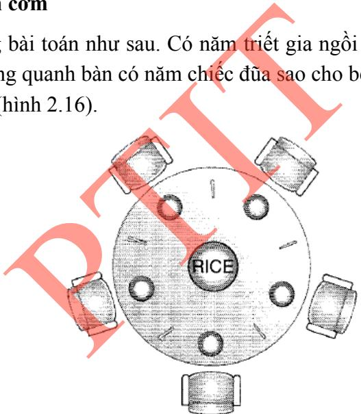

Cờ hiệu cho phép giải quyết bài toán này như sau. Mỗi đũa được biểu diễn bằng một cờ hiệu. Thao tác nhặt đũa sẽ gọi Wait đối với cờ hiệu tương ứng và thao tác đặt đũa xuống bàn gọi Signal. Toàn bộ giải pháp sử dụng cờ hiệu cho bài toán triết gia ăn cơm thể hiện trên 2.17.

… semaphore chopstick[5] = {1,1,1,1,1}; void Philosopher(int i){ //tiến trình P(i) for(;;){ //lặp vô hạn Wait(chopstick[i]); //lấy đũa bên trái Wait(chopstick[(i+1)%5]); //lấy đũa bên phải <Ăn cơm> Signal(chopstick[(i+1)%5]); Signal(chopstick[i]); <Suy nghĩ> } } void main(){ // chạy đồng thời 5 tiến trình StartProcess(Philosopher(1)); ... StartProcess(Philosopher (5)); } PTIT

Hình 2.17. Bài toán triết gia ăn cơm sử dụng cờ hiệu

Lưu ý rằng giải pháp trên 2.17 cho phép thực hiện loại trừ tương hỗ, tức là tránh trường hợp hai triết gia cùng nhặt một đũa. Tuy nhiên, giải pháp này có thể gây bế tắc nếu cả năm người cùng nhặt được đũa bên trái và không thể tiếp tục vì đũa bên phải đã bị người bên phải nhặt mất. Cách giải quyết tình trạng này sẽ được đề cập trong phần về bế tắc.

## **b. Bài toán người sản xuất, người tiêu dùng với bộ đệm hạn chế**

Bài toán được mô tả như sau. Có một người sản xuất ra sản phẩm gì đó và xếp sản phẩm làm ra vào một chỗ chứa gọi là bộ đệm, mỗi lần một sản phẩm. Một người tiêu dùng lấy sản phẩm từ bộ đệm, mỗi lần một sản phẩm, để sử dụng. Dung lượng của bộ đệm là hạn chế và chỉ chứa được tối đa N sản phẩm. Đây là bài toán có nhiều phiên bản tương tự trên thực tế, chẳng hạn thiết bị vào/ra như bàn phím có thể nhận ký tự gõ từ bàn phím, đặt vào bộ đệm, và tiến trình lấy ký tự từ bộ đệm ra để xử lý. Trong trường hợp tổng quát có thể có nhiều người sản xuất cùng làm ra và xếp sản phẩm vào bộ đệm.

Bài toán người sản xuất người tiêu dùng đặt ra ba yêu cầu đồng bộ sau:

- Người sản xuất và người tiêu dùng không được sử dụng bộ đệm cùng một lúc. Đây là yêu cầu loại trừ tương hỗ.
- Khi bộ đệm rỗng, người tiêu dùng không nên cố lấy sản phẩm.
- Khi bộ đệm đầy, người sản xuất không được thêm sản phẩm vào bộ đệm.

Ba yêu cầu trên có thể giải quyết bằng cờ hiệu. Yêu cầu thứ nhất được giải quyết bằng cách sử dụng một cờ hiệu lock khởi tạo bằng 1. Yêu cầu thứ hai và thứ ba được giải quyết lần lượt bằng hai cờ hiệu empty và full. Cờ hiệu empty được khởi tạo bằng 0 và full được khởi tạo bằng kích thước bộ đệm N. Giải pháp cho bài toán được thể hiện trên 2.18:

const int N; //kích thước bộ đệm semaphore lock = 1; semaphore empty = 0; semaphore full = N; void producer () { //tiến trình người sản xuất for (;;) { <sản xuất > wait (full); wait (lock); <thêm một sản phẩm vào bộ đệm> signal (lock); signal (empty); } } void consumer () { //tiến trình người tiêu dùng for (;;) { wait (empty); wait (lock); <lấy một sản phẩm từ bộ đệm> signal (lock); signal (full); <tiêu dùng> } } void main(){ StartProcess(producer); StartProcess(consumer); } PTIT

Hình 2.18: Giải pháp cho bài toán người sản xuất người tiêu dùng sử dụng cờ hiệu

#### **2.4.7. Monitor**

Trong một phần trước ta đã xem xét về cơ chế đồng bộ sử dụng cờ hiệu. Mặc dù có một số ưu điểm như không phải chờ đợi tích cực và dễ sử dụng hơn giải thuật Peterson song đồng bộ hóa bằng cờ hiệu có thể gây ra lỗi nếu không được sử dụng đúng cách. Sử dụng cờ hiệu không đúng sẽ gây ra các lỗi sau:

- Quên không gọi thao tác wait hoặc signal hoặc cả hai.

- Đảo ngược thứ tự wait và signal: gây ra bế tắc.
- Thay vì dùng thao tác wait lại dùng signal hoặc ngược lại, tức là gọi wait hai lần hoặc signal hai lần: trong trường hợp thứ nhất không đảm bảo loại trừ tương hỗ, trong trường hợp thứ hai gây đói.

Một điều quan trọng là những lỗi xuất hiện như vậy khó debug do lỗi chỉ xẩy ra ở một số trường hợp khi tiến trình thực hiện xen kẽ nhau theo một thứ tự nhất định.

Để hạn chế phần nào các vấn đề vừa nêu khi sử dụng cờ hiệu, một giải pháp khác của nhóm giải pháp dựa trên hỗ trợ của hệ điều hành và ngôn ngữ bậc cao là giải pháp sử dụng *monitor* (một số tài liệu tại Việt nam dịch là *phòng đợi* do đặc điểm của monitor).

#### **Khái niệm monitor**

Monitor được định nghĩa dưới dạng một kiểu dữ liệu trừu tượng của ngôn ngữ lập trình bậc cao, chẳng hạn như một class của C++ hoặc Java. Mỗi monitor gồm một dữ liệu riêng, hàm khởi tạo, và một số hàm hoặc phương thức để truy cập dữ liệu với các đặc điểm sau:

- 1) Tiến trình hoặc dòng chỉ có thể truy cập dữ liệu của monitor thông qua các hàm hoặc phương thức của monitor, không thể truy cập dữ liệu trực tiếp. Tiến trình thực hiện trong monitor bằng cách gọi hàm do monitor cung cấp.
- 2) Tại mỗi thời điểm, chỉ một tiến trình được thực hiện trong monitor. Tiến trình khác gọi hàm của monitor sẽ bị phong tỏa, xếp vào hàng đợi của monitor để chờ cho đến khi monitor được giải phóng. PTIT

Đặc điểm thứ nhất rất quen thuộc đối với đối tượng trong ngôn ngữ lập trình hướng đối tượng và làm cho monitor có nhiều điểm tương tự class.

Đặc điểm thứ hai cho phép đảm bảo loại trừ tương hỗ đối với đoạn nguy hiểm. Người lập trình chỉ cần đặt tài nguyên nguy hiểm vào trong monitor, ví dụ đặt biến dùng chung thành dữ liệu của monitor, và không cần lập trình cơ chế loại trừ tương hỗ một cách tường minh bằng cách sử dụng các bước trước và sau đoạn nguy hiểm như trong những phương pháp ở trên. Đặc điểm này giúp tránh lỗi xảy như khi dùng cờ hiệu.

# **Biến điều kiện**

Monitor được định nghĩa như trên cho phép giải quyết vấn đề loại trừ tương hỗ. Tuy nhiên, có thể xẩy ra vấn đề khác về đồng bộ, chẳng hạn khi một tiến trình đang thực hiện trong monitor và phải dừng lại (bị phong tỏa) để đợi một sự kiện hay một điều kiện nào đó được thỏa mãn. Trong trường hợp như vậy, tiến trình cần trả lại monitor để tiến trình khác có thể sử dụng. Tiến trình chờ đợi sẽ được khôi phục lại từ điểm dừng sau khi điều kiện đang chờ đợi được thỏa mãn.

Để giải quyết tình huống vừa nêu, ta có thể sử dụng các biến điều kiện. Đây là những biến được khai báo và sử dụng trong monitor với hai thao tác là cwait và csignal (tiền tố "c" được thêm vào để phân biệt với cờ hiệu) như sau:

- x.cwait (): tiến trình đang ở trong monitor và gọi cwait bị phong tỏa cho tới khi điều kiện x xẩy ra. Tiến trình bị xếp vào hàng đợi của biến điều kiện x. Monitor được giải phóng và một tiến trình khác sẽ được vào monitor.

- x.csignal (): tiến trình gọi csignal để thông báo điều kiện x đã thỏa mãn. Nếu có tiến trình đang bị phong tỏa và nằm trong hàng đợi của x do gọi x.cwait() trước đó thì một tiến trình như vậy sẽ được giải phóng. Nếu không có tiến trình bị phong tỏa thì thao tác csignal sẽ không có tác dụng gì cả.

Cần lưu ý điểm khác nhau của csignal với signal của cờ hiệu: signal luôn giải phóng một tiến trình còn csignal thì có thể không, nếu không có tiến trình chờ đợi điều kiện.

Cấu trúc monitor với các biến điều kiện được thể hiện trên 2.19.

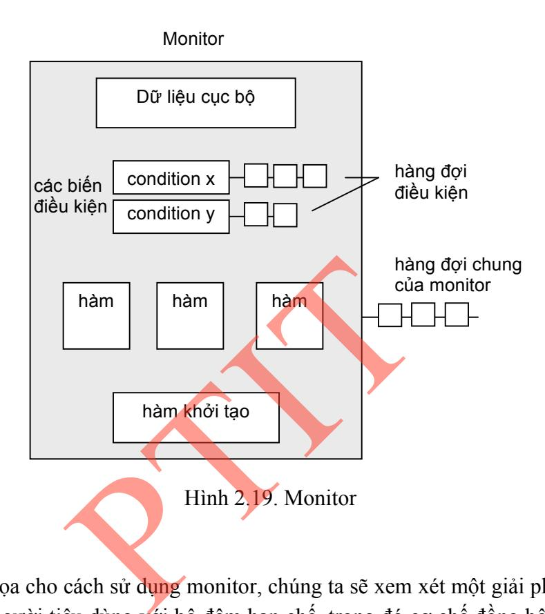

Để minh họa cho cách sử dụng monitor, chúng ta sẽ xem xét một giải pháp cho bài toán người sản xuất người tiêu dùng với bộ đệm hạn chế, trong đó cơ chế đồng bộ được thực hiện bằng monitor (hình 2.20). Trong giải pháp này, bộ đệm buffer được khai báo như dữ liệu cục bộ của monitor có thể truy cập bằng hai thao tác append (thêm vào) và take (lấy ra). Monitor sử dụng hai biến điều kiện notFull và notEmpty để tránh việc thêm sản phẩm vào bộ đệm đầy hoặc lấy sản phẩm khỏi bộ đệm rỗng.

monitor BoundedBuffer { product buffer[N]; //bộ đệm chứa N sản phẩm kiểu product int count; //số lượng sản phẩm hiện thời trong bộ đệm condition notFull, notEmpty; //các biến điều kiện public: BoundedBuffer( ) { //khởi tạo count = 0; } void append (product x) { if (count == N) notFull.cwait ( ); //dừng và chờ đến khi buffer có chỗ

<Thêm một sản phẩm vào buffer> count++; notEmpty.csignal (); } product take ( ) { if (count == 0) notEmptry.cwait (); //chờ đến khi buffer không rỗng <Lấy một sản phẩm x từ buffer> count --; notFull.csignal ( ); } } void producer ( ) { //tiến trình người sản xuất for (;;){ <Sản xuất sản phẩm x> BoundedBuffer.append (x); } } void consumer ( ) { //tiến trình người tiêu dùng for (;;){ product x = BoundedBuffer.take (); <Tiêu dùng x> } } void main() { Thực hiện song song producer và consumer. } PTIT

Hình 2.20. Giải pháp sử dụng monitor cho bài toán người sản xuất người tiêu dùng với bộ đệm hạn chế

#### **2.4.8. Bế tắc**

#### **2.4.8.1. Bế tắc là gì?**

Một vấn đề gây nhiều khó khăn đối với các tiến trình đồng thời là tình trạng *bế tắc* (deadlock). Bế tắc là tình trạng một nhóm tiến trình có cạnh tranh về tài nguyên hay có hợp tác phải dừng (phong tỏa) vô hạn. Lý do dừng vô hạn của nhóm tiến trình là do tiến trình phải chờ đợi một sự kiện chỉ có thể sinh ra bởi tiến trình khác cũng đang trong trạng thái chờ đợi của nhóm.

Để minh họa cho tình huống xảy ra bế tắc, ta xét ví dụ sau. Hai tiến trình P và Q thực hiện đồng thời. Mỗi tiến trình cần sử dụng đồng thời hai tài nguyên X và Y trong một khoảng thời gian nhất định. Tài nguyên X và Y chỉ có khả năng phục vụ một tiến trình tại một thời điểm. Để sử dụng tài nguyên, mỗi tiến trình cần thực hiện thao tác yêu cầu tài nguyên Request, sau khi thực hiện xong, tiến trình giải phóng tài nguyên bằng thao tác Release. Tiến trình P và Q được thể hiện như sau:

| Ti ế n trình P |                |
|----------------|----------------|
| Request X      |                |
| Request Y      |                |
| Release X      |                |
| Release Y      |                |
|                | Ti ế n trình Q |
|                | Request Y      |
|                | Request X      |
|                | Release Y      |
|                | Release X      |

Giả sử do kết quả điều độ, thứ tự thực hiện của hai tiến trình diễn ra như sau:

…

P: Request X Q: Requets Y

…

P: Request Y Q: Request X

…

Trong trường hợp này, thao tác "P:Request Y" sẽ khiến P phải chờ cho đến khi Q giải phóng Y. Nhưng Q cũng phải dừng lại ở thao tác "Q: Request X" để đợi tài nguyên X do P đang giữ. Kết quả hai tiến trình rơi vào bế tắc.

#### **2.4.8.2. Điều kiện xảy ra bế tắc**

Tình trạng bế tắc xẩy ra khi bốn điều kiện sau đồng thời thỏa mãn:

- **1) Loại trừ tương hỗ**. Điều kiện này nghĩa là có một tài nguyên nguy hiểm, tức là tài nguyên mà tại mỗi thời điểm chỉ duy nhất một tiến trình được sử dụng. Tiến trình khác yêu cầu tài nguyên này sẽ phải dừng lại chờ đến khi tài nguyên được giải phóng.
- **2) Giữ và chờ**. Tiến trình giữ tài nguyên trong khi chờ đợi, chẳng hạn chờ đợi để được cấp thêm tài nguyên khác.
- **3) Không có phân phối lại (no preemption)**. Tài nguyên do tiến trình giữ không thể phân phối lại cho tiến trình khác trừ khi tiến trình đang giữ tự nguyện giải phóng tài nguyên.
- **4) Chờ đợi vòng tròn**. Tồn tại nhóm tiến trình P1, P2, …, Pn sao cho P1 chờ đợi tài nguyên do P2 đang giữ, P2 chờ tài nguyên do P3 đang giữ, …, Pn chờ tài nguyên do P1 đang giữ. PTIT

Bốn điều kiện trên là cần và đủ để xẩy ra bế tắc. Cần lưu ý rằng điều kiện 2 là hệ quả của điều kiện 4 và điều kiện 3, nhưng vẫn được tách riêng để thuận lợi cho việc tìm hiểu cơ chế xử lý bế tắc trình bày trong các phần sau.

Dựa trên đặc điểm và điều kiện xảy ra bế tắc, có thể giải quyết vấn đề bế tắc theo những cách sau:

- **Ngăn ngừa** (deadlock prevention): đảm bảo để một trong bốn điều kiện xẩy ra bế tắc không bao giờ thỏa mãn. Giải pháp này có thể thực hiện bằng cách sử dụng một số quy tắc để hạn chế cách yêu cầu tài nguyên của tiến trình.
- **Phòng tránh** (deadlock avoidance): cho phép một số điều kiện bế tắc được thỏa mãn nhưng đảm bảo để không đạt tới điểm bế tắc.
- **Phát hiện và giải quyết** (deadlock detection): cho phép bế tắc xẩy ra, phát hiện bế tắc và khôi phục hệ thống về tình trạng không bế tắc.

Trên thực tế, hệ điều hành hiện nay không sử dụng giải pháp nào trong số này, tức là không làm gì với bế tắc. Nhiệm vụ xử lý bế tắc do các tiến trình tự đảm nhiệm.

## **2.4.8.3. Ngăn ngừa bế tắc**

Ngăn ngừa bế tắc (deadlock prevention) là đảm bảo để ít nhất một trong bốn điều kiện trình bày trong phần trước không xẩy ra, tức là loại trừ trước khả năng xảy ra bế tắc. Bốn điều kiện xẩy ra bế tắc có thể ngăn ngừa như sau:

## **1) Loại trừ tương hỗ**

Có thể tránh loại trừ tương hỗ đối với những tài nguyên cho phép nhiều tiến trình sử dụng một lúc ví dụ các file trong chế độ đọc. Tuy nhiên, trên thực tế luôn luôn tồn tại tài nguyên không có khả năng chia sẻ đồng thời như vậy và cần đảm bảo loại trừ tương hỗ khi sử dụng chúng. Do vậy không thể ngăn ngừa điều kiện về loại trừ tương hỗ.

## **2) Giữ và chờ**

Có hai cách ngăn ngừa điều kiện này. Cách thứ nhất là yêu cầu tiến trình phải nhận đủ toàn bộ tài nguyên cần thiết trước khi thực hiện tiếp, nếu không nhận đủ, tiến trình bị phong tỏa để chờ cho đến khi có thể nhận đủ tài nguyên. Cách này thường không hiệu quả do tiến trình phải chờ đợi rất lâu để lấy đủ tài nguyên trong khi có thể thực hiện với một số tài nguyên được cấp. Ngoài ra tiến trình sẽ giữ toàn bộ tài nguyên đến khi thực hiện xong, kể cả tài nguyên chưa cần đến, gây lãng phí tài nguyên. PTIT

Cách thứ hai là tiến trình chỉ được yêu cầu tài nguyên nếu tiến trình không giữ tài nguyên nào khác. Trước khi tiến trình yêu cầu thêm tài nguyên, tiến trình phải giải phóng tài nguyên đã được cấp và yêu cầu lại (nếu cần) cùng với tài nguyên mới.

## **3) Không có phân phối lại**

Điều kiện này có thể ngăn ngừa như sau. Khi một tiến trình yêu cầu tài nguyên nhưng không được do đã bị cấp phát, hệ điều hành sẽ thu hồi lại toàn bộ tài nguyên tiến trình đang giữ. Tiến trình chỉ có thể thực hiện tiếp sau khi lấy được tài nguyên cũ cùng với tài nguyên mới yêu cầu.

Một cách thực hiện khác là khi tiến trình yêu cầu tài nguyên, nếu tài nguyên còn trống, ta cấp phát ngay. Nếu tài nguyên do tiến trình khác giữ và tiến trình này đang chờ cấp thêm tài nguyên thì thu hồi lại để cấp cho tiến trình yêu cầu. Nếu hai điều kiện trên đều không thỏa thì tiến trình yêu cầu tài nguyên phải chờ.

Một trong những cách ngăn ngừa chờ đợi vòng tròn là xác định một thứ tự cho các dạng tài nguyên trong hệ thống và chỉ cho phép tiến trình yêu cầu tài nguyên sao cho tài nguyên mà tiến trình yêu cầu sau có thứ tự lớn hơn tài nguyên mà tiến trình đó yêu cầu trước.

Nguyên tắc trên được minh họa như sau. Giả sử trong hệ thống có n dạng tài nguyên ký hiệu R1, R2, …, Rn. Các dạng tài nguyên có thể là máy in, ổ đĩa, v.v. Tiếp theo, không mất tính tổng quát, ta giả sử những dạng tài nguyên này được sắp xếp theo thứ tự tăng dần của chỉ số, tức là R1 đứng trước R2, R2 đứng trước R3, v.v. Với cách sắp xếp như vậy ta có thể tránh bế tắc bằng cách chỉ cho phép tiến trình yêu cầu tài nguyên theo thứ tự tăng của chỉ số. Nếu tiến trình đã yêu cầu một số tài nguyên dạng Ri thì sau đó tiến trình chỉ được phép yêu cầu tài nguyên dạng Rj nếu j > i. Nếu tiến trình cần nhiều tài nguyên cùng dạng thì tiến trình phải yêu cầu tất cả tài nguyên dạng đó cùng một lúc.

Có thể dễ dàng kiểm tra, việc áp dụng quy tắc trên cho phép ngăn ngừa chờ đợi vòng tròn. Giả sử xẩy ra chờ đợi vòng tròn do tiến trình P đã có Ri và yêu cầu Rj trong khi tiến trình Q đã có Rj và yêu cầu Ri. Ta sẽ thấy ngay điều này không thể xẩy ra do một trong hai tiến trinh vi phạm quy tắc nói trên (hoặc i > j hoặc j > i).

# **2.4.8.4. Phòng tránh bế tắc**

Giải pháp ngăn ngừa bế tắc trình bày ở trên tập trung vào việc sử dụng quy tắc hay ràng buộc khi cấp phát tài nguyên để ngăn ngừa điều kiện xẩy ra bế tắc. Việc sử dụng ràng buộc như vậy có nhược điểm là làm cho việc sử dụng tài nguyên kém hiệu quả, giảm hiệu năng của tiến trình. Để giải quyết phần nào nhược điểm này có thể sử dụng nhóm giải pháp thứ hai là *phòng tránh bế tắc* (deadlock avoidance). PTIT

Phòng tránh bế tắc giống ngăn ngừa bế tắc ở chỗ đều nhằm đảm bảo bế tắc không thể xảy ra (thực chất cả hai đều là ngăn ngừa). Tuy nhiên, phòng tránh bế tắc cho phép ba điều kiện đầu xẩy ra và chỉ đảm bảo sao cho trạng thái bế tắc không bao giờ đạt tới. Mỗi yêu cầu cấp tài nguyên của tiến trình sẽ được xem xét và quyết định tùy theo tình hình cụ thể, thay vì tuân theo một quy tắc chung như trong trường hợp ngăn ngừa.

Để làm được như vậy, hệ điều hành yêu cầu tiến trình cung cấp thông tin về việc sử dụng tài nguyên của mình và sử dụng thông tin này khi cấp phát. Dạng thông tin đơn giản và hiệu quả nhất là số lượng tối đa tài nguyên tiến trình cần sử dụng.

Dựa trên thông tin về số lượng tài nguyên cần cấp tối đa do tiến trình thông báo, hệ thống có thể phòng tránh bế tắc bằng cách sử dụng thuật toán người cho vay như sau.

## **Thuật toán người cho vay (banker's algorithm)**

Thuật toán người cho vay được đặt tên dựa trên sự tương tự giữa việc quyết định cho vay tiền của ngân hàng với việc cấp phát tài nguyên trong máy tính. Người cho vay giỏi là người cho vay được nhiều. Tuy nhiên, khi cho vay vượt quá số tiến thực có sẽ gặp rủi ro do mỗi người vay không thể vay đủ số tiến cần thiết để phục vụ kinh doanh, do vậy không thể thu hồi vốn và không thể trả nợ dẫn tới cả ngân hàng và người vay rơi vào bế tắc tương tự tiến trình cạnh tranh về tài nguyên. Thuật toán người cho vay được mô tả như sau.

Khi tiến trình muốn khởi tạo, tiến trình thông báo dạng tài nguyên và số lượng tài nguyên tối đa cho mỗi dạng sẽ yêu cầu. Nếu số lượng yêu cầu không vượt quá khả năng hệ thống, tiến trình sẽ được khởi tạo. Để trình bày thuật toán người cho vay, ta định nghĩa một số khái niệm sau:

*Trạng thái* được xác định bởi tình trạng sử dụng tài nguyên hiện thời trong hệ thống. Trạng thái được cho bởi các thông tin sau:

- Số lượng tối đa tài nguyên mà tiến trình yêu cầu. Thông tin này được cho dưới dạng ma trận M[n][m], trong đó n là số lượng tiến trình, m là số lượng tài nguyên, M[i][j] (0<=i<=n, 0<=j<=m) là số lượng tài nguyên tối đa dạng j mà tiến trình i yêu cầu.
- Số lượng tài nguyên còn lại cho dưới dạng vec tơ A[m], trong đó A[j] là số lượng tài nguyên dạng j còn lại và có thể cấp phát.
- Lượng tài nguyên đã cấp cho mỗi tiến trình dưới dạng ma trận D[n][m], trong đó D[i][j] là lượng tài nguyên dạng j đã cấp cho tiến trình i.
- Lượng tài nguyên còn cần cấp dưới dạng ma trận C[n][m] trong đó C[i][j]=M[i][j]- D[i][j] là lượng tài nguyên dạng j mà tiến trình i còn cần cấp.

*Trạng thái an toàn* là trạng thái mà từ đó có ít nhất một phương án cấp phát sao cho bế tắc không xẩy ra.

Với các khái niệm trạng thái định nghĩa ở trên, cách phòng tránh bế tắc được thực hiện như sau. Khi tiến trình có yêu cầu cấp tài nguyên, hệ thống giả sử tài nguyên được cấp, cập nhật lại trạng thái và xác định xem trạng thái đó có an toàn không. Nếu an toàn, tài nguyên sẽ được cấp thật. Ngược lại, tiến trình bị phong tỏa và chờ tới khi có thể cấp phát an toàn. PTIT

Để minh họa, ta xét ví dụ sau. Hệ thống có 3 dạng tài nguyên X, Y, Z với số lượng ban đầu X=10, Y=5, Z=7. Bốn tiến trình P1, P2, P3, P4 có yêu cầu tài nguyên tối đa cho trong bảng M sau:

|    | X | Y | Z |
|----|---|---|---|
| P1 | 7 | 5 | 3 |
| P2 | 3 | 2 | 2 |
| P3 | 9 | 0 | 2 |
| P4 | 2 | 2 | 2 |

Yêu cầu tối đa

Xét trạng thái của hệ thống với lượng tài nguyên đã cấp, còn lại, còn cần như sau:

|    | X | Y | Z |
|----|---|---|---|
| P1 | 0 | 1 | 0 |
| P2 | 2 | 0 | 0 |
| P3 | 3 | 0 | 2 |
| P4 | 2 | 1 | 1 |

Đã cấp

|    | X | Y | Z |
|----|---|---|---|
| P1 | 7 | 4 | 3 |
| P2 | 1 | 2 | 2 |
| P3 | 6 | 0 | 0 |
| P4 | 0 | 1 | 1 |

Còn cần cấp

Trạng thái này là trạng thái an toàn do có thể tìm ra cách cấp phát không dẫn đến bế tắc, ví dụ theo thứ tự P2, P4, P3, P1.

Giả sử hệ thống đang nằm trong trạng thái an toàn như trên và P1 yêu cầu cấp 3 tài nguyên dạng Y, tức là yêu cầu = (0,3,0). Nếu yêu cầu này được thỏa mãn, hệ thống sẽ chuyển sang trạng thái tiếp theo

| X Y Z     | X     | Y       | Z |
|-----------|-------|---------|---|
| 3 0 4     |       |         |   |
| Còn l ạ i |       |         |   |
| P1        | 7     | 1       | 3 |
| P2        | 1     | 2       | 2 |
| P3        | 6     | 0       | 0 |
| P4        | 0     | 1       | 1 |
|           | Còn c | ầ n c ấ | p |

Đây là trạng thái không an toàn vì không thể tìm ra cách cấp phát nào cho phép bất kỳ tiến trình nào thực hiện đến cùng trước khi có thể trả lại tài nguyên. Do vậy yêu cầu (0,3,0) phải bị từ chối.

Việc kiểm tra xem một trạng thái có phải là trạng thái an toàn không có thể thực hiện bằng thuật toán thể hiện trên 2.21.

- 1. Khai báo mảng W kích thước m và mảng F kích thước n. (F[i] chứa tình trạng tiến trình thứ i đã kết thúc hay chưa, W chứa lượng tài nguyên còn lại) Khởi tạo W=A và F[i]=false (i=0,…,n-1)
- 2. Tìm i sao cho: F[i] = false và C[i][j] ≤ W[j] với mọi j=0,…,m-1 Nếu không có i như vậy thì chuyển sang bước 4
- 3. a) W = W + D[i]
  - b) F[i] = true
  - c) Quay lại bước 2
- 4. If F[i] = true với mọi i =0,…,n-1 thì trạng thái an toàn Else trạng thái không an toàn PTIT

Hình 2.21. Thuật toán xác định trạng thái an toàn

#### **2.4.8.5. Phát hiện bế tắc và xử lý**

Các biện pháp ngăn ngừa và phòng tránh bế tắc sử dụng ràng buộc khi cấp phát tài nguyên để tránh cho bế tắc không xảy ra. Đặc điểm chung của hai nhóm giải pháp này là an toàn nhưng đều ảnh hưởng tới hiệu quả sử dụng tài nguyên.

*Phát hiện bế tắc* (deadlock detection) là cách tiếp cận khác. Hệ thống không thực hiện biện pháp ngăn ngừa hay phòng tránh và do vậy bế tắc có thể xảy ra. Hệ thống định kỳ kiểm tra để phát hiện có tình trạng bế tắc hay không, nếu có, hệ thống sẽ xử lý để khôi phục lại trạng thái không có bế tắc. Tiếp theo đây, ta sẽ xem xét hai nội dung: cách phát hiện bế tắc và cách khôi phục lại trạng thái không bế tắc.

## **Phát hiện bế tắc**

*Trường hợp mỗi dạng tài nguyên chỉ có một tài nguyên duy nhất*. Trong trường hợp này, việc phát hiện bế tắc được thực hiện tương đối đơn giản bằng cách sử dụng đồ thị biểu diễn quan hệ chờ đợi lẫn nhau giữa tiến trình (tạm gọi là *đồ thị chờ đợi*), được xây dựng như sau.

Trước hết, ta xây dựng đồ thị cấp phát tài nguyên như thể hiện trên hình 2.22.a, trong đó các nút là tiến trình và tài nguyên. Tài nguyên được nối với tiến trình bằng cung có hướng nếu tài nguyên được cấp cho tiến trình đó. Tiến trình được nối với tài nguyên bằng cung có hướng nếu tiến trình đang được cấp tài nguyên đó.

Đồ thị chờ đợi được xây dựng từ đồ thị cấp phát tài nguyên bằng cách bỏ đi các nút tương ứng với tài nguyên và nhập các cung đi qua nút bị bỏ. Hình 2.22.b minh họa cho việc xây dựng đồ thị chờ đợi từ đồ thị cấp phát tài nguyên bên trái.

Đồ thị chờ đợi cho phép phát hiện tình trạng tiến trình chờ đợi vòng tròn là điều kiện đủ để sinh ra bế tắc. Trong ví dụ vừa xét, ta có thể thấy tiến trình P1, P2, P4 đang bị bế tắc do phải chờ đợi vòng tròn lẫn nhau. Trong trường hợp tổng quát, để phát hiện bế tắc trên đồ thị chờ đợi có thể sử dụng thuật toán phát hiện chu trình trên đồ thị có hướng.

Hình 2.22. Đồ thị cấp phát tài nguyên và đồ thị chờ đợi

## **Thời điểm phát hiện bế tắc**

Trong phần trên ta đã xem xét thuật toán phát hiện bế tắc. Vấn đề tiếp theo là khi nào hệ thống cần sử dụng những thuật toán này để phát hiện bế tắc (nếu có). Chu kỳ chạy thuật toán phát hiện bế tắc sẽ phụ thuộc vào hệ thống cụ thể và tần suất xuất hiện bế tắc trên đó. Tuy nhiên việc xác định chu kỳ chạy thuật toán có thể dựa trên những phân tích sau.

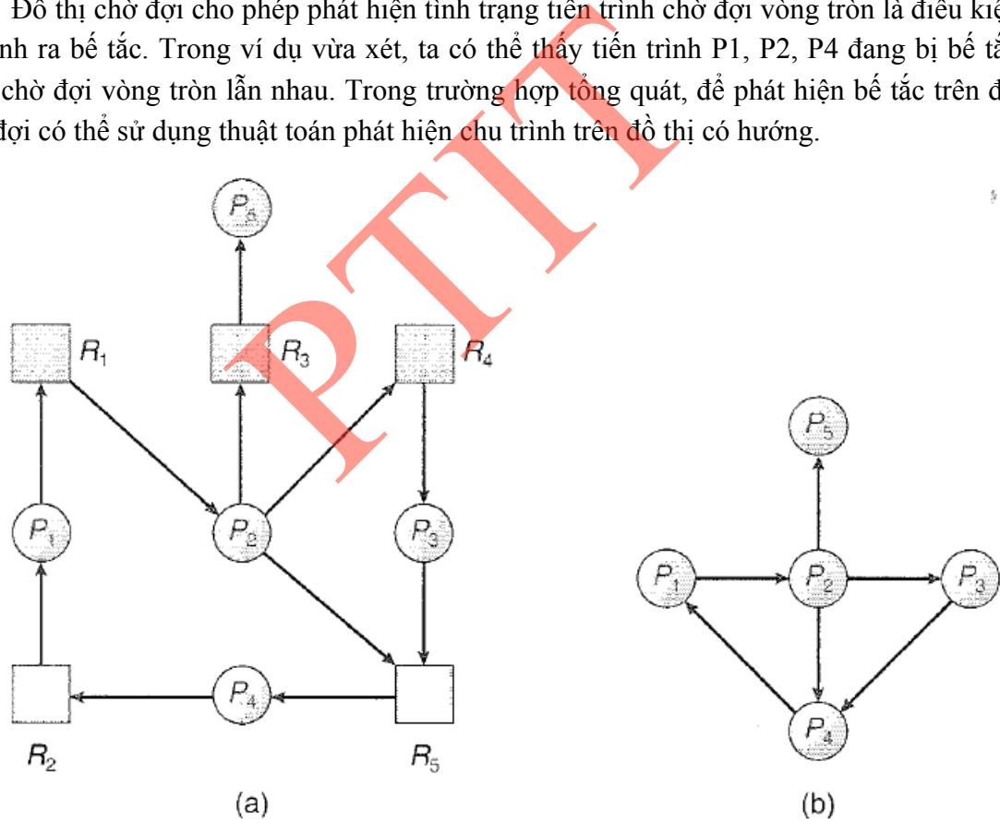

Bế tắc chỉ có thể xuất hiện sau khi một tiến trình nào đó yêu cầu tài nguyên và không được thỏa mãn. Lưu ý là không phải yêu cầu không được thỏa mãn nào cũng làm phát sinh bế tắc. Như vậy, hệ thống có thể chạy thuật toán phát hiện bế tắc mỗi khi có yêu cầu cấp phát tài nguyên không được thỏa mãn. Chu kỳ phát hiện bế tắc như vậy cho phép phát hiện bế tắc ngay khi vừa xẩy ra. Tuy nhiên, do thuật toán phát hiện bế tắc có độ phức tạp nhất định nên việc chạy thường xuyên như vậy làm giảm hiệu năng hệ thống.

Để tránh ảnh hưởng đến hiệu năng, có thể giảm tần suất chạy thuật toán phát hiện bế tắc, chẳng hạn sau từng chu kỳ từ vài chục phút tới vài giờ. Ngoài ra có thể chạy thuật toán khi có một số dấu hiệu như hiệu suất sử dụng CPU giảm xuống dưới một ngưỡng nào đó. Việc giảm hiệu suất sử dụng CPU có thể có nguyên nhân là tiến trình bị bế tắc không thể thực hiện tiếp và do vậy không sử dụng CPU.

## **Xử lý khi bị bế tắc**

Khi phát hiện bế tắc, hệ điều hành cần có biện pháp xử lý để khôi phục lại hệ thống về tình trạng không bế tắc. Nhìn chung, hệ điều hành có thể sử dụng một trong những phương pháp sau để xử lý khi phát hiện bế tắc:

- Kết thúc tất cả tiến trình đang bị bế tắc. Đây là cách giải quyết đơn giản nhất và cho phép chấm dứt ngay bế tắc. Nhược điểm của phương pháp này là bỏ phí phần việc tiến trình đã thực hiện trước khi bế tắc.
- Kết thúc lần lượt từng tiến trình đang bị bế tắc cho đến khi hết bế tắc. Hệ điều hành sẽ phải chạy lại thuật toán phát hiện bế tắc sau khi kết thúc mỗi tiến trình. Hệ điều hành có thể chọn thứ tự kết thúc tiến trình dựa trên tiêu chí nào đó, chẳng hạn tiến trình đang giữ nhiều tài nguyên hơn sẽ bị chọn kết thúc trước.
- Khôi phục tiến trình về thời điểm trước khi bị bế tắc sau đó cho các tiến trình thực hiện lại từ điểm này. Phương pháp này đòi hỏi hệ điều hành lưu trữ trạng thái để có thể thực hiện quay lui và khôi phục về các điểm kiểm tra trước đó. Ngoài ra, khi chạy lại từ những điểm chưa bế tắc, các tiến trình có thể lại rơi vào bế tắc tiếp.
- Lần lượt thu hồi lại tài nguyên từ các tiến trình bế tắc cho tới khi hết bế tắc. Tiến trình bị thu hồi tài nguyên được khôi phục về trạng thái trước khi được cấp tài nguyên. PTIT

## **2.4.8.6. Ví dụ ngăn ngừa bế tắc cho bài toán triết gia ăn cơm**

Trong một phần trước, ta đã xem xét giải pháp loại trừ tương hỗ cho bài toán triết gia ăn cơm. Giải pháp này sẽ dẫn tới bế tắc trong tình huống cả năm người cùng lấy được đũa bên trái nhưng sau đó không lấy được đũa bên phải do đũa đã bị người bên phải giữ. Để tránh bế tắc có thể sử dụng một số biện pháp như sau:

- Đặt hai thao tác lấy đũa của mỗi triết gia vào đoạn nguy hiểm để đảm bảo triết gia lấy được hai đũa cùng một lúc.
- Quy ước bất đối xứng về thứ tự lấy đũa, ví dụ người có số thứ tự chẵn lấy đũa trái trước đũa phải, người có số thứ tự lẻ lấy đũa phải trước đũa trái.
- Tại mỗi thời điểm chỉ cho tối đa bốn người ngồi vào bàn.

Sau đây, ta sẽ xem xét việc thực hiện biện pháp chỉ cho tối đa bốn người ngồi vào bàn bằng cách cải tiến giải pháp sử dụng cờ hiệu trình bày ở trên. Giải pháp đồng bộ sử dụng thêm một cờ hiệu table có giá trị khởi tạo bằng 4. Triết gia phải gọi thao tác wait(table) trước khi ngồi vào bàn và lấy đũa. Giải pháp mới được thể hiện trên hình 2.23. Trước khi thực hiện thao tác lấy đũa, triết gia phải gọi wait(table). Do giá trị cờ hiệu table bằng 4 nên nếu đã có bốn người gọi wait(table) và chưa ai gọi signal(table)sau khi ăn xong thì người thứ năm gọi wait(table)sẽ bị phong tỏa. Nhờ vậy, tại một thời điểm chỉ có tối đa bốn người có thể gọi các thao tác lấy đũa, tức là sẽ có ít nhất một người lấy được cả hai đũa và vì thế không xẩy ra bế tắc.

semaphore chopstick[5] = {1,1,1,1,1}; semaphore table = 4; void Philosopher(int i){ //tiến trình P(i) for(;;){ //lặp vô hạn wait(table); wait(chopstick[i]); //lấy đũa bên trái wait(chopstick[(i+1)%5]); //lấy đũa bên phải <Ăn cơm> signal(chopstick[(i+1)%5]); signal(chopstick[i]); signal(table); <Suy nghĩ> } } void main(){ // chạy đồng thời 5 tiến trình StartProcess(Philosopher(1)); ... StartProcess(Philosopher (5)); } PTIT

Hình 2.23. Giải pháp đồng bộ không bế tắc cho bài toán triết gia ăn cơm

# 2.5. CÂU HỎI VÀ BÀI TẬP CHƯƠNG

- 1. Điểm khác nhau giữa điều độ dài hạn, trung hạn, và ngắn hạn đối với tiến trình là gì?
- 2. Hệ điều hành thực hiện những việc gì khi chuyển đổi ngữ cảnh?
- 3. Hãy nêu hai điểm khác nhau giữ luồng mức người dùng và luồng mức nhân. Khi nào luồng mức người dùng ưu điểm hơn luồng mức nhân?

- 4. Khi tạo ra luồng mới, những cấu trúc dữ liệu nào được tạo ra? Các cấu trúc này khác gì so với cấu trúc dữ liệu được tạo ra khi tạo mới tiến trình?
- 5. Hãy cho biết các thông tin nào dưới đây được chia sẻ giữa các luồng của cùng một tiến trình:
  - a. Giá trị các thanh ghi.
  - b. Con trỏ ngăn xếp.
  - c. Các biến toàn cục của tiến trình.
- 6. Tiến trình đa luồng với các luồng mức nhân có cho phép tăng tốc độ xử lý so với tiến trình đơn luồng trên máy tính với một CPU không? Nếu có thì trong trường hợp nào?
- 7. Hãy viết phương án đa luồng và đơn luồng cho một bài toán tự chọn sử dụng Java hoặc C++ với Windows API. Gợi ý: có thể viết phương án đa luồng cho bài toán sắp xếp, theo đó hai luồng sắp xếp hai phần của danh sách và luồng thứ ba gộp hai danh sách đã được sắp xếp thành một danh sách chung.
- 8. Trình bầy sự khác nhau giữa điều độ có phân phối lại và không phân phối lại.
- 9. Thuật toán điều độ nào trong số các thuật toán điều độ dưới đây có thể gây ra tình trạng đói, tức là tình trạng tiến trình phải chờ đợi rất lâu mà không được cấp CPU:
  - a. Đến trước phục vụ trước
  - b. Tiến trình ngắn nhất trước
  - c. Quay vòng
  - d. Điều độ theo mức ưu tiên.
- 10. Xác định mức ưu tiên cụ thể cho luồng trong Windows với các thông tin sau:
  - a. Luồng thuộc nhóm ưu tiên HIGH\_PRIORITY\_CLASS và mức ưu tiên tương đối trong nhóm là NORMAL.
  - b. Luồng thuộc nhóm ưu tiên BELOW\_NORMAL\_PRIORITY\_CLASS và mức ưu tiên tương đối trong nhóm là HIGHEST.
- 11. Cho các tiến trình với thời gian (độ dài) chu kỳ CPU tiếp theo và số ưu tiên như trong bảng sau (số ưu tiên nhỏ ứng với độ ưu tiên cao). Biết rằng các tiến trình cùng xuất hiện vào thời điểm 0 theo thứ tự P1, P2, P3, P4. PTIT

| Ti ế n trình | Th ờ i gian ( độ | dài) S ố ư u tiên |
|--------------|------------------|-------------------|
| P1           | 7                | 4                 |
| P2           | 2                | 1                 |
| P3           | 1                | 2                 |
| P4           | 4                | 2                 |

Vẽ biểu đồ thể hiện thứ tự và thời gian cấp phát CPU cho các tiến trình khi sử dụng thuật toán : 1) điều độ quay vòng với độ dài lượng tử = 1 ; 2) điều độ theo mức ưu tiên không có phân phối lại. Tính thời gian chờ đợi trung bình cho từng trường hợp.

- 12. Cho các tiến trình sau với thời gian (độ dài) chu kỳ CPU tiếp theo và thời điểm xuất hiện (thời điểm yêu cầu được cấp CPU) như trong bảng sau:

| Ti ế n trình | Độ dài | Th ờ i đ i ể m xu ấ t hi ệ n |
|--------------|--------|------------------------------|
| P1           | 9      | 0                            |
| P2           | 4      | 2                            |
| P3           | 2      | 4                            |

Vẽ biểu đồ thể hiện thứ tự và thời gian cấp phát CPU cho các tiến trình khi sử dụng các thuật toán điều độ sau: 1) điều độ ưu tiên tiến trình ngắn nhất; 2) điều độ ưu tiên thời gian còn lại ngắn nhất. Tính thời gian chờ đợi trung bình cho từng trường hợp.

- 13. Sử dụng lệnh phần cứng Test\_and\_Set cho bài toán các triết gia ăn cơm. Cho biết giải pháp này có thể gây đói hoặc bế tắc cho các tiến trình không, tại sao?
- 14. Sử dụng monitor để giải quyết vấn đề loại trừ tương hỗ và đoạn nguy hiểm cho bài toán các triết gia ăn cơm.
- 15. Hãy giải thích khái niệm chờ đợi tích cực (busy waiting).
- 16. Hãy chứng minh nếu các thao tác wait() và signal() của semaphore không phải là các thao tác nguyên tử thì điều kiện về loại trừ tương hỗ có thể không được đảm bảo. PTIT

## **CHƯƠNG 3: QUẢN LÝ BỘ NHỚ**

Bộ nhớ là tài nguyên quan trọng thứ hai sau CPU trong một hệ thống máy tính. Bộ nhớ bao gồm các byte hoặc các từ được đánh địa chỉ. Đây là chỗ chứa các tiến trình và dữ liệu của tiến trình. Việc quản lý và sử dụng bộ nhớ hợp lý ảnh hưởng tới tốc độ và khả năng của toàn bộ hệ thống tính toán, do vậy, quản lý bộ nhớ là một chức năng quan trọng của hệ điều hành.

Các công việc liên quan tới quản lý bộ nhớ bao gồm quản lý bộ nhớ trống, cấp phát bộ nhớ trống cho các tiến trình và giải phóng bộ nhớ đã cấp phát, ngăn chặn việc truy cập trái phép tới các vùng bộ nhớ, ánh xạ giữa địa chỉ lôgic và địa chỉ vật lý. Trong trường hợp yêu cầu về bộ nhớ của các tiến trình lớn hơn dung lượng bộ nhớ vật lý, hệ điều hành cho phép trao đổi thông tin giữa đĩa và bộ nhớ hoặc tổ chức bộ nhớ ảo để thoả mãn nhu cầu các tiến trình.

Trong chương này ta sẽ xem xét những kiểu tổ chức hệ thống và cách thức khác nhau để quản lý bộ nhớ. Các kiểu tổ chức được xem xét từ đơn giản như hệ thống đơn chương trình cho tới phức tạp hơn - đa chương trình.

## 3.1. ĐỊA CHỈ VÀ CÁC VẤN ĐỀ LIÊN QUAN

Có thể hình dung bộ nhớ máy tính như một chuỗi các ô nhớ được đánh địa chỉ bắt đầu từ 0. Đơn vị đánh địa chỉ có thể là từ máy (words) nhưng thường là byte. Trong quá trình thực hiện tiến trình, CPU đọc các lệnh từ bộ nhớ và thực hiện các lệnh này. Các lệnh có thể có yêu cầu đọc, xử lý và ghi dữ liệu ngược vào bộ nhớ. Để có thể thực hiện các lệnh và xử lý dữ liệu, cả dữ liệu và lệnh đều phải được gán địa chỉ. CPU sử dụng địa chỉ để xác định lệnh và dữ liệu cụ thể. PTIT

#### **3.1.1. Vấn đề gán địa chỉ**

Chương trình máy tính thường không được viết trực tiếp trên ngôn ngữ máy, trừ thế hệ máy tính đầu tiên, mà viết trên một ngôn ngữ bậc cao hoặc trên hợp ngữ. Các chương trình nguồn phải qua một quá trình dịch và liên kết trước khi trở thành chương trình có thể tải vào và thực hiện. Quá trình đó được biểu diễn trên hình 3.1.

Ở mỗi giai đoạn, địa chỉ được biểu diễn theo một cách khác nhau. Khi viết chương trình, chúng ta sử dụng địa chỉ dưới dạng các tên (ví dụ tên biến, tên hàm) theo quy ước của ngôn ngữ lập trình. Khi dịch, chương trình dịch biến đổi mã nguồn của từng mô đun (từng file mã nguồn) thành mã máy và thay đổi tên thành địa chỉ. Do không biết vị trí chính xác của mô đun được dịch trong chương trình nên chương trình dịch chỉ có thể ánh xạ tên thành các địa chỉ tương đối tính từ đầu mô đun chương trình được dịch.

Liên kết là quá trình kết hợp các mô đun chương trình, bao gồm cả các mô đun chứa các hàm thư viện, thành chương trình hoàn chỉnh, còn gọi là các mô đun tải được. Chương trình liên kết biết vị trí chính xác các mô đun trong chương trình, do vậy chương trình liên kết có thể gán địa chỉ trong phạm vi toàn chương trình, thay vì trong từng mô đun như chương trình dịch. Sau khi liên kết xong, ta được chương trình có thể tải vào bộ nhớ để thực hiện.

Để thực hiện một chương trình, hệ điều hành đọc chương trình từ đĩa vào bộ nhớ và tạo ra tiến trình tương ứng. Vị trí mà chương trình sẽ được tải vào trong bộ nhớ là có thể thay đổi và thường không biết trước. Chẳng hạn, mặc dù địa chỉ đầu của bộ nhớ là 00000, địa chỉ đầu của tiến trình hoàn toàn có thể khác 00000 và thậm chí có thể thay đổi trong quá trình thực hiện tiến trình. Do đó, khi viết chương trình, lập trình viên chưa biết và chưa thể gán địa chỉ cho các lệnh cũng như dữ liệu. Các chương trình dịch và liên kết cũng không biết địa chỉ chính xác khi thực hiện công việc của mình.

Hình 3.1. Quá trình tạo và tải chương trình vào bộ nhớ

Như vậy, hệ điều hành cần có khả năng gán địa chỉ và ánh xạ các địa chỉ này tuỳ thuộc vào vị trí tiến trình trong bộ nhớ. Khả năng sử dụng những vùng nhớ không cố định cho tiến trình và ánh xạ địa chỉ là một yêu cầu rất quan trọng đối với hệ điều hành khi thực hiện chức năng quản lý bộ nhớ.

*Ngoại lệ*. Trong một số hệ điều hành đơn giản, như hệ điều hành CP/M, một số dạng chương trình như chương trình kiểu .com luôn được tải vào một vị trí xác định trong bộ nhớ (vị trí 100h). Với chương trình và hệ thống kiểu này, địa chỉ được xác định ngay từ lúc viết mã nguồn trên hợp ngữ, hoặc trong quá trình dịch và liên kết.

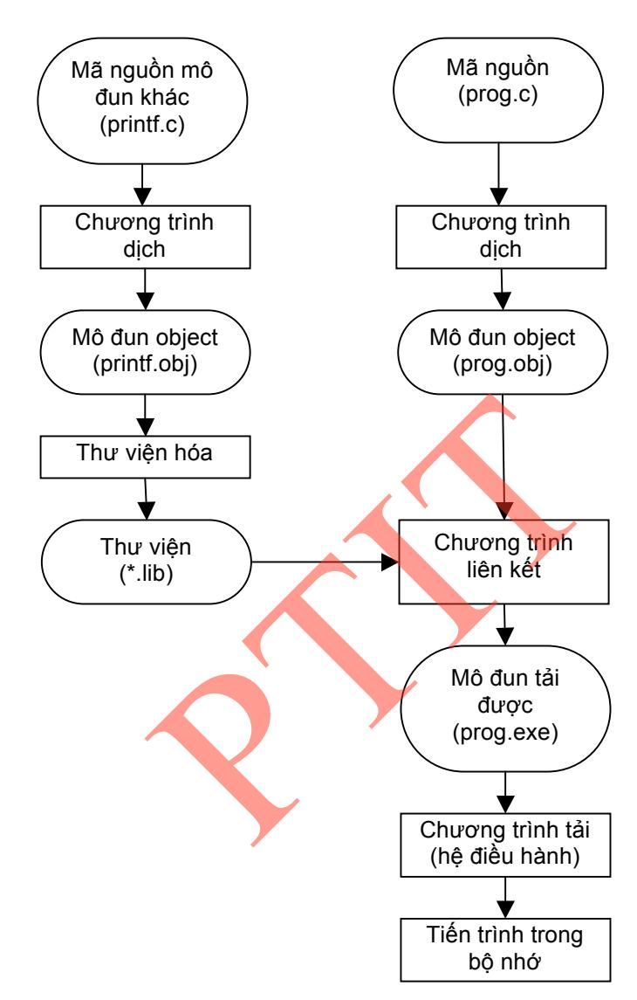

#### **3.1.2. Địa chỉ lô gic và địa chỉ vật lý**

Do vị trí tiến trình trong bộ nhớ có thể thay đổi, cần phân biệt hai loại địa chỉ: *địa chỉ lôgic* và *địa chỉ vật lý*.

Địa chỉ lôgic là địa chỉ được gán cho các lệnh và dữ liệu không phụ thuộc vào vị trí cụ thể của tiến trình trong bộ nhớ. Khi thực hiện chương trình, CPU "nhìn thấy" và sử dụng địa chỉ lôgic này để trỏ đến các phần khác nhau của lệnh, dữ liệu. Một dạng địa chỉ lôgic điển hình là địa chỉ tương đối, trong đó mỗi phần tử của chương trình được gán một địa chỉ tương đối với một vị trí nào đó, chẳng hạn đầu chương trình, và không phụ thuộc vào vị trí thực của tiến trình trong bộ nhớ. Toàn bộ địa chỉ được gán trong chương trình tạo thành không gian nhớ lôgic của chương trình. Trong trường hợp sử dụng bộ nhớ ảo, địa chỉ lôgic còn được gọi là *địa chỉ ảo*.

Để truy cập bộ nhớ, địa chỉ lô gic cần được biến đổi thành địa chỉ vật lý. Địa chỉ vật lý là địa chỉ chính xác trong bộ nhớ của máy tính và được phần cứng quản lý bộ nhớ đặt lên đường địa chỉ để truy cập ô nhớ tương ứng. Địa chỉ vật lý còn được gọi là địa chỉ tuyệt đối. Thông thường, không gian nhớ vật lý khác với không gian nhớ lôgic của chương trình.

Trong thời gian thực hiện tiến trình, địa chỉ lôgic được ánh xạ sang địa vật lý nhờ một cơ chế phần cứng gọi là *khối quản lý bộ nhớ* (MMU=Memory Management Unit). Có nhiều cách khác nhau để thực hiện ánh xạ này. Cơ chế ánh xạ cụ thể cho những cách tổ chức bộ nhớ khác nhau sẽ được trình bày trong các phần sau. PTIT

## 3.2. MỘT SỐ CÁCH TỔ CHỨC CHƯƠNG TRÌNH

Một vấn đề quan trọng trong tổ chức chương trình và quản lý bộ nhớ là làm sao giảm được không gian chương trình chiếm trên đĩa và trong bộ nhớ, qua đó có thể sử dụng không gian nhớ hiệu quả hơn.

**Tổ chức tĩnh**. Theo cách thông thường nhất, chương trình được tạo thành từ một số mô đun khác nhau. Các mô đun có thể được viết và dịch thành file object (đuôi .obj), sau đó liên kết với nhau thành chương trình thực hiện được hay còn gọi là chương trình tải được. Một số mô đun object chứa các hàm hay dùng có thể được lưu trữ dưới dạng thư viện để tiện cho việc liên kết với các mô đun khác của chương trình. Khi cần thực hiện chương trình, hệ điều hành sẽ tải toàn bộ chương trình vào bộ nhớ. Quá trình này được thể hiện trên hình 3.1. Cách tổ chức chương trình như vậy có thể gọi là cách *tổ chức tĩnh* hay tổ chức tuyến tính.

Mặc dù đơn giản và trực quan, cách tổ chức, liên kết và tải chương trình như vậy không cho phép sử dụng bộ nhớ hiệu quả. Sau đây, ta xem xét một số kỹ thuật cho phép giải quyết vấn đề này.

## **3.2.1. Tải trong quá trình thực hiện**

Bình thường, toàn bộ chương trình được tải vào bộ nhớ để thực hiện. Đối với các chương trình lớn, trong một phiên làm việc, một số phần của chương trình có thể không được dùng tới, chẳng hạn các hàm xử lý lỗi. Các hàm này sẽ chiếm chỗ vô ích trong bộ nhớ, đồng thời làm tăng thời gian tải chương trình lúc đầu.

Từ nhận xét này, một kỹ thuật được áp dụng là tải các hàm hay chương trình con trong quá trình thực hiện chương trình, hay còn gọi là *tải động*. Thực chất của kỹ thuật này là hoãn việc tải các hàm cho đến khi hàm được sử dụng. Hàm nào chưa được gọi đến thì chưa được tải vào bộ nhớ. Mỗi khi có một lời gọi hàm, chương trình gọi sẽ kiểm tra xem hàm được gọi đã nằm trong bộ nhớ chưa. Nếu chưa, chương trình tải sẽ được gọi để tải hàm vào bộ nhớ, ánh xạ địa chỉ hàm vào không gian nhớ chung của chương trình và thay đổi bảng địa chỉ ghi lại các ánh xạ đó.

Trong kỹ thuật này, việc kiểm tra và tải các hàm do chương trình người dùng đảm nhiệm. Hệ điều hành không kiểm soát quá trình tải mà chỉ cung cấp các hàm phục vụ việc tải các mô đun thôi.

## **3.2.2. Liên kết động và thư viện dùng chung**

Trong quá trình liên kết truyền thống, còn gọi là liên kết tĩnh, các hàm thư viện được liên kết luôn vào chương trình chính. Kích thước chương trình khi đó sẽ bằng kích thước chương trình vừa được dịch cộng với kích thước các hàm thư viện. Trên thực tế, có các hàm thư viện được dùng trong hầu hết các chương trình, ví dụ đa số chương trình viết cho Windows sử dụng các hàm quản lý cửa sổ và giao diện đồ hoạ. Nếu liên kết tĩnh, các hàm này sẽ có mặt lặp đi lặp lại trong các chương trình làm tăng không gian chung mà các chương trình chiếm, bao gồm cả không gian trên đĩa và không gian bộ nhớ chính khi các chương trình được tải vào để thực hiện.

Một trong những cách giải quyết vấn đề này là sử dụng kỹ thuật *liên kết động và các thư viện hàm dùng chung*.Về bản chất, kỹ thuật này chỉ thực hiện liên kết thư viện vào chương trình trong thời gian thực hiện, khi chương trình đã ở trong bộ nhớ. Trong giai đoạn liên kết, chương trình liên kết không kết nối các mô đun thư viện vào mô đun chương trình. Thay vào đó, một đoạn mã nhỏ sẽ được chèn vào vị trí của hàm thư viện. Đoạn mã này chứa thông tin về mô đun thư viện như mô đun đó nằm trong thư viện nào, vị trí (địa chỉ) mà mô đun đó chiếm trong không gian địa chỉ của chương trình. PTIT

Trong thời gian chạy, khi đoạn mã chèn vào được thực hiện, đoạn này sẽ kiểm tra xem mô đun thư viện đã có nằm trong bộ nhớ chưa. Nếu chưa, mô đun thư viện sẽ được đọc vào bộ nhớ, sau đó chương trình sẽ thay địa chỉ đoạn mã chèn thành địa chỉ mô đun thư viện. Trong lần thực hiện tiếp theo, khi tới đoạn đến đoạn chương trình này, mô đun thư viện sẽ được thực hiện ngay, không cần mất thời gian kiểm tra và tải lại. Đối với mô đun thư viện được sử dụng bởi nhiều tiến trình, tất cả tiến trình có thể dùng chung một bản duy nhất phần mã chương trình của thư viện. Thư viện khi đó được gọi là thư viện dùng chung.

Kỹ thuật liên kết động được minh họa trên hình 3.2.

Ngoài ưu điểm tiết kiệm bộ nhớ, thư viện dùng chung còn giúp cho việc cập nhật và sửa lỗi thư viện dễ dàng hơn. Khi có thay đổi trong thư viện, người lập trình không cần biên dịch và liên kết lại toàn bộ chương trình. Thay vào đó, chương trình chỉ cần chứa thông tin về phiên bản của thư viện tương thích với chương trình và lựa chọn phiên bản phù hợp.

Một ví dụ sử dụng liên kết động và thư viện dùng chung là hệ điều hành Windows. Thư viện dùng chung của Windows được chứa trong các file có đuôi là DLL (Dynamic Linking Library). Khi xây dựng chương trình, trình liên kết cho phép người lập trình lựa chọn chế độ liên kết tĩnh hay liên kết động. Nếu liên kết tĩnh, toàn bộ các mô đun chương trình và thư viện được liên kết thành một file thực hiện duy nhất có thể cài và chạy trên máy khác. Ngược lại, nếu chọn liên kết động, file thực hiện không chứa thư viện và có kích thước nhỏ hơn so với liên kết tĩnh. Tuy nhiên, khi cài đặt trên máy khác cần cài đặt cả file thực hiện chính và các file .DLL chứa thư viện. Hệ thống sẽ thông báo không tìm được file DLL cần thiết trong trường hợp không tìm được các file này.

Hình 3.2: Liên kết động trong thời gian thực hiện

## 3.3. PHÂN CHƯƠNG BỘ NHỚ

Để thực hiện tiến trình, hệ điều hành cần cấp phát cho tiến trình không gian nhớ cần thiết. Việc cấp phát và quản lý vùng nhớ là chức năng quan trọng của hệ điều hành. Trong phần này, chúng ta sẽ xem xét một kỹ thuật cấp phát đơn giản nhất, trong đó mỗi tiến trình được cấp một *vùng bộ nhớ liên tục*. Các kỹ thuật tiên tiến hơn sẽ được đề cập trong các phần sau.

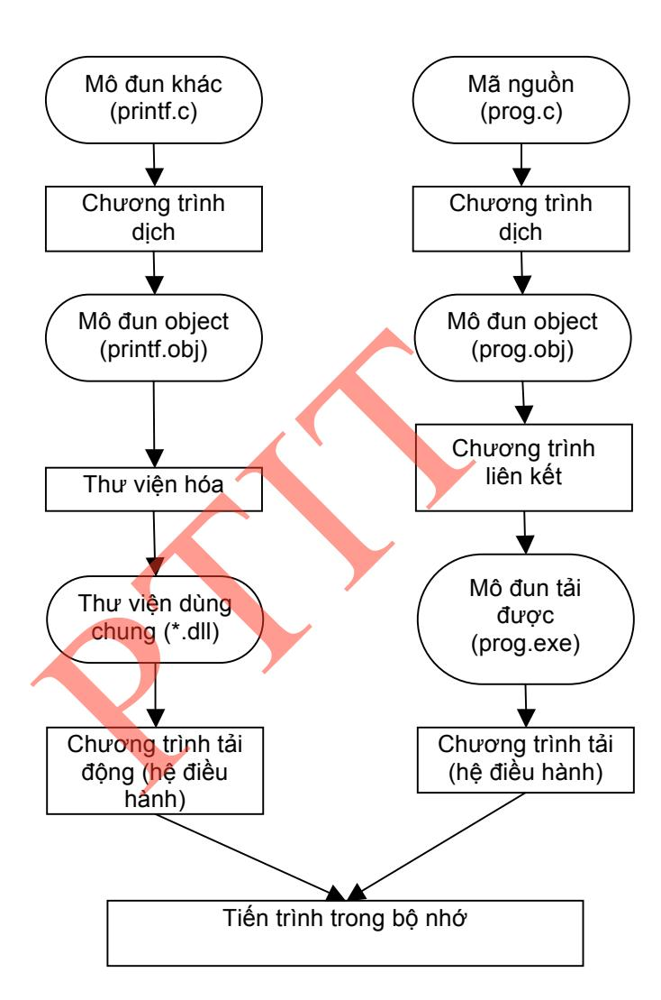

Hệ thống máy tính hiện đại thường là hệ thống đa chương trình trong đó hệ điều hành cho phép tải và giữ trong bộ nhớ nhiều tiến trình cùng một lúc. Để có thể chứa nhiều tiến trình cùng một lúc trong bộ nhớ, hệ điều hành tiến hành chia sẻ bộ nhớ giữa các tiến trình. Kỹ thuật đơn giản nhất là chia bộ nhớ thành các phần liên tục gọi là *chương* (partition), mỗi tiến trình sẽ được cung cấp một chương để chứa lệnh và dữ liệu của mình. Quá trình phân chia bộ nhớ thành chương như vậy gọi là *phân chương bộ nhớ* (partitioning) hay còn gọi là cấp phát vùng nhớ liên tục.

Mặc dù kỹ thuật phân chương thuần túy được coi là lỗi thời, tuy nhiên việc xem xét kỹ thuật này là cơ sở để tìm hiểu về nhiều vấn đề khác trong quản lý không gian nhớ, và do vậy vẫn được đề cập tới ở đây.

Tùy vào việc lựa chọn vị trí và kích thước của chương, có thể phân biệt phân chương cố định và phân chương động.

## **3.3.1. Phân chương cố định**

Phân chương cố định là phương pháp đơn giản nhất để phân chia bộ nhớ cho các tiến trình. Bộ nhớ được phân thành những chương có kích thước cố định ở những vị trí cố định. Mỗi chương chứa được đúng một tiến trình do đó số tiến trình tối đa có thể chứa đồng thời trong bộ nhớ sẽ bị giới hạn bởi số lượng chương. Khi được tải vào, tiến trình được cấp phát một chương. Sau khi tiến trình kết thúc, hệ điều hành giải phóng chương và chương có thể được cấp phát tiếp cho tiến trình mới.

**Lựa chọn kích thước chương**. Kích thước các chương có thể chọn bằng nhau hoặc không bằng nhau. Việc chọn các chương kích thước bằng nhau mặc dù đơn giản hơn một chút song rất không mềm dẻo. Tiến trình có kích thước lớn hơn kích thước chương sẽ không thể tải vào chương và chạy được. Muốn cho chương chứa được các tiến trình lớn, ta phải tăng kích thước của chương bằng kích thước của tiến trình lớn nhất. Do mỗi tiến trình chiếm cả một chương, các tiến trình nhỏ cũng được cung cấp và chiếm cả chương như một tiến trình lớn. Phần bộ nhớ rất đáng kể còn lại của chương sẽ bị bỏ trống gây lãng phí bộ nhớ. Hiện tượng này gọi là *phân mảnh trong* (internal fragmentation). PTIT

Trên thực tế, hệ điều hành chỉ sử dụng phương pháp phân chương với kích thước chương không bằng nhau.

Giả sử các chương có kích thước khác nhau và xuất hiện yêu cầu cung cấp chương cho tiến trình. Các tiến trình cần được tải vào được sắp xếp trong hàng đợi chờ đến lượt được cấp chương nhớ.

Có hai cách lựa chọn chương nhớ để cấp cho tiến trình đang chờ đợi. Cách thứ nhất là lựa chọn *chương nhỏ nhất có thể chứa tiến trình*, tạm gọi là lựa chọn chương phù hợp nhất, để cấp. Mỗi chương khi đó có một hàng đợi riêng. Tiến trình có kích thước phù hợp với chương nào sẽ nằm trong hàng đợi của chương đó (hình 3.3 a).

Ưu điểm của cách cấp chương này là cho phép giảm tối thiểu phân mảnh trong và do đó tiết kiệm được bộ nhớ. Tuy nhiên tính từ quan điểm toàn cục của hệ thống, cách cấp chương này có một nhược điểm đáng kể sau. Do mỗi chương có một hàng đợi riêng nên sẽ có thời điểm hàng đợi của chương lớn hơn thì rỗng và chương cũng không chứa tiến trình nào, trong khi hàng đợi của chương nhỏ hơn thì có các tiến trình. Các tiến trình nhỏ này buộc phải đợi được cấp chương nhỏ trong khi có thể tải vào chương lớn hơn và chạy. Trên hình 3.3 a, chương 3 trống và không được sử dụng, còn các tiến trình nhỏ vẫn phải chờ chương 1, 2.

Hình 3.3. Cấp phát bộ nhớ sử dụng phân chương cố định. (a) Mỗi chương có hàng đợi riêng. (b) Một hàng đợi chung cho tất cả các chương

Cách thứ hai cho phép khắc phục nhược điểm nói trên. Trong cách này, hệ điều hành sử dụng một hàng đợi duy nhất cho tất cả các chương (hình 3.3 b). Mỗi khi có khi có một chương trống, tiến trình nằm gần đầu hàng đợi nhất và có kích thước phù hợp với chương sẽ được tải vào để thực hiện. Với cách lựa chọn như vậy, có thể tiến trình ở đầu hàng đợi hơn và có thứ tự ưu tiên cao hơn sẽ bị tải vào sau. Để tránh cho tiến trình bị bỏ qua nhiều lần do kích thước không phù hợp và phải đứng quá lâu trong hàng đợi, có thể quy định số lần tối đa n mà mỗi tiến trình bị bỏ qua. Mỗi khi tiến trình bị "chen ngang" trong hàng đợi, tiến trình sẽ được thêm một điểm. Khi tiến trình được n điểm, hệ điều hành sẽ tìm khả năng gần nhất để tải tiến trình vào bộ nhớ.

Một ví dụ kinh điển về sử dụng thành công phương pháp phân chương này là hệ điều hành cho máy tính của hãng IBM OS/360 với phương pháp có tên gọi MFT (Multiprogramming with Fixed number of Tasks). Kích thước và số lượng chương do người vận hành máy quy định và được giữ nguyên trong những khoảng thời gian tương đối dài, chẳng hạn trong cả một phiên làm việc.

Mặc dù phương pháp phân chương cố định tương đối đơn giản, song phương pháp này có một số nhược điểm. Thứ nhất, số lượng tiến trình trong bộ nhớ bị hạn chế bởi số lượng chương. Thứ hai, do bị phân mảnh trong nên bộ nhớ được sử dụng không hiệu quả. Hiện nay, phương pháp phân chương này hầu như không được sử dụng.

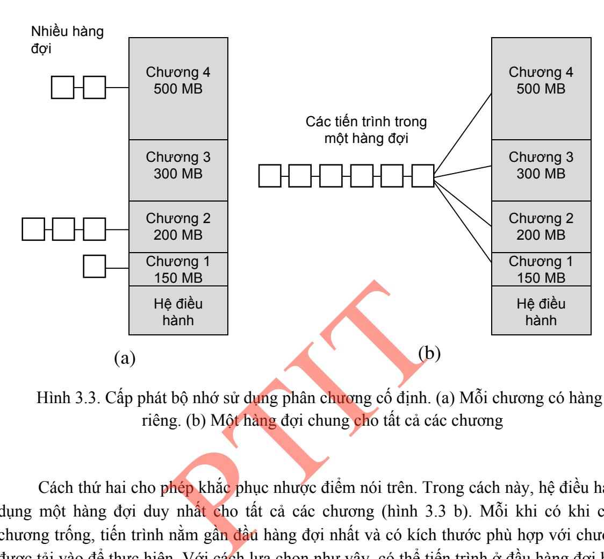

#### **3.3.2. Phân chương động**

Trong phương pháp phân chương này, kích thước và số lượng chương đều *không cố định và có thể thay đổi*. Mỗi khi tiến trình được tải vào bộ nhớ, tiến trình được cấp một lượng bộ nhớ đúng bằng lượng bộ nhớ mà tiến trình cần, sau khi kết thúc, tiến trình giải phóng bộ nhớ. Vùng bộ nhớ do tiến trình chiếm trước đó trở thành một "lỗ" (vùng trống) trong bộ nhớ nếu các vùng nhớ trước và sau thuộc về các tiến trình khác.

Như vậy, ở mỗi thời điểm, trong bộ nhớ tồn tại một tập hợp các vùng trống có kích thước khác nhau. Hệ điều hành sử dụng một bảng để biết được phần bộ nhớ nào đã được dùng, phần nào đang còn trống. Các vùng bộ nhớ cũng có thể được liên kết thành một danh sách kết nối.

Tiến trình cần bộ nhớ được xếp trong hàng đợi để chờ tới lượt mình. Mỗi khi đến lượt một tiến trình, hệ điều hành sẽ cố gắng cung cấp bộ nhớ cho tiến trình đó bằng cách tìm một lỗ (vùng bộ nhớ) trống có kích thước lớn hơn hoặc bằng kích thước tiến trình. Nếu không có vùng bộ nhớ trống nào thoả mãn điều kiện này, hệ điều hành có thể chờ cho tới khi một vùng bộ nhớ đủ lớn được giải phóng để cấp phát hoặc tìm kiếm trong hàng đợi một tiến trình đủ nhỏ để có thể chứa trong những vùng bộ nhớ còn trống.

Trong trường hợp kích thước vùng trống tìm được lớn hơn kích thước tiến trình, vùng trống được chia thành hai phần. Một phần cấp cho tiến trình, phần còn lại trở thành một vùng trống có kích thước nhỏ hơn vùng trống ban đầu và được bổ sung vào danh sách các vùng trống mà hệ điều hành quản lý.

Mỗi tiến trình sau khi kết thúc tạo ra một vùng trống mới. Nếu vùng trống này nằm kề cận với một vùng trống khác, chúng sẽ được nối với nhau để tạo ra vùng trống mới có kích thước lớn hơn. Trên hình 3.4 thể hiện tình trạng bộ nhớ khi tiến trình được cấp phát và giải phóng chương nhớ theo thời gian sử dụng kỹ thuật phân chương động. PTIT

Hình 3.4. Tình trạng bộ nhớ khi phân chương động. Vùng bôi xám là vùng nhớ trống

**Phân mảnh ngoài**. Cùng với thời gian, việc phân chương động có thể sinh ra trong bộ nhớ các vùng trống kích thước quá nhỏ và do vậy không thể cấp phát tiếp cho bất kỳ tiến trình

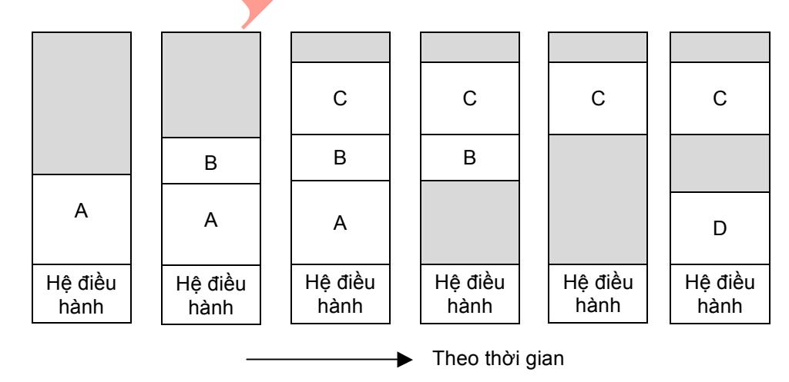

nào. Không gian mà các vùng trống này chiếm do vậy bị bỏ phí. Hiện tượng này gọi là *phân mảnh ngoài*. Sở dĩ gọi như vậy là do không gian bên ngoài các chương bị chia nhỏ, trái với phân mảnh trong như ta đã nhắc tới ở trên.

Để giải quyết vấn đề phân mảnh ngoài, người ta sử dụng kỹ thuật dồn bộ nhớ. Các chương thuộc về các tiến trình được dịch chuyển lại nằm kề nhau. Các vùng trống giữa các tiến trình khi đó sẽ dồn thành một vùng trống duy nhất. Thông thường, tất cả tiến trình sẽ được dồn về một đầu bộ nhớ, các vùng trống sẽ chuyển về đầu còn lại và hợp thành một vùng trống duy nhất. Kỹ thuật dồn bộ nhớ đòi hỏi một số thời gian nhất định để di chuyển các chương nhớ và làm nảy sinh vấn đề bố trí lại địa chỉ trong các tiến trình. Do các hạn chế này, việc dồn bộ nhớ không thể thực hiện quá thường xuyên.

Trong các phần sau của chương, ta sẽ xem xét một cách khác cho phép tránh phân mảnh ngoài, đó là kỹ thuật cấp phát bộ nhớ không liên tục, trong đó mỗi tiến trình được cấp bộ nhớ ở những vùng không liền nhau.

**Lựa chọn vùng trống để cấp phát**. Một yếu tố ảnh hưởng nhiều tới phân mảnh ngoài là lựa chọn vùng trống phù hợp khi cấp bộ nhớ cho tiến trình. Chiến lược lựa chọn vùng trống đúng đắn để cấp phát sẽ làm giảm đáng kể phân mảnh ngoài. Có ba chiến lược cấp bộ nhớ thường được sử dụng:

§ **Vùng thích hợp đầu tiên (first fit)**: chọn vùng trống đầu tiên có kích thước lớn hơn hoặc bằng kích thước cần cấp phát. Việc tìm kiếm có thể bắt đầu từ đầu danh sách các vùng trống hay từ vị trí của lần cấp phát cuối cùng. Trong trường hợp sau, chiến lược được đặt tên là **vùng thích hợp tiếp theo (next fit).** Chiến lược này đơn giản và do đó thực hiện nhanh nhất. § **Vùng thích hợp nhất (best fit)**: chọn vùng trống nhỏ nhất trong số các vùng trống có kích thước lớn hơn hoặc bằng kích thước cần cấp phát. Vùng trống sinh ra sau khi cấp phát do vậy sẽ có kích thước bé nhất. § **Vùng không thích hợp nhất (worst fit)**: từ nhận xét là các vùng trống sinh ra sau khi cấp phát theo chiến lược thứ hai (best fit) có kích thước bé và do đó thường không thích hợp cho việc cấp phát tiếp theo, người ta nghĩ ra chiến lược thứ ba này. Vùng trống lớn nhất sẽ được cấp phát. Không gian còn thừa từ vùng trống này sau khi cấp xong tạo ra vùng trống mới có kích thước lớn hơn so với hai chiến lược trên. PTIT

**Ví dụ:** trong bộ nhớ có 4 vùng trống có kích thước lần lượt như sau 3MB, 8MB, 7MB, và 10MB; yêu cầu cấp phát vùng nhớ kích thước 6MB. Ba chiến lược cấp phát ở trên sẽ cho kết quả như sau:

- Chiến lược first fit sẽ chọn khối 8MB để chia và cấp phát.
- Chiến lược best fit sẽ chọn vùng trống 7MB.
- Chiến lược worst fit sẽ chọn vùng trống 10MB.

Để quyết định chiến lược nào là tốt nhất, nhiều nghiên cứu đã được thực hiện. Kết quả mô phỏng và thực nghiệm cho thấy, hai phương pháp đầu cho phép giảm phân mảnh ngoài tốt hơn phương pháp thứ ba. Trong hai phương pháp đầu, phương pháp thứ nhất đơn giản và có tốc độ nhanh nhất.

## **3.3.3. Phương pháp kề cận**

Cả hai phương pháp phân chương nói trên đều có các nhược điểm. Phân chương cố định hạn chế số lượng tiến trình trong bộ nhớ và gây phân mảnh trong. Phân chương động, mặc dù tránh được các nhược điểm này, song tương đối phức tạp trong việc quản lý vùng trống và lựa chọn vùng trống phù hợp, đồng thời gây phân mảnh ngoài. Một phương pháp cho phép dung hoà các nhược điểm của hai phương pháp nói trên được gọi là *phương pháp kề cận* (buddy systems).

Trong phương pháp này, hệ điều hành quản lý và cấp phát khối nhớ có kích thước là luỹ thừa của 2. Giả sử các khối trống có kích thước là 2K với L<=K<=H, trong đó 2L là kich thước khối nhớ nhỏ nhất có thể được cấp phát (thường không nhỏ hơn 1KB), 2H là kích thước khối nhớ lớn nhất có thể cấp phát (thường bằng kích thước toàn bộ nhớ).

Khởi đầu, toàn bộ nhớ là một khối trống duy nhất có kích thước 2H. Giả sử có yêu cầu cấp phát khối nhớ kích thước s. Nếu 2H-1 < s ≤ 2H thì toàn khối nhớ sẽ được cấp phát. Trong trường hợp s ≤ 2H-1 , khối nhớ được chia đôi thành hai khối kề cận, mỗi khối có kích thước 2H-1 . So sánh tiếp, nếu 2H-2 < s ≤ 2H-1 , một trong hai khối 2H-2 sẽ được cấp phát. Ngược lại, một trong hai khối 2H-2 được chia đôi tiếp thành các khối kề cận kích thước 2H-3 . Quá trình này tiếp tục cho tới khi khối nhớ nhỏ nhất có kích thước lớn hơn hoặc bằng s được tạo ra hoặc ta đạt giới hạn dưới 2L . PTIT

Một ví dụ minh họa quá trình cấp phát và giải phóng bộ nhớ sử dụng phương pháp kề cận được thể hiện qua hình 3.5.

| 1GB |   |   | tr ố ng |   |   |         |         | 1GB   |         |
|-----|---|---|---------|---|---|---------|---------|-------|---------|
| C   | ấ | p | 205MB   |   | A | = 205MB |         | 256MB | 512MB   |
| C   | ấ | p | 120MB   |   | A | = 205MB | B=120MB | 128MB | 512MB   |
| C   | ấ | p | 500MB   |   | A | = 205MB | B=120MB | 128MB | C=500MB |
| Gi  | ả | i | phóng   | B | A | = 205MB |         | 256MB | C=500MB |
| Gi  | ả | i | phóng   | C | A | = 205MB |         | 256MB | 512MB   |
| Gi  | ả | i | phóng   | A |   |         |         | 1GB   |         |

| 1GB |   |   | tr ố ng |   |   |         |         | 1GB   |         |
|-----|---|---|---------|---|---|---------|---------|-------|---------|
| C   | ấ | p | 205MB   |   | A | = 205MB |         | 256MB | 512MB   |
| C   | ấ | p | 120MB   |   | A | = 205MB | B=120MB | 128MB | 512MB   |
| C   | ấ | p | 500MB   |   | A | = 205MB | B=120MB | 128MB | C=500MB |
| Gi  | ả | i | phóng   | B | A | = 205MB |         | 256MB | C=500MB |
| Gi  | ả | i | phóng   | C | A | = 205MB |         | 256MB | 512MB   |
| Gi  | ả | i | phóng   | A |   |         |         | 1GB   |         |

Hình 3.5. Ví dụ cấp phát và giải phóng chương nhớ sử dụng kỹ thuật kề cận

Sau một thời gian tiến hành phân chia như vậy, trong bộ nhớ sẽ hình thành tập hợp các khối trống kích thước 2K . Hệ điều hành quản lý các khối này bằng cách tạo ra danh sách kết nối, mỗi danh sách gồm các khối có kích thước bằng nhau. Các khối bị chia đôi được chuyển sang danh sách khối bé hơn. Ngược lại, khi có hai khối kề cận cùng kích thước, chúng sẽ được kết hợp lại tạo ra khối có kích thước gấp đôi và được chuyển vào danh sách các khối kích thước tương ứng. Khi có yêu cầu cấp phát, hệ thống sẽ xem xét danh sách các khối có kích thước phù hợp nhất, tức là khối nhỏ nhất có thể chứa tiến trình mà không cần chia đôi. Nếu danh sách này không có khối nào, hệ thống sẽ tìm trong danh sách các khối lớn hơn và tiến hành chia đôi khối lớn hơn tìm được cho tới khi tìm được khối phù hợp.

Cũng như kỹ thuật phân chương nói chung, phương pháp kề cận thuần túy hiện được coi là có nhiều nhược điểm. Tuy nhiên, phương pháp này có thể sử dụng kết hợp với kỹ thuật phân trang sẽ được trình bày ở phần sau để tận dụng ưu điểm của mình. Hệ điều hành Linux sử dụng phương pháp kề cận kết hợp với trang nhớ kích thước 4KB để quản lý bộ nhớ vật lý.

# **3.3.4. Ánh xạ địa chỉ và chống truy cập bộ nhớ trái phép**

Với việc phân chương bộ nhớ, các tiến trình sẽ được tải vào các chương bộ nhớ để thực hiện. Vị trí các chương trong bộ nhớ thường không được biết trước và có thể thay đổi trong quá trình thực hiện tiến trình (ví dụ khi hệ thống tiến hành dồn bộ nhớ ở phương pháp phân chương động). Do đó, một vấn đề cần giải quyết là ánh xạ các địa chỉ lôgic của tiến trình thành địa chỉ vật lý.

Vấn đề tiếp theo cũng cần giải quyết là chống truy cập trái phép bộ nhớ. Với nhiều tiến trình chứa trong bộ nhớ, các tiến trình có thể vô tình (do lỗi) hoặc cố ý truy cập tới vùng bộ nhớ thuộc tiến trình khác. Việc truy cập trái phép có thể phá vỡ an toàn bảo mật thông tin. Nếu tiến trình bị truy cập trái phép là tiến trình của hệ điều hành thì việc truy cập có thể gây ra lỗi làm hỏng toàn bộ hệ thống. PTIT

Hai vấn đề nói trên có thể giải quyết bằng cách sử dụng một cơ chế phần cứng như minh họa trên hình 3.6.

Hình 3.6. Cơ chế ánh xạ địa chỉ và chống truy cập trái phép

Khi hệ điều hành tải tiến trình vào và thực hiện, hai thanh ghi đặc biệt của CPU sẽ được sử dụng. Thanh ghi thứ nhất gọi là thanh ghi cơ sở chứa địa chỉ bắt đầu của tiến trình trong bộ

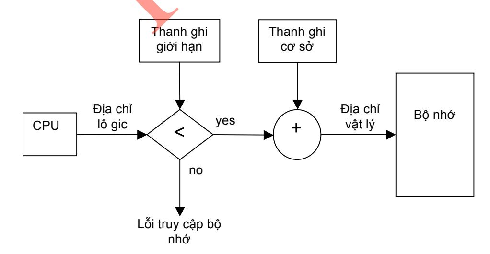

nhớ. Thanh ghi thứ hai gọi là thanh ghi giới hạn và chứa giới hạn địa chỉ lô gic của tiến trình tức độ dài chương chứa tiến trình. Địa chỉ lôgic được so sánh với nội dung thanh ghi giới hạn. Chỉ những địa chỉ lôgic nhỏ hơn giá trị thanh ghi này mới được coi là hợp lệ và được ánh xạ thành địa chỉ vật lý. Địa chỉ vật lý được tạo ra bằng cách cộng nội dung thanh ghi cơ sở với địa chỉ lôgic.

Trong trường hợp các chương bị di chuyển trong bộ nhớ, chẳng hạn như khi hệ điều hành tiến hành dồn bộ nhớ để tránh phân mảnh ngoài, nội dung thanh ghi cơ sở sẽ được thay đổi thành địa chỉ mới của chương. Các phép ánh xạ sau đó vẫn diễn ra như cũ.

## **3.3.5. Trao đổi giữa bộ nhớ và đĩa (swapping)**

**Khái niệm**. Trong các hệ đa chương trình, để có thể thực hiện nhiều tiến trình một lúc, các tiến trình đang thực hiện có thể bị tạm thời tải ra đĩa nhường chỗ để tải các tiến trình khác vào và thực hiện. Sau đó các tiến trình bị tải ra lại được tải vào thực hiện tiếp từ vị trí tạm dừng. Thao tác này được gọi là trao đổi giữa bộ nhớ và đĩa (swapping).

Khi bị trao đổi ra đĩa, hệ thống sẽ chép ra đĩa "ảnh" của tiến trình, tức là toàn bộ tiến trình ở trạng thái hiện thời với giá trị dữ liệu, nội dung ngăn xếp, lưu lại con trỏ lệnh. Nhờ vậy, khi được chuyển lại vào bộ nhớ, tiến trình có thể thực hiện tiếp từ vị trí bị dừng khi trao đổi ra đĩa.

Việc trao đổi giữa đĩa và bộ nhớ như vậy có thể thực hiện khi một tiến trình đã hết khoảng thời gian sử dụng CPU của mình và phải đợi cho tới khi đến lượt. Tiến trình khi đó bị tải ra để nhường chỗ cho tiến trình khác đến lượt sử dụng CPU. Tiến trình cũng có thể bị tải ra để nhường chỗ cho một tiến trình khác có thứ tự ưu tiên cao hơn. Nhờ kỹ thuật này, tổng không gian nhớ của tất cả tiến trình có thể lớn hơn so với không gian nhớ vật lý do một số tiến trình được giữ tạm trên đĩa. PTIT

**Vấn đề tốc độ**. Các tiến trình thường được tải ra và tải vào từ các đĩa tốc độ cao. Thời gian tải phụ thuộc vào tốc độ truy cập đĩa, tốc độ truy cập bộ nhớ và kích thước tiến trình. Với những tiến trình có kích thước lớn từ vài trăm megabyte tới vài gigabyte và tốc độ truyền dữ liệu giữa bộ nhớ với đĩa cứng hiện nay, thời gian trao đổi một tiến trình ra đĩa có thể lên tới vài giây. Như vậy, thời gian chuyển đổi ngữ cảnh giữa các tiến trình, bao gồm cả thời gian trao đổi đĩa, là tương đối lớn.

Khi được tải vào lại, tiến trình có thể được chứa vào vị trí cũ hoặc được cấp cho một chương địa chỉ hoàn toàn mới.

**Một số hạn chế**. Một hạn chế với các tiến trình bị trao đổi là tiến trình đó phải ở trạng thái nghỉ, đặc biệt không thực hiện các thao tác vào ra do việc trao đổi các tiến trình đang vào/ra sẽ gây lỗi. Để minh họa, ta xét ví dụ sau. Giả sử, tiến trình P1 có một yêu cầu vào ra đang ở trong hàng đợi do thiết bị vào/ra bận. Ta tải P1 ra đĩa và tải P2 vào vị trí của P1. Khi thao tác vào ra của P1 được đáp ứng, thao tác này sẽ truy cập vùng địa chỉ của P1 trước kia. Tuy nhiên, do vùng bộ nhớ này hiện giờ thuộc về P2 nên dữ liệu của P1 sẽ được đọc vào vùng bộ nhớ của P2 và gây ra lỗi. Để tránh những tình huống như vậy có thể sử dụng hai giải pháp. Giải pháp thứ nhất, đã nói ở trên, là không trao đổi các tiến trình đang có yêu cầu vào/ra dữ liệu. Giải pháp thứ hai là thay vì đọc/ghi dữ liệu trực tiếp giữa thiết bị với vùng nhớ của tiến trình, dữ liệu sẽ được đọc/ghi vào vùng bộ nhớ đệm (buffer) của hệ điều hành và được chứa tạm ở đây. Khi tiến trình được chuyển vào bộ nhớ, dữ liệu mới đọc/ghi sẽ được đồng bộ giữa bộ nhớ đệm và vùng nhớ của tiến trình.

Ở trên, ta đã xem xét việc trao đổi toàn bộ tiến trình ra đĩa. Do các hạn chế về tốc độ, kỹ thuật này ít khi sử dụng trong các hệ điều hành hiện nay. Thay vì vậy, việc trao đổi từng phần tiến trình thường ra đĩa được sử dụng trong các hệ thống bộ nhớ ảo.

#### **Trao đổi bộ nhớ - đĩa trong các hệ điều hành di động**

Do đặc điểm của thiết bị di động, các hệ điều hành cho thiết bị di động hầu như không sử dụng kỹ thuật trao đổi giữa bộ nhớ và đĩa. Có hai nguyên nhân chính của việc không sử dụng kỹ thuật này. Thứ nhất, thiết bị di động không sử dụng đĩa cứng mà dùng bộ nhớ flash hay bộ nhớ SSD với dung lượng tương đối nhỏ so với đĩa cứng và do vậy không có nhiều không gian để chuyển các tiến trình từ bộ nhớ trong ra bộ nhớ ngoài. Ví dụ, iPhone hiện nay chỉ có bộ nhớ ngoài dung lượng 16GB – 64GB so với dung lượng hàng trăm GB của đĩa cứng thông thường. Thứ hai, công nghệ bộ nhớ flash của thiết bị di động chỉ cho phép ghi dữ liệu lên đó một số lần nhất định, sau khi đạt được giới hạn này, bộ nhớ làm việc không ổn định. Do vậy, cần tránh việc ghi ra bộ nhớ ngoài quá nhiều.

Thay vì trao đổi ra đĩa, hệ điều hành di động thường xóa tiến trình khi không đủ bộ nhớ. Ví dụ, hệ điều hành iOS sử dụng chiến lược sau. Khi bộ nhớ trong còn ít, hệ điều hành báo cho các ứng dụng giải phóng bớt bộ nhớ. Thông thường, ứng dụng sẽ giải phóng vùng bộ nhớ dùng chứa mã chương trình và dữ lại những vùng chứa dữ liệu. Chiến lược này giúp ứng dụng khôi phục lại trạng thái cũ nhanh chóng khi có đủ bộ nhớ. Tuy nhiên, nếu cách này không giúp ứng dụng giải phóng đủ lượng bộ nhớ hệ điều hành yêu cầu, iOS sẽ xóa ứng dụng khỏi bộ nhớ trong. PTIT

Tương tự iOS, hệ điều hành Android cũng kết thúc và xóa tiến trình khỏi bộ nhớ khi thiếu bộ nhớ. Tuy nhiên, Android ghi một số thông tin trạng thái tiến trình ra bộ nhớ ngoài trước khi kết thúc tiến trình. Các thông tin này có thể giúp cho việc chạy lại các ứng dụng được nhanh hơn.

## 3.4. PHÂN TRANG BỘ NHỚ

Trong kỹ thuật phân chương trình bày ở trên, mỗi tiến trình chiếm một chương tức một vùng liên tục trong bộ nhớ. Nhược điểm của việc phân chương bộ nhớ là tạo ra phân mảnh: phân mảnh trong đối với phân chương cố định, phân mảnh ngoài đối với phân chương động, hậu quả đều là việc không tận dụng hết bộ nhớ.

Để hạn chế nhược điểm của kỹ thuật cấp phát cho tiến trình chương nhớ, có thể sử dụng phương pháp cấp phát cho tiến trình những vùng nhớ không nằm liền nhau. Trong phần này ta sẽ xem xét kỹ thuật *phân trang* (paging), là một trong hai kỹ thuật cấp phát bộ nhớ như vậy.

# **3.4.1. Khái niệm phân trang bộ nhớ**

Trong các hệ thống phân trang, bộ nhớ vật lý được chia thành các khối nhỏ kích thước cố định và bằng nhau gọi là *khung trang* (page frame) hoặc đơn giản là *khung*. Không gian địa chỉ lôgic của tiến trình cũng được chia thành những khối gọi là *trang* (page) có kích thước bằng kích thước của khung. Mỗi tiến trình sẽ được cấp các khung để chứa các trang nhớ của mình. Các khung thuộc về một tiến trình có thể nằm ở các vị trí khác nhau trong bộ nhớ chứ *không nhất thiết nằm liền nhau* theo thứ tự các trang. Hình 3.7 sau cho thấy có ba tiến trình được tải vào bộ nhớ. Tiến trình A và C chiếm các khung nằm cạnh nhau trong khi tiến trình D chiếm các khung nằm trong hai vùng nhớ cách xa nhau.

Hình 3.7: Phân trang bộ nhớ

Kỹ thuật phân trang có điểm tương tự với phân chương cố định, trong đó mỗi khung tương tự một chương, có kích thước và vị trí không thay đổi. Tuy nhiên, khác với phân chương, mỗi tiến trình được cấp phát nhiều khung kích thước nhỏ, nhờ vậy giảm đáng kể phân mảnh trong. PTIT

Khi phân trang, khoảng không gian bỏ phí do phân mảnh trong bằng phần không gian không sử dụng trong trang cuối của tiến trình, nếu kích thước tiến trình không bằng bội số kích thước trang. Tính trung bình, mỗi tiến trình bị bỏ phí một nửa trang do phân mảnh trong. Phương pháp phân trang không bị ảnh hưởng của phân mảnh ngoài do từng khung trong bộ nhớ đều có thể sử dụng để cấp phát.

#### **3.4.2. Ánh xạ địa chỉ**

**Bảng trang**. Do tiến trình nằm trong những khung nhớ không liền kề nhau, để ánh xạ địa chỉ lôgic của tiến trình thành địa chỉ vật lý, việc dùng một thanh ghi cơ sở cho mỗi tiến trình như ở phương pháp phân chương là không đủ. Thay vào đó người ta sử dụng một bảng gọi là *bảng trang* (page table). Mỗi ô của bảng tương ứng với một trang và chứa số thứ tự hay địa chỉ cơ sở của khung chứa trang đó trong bộ nhớ. Trên hình 3.8 là ví dụ bảng trang cho ba tiến trình A, C, D đã được minh họa ở hình 3.7. Nhìn vào bảng trang của tiến trình D, ta có thể thấy trang số 2 của tiến trình D nằm trong khung số 8 của bộ nhớ vật lý, và do vậy địa chỉ bắt đầu của trang trong bộ nhớ vật lý là 8\*s, trong đó s là kích thước của trang. Cần lưu ý là mỗi tiến trình có bảng trang riêng của mình.

0 A.0 1 A.1 2 A.2 3 D.0 4 D.1 5 C.0 6 C.1 7 C.2 8 D.2 9 D.3

Bộ nhớ

0 A.0 1 A.1 2 A.2 0 C.0 1 C.1 2 C.2 0 D.0 1 D.1 2 D.2 3 D3

Không gian nhớ lô gic của các tiến trình

A và B: 3 trang D: 4 trang

Tiến trình A Tiến trình B

Tiến trình C

Hình 3.8. Ví dụ bảng trang của các tiến trình

**Địa chỉ**. Địa chỉ lô gic khi phân trang bao gồm hai phần: *số thứ tự trang* (p) và *độ dịch* (o) của địa chỉ tính từ đầu trang đó. Số thứ tự trang được dùng để tìm ra ô tương ứng trong bảng trang, từ bảng ta tìm được địa chỉ cơ sở của khung tương ứng. Địa chỉ này được cộng vào độ dịch trong trang để tạo ra địa chỉ vật lý và được chuyển cho mạch điều khiển bộ nhớ để truy cập. Như sẽ đề cập tới ở dưới đây, kích thước của trang và khung luôn được chọn là lũy thừa của 2, do vậy việc xác định các phần p, o và việc ánh xạ từ địa chỉ logic sang địa chỉ vật lý có thể thực hiện dễ dàng trên phần cứng.

Cấu trúc địa chỉ lô gic được thể hiện trên hình sau, trong đó độ dài địa chỉ lô gic là *m*+*n* bit, tương ứng với không gian nhớ lô gic của tiến trình là 2*m*+*n* . Phần *m* bit cao chứa số thứ tự của trang, và *n* bit thấp chứa độ dịch trong trang nhớ. Kích thước trang nhớ khi đó sẽ bằng 2*n* . PTIT

Ví dụ: cho trang nhớ kích thước 1024B, độ dài địa chỉ lô gic 16 bit. Địa chỉ lô gic 1502, hay 0000010111011110 ở dạng nhị phân, sẽ có:

phần *p* = 1502/1024 = 1 tương ứng với 6 bit cao 000001

phần *o* = 1502 module 1024 = 478 tương ứng với 10 bit thấp 0111011110.

Như vậy ta có địa chỉ logic dưới dạng thập phân 1502 có hai phần (trang 1, độ dịch 478), hay dưới dạng nhị phân có hai phần là 000001**|**0111011110, trong đó 6 bit cao là số thứ tự trang và 10 bit thấp là độ dịch trong trang.

**Cơ chế ánh xạ địa chỉ**. Quá trình biến đổi từ địa chỉ lô gic thành địa chỉ vật lý được thực hiện nhờ phần cứng theo cơ chế được thể hiện trên hình 3.9. Cần lưu ý là việc ánh xạ địa chỉ đều phải dựa vào phần cứng vì thao tác ánh xạ cần thực hiện thường xuyên và ảnh hưởng lớn tới tốc độ toàn hệ thống.

Do việc phân trang phải dựa vào sự hỗ trợ của phần cứng khi biến đổi địa chỉ, kích thước trang và khung do phần cứng quyết định. Để thuận tiện cho việc ánh xạ địa chỉ theo cơ chế trên hình 3.9, kích thước trang luôn được chọn bằng lũy thừa của 2, và nằm trong khoảng từ 512B đến 1GB. Lưu ý rằng với kích thước trang bằng lũy thừa của 2, việc tách phần *p* và *o* trong địa chỉ lô gic được thực hiện dễ dàng bằng phép dịch bit thay vì thực hiện phép chia và chia mô đun thông thường (xem ví dụ về địa chỉ lô gic ở trên).

Bảng trang tiến trình A Bảng trang tiến trình C

Bảng trang tiến trình D

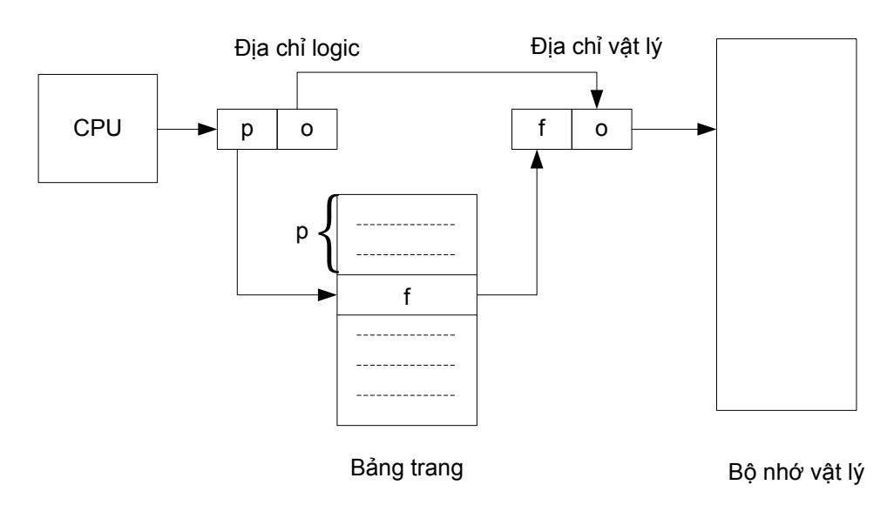

Hình 3.9. Phần cứng ánh xạ địa chỉ khi phân trang

#### **Ví dụ biến đổi địa chỉ**.

Để minh họa cho biến đổi địa chỉ logic thành địa chỉ vật lý khi phân trang, xét một ví dụ rất đơn giản như trên hình 3.10. Không gian nhớ logic có kích thước 16B = 24 , gồm 4 trang, bộ nhớ vật lý có 8 trang, kích thước trang nhớ bằng 4B = 22 . Như vậy, độ dài địa chỉ logic là 4 bit, trong đó độ dài phần o là 2 bit và phần p là 2 bit. Không gian nhớ vật lý là 32B = 25 , tương ứng với độ dài địa chỉ vật lý là 5 bit. PTIT

Địa chỉ logic 1 nằm tại trang 0 và độ dịch từ đầu trang là 1 (1/4 = 0; 1 module 4 = 1). Theo bảng trang, trang 0 nằm trong khung 1, do vậy địa chỉ vật lý tương ứng là 1\*4 + 1 = 5. Biểu diễn dưới dạng nhị phân, ta có: địa chỉ logic = 0001, phần p = 00, phần o = 01, địa chỉ khung f = 001, địa chỉ vật lý (f,o) = 00101 = 5.

Tương tự, địa chỉ logic 13 nằm tại trang 3 (13/4 = 3), độ dịch từ đầu trang là 1 (13 module 4 = 1). Theo bảng trang, trang 3 nằm ở khung 6, do vậy địa chỉ vật lý = 4\*6 + 1 = 25. Biểu diễn dưới dạng nhị phân, ta có: địa chỉ logic = 1101, phần p = 11, phần o = 01, địa chỉ khung f = 110, địa chỉ vật lý (f,o) = 11001 = 25.

**Kích thước trang**. Như đã nói ở trên, phân mảnh trong khi phân trang có giá trị trung bình bằng nửa trang. Như vậy, giảm kích thước trang cho phép tiết kiệm bộ nhớ. Tuy nhiên, kích thước trang nhỏ làm số lượng trang tăng lên, dẫn tới bảng trang to hơn, khó quản lý. Kích thước trang quá bé cũng không tiện cho việc trao đổi với đĩa, vốn được thực hiện theo từng khối lớn. Trên thực tế, người ta thường chọn trang có kích thước vừa phải. Ví dụ, vi xử lý Pentium của Intel hiện nay hỗ trợ kích thước trang bằng 4KB hoặc 4MB. Hệ điều hành Windows 32 bit chọn kích thước trang bằng 4KB.

**Quản lý khung**. Để cấp phát được bộ nhớ, hệ điều hành cần biết các khung trang nào còn trống, khung trang nào đã được cấp và cấp cho tiến trình nào. Để quản lý được các thông tin này, hệ điều hành sử dụng một bảng gọi là *bảng khung* (frame table). Mỗi khoản mục của bảng khung ứng với một khung của bộ nhớ vật lý và chứa các thông tin về khung này: còn trống hay đã được cấp, cấp cho tiến trình nào v.v.

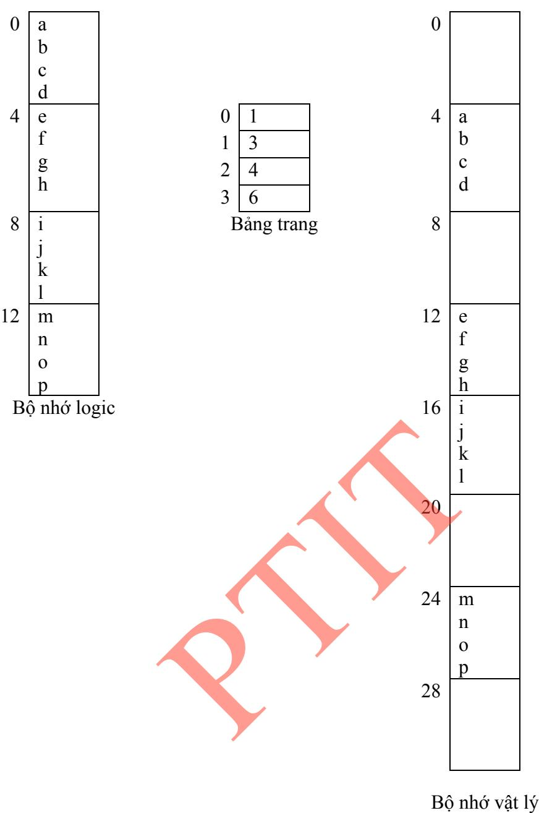

Hình 3.10. Ví dụ ánh xạ địa chỉ trong phân trang bộ nhớ

Với việc phân trang, cách nhìn của người dùng và chương trình ứng dụng đối với bộ nhớ (tức là bộ nhớ lôgic) hoàn toàn khác với bộ nhớ vật lý thực. Bộ nhớ lôgic khi đó được chương trình ứng dụng coi như một khối liên tục và duy nhất chứa chương trình đó. Thực tế, chương trình có thể gồm các trang nằm xa nhau và rải rác trong bộ nhớ. Cơ chế ánh xạ giữa hai loại địa chỉ hoàn toàn trong suốt đối với chương trình cũng như người lập trình. Việc ánh xạ giữa không gian nhớ logic và vật lý và do hệ điều hành chịu trách nhiệm. Tiến trình ứng dụng, do đó, không có khả năng truy cập tới vùng bộ nhớ thực nằm ngoài các trang được cấp cho tiến trình đó.

Việc lưu trữ và tổ chức bảng trang có ảnh hưởng nhiều tới hiệu năng toàn hệ thống. Trong phần này ta sẽ xem xét một số kỹ thuật liên quan tới việc tổ chức và truy cập bảng trang.

#### **Tốc độ truy cập bảng phân trang**

Mỗi thao tác truy cập bộ nhớ đều đòi hỏi thực hiện ánh xạ giữa địa chỉ lôgic và địa chỉ vật lý, tức là đòi hỏi truy cập bảng phân trang. Tốc độ truy cập bảng phân trang do đó ảnh hưởng rất lớn tới tốc độ truy cập bộ nhớ của toàn hệ thống. Vậy phải lưu trữ bảng phân trang sao cho tốc độ truy cập là cao nhất.

*Lưu bảng trang trong các thanh ghi*. Cách nhanh nhất là sử dụng một tập hợp các thanh ghi dành riêng để lưu bảng trang. Các thanh ghi này được thiết kế riêng cho việc chứa dữ liệu bảng trang và ánh xạ địa chỉ. Việc truy cập các thanh ghi này được phân quyền, sao cho chỉ có hệ điều hành chạy trong chế độ nhân mới có thể truy cập được. Tốc độ truy cập bảng phân trang khi đó rất cao nhưng kích thước và số lượng bảng phân trang sẽ bị hạn chế do số lượng thanh ghi của CPU không nhiều lắm. Trong một số máy tính trước đây sử dụng kỹ thuật này, số lượng ô trong bảng trang không vượt quá 256.

*Lưu bảng trang trong bộ nhớ trong*. Các máy tính hiện đại đều có bộ nhớ lớn và do đó cũng cần bảng phân trang lớn tương ứng. Số lượng ô trong bảng trang có thể lên tới hàng triệu. Phương pháp dùng thanh ghi, do đó, không áp dụng được.

Các bảng phân trang khi đó được giữ trong bộ nhớ. Vị trí của mỗi bảng sẽ được trỏ tới bởi một thanh ghi gọi là thanh ghi cơ sở của bảng trang (PTBR-Page-Table Base Register). Như vậy mỗi thao tác truy cập bộ nhớ trong đòi hỏi hai thao tác truy cập bộ nhớ, một để đọc ô nhớ tương ứng trong bảng trang, và một để thực hiện truy cập cần thiết. Do tốc độ bộ nhớ tương đối chậm nên đòi hỏi nhiều thời gian cho việc truy cập bảng. PTIT

*Sử dụng bộ nhớ cache*. Do việc đọc bảng trang trong bộ nhớ chính có tốc độ chậm nên giải pháp thông dụng để tăng tốc độ truy cập bảng trang trong phần cứng hiện nay, bao gồm cả họ CPU x86, là sử dụng bộ nhớ cache tốc độ cao chuyên dụng gọi là *đệm dịch địa chỉ* (nguyên bản tiếng Anh: Translation Look-aside Buffer - TLB). Mỗi phần tử của TLB chứa một khóa và giá trị tương ứng với khóa đó. Khóa ở đây là số thứ tự trang, giá trị là số thứ tự khung tương ứng. Khi đưa vào một số thứ tự trang, tức là một khóa, khóa sẽ được so sánh đống thời với tất cả các khóa trong TLB, nếu có khóa cần tìm, bộ đệm sẽ trả lại số thứ tự của khung tương ứng. Quá trình tìm kiếm khóa và giá trị khung tương ứng này diễn ra rất nhanh, hầu như không làm tăng thêm thời gian thực hiện chu trình xử lý lệnh của CPU.

Sơ đồ kết hợp đệm dịch địa chỉ TLB với bảng trang trong bộ nhớ được thể hiện trên hình 3.11. Thông thường, TLB chứa từ vài chục tới 1024 địa chỉ trang và số thứ tự khung tương ứng. Khi CPU sinh ra địa chỉ logic, phần số thứ tự trang p được gửi cho TLB, số này được so sánh đồng thời với tất cả các khóa (số thứ tự trang) trong TLB. Lúc này có hai khả năng:

- Nếu tìm được số thứ tự trang trong TBL, số thứ tự khung sẽ được trả về để tạo thành địa chỉ vật lý gần như tức thì.
- Ngược lại, nếu số thứ tự trang không nằm trong TLB, hệ thống sẽ truy cập bảng trang từ bộ nhớ trong để tìm số khung. Tùy từng hệ thống, việc truy cập bảng trang

có thể do phần cứng (CPU) hay hệ điều hành thực hiện. Sau khi truy cập bảng trang, thông tin này được dùng để tạo địa chỉ vật lý, đồng thời số thứ tự trang và khung vừa tìm được cũng được thêm vào TLB. Như vậy, nếu các lần truy cập tiếp theo sử dụng cùng trang này, số thứ tự trang đã được lưu trong TLB và do vậy không cần truy cập bảng trang nữa.

Trong trường hợp tất cả các ô trong TLB đã được điền đủ, hệ thống sẽ giải phóng một ô để chứa cặp giá trị mới được đọc vào. Để lựa chọn ô bị giải phóng có thể sử dụng một trong các thuật toán như LRU, quay vòng, hay thậm chí chọn ngẫu nhiên (chi tiết về các thuật toán này xem trong phần các thuật toán đổi trang). Ngoài ra, hệ thống có thể giữ thường xuyên một số cặp số thứ tự trang – khung thường xuyên trong TLB, không bị đẩy ra ngoài. Đây thường là số thứ tự các trang chứa phần nhân của hệ điều hành, là các phần quan trọng, hay được truy cập.

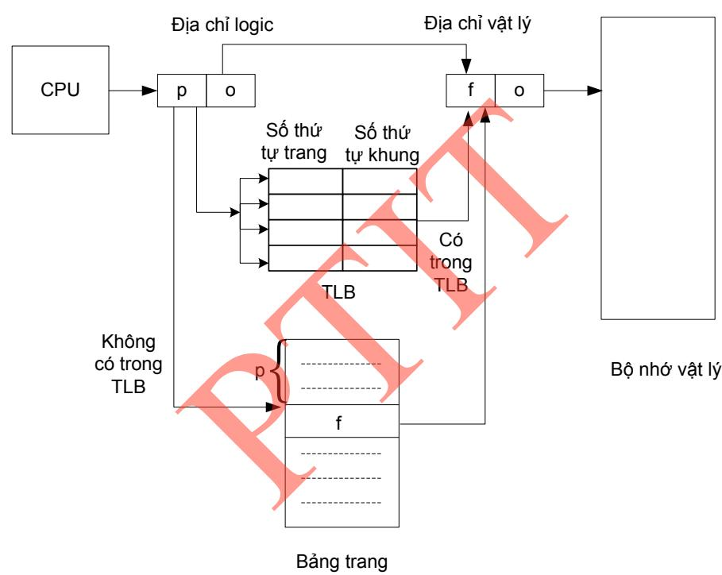

Hình 3.11. Kết hợp đệm dịch địa chỉ (TLB) với bảng trang nằm trong bộ nhớ trong

Độ hiệu quả của TLB được đánh giá như độ hiệu quả của bộ nhớ cache thông thường, tức là bằng tỷ lệ truy cập thành công tới TLB (hit ratio). Ví dụ, nếu tỷ lệ này là 90% thì trung bình trong 100 lần truy cập bộ nhớ, chỉ có 10 lần cần truy cập bảng trang và 90 lần còn lại có thể tìm được số thứ tự trang trong TLB. Các CPU hiện nay thường sử dụng TLB nhiều mức để tăng hiệu quả trong khi vẫn giữ được giá thành thấp.

## **Bảng trang nhiều mức**

Các hệ thống tính toán hiện đại cho phép sử dụng không gian địa chỉ lôgic rất lớn (232 đến 264). Kích thước bảng phân trang do đó cũng tăng theo. Lấy ví dụ bảng trang trong Windows 32 với không gian địa chỉ lôgic là 232 B, kích thước trang nhớ là 4KB=212. Số lượng khoản mục cần có trong bảng phân trang sẽ là 232/212=220. Nếu mỗi khoản mục có kích thước 4 byte, kích thước bảng phân trang sẽ là 222=4MB. Mỗi tiến trình cần có một bảng phân trang riêng như vậy.

Do bảng trang có kích thước lớn, cần chia bảng trang thành các phần nhỏ hơn sao cho các phần có thể được lưu trong bộ nhớ độc lập với nhau. Có hai lợi ích chính của việc chia bảng trang thành các phần nhỏ như vậy. Thứ nhất, việc cấp phát các vùng nhớ nhỏ để chứa bảng trang đơn giản hơn so với cả bảng trang. Thứ hai, mặc dù bảng trang lớn nhưng đa số tiến trình có kích thước nhỏ hơn kích thước tối đa cho phép và do vậy chỉ một phần của bảng trang được sử dụng. Việc chia nhỏ bảng trang cho phép lưu một phần bảng trang trong bộ nhớ, là phần bảng trang thực sự được sử dụng.

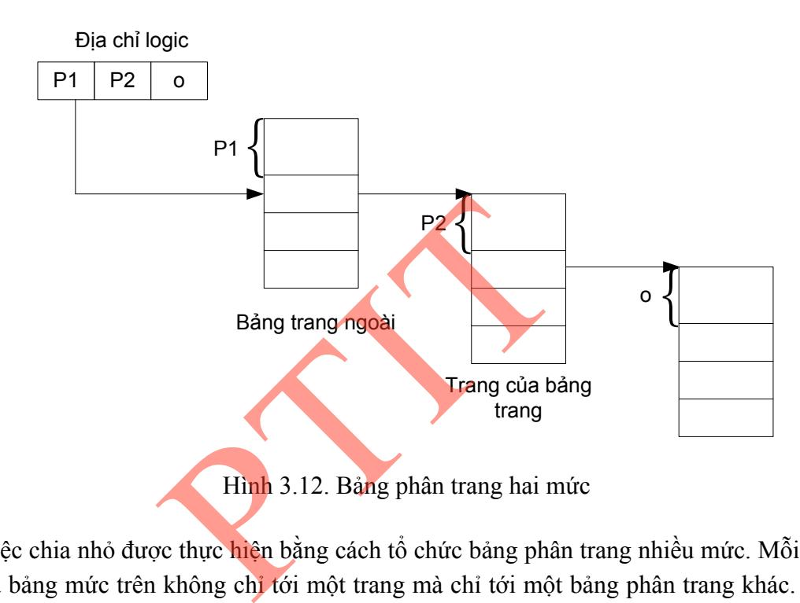

Hình 3.12. Bảng phân trang hai mức

Việc chia nhỏ được thực hiện bằng cách tổ chức bảng phân trang nhiều mức. Mỗi khoản mục của bảng mức trên không chỉ tới một trang mà chỉ tới một bảng phân trang khác. Ta lấy ví dụ bảng hai mức như trong Windows 32. Địa chỉ 32 bit khi đó được chia thành 3 phần. Phần thứ nhất p1 kích thước 10 bit cho phép định vị khoản mục trong bảng mức trên. Từ đây ta tìm được bảng mức dưới tương ứng. Phần p2 cho phép định vị khoản mục trong bảng mức dưới. Khoản mục này chứa địa chỉ của khung tương ứng. Phần còn lại o kích thước 12 bit chứa độ dịch trong trang.

## **Bảng trang ngược (Inverted page table)**

Trong các phần trước, ta đã xem xét cách tổ chức trong đó mỗi tiến trình có một bảng trang riêng, mỗi khoản mục của bảng ứng với một trang của tiến trình và chứa số thứ tự của khung cấp cho tiến trình đó. Do không gian địa chỉ logic lớn nên số lượng khoản mục trong mỗi bảng rất lớn, chẳng hạn trong Windows 32 là 220 khoản mục. Nếu đồng thời có nhiều tiến trình thì tổng số khoản mục của các bảng trang sẽ được nhân lên. Một kỹ thuật cho phép tránh việc có nhiều bảng trang như vậy gọi là *bảng trang ngược* (inverted page table), trong đó toàn bộ hệ thống chỉ có một bảng trang ngược, mỗi ô của bảng tương ứng với một khung nhớ vật lý, thay vì ứng với một trang nhớ logic như cách thông thường. Như vậy, kích thước của bảng trang ngược được xác định bới kích thước bộ nhớ thực của máy tính và không phụ thuộc vào số lượng tiến trình.

Mỗi khoản mục trong bảng trang ngược tương ứng với một khung và chứa hai thông tin: số thứ tự của trang nằm trong khung đó, và số định danh của tiến trình sở hữu trang này. Nếu khung chưa được cấp phát, thì khoản mục tương ứng trong bảng được để trống hoặc chứa một giá trị đặc biệt. Địa chỉ logic do CPU sinh ra gồm 3 phần:

< số định danh tiến trình pid, số thứ tự trang p, độ dịch trong trang o >

Việc ánh xạ địa chỉ được thực hiện như sau (hình 3.13). Phần (pid, p) được so sánh với nội dung các khoản mục của bảng trang ngược để tìm ra ô có cùng pid và số thứ tự trang p như vậy. Số thứ tự của khoản mục tìm được chính là số thứ tự của khung. Số này được ghép với phần độ dịch o để tạo ra địa chỉ vật lý.

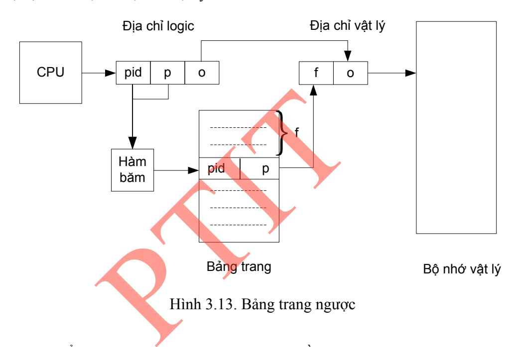

Hình 3.13. Bảng trang ngược

Có hai cách để tìm ra khoản mục có chứa (pid, p) cần tìm.

- Cách thứ nhất là tìm kiếm tuần tự: (pid, p) được lần lượt so với nội dung từng ô trong bảng cho đến khi tìm được ô có pid và p tương ứng hoặc cho đến khi không tìm được ô như vậy. Do các ô trong bảng trang ngược không được sắp xếp theo thứ tự của pid và được sắp xếp theo số thứ tự khung nên chỉ có thể duyệt lần lượt để tìm được ô tương ứng. Cách này có tốc độ chậm, đặc biệt nếu bộ nhớ gồm nhiều khung.
- Cách thứ hai sử dụng hàm băm để tìm tăng tốc độ tìm kiếm. Hệ thống sử dụng một bảng băm cho phép ánh xạ (pid, p) vào khoản mục cần tìm như minh họa trên hình 3.13. Cách này có tốc độ nhanh hơn nhiều so với duyệt tuần tự. Cần lưu ý rằng việc truy cập hàm băm và bảng băm đòi hỏi thêm một lần truy cập bộ nhớ nữa. Như vậy thao tác ánh xạ địa chỉ dẫn tới hai lần truy cập bộ nhớ: một lần để truy cập bảng băm và một lần để truy cập bảng trang.

Bảng trang ngược được sử dụng với một số dòng CPU như PowerPC (do Apple-IBM-Motorola thiết kế và trước đây được sử dụng trong máy Macintosh của Apple), và IA-64 của Intel.

#### 3.5. PHÂN ĐOẠN BỘ NHỚ

Trong phần này, ta sẽ xem xét một kỹ thuật cấp phát bộ nhớ khác, trong đó mỗi tiến trình được cấp phát những vùng nhớ không nhất thiết nằm liền nhau.

#### **3.5.1 Khái niệm**

Mỗi chương trình bao gồm một số thành phần có ý nghĩa khác nhau: dữ liệu, lệnh, hàm, ngăn xếp v.v. , Tuy nhiên, khi phân trang, chương trình được chia thành các trang kích thước đều nhau, không quan tâm đến tổ chức lôgic và ý nghĩa các thành phần. Bộ nhớ được coi như một khối duy nhất các byte hoặc các từ.

Một cách tổ chức khác cho phép tính tới tổ chức lôgic của chương trình là *phân đoạn* (segmentation). Chương trình được chia thành những phần kích thước khác nhau gọi là *đoạn* (segment) tuỳ theo ý nghĩa của chúng. Chẳng hạn, ta có thể phân biệt:

- Đoạn chương trình, chứa mã toàn bộ chương trình, hay một số hàm hoặc thủ tục của chương trình.
- Đoạn dữ liệu, chứa các biến toàn cục, các mảng.
- Đoạn ngăn xếp, chứa ngăn xếp của tiến trình trong quá trình thực hiện. PTIT

Không gian địa chỉ lôgic của tiến trình khi đó sẽ gồm tập hợp các đoạn. Mỗi đoạn tương ứng với không gian địa chỉ riêng, được phân biệt bởi tên và độ dài của mình. Ngoài cách dùng tên, đoạn cũng có thể được đánh số để phân biệt. Mỗi địa chỉ lôgic do CPU sinh ra khi đó sẽ gồm hai phần: số thứ tự của đoạn và độ dịch trong đoạn.

Việc chia chương trình thành các đoạn có thể do người lập trình thực hiện, chẳng hạn khi lập trình bằng assembly, hoặc do chương trình dịch tự của ngôn ngữ bậc cao tự động chia. Người lập trình khi đó cần biết kích thước tối đa được phép của đoạn, ví dụ để không khai báo mảng vượt kích thước tối đa này.

Phân đoạn bộ nhớ giống với phân chương động ở chỗ bộ nhớ được cấp phát theo từng vùng kích thước thay đổi. Tuy nhiên, khác với phân chương động, mỗi chương trình có thể chiếm những đoạn bộ nhớ không nằm liền kề nhau. Mỗi khi có yêu cầu cấp phát bộ nhớ cho các đoạn, thuật toán cấp phát first-fit hoặc best-fit như phân chương động sẽ được sử dụng.

Cũng như phân chương động, phân đoạn không sinh phân mảnh trong nhưng lại tạo phân mảnh ngoài. Mức độ phân mảnh ngoài phụ thuộc vào kích thước trung bình của đoạn. Đoạn càng nhỏ thì phân mảnh ngoài càng giảm. Trường hợp đặc biệt, nếu kích thước đoạn là một byte hay một từ tức là bằng đơn vị thông tin nhỏ nhất được đánh địa chỉ của bộ nhớ thì sẽ hoàn toàn không có phân mảnh ngoài. Tuy nhiên, số lượng đoạn tăng làm tăng kích thước của bảng phân đoạn và tăng thời gian quản lý các đoạn. Kích thước đoạn thường phụ thuộc kích thước bộ nhớ. Bộ nhớ càng lớn thì kích thước đoạn cũng được chọn càng lớn. Nhìn chung, phân mảnh ngoài khi phân đoạn nhỏ hơn phân chương động do tiến trình đã được chia thành các đoạn kích thước nhỏ hơn.

#### **3.5.2. Ánh xạ địa chỉ và chống truy cập trái phép**

**Địa chỉ**. Khi sử dụng phân đoạn, không gian nhớ lô gic sẽ bao gồm không gian nhớ của các đoạn. Do vậy, địa chỉ lô gic bao gồm hai thành phần, chỉ rõ hai thông tin: địa chỉ thuộc đoạn nào, và độ dịch từ đầu đoạn là bao nhiêu. Hai thông tin này cần được người lập trình cung cấp rõ ràng, khác với trường hợp phân trang, trong đó tiến trình cung cấp duy nhất một địa chỉ và phần cứng có nhiệm vụ tách địa chỉ này thành số trang và độ dịch.

Đối với đoạn được đánh số, địa chỉ lô gic sẽ có hai thành phần, được cấu trúc như sau:

< số thứ tự đoạn (*s*), độ dịch trong đoạn (*o*) >

Đối với trường hợp chương trình viết trên ngôn ngữ bậc cao, địa chỉ lô gic với hai thành phần như vậy được chương trình dịch sinh ra trong quá trình dịch để thể hiện cấu trúc và ý nghĩa các đoạn của chương trình nguồn.

**Ánh xạ địa chỉ**. Địa chỉ lô gic cần phải được biến đổi thành địa chỉ vật lý để xác định ô nhớ cụ thể của máy tính. Tương tự như trong trường hợp phân trang, việc ánh xạ được thực hiện dựa trên *bảng đoạn* (segment table). Mỗi ô của bảng đoạn chứa địa chỉ cơ sở và giới hạn của đoạn. Địa chỉ cơ sở là vị trí bắt đầu của đoạn trong bộ nhớ máy tính, còn giới hạn đoạn chính là độ dài đoạn và sẽ được sử dụng để chống truy cập trái phép ra ngoài đoạn. Mỗi tiến trình có một bảng như vậy.

Bảng đoạn được sử dụng kết hợp với một cơ chế phần cứng cho phép biến đổi từ địa chỉ lô gic sang địa chỉ tuyệt đối như minh họa trên hình 3.14. Trước hết, phần *s* trong địa chỉ được sử dụng để tìm tới ô thứ *s* trong bảng đoạn và truy cập hai giá trị *giới hạn* và *cơ sở* chứa trong ô này. Tiếp theo, phần độ dịch *o* của địa chỉ được so sánh với phần giới hạn chứa trong ô. Nếu o nhỏ hơn *giới hạn* thì đây là truy cập hợp lệ, ngược lại nếu o lớn hơn hoặc bằng giới hạn thì địa chỉ này vượt ra ngoài phạm vi của đoạn và do vậy sẽ bị báo lỗi truy cập. Trong trường hợp truy cập hợp lệ, phần độ dịch o được cộng với địa chỉ *cơ sở* để tạo ra địa chỉ vật lý. PTIT

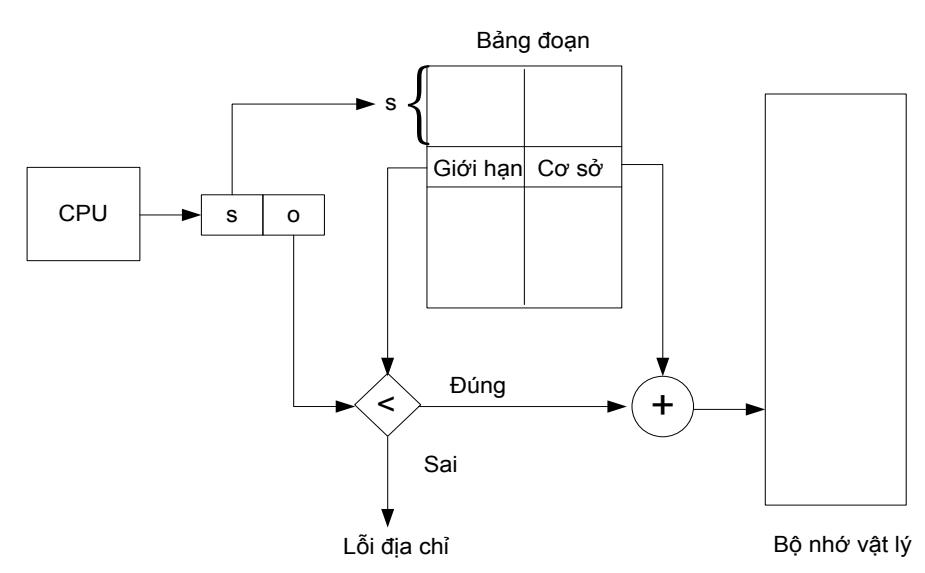

Hình 3.14. Cơ chế ánh xạ địa chỉ khi phân đoạn

Việc chống truy cập trái phép được thực hiện nhờ các bit bảo vệ chứa trong khoản mục của bảng phân đoạn. Các đoạn được gắn bit bảo vệ dựa theo ý nghĩa của đoạn đó. Chẳng hạn, các đoạn chứa lệnh sẽ không cho phép ghi mà chỉ cho phép đọc. Trong trường hợp hai hoặc nhiều tiến trình có chung một đoạn thì các bảng đoạn của các tiến trình này sẽ có một ô với giá trị giới hạn và cơ sở giống nhau, tức là trỏ vào cùng một vùng bộ nhớ vật lý.

#### **3.5.3. Kết hợp phân đoạn với phân trang**

Để kết hợp các ưu điểm của phân doạn với các ưu điểm của phân trang, các hệ thống tính toán hiện đại thường kết hợp cả hai phương pháp tổ chức bộ nhớ này. Tiến trình bao gồm nhiều đoạn. Mỗi đoạn lại được phân trang. Như vậy mỗi tiến trình có một bảng phân đoạn riêng và mỗi đoạn lại có bảng phân trang riêng của mình.

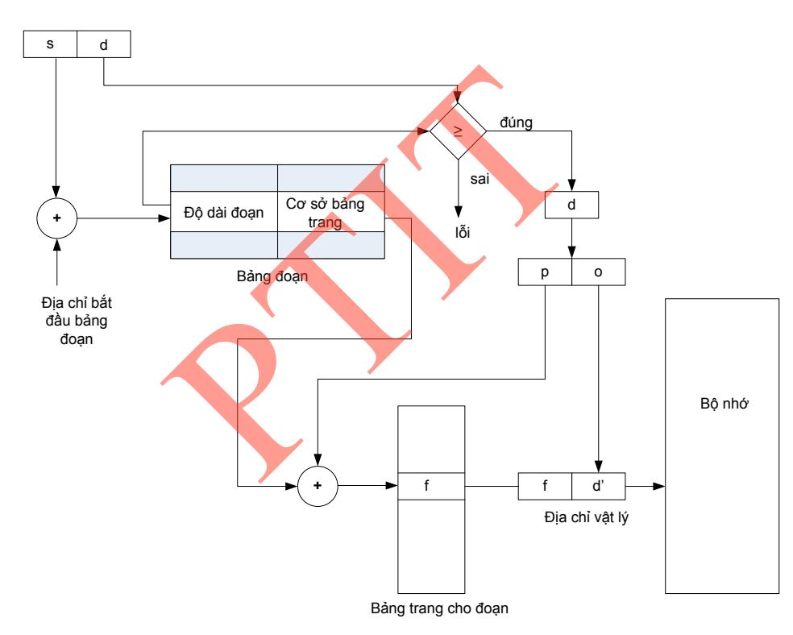

Hình 3.15. Ánh xạ địa chỉ kết hợp phân đoạn với phân trang

Để định vị ô nhớ trong phương pháp này, địa chỉ phải gồm ba phần (s,p,o). Phần thứ nhất s là số thứ tự đoạn. s cho phép xác định khoản mục ứng với đoạn trong bảng chia đoạn. Khoản mục chứa con trỏ tới bảng chia trang cho đoạn đó. Số thứ tự trang p cho phép xác định khung trang tương ứng. Độ dịch o sẽ được cộng vào địa chỉ khung để tính ra địa chỉ vật lý.

#### 3.6. BỘ NHỚ ẢO

#### **3.6.1. Khái niệm bộ nhớ ảo**

Qua các nội dung trình bày ở phần trên: phân trang, phân đoạn, trao đổi bộ nhớ-đĩa, có thể rút ra một số nhận xét như sau:

- Tiến trình có thể bị chia thành những phần nhỏ (trang hoặc đoạn) và được xếp nằm rải rác trong bộ nhớ. Các phần nhỏ này có thể bị trao đổi ra đĩa hoặc từ đĩa vào trong quá trình thực hiện.
- Các phép truy cập địa chỉ trong tiến trình đếu sử dụng địa chỉ lôgic, địa chỉ này sau đó được ánh xạ thành địa chỉ vật lý nhờ các cơ chế phần cứng. Việc ánh xạ được thực hiện trong thời gian thực hiện, với tiến trình cũng như người dùng không nhìn thấy và không cần biết đến việc ánh xạ này.

Phân tích việc thực hiện các tiến trình cũng cho thấy không phải tiến trình nào khi chạy cũng sử dụng tất cả các lệnh và dữ liệu của mình với tần suất như nhau. Ví dụ các đoạn lệnh xử lý lỗi có thể rất ít khi được gọi.

Các nhận xét này cho phép rút ra một kết luận rất quan trọng: không nhất thiết toàn bộ các trang hoặc đoạn của một tiến trình phải có mặt đồng thời trong bộ nhớ khi tiến trình chạy. Các trang hoặc đoạn có thể được trao đổi từ đĩa vào bộ nhớ khi có nhu cầu truy cập tới. Việc thực hiện các tiến trình chỉ nằm một phần trong bộ nhớ có một số ưu điểm sau:

- Số lượng tiến trình được chứa đồng thời trong bộ nhớ tăng lên do mỗi tiến trình chiếm ít chỗ hơn. Càng nhiều tiến trình trong bộ nhớ thì CPU càng được sử dụng triệt để hơn.
- Kích thước tiến trình có thể lớn hơn kích thước thực của bộ nhớ. Người lập trình có thể viết những chương trình lớn mà không cần quan tâm tới hạn chế của bộ nhớ thực. Điều này cho phép giải quyết một trong những vấn đề cơ bản của lập trình: giới hạn kích thước chương trình. Hệ điều hành sẽ tự phân chia chương trình, tải vào để thực hiện khi cần, người lập trình không cần quan tâm tới các vấn đề này. PTIT

Tới đây ta có thể đưa ra khái niệm bộ nhớ ảo. Trước hết, nhắc lại khái niệm bộ nhớ thực. Bộ nhớ thực là bộ nhớ vật lý của máy tính, lệnh và dữ liệu chỉ được xử lý khi nằm trong bộ nhớ thực. *Bộ nhớ ảo là bộ nhớ lôgic theo cách nhìn của người lập trình và tiến trình và không bị hạn chế bởi bộ nhớ thực*. Bộ nhớ ảo có thể lớn hơn bộ nhớ thực rất nhiều và bao gồm cả không gian trên đĩa.

Bộ nhớ ảo là một phương pháp tổ chức bộ nhớ quan trọng được sử dụng trong hầu hết các hệ điều hành hiện đại. Nó đơn giản hoá rất nhiều nhiệm vụ của người lập trình và cho phép sử dụng không gian nhớ lớn hơn không gian nhớ thực.

Bộ nhớ ảo thường được xây dựng dựa trên phương pháp phân trang trong đó các trang là đơn vị để nạp từ đĩa vào khi cần. Trong phương pháp kết hợp phân đoạn với phân trang, trang cũng được sử dụng như đơn vị để xây dựng bộ nhớ ảo. Phương pháp phân đoạn tương đối ít được sử dụng làm cơ sở cho bộ nhớ ảo do các thuật toán đổi đoạn phức tạp hơn đổi trang. Nguyên nhân chính của sự phức tạp là do kích thước đoạn không cố định. Trong các phần sau, tổ chức bộ nhớ ảo trên cơ sở phân đoạn không được đề cập tới.

*Nạp trang theo nhu cầu* (demand paging) dựa trên phân trang kết hợp trao đổi bộ nhớđĩa. Tiến trình được phân trang và chứa trên đĩa. Khi cần thực hiện tiến trình, ta nạp tiến trình vào bộ nhớ. Tuy nhiên, không phải toàn bộ các trang của tiến trình được nạp cùng một lúc. Chỉ những trang đang cần đến mới được nạp vào. Do đó có tên gọi nạp trang theo nhu cầu.

Tại một thời điểm, mỗi tiến trình sẽ gồm có tập hợp các trang đang ở trong bộ nhớ và những trang còn trên đĩa. Để nhận biết trang đã ở trong bộ nhớ hay ở ngoài, người ta thêm một bit (tạm gọi là bit P) vào khoản mục trong bảng phân trang. Giá trị của bit bằng 1(0) cho thấy trang tương ứng đã ở trong (ngoài) bộ nhớ hoặc ngược lại. Hình 3.13 minh họa một ví dụ tiến trình với các trang ở trong và ngoài bộ nhớ.

Khi tiến trình truy cập tới một trang, bit P của trang sẽ được kiểm tra. Nếu trang đã ở trong bộ nhớ, việc truy cập diễn ra bình thường. Ngược lại, nếu trang chưa được nạp vào, một sự kiện gọi là *thiếu trang* hay *lỗi trang* (page-fault) sẽ xẩy ra. Phần cứng làm nhiệm vụ ánh xạ địa chỉ trang sinh ra một ngắt và được chuyển cho hệ điều hành để xử lý. Thủ tục xử lý ngắt sinh ra do thiếu trang gồm các bước sau (hình 3.17):

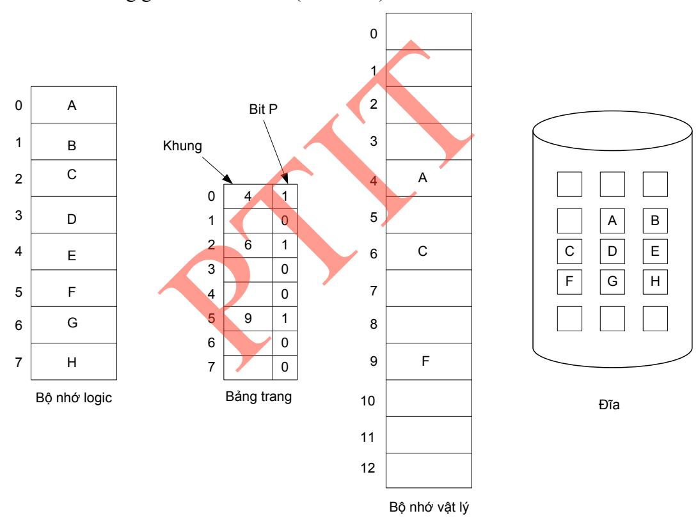

Hình 3.16. Phân trang bộ nhớ

- Hệ điều hành tìm một khung trống trong danh sách các khung trống.
- Trang tương ứng sẽ được đọc từ đĩa vào khung trang vừa tìm được.
- Sau khi trang được đọc vào, khoản mục tương ứng trong bảng phân trang sẽ được sửa đổi tương ứng với vị trí của trang trong bộ nhớ, trạng thái bit P thể hiện việc trang đã ở trong bộ nhớ.
- Lệnh của tiến trình đã gây ra ngắt được thực hiện lại. Lệnh này bây giờ có thể truy

cập trang vừa được nạp vào.

Sau khi ngắt được xử lý xong và trang được nạp, toàn bộ trạng thái tiến trình được khôi phục lại như ban đầu và ta có thể thực hiện tiếp tiến trình với một trang vừa được nạp. Tại thời điểm này, một số trang của tiến trình có thể vẫn nằm ngoài bộ nhớ. Nếu tiến trình truy cập các trang đó, sự kiện thiếu trang lại xẩy ra và quá trình xử lý như trên sẽ lặp lại.

Với sơ đồ xử lý thiếu trang như trên đây, ta có thể bắt đầu một tiến trình mà không nạp bất kỳ trang nào của tiến trình vào bộ nhớ. Khi con trỏ lệnh được hệ điều hành chuyển tới lệnh đầu tiên (chưa được tải vào bộ nhớ) của tiến trình để thực hiện, sự kiện thiếu trang sẽ sinh ra và trang tương ứng được nạp vào. Tiến trình sau đó thực hiện bình thường cho tới lần thiếu trang tiếp theo. Sơ đồ nạp trang như vậy là trường hợp riêng của nạp trang theo nhu cầu và được gọi là nạp trang hoàn toàn theo nhu cầu. Trong các sơ đồ khác, một số trang có thể được nạp sẵn và được giữ trong bộ nhớ để tránh xảy ra thiếu trang. Việc lựa chọn số trang để nạp sẵn được trình bày trong một phần sau.

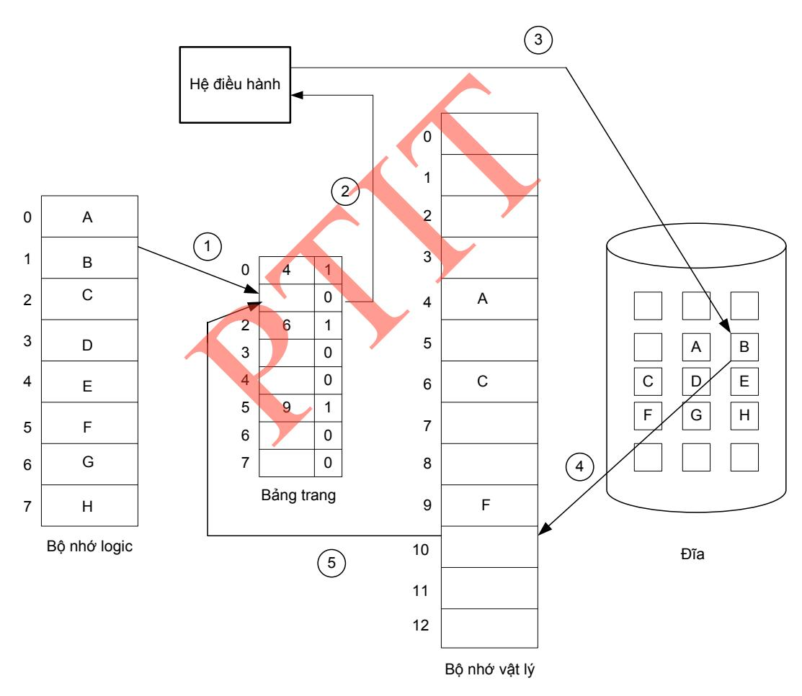

Hình 3.17. Các bước xử lý thiếu trang

Chiến lược nạp trang khác với nạp trang theo nhu cầu được gọi là nạp trang trước (prepage), trong đó các trang chưa cần đến cũng được nạp vào bộ nhớ. Chiến lược này dựa trên đặc điểm của đĩa hoặc băng từ trong đó các khối liên tiếp trên đĩa cùng thuộc một tiến trình được đọc đồng thời vào bộ nhớ để hạn chế thời gian di chuyển đầu từ đọc đĩa. Tuy nhiên, các nghiên cứu cho thấy, chiến lược nạp trang trước là không hiệu quả về nhiều mặt và do đó sẽ không được đề cập tới nữa.

Một vấn đề gắn với nạp trang theo nhu cầu là một lệnh có thể sinh ra các yêu cầu truy cập bộ nhớ khác nhau (để đọc lệnh và các toán hạng). Nếu các địa chỉ truy cập thuộc về những trang mới khác nhau thì lệnh đó sẽ gây ra nhiều sự kiện thiếu trang và do vậy làm giảm nghiêm trọng tốc độ thực hiện. Tuy nhiên trong thực tế, hiện tượng này ít xảy ra do tính cục bộ của lệnh và dữ liệu. Ta sẽ quay lại vấn đề này sau.

#### 3.7. ĐỔI TRANG

#### **3.7.1. Tại sao phải đổi trang**

Khi xẩy ra thiếu trang, hệ điều hành tìm một khung trống trong bộ nhớ, đọc trang thiếu vào khung và tiến trình sau đó hoạt động bình thường. Tuy nhiên, do kích thước của các tiến trình có thể lớn hơn kích thước bộ nhớ thực rất nhiều nên tới một lúc nào đó sẽ xảy ra tình trạng toàn bộ bộ nhớ đã được cấp phát, hệ điều hành không thể tìm được khung trống để tải trang mới vào.

Cách giải quyết đơn giản nhất trong trường hợp đó là hệ điều hành kết thúc tiến trình do không thoả mãn được nhu cầu bộ nhớ. Nhưng, như ta đã biết, mục đích của bộ nhớ ảo là cho phép các tiến trình sử dụng được không gian nhớ lớn hơn không gian nhớ thực và tăng tính đa chương trình của hệ thống. Tiến trình và người dùng cần được đáp ứng nhu cầu về bộ nhớ.

Cách giải quyết thứ hai là tạm trao đổi tiến trình ra đĩa, giải phóng toàn bộ không gian mà tiến trình chiếm trong bộ nhớ và chờ tới khi thuận lợi (nhiều bộ nhớ trống hơn) mới nạp lại tiến trình vào bộ nhớ để thực hiện tiếp. Cách giải quyết này là cần thiết trong một số trường hợp. PTIT

Cách giải quyết thứ ba được áp dụng trong đa số trường hợp. Đó là sử dụng kỹ thuật đổi trang.

## **Thao tác đổi trang**

Bản chất của việc đổi trang như sau. Nếu không có khung nào trống, hệ điều hành chọn một khung đã cấp phát nhưng hiện giờ không dùng tới và giải phóng khung trang này. Nội dung của khung được trao đổi ra đĩa, trang nhớ chứa trong khung sẽ được đánh dấu không còn nằm trong bộ nhớ (bằng cách thay đổi bit P tương ứng) trong bảng phân trang có chứa trang này. Khung đã được giải phóng được cấp phát cho trang mới cần nạp vào.

Cụ thể, quá trình đổi trang diễn ra qua một số bước sau:

Bước 1: Xác định trang cần nạp vào trên đĩa

Bước 2: Nếu có khung trống trống thì chuyển sang bước 4.

Bước 3:

- a) Lựa chọn một khung để giải phóng. Khung được lựa chọn theo một thuật toán hay chiến lược đổi trang nào đó.
- b) Ghi nội dung khung bị đổi ra đĩa (nếu cần); cập nhật bảng trang và bảng khung.

khung để thể hiện thay đổi này.

Bước 5: Thực hiện tiếp tiến trình từ điểm bị dừng trước khi đổi trang.

**Đổi trang có ghi và đổi trang không ghi.** Nếu nhu cầu đổi trang xuất hiện khi nạp trang mới, thời gian nạp trang sẽ tăng đáng kể do xuất hiện thêm nhu cầu ghi trang bị đổi ra đĩa. Để giảm thời gian này, các trang nhớ có nội dung không thay đổi từ lúc nạp vào được hệ điều hành nhận biết và không ghi ngược ra đĩa. Việc nhận biết được thực hiện bằng cách sử dụng một bit trong khoản mục của trang gọi là bit sửa đổi (ta sẽ ký hiệu là bit M). Mỗi khi có một byte hay từ của trang bị sửa đổi, bit này sẽ được xác lập bằng 1. Một trang nhớ có bit sửa đổi bằng 1 sẽ được ghi ra đĩa khi đổi trang.

**Các khung bị khoá**: Khi tìm các khung để giải phóng và đổi trang, hệ điều hành sẽ trừ ra một số khung. Các khung và trang chứa trong khung này được đánh dấu bị khoá và sẽ không bao giờ bị đổi ra đĩa. Đó thường là các khung chứa trang nhớ thuộc các tiến trình nhân của hệ điều hành hoặc chứa những cấu trúc thông tin điều khiển quan trọng. Những phần bộ nhớ này cần thiết cho việc hoạt động của hệ thống và do vậy cần thường xuyên được giữ trong bộ nhớ, không được đổi ra đĩa. Các khung bị khoá được nhận biết bởi một bit riêng chứa trong bảng khung.

#### **3.7.2. Các chiến lược đổi trang**

Một vấn đề quan trọng đối với hệ điều hành là chọn khung nào trong các khung không bị khoá để tiến hành đổi trang. Chiến lược lựa chọn thích hợp cho phép tối ưu một số tham số, trong đó quan trọng nhất là giảm tần suất đổi trang. Chiến lược đổi trang tốt là chiến lược cho phép giảm số lần đổi trang, trong khi có tốc độ nhanh và dễ triển khai. Các chiến lược đổi trang đã được đề xuất và khảo sát trong rất nhiều nghiên cứu về quản lý bộ nhớ. Trong phần này, một số chiến lược đổi trang sẽ được trình bày và phân tích. PTIT

Các chiến lược đổi trang được trình bày trong phần này bao gồm:

- Đổi trang tối ưu( OPT)
- Đổi trang theo nguyên tắc FIFO
- Trang ít được dùng nhất (LRU)
- Chiến lược đồng hồ (CLOCK)

#### **a. Đổi trang tối ưu (OPT)**

Với chiến lược này, hệ điều hành chọn trang nhớ sẽ không được dùng tới trong khoảng thời gian lâu nhất để trao đổi. Nói cách khác, trang bị đổi là trang có lần truy cập tiếp theo cách xa thời điểm hiện tại nhất. Chiến lược này cho phép giảm tối thiểu sự kiện thiếu trang và do đó là *tối ưu* theo tiêu chuẩn này. Tuy nhiên, để sử dụng chiến lược này, hệ điều hành cần đoán trước nhu cầu sử dụng các trang trong tương lai. Điều này rất khó thực hiện trên thực tế do thứ tự truy cập trang không cố định và không biết trước. Chiến lược đổi trang tối ưu, do đó, không thể áp dụng trong thực tế mà chỉ được dùng để so sánh với các chiến lược đổi trang khác.

Các chiến lược đổi trang được minh họa qua ví dụ sau. Giả sử tiến trình được cấp 3 khung, không gian nhớ logic của tiến trình gồm 5 trang và các trang của tiến trình được truy cập theo thứ tự sau: 2, 3, 2, 1, 5, 2, 4, 5, 3, 2, 5, 2.

Thứ tự đổi trang khi sử dụng phương pháp đổi trang tối ưu được minh họa trên hình sau, trong đó F ký hiệu cho tình huống thiếu trang gây ra đổi trang mới. Trước tiên, các khung nhớ đều trống. Việc truy cập các trang 2, 3, 1 sẽ tới việc nạp các trang này vào ba khung nhớ trống. Khi truy cập trang số 5 không còn khung nhớ trống và do vậy phải đổi trang. Trong số ba trang 2, 3, 1 đang ở trong bộ nhớ, trang số 1 sau đó không được sử dụng, tức là có thời điểm sử dụng trong tương lai xa hiện tại nhất nên bị đổi ra đĩa. Tiếp theo, khi truy cập trang số 4 sẽ gây đổi trang tiếp theo. Trong số ba trang 2, 3, 5 trang 2 có lần truy cập tiếp theo muộn hơn so với trang 3 và 5, do vậy bị đổi ra. Theo cách thực hiện như trên, ta có thứ tự truy cập và đổi các trang còn lại diễn ra như trên hình vẽ.

Đổi trang tối ưu đòi hỏi 3 lần đổi trang cho chuỗi truy cập trên.

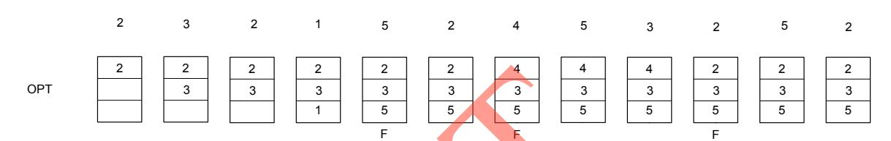

#### **b. Vào trước, ra trước (FIFO)**

Đây là chiến lược đơn giản nhất. Trang được đọc vào bộ nhớ trước sẽ bị đổi ra trước khi có yêu cầu đổi trang. Chiến lược này có thể triển khai một cách đơn giản bằng cách sử dụng hàng đợi FIFO. Khi trang được nạp vào bộ nhớ, số thứ tự trang được thêm vào cuối hàng đợi. Khi cần đổi trang, trang có số thứ tự ở đầu hàng đợi sẽ bị đổi. PTIT

Ngoài đặc điểm đơn giản, chiến lược FIFO dựa trên giả thiết sau: trang bị trao đổi là trang nằm trong bộ nhớ lâu nhất. Do nằm trong bộ nhớ lâu nhất nên có nhiều khả năng trang đó không còn cần tới nữa. Rõ ràng, lôgic này là không đúng trong nhiều trường hợp. Có những phần lệnh và dữ liệu của chương trình được dùng rất nhiều trong suốt quá trình tồn tại của tiến trình, chẳng hạn một số biến toàn cục được truy cập nhiều trong suốt vòng đời tiến trình. Vì vậy, chiến lược FIFO thường gây ra tần suất đổi trang lớn so với các chiến lược đổi trang khác.

Kết quả đổi trang sử dụng FIFO cho chuỗi truy cập ở ví dụ trên được minh họa trên hình sau. Khi truy cập trang số 5, trong bộ nhớ đang có các trang 2, 3, 1, trong đó trang số 2 được nạp vào bộ nhớ sớm nhất và do vậy bị đổi. Tiếp theo, khi truy cập trang số 2, trong ba trang 5, 3, 1, trang 3 được nạp vào sớm nhất và do vậy bị đổi ra để nhường chỗ cho trang số 2. Kết quả, với ví dụ đã cho, chiến lược đổi trang FIFO gây ra sáu lần đổi trang, nhiều hơn đáng kể so với đổi trang tối ưu ở trên.

2

      FIFO

3 2 1 5 2 4 5 3 2 5 2

#### **c. Đổi trang ít sử dụng nhất trong thời gian cuối LRU (Least Recently Used)**

Ở chiến lược đổi trang này, trang bị đổi là trang mà thời gian từ lần truy cập cuối cùng đến thời điểm hiện tại là lâu nhất. Nói cách khác, đó là trang ít được truy cập trong thời gian cuối nhất trong số các trang đang nằm trong bộ nhớ.

Chiến lược đổi trang LRU dựa trên nguyên tắc cục bộ về thời gian, theo đó trang đang được sử dụng sẽ được sử dụng tiếp. Ngược lại trang ít được sử dụng hiện tại sẽ ít khả năng được sử dụng tới trong tương lai gần và do vậy cần được đổi ra nhường chỗ cho trang mới.

Phương pháp này ngược với phương pháp đổi trang tối ưu. Với đổi trang tối ưu, tiêu chí để chọn trang là thời gian truy cập trang trong tương lai. Trong khi đó, ở đây, thời gian được sử dụng làm tiêu chí so sánh là khoảng thời gian không sử dụng trang trong quá khứ. Thực tế cho thấy, LRU cho kết quả tốt gần như phương pháp đổi trang tối ưu.

Với ví dụ chuỗi truy cập trang ở trên, LRU cho kết quả đổi trang như sau:

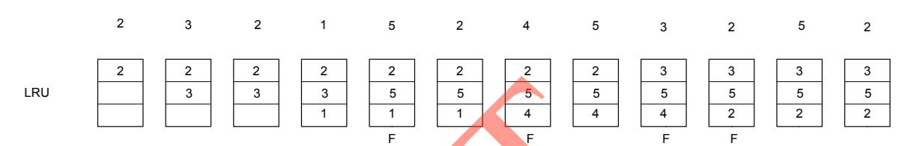

Khi đổi cần chọn trang để đổi khi truy cập trang số 5 lần đầu tiên, trong số ba trang 2, 3, 1, trang 1 vừa được truy cập xong, trước đó là trang 2, trước nữa mới là trang 3. Như vậy trang 3 là trang có lần truy cập cuối xa hiện tại nhất và do vậy bị đổi. Khi truy cập tới trang 4 lại cần đổi trang: trong số ba trang 2, 5, 1, trang 2 được truy cập ngay trước đó, trước nữa là trang 5 và xa nhất là trang 1, do vậy trang 1 bị đổi nhường chỗ cho trang 4. Kết quả, với ví dụ trên, phương pháp LRU gây ra bốn lần đổi trang, chỉ nhiều hơn một lần so với đổi trang tối ưu OPT. PTIT

Mặc dù có hiệu quả tốt do ít gây ra đổi trang, việc triển khai LRU tương đối khó khăn, chậm hơn hơn so với phương pháp FIFO và thường đòi hỏi sự hỗ trợ của phần cứng để đảm bảo về tốc độ. Khó khăn chính ở đây là làm sao xác định được trang có lần truy cập cuối diễn ra cách thời điểm hiện tại lâu nhất. Sau đây là hai cách giải quyết:

- Sử dụng biến đếm: mỗi khoản mục của bảng phân trang sẽ có thêm một trường chứa thời gian truy cập trang lần cuối. Đây không phải thời gian thực mà là thời gian lôgic do hệ thống xác định như sau. CPU có thêm một thanh ghi chứa một số đếm, số đếm này chính là thời gian lôgic. Chỉ số của số đếm tăng mỗi khi xảy ra truy cập bộ nhớ. Mỗi khi một trang nhớ được truy cập, nội dung của số đếm sẽ được ghi vàko trường thời gian truy cập trong khoản mục của trang đó, sau đó số đếm tăng lên một đơn vị. Như vậy trường này luôn chứa thời gian truy cập trang lần cuối. Trang bị đổi sẽ là trang có giá trị trường này nhỏ nhất. Như vậy mỗi khi có yêu cầu đổi trang, hệ điều hành sẽ tìm trong bảng phân trang để xác định trang có tuổi bé nhất. Cách triển khai này đòi hỏi có sự tham gia của phần cứng.
- Sử dụng hàng đợi đặc biệt: một hàng đợi được sử dụng để chứa số thứ tự trang. Khi trang được đọc vào bộ nhớ, số thứ tự trang được thêm vào cuối hàng đợi. Mỗi khi một trang nhớ

được truy cập, số thứ tự trang sẽ được chuyển về cuối hàng đợi. Như vậy cuối hàng đợi sẽ chứa trang được truy cập gần đây nhất, trong khi đầu hàng đợi chính là trang LRU, tức là trang cần trao đổi. Lưu ý, hàng đợi ở đây là hàng đợi đặc biệt trong đó các phần tử có thể lấy ra từ vị trí bất kỳ chứ không nhất thiết từ đầu, do vậy không giống với hàng đợi truyền thống. Mặc dù việc tìm kiếm và chuyển vị trí số trang trong hàng đợi đòi hỏi một số thời gian xong ta lại tránh được việc tìm kiếm trong bảng phân trang. Phương pháp này thích hợp cho việc thực hiện bằng phần mềm.

#### **d. Thuật toán đồng hồ**

Thuật toán đồng hồ (clock), còn gọi là thuật toán cơ hội thứ hai (second chance), là một cải tiến của thuật toán FIFO nhằm tránh thay thế những trang mặc dù đã được nạp vào lâu nhưng hiện vẫn có khả năng được sử dụng. Khi chọn trang, thuật toán đồng hồ dựa trên hai thông tin. Thứ nhất, đó là thứ tự nạp trang vào bộ nhớ. Thứ hai, thông tin về việc gần đây trang có được truy cập hay không.

Thuật toán đồng hồ được thực hiện như sau. Mỗi trang được gắn thêm một bit gọi là bit sử dụng, ký hiệu là U, chứa trong bảng phân trang. Mỗi khi trang được truy cập để đọc hoặc ghi, bit U của trang đó được đặt giá trị bằng 1. Như vậy, ngay khi trang được đọc vào bộ nhớ, bit U của trang đã được đặt bằng 1.

Các khung có thể bị đổi, hay trang tương ứng, được liên kết vào một danh sách vòng, tức là danh sách có đầu và cuối trùng nhau. Danh sách này có một con trỏ có thể chuyển động theo một chiều nhất định để trỏ lần lượt vào các trang trong danh sách. Khi một trang nào đó bị đổi, con trỏ được dịch chuyển để trỏ vào trang tiếp theo trong danh sách. Danh sách có thể thể hiện tương tự như một mặt đồng hồ với các khung/trang là con số và và con trỏ là kim đồng hồ chuyển động theo một chiều nhất định (hình 3.18). PTIT

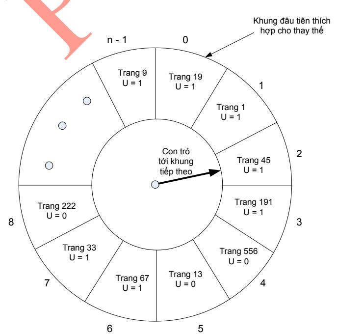

Hình 3.18 .Thuật toán đồng hồ

Khi có nhu cầu đổi trang, hệ điều hành kiểm tra trang đang bị trỏ tới. Nếu bit U của trang bằng 0, trang sẽ bị đổi ngay. Ngược lại, nếu bit U bằng 1, hệ điều hành sẽ đặt bit U bằng 0, chuyển sang trang tiếp theo trong danh sách và lặp lại thủ tục trên.

Với cách thực hiện như trên, nếu tại thời điểm đổi trang bit U của tất cả trang trong danh sách bằng 1 thì con trỏ sẽ quay đúng một vòng, đặt bit U của tất cả trang bằng 0, sau đó trang hiện thời đang bị trỏ tới sẽ bị đổi.

Minh họa cho hoạt động của thuật toán đồng hồ: với ví dụ chuỗi truy cập trang nhớ được cho ở trên, ta có kết quả đổi trang như thể hiện trên hình dưới. Trên hình vẽ, vị trí con trỏ được thể hiện bằng mũi tên trỏ vào trang tương ứng. Dấu sao '\*' bên cạnh số thứ tự trang tương ứng với giá trị bit U = 1, các trang với U = 0 không có dấu '\*'. Khi nạp các trang đầu tiên, sau mỗi lần nạp trang con trỏ được chuyển sang trang tiếp theo trong danh sách vòng. Khi truy cập trang 5 lần đầu và cần tìm trang để đổi, con trỏ đang ở vị trí trang số 2 và cả ba trang 2, 3, 1 đều có U = 1, do vậy con trỏ sẽ di chuyển đúng một vòng, xóa các bit U về 0, quay lại vị trí cũ và do vậy trang số 2 bị đổi. Sau đó, con trỏ di chuyển sang trang tiếp theo là trang số 3. Tiếp theo, khi truy cập trang số 2, trang đang bị trỏ vào là trang số 3 có U = 0 do vậy trang này bị đổi ra ngoài. Quá trình này được tiếp tục. Một điểm cần lưu ý là khi truy cập trang số 2 ở trạng thái thứ 10 (trạng thái thứ 3 tính từ cuối lên), do trang số 2 đã có trong bộ nhớ, thuật toán không tiến hành đổi trang nhưng đặt bit U của trang 2 thành U = 1, nhờ vậy mà trang số 2 không bị đổi trong lần đổi trang tiếp theo. Trên ví dụ đang sử dụng, thuật toán đồng hồ gây ra 5 lần đổi trang, tốt hơn so với FIFO mặc dù vẫn nhiều hơn so với LRU. PTIT

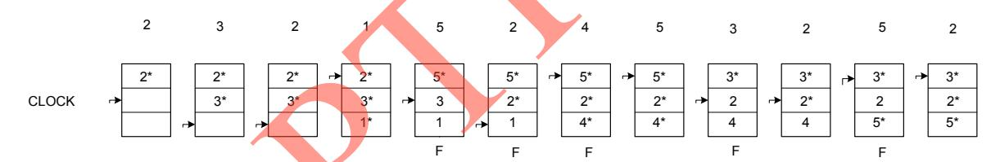

So với FIFO, thuật toán đồng hồ căn cứ trên hai thông tin để đưa ra quyết định đổi trang. Thông tin thứ nhất là thời gian trang được tải vào, thể hiện qua vị trí trang trong danh sách tương tự như FIFO. Thông tin thứ hai là việc gần đây trang có được sử dụng không, thể hiện qua nội dung bit U. Việc kiểm tra thêm bit U tương tự việc cho trang thêm khả năng được giữ trong bộ nhớ và vì vậy thuật toán có tên gọi khác là "cơ hội thứ hai".

#### **e. Thuật toán đồng hồ cải tiến**

Một số biến thể của thuật toán đồng hồ có thể sử dụng để tận dụng thêm thông tin phụ giúp cho việc đổi trang được tốt hơn. Chẳng hạn, ngoài bit U, thuật toán đồng hồ có thể sử dụng thêm thông tin về việc nội dung trang có bị thay đổi không. Trong một phần trước, ta đã biết rằng nếu nội dung trang bị thay đổi sau khi nạp vào thì khi đổi trang sẽ mất thời gian hơn do phải ghi nội dung trang ra đĩa. Để đánh dấu những trang có nội dung thay đổi, hệ thống sử dụng bit M, với M được đặt bằng 1 mỗi khi ghi vào trang.

Kết hợp bit U và bit M, ta có bốn khả năng sau:

- U=0, M=0: cho thấy trang gần đây không được truy cập và nội dung cũng không bị thay đổi, rất thích hợp để bị đổi ra ngoài.

- U=0, M=1: trang có nội dung thay đổi nhưng gần đây không được truy cập, cũng là ứng viên để đổi ra ngoài mặc dù đòi hỏi thời gian ghi ra đĩa so với trường hợp trên.
- U=1, M=0: trang mới được truy cập gần đây và do vậy theo nguyên lý cục bộ về thời gian có thể sắp được truy cập tiếp.
- U=1, M=1: trang có nội dung bị thay đổi và mới được truy cập gần đây, chưa thật thích hợp để đổi.

Có thể nhận thấy, đi từ trên xuống dưới, những trường hợp phía trên nên đổi trước trường hợp phía dưới.

Để đổi trang theo thứ tự liệt kê ở trên, thuật toán đồng hồ cải tiến thực hiện các bước sau:

*Bước 1*: Bắt đầu từ vị trí hiện tại của con trỏ, kiểm tra các trang. Trang đầu tiên có U=0 và M=0 sẽ bị đổi. Ở bước này, thuật toán chỉ kiểm tra mà không thay đổi nội dung bit U, bit M.

*Bước 2*: Nếu quay hết một vòng mà không tìm được trang có U=0 và M=0 thì quét lại danh sách lần hai. Trang đầu tiên có U=0 và M=1 sẽ bị đổi. Trong quá trình quét lại, thuật toán đặt bit U của trang đã quét đến nhưng được bỏ qua bằng 0.

Nếu hai bước trên không cho kết quả thì thực hiện lại bước 1. Nếu vẫn chưa có kết quả thì thực hiện lại bước 2.

Dễ dàng kiểm tra, việc thực hiện thuật toán cho phép tìm ra trang để đổi theo thứ tự ưu tiên liệt kê ở trên.

#### **3.7.3. Sử dụng đệm trang**

Một kỹ thuật thường được sử dụng kết hợp với thuật toán đổi trang nói trên là sử dụng *đệm trang* (page-buffering). Hệ điều hành dành ra một số khung trống được kết nối thành danh sách liên kết gọi là các trang đệm. Khi có yêu cầu đổi trang, một trang bị đổi như bình thường nhưng nội dung trang này không bị xóa ngay khỏi bộ nhớ để nhường cho trang mới. Thay vào đó, khung chứa trang được đánh dấu là khung trống và thêm vào cuối danh sách trang đệm. Thay vì nạp vào khung chứa trang vừa bị đổi, trang mới sẽ được nạp vào khung đứng đầu trong danh sách trang đệm. Tới thời điểm thích hợp, hệ thống sẽ ghi nội dung các trang trong danh sách đệm ra đĩa. PTIT

Kỹ thuật đệm trang cho phép cải tiến tốc độ do một số lý do sau:

Thứ nhất, nếu trang bị đổi có nội dung cần ghi ra đĩa, hệ điều hành vẫn có nạp trang mới vào ngay, việc ghi ra đĩa sẽ được lùi lại tới một thời điểm muộn hơn. Thao tác ghi ra đĩa có thể thực hiện đồng thời với nhiều trang nằm trong danh sách được đánh dấu trống. Việc ghi nhiều trang đồng thời như vậy thường tiết kiệm thời gian hơn do thao tác ghi đĩa được tiến hành theo khối lớn.

Thứ hai, trang bị đổi vẫn được giữ trong bộ nhớ một thời gian. Trong thời gian này, nếu có yêu cầu truy cập, trang sẽ được lấy ra từ danh sách đệm và sử dụng ngay mà không cần nạp lại từ đĩa. Vùng đệm khi đó đóng vai trò giống như bộ nhớ cache.

#### 3.8. CẤP PHÁT KHUNG TRANG

#### **3.8.1. Giới hạn số lượng khung**

Với bộ nhớ ảo, tiến trình không nhất thiết phải nằm hoàn toàn trong bộ nhớ máy tính. Một số trang của tiến trình được cấp phát khung nhớ trong khi những trang khác tạm nằm trên đĩa. Vấn đề đặt ra với hệ điều hành là cấp phát bao nhiêu khung cho mỗi tiến trình. Số khung cấp cho mỗi tiến trình càng nhỏ thì càng chứa được nhiều tiến trình trong bộ nhớ tại mỗi thời điểm. Tuy nhiên, khi lựa chọn số lượng khung tối đa cho mỗi tiến trình, cần chú ý hai nhận xét sau:

- Khi số lượng khung cấp tối đa cấp cho mỗi tiến trình giảm xuống tới một mức nào đó, lỗi thiếu trang sẽ diễn ra thường xuyên. Chẳng hạn, khi việc thực hiện một lệnh yêu cầu truy cập tới nhiều trang hơn số khung được cấp thì việc thiếu trang sẽ lặp đi lặp lại do không bao giờ các trang nhớ yêu cầu có mặt đồng thời trong bộ nhớ.
- Việc cấp thêm khung cho tiến trình sẽ làm giảm tần suất thiếu trang. Tuy nhiên, khi số lượng khung cấp cho tiến trình tăng lên đến một mức nào đó, thì việc tăng thêm khung cho tiến trình không làm giảm đáng kể tần suất thiếu trang nữa. Lý do chủ yếu là do số lượng khung đã trở nên bão hòa (xấp xỉ yêu cầu bộ nhớ tối đa của tiến trình), hoặc do nguyên tắc cục bộ, theo đó, tại mỗi thời điểm, những trang nhớ cần truy cập đồng thời đã được tải đủ vào số khung được cấp phát. PTIT

Từ nhận xét thứ nhất, hệ điều hành thường được đặt một giới hạn tối thiểu các khung cấp phát cho mỗi tiến trình. Mỗi tiến trình sẽ được cấp phát số lượng khung không nhỏ hơn giới hạn này. Giới hạn tối thiểu được xác định dựa trên kiến trúc phần cứng máy tính. Những yếu tố cơ bản để xác định giới hạn là số toán hạng trong một lệnh máy và kích thước trang nhớ.

Trên cơ sở nhận xét thứ hai, có hai phương pháp thường được hệ điều hành sử dụng để quyết định số lượng khung tối đa cấp phát cho mỗi tiến trình: phương pháp cấp phát *số lượng khung cố định* và cấp phát *số lượng khung thay đổi*.

## **a) Cấp phát số lượng khung cố định**.

Theo cách cấp phát này, hệ điều hành cấp cho tiến trình một số lượng cố định khung để chứa trang nhớ của mình. Số lượng này được xác định vào thời điểm tạo mới tiến trình và không thay đổi trong quá trình tiến trình tồn tại. Đến đây lại có hai cách tính số lượng khung tối đa.

**Cấp phát bằng nhau**. Theo cách này, mỗi tiến trình được cập một số lượng khung tối đa giống nhau, không phụ thuộc vào đặc điểm riêng của tiến trình. Số lượng khung tối đa khi đó được xác định dựa trên kích thước bộ nhớ và mức độ đa chương trình mong muốn.

**Cấp phát không bằng nhau**. Số lượng khung tối đa cấp cho tiến trình có thể khác nhau và được tính toán dựa trên đặc điểm tiến trình như kích thước không gian nhớ lô gic, dạng tiến trình (tiến trình nền, tiến trình tương tác trực tiếp v.v.). Cách đơn giản nhất là cấp cho mỗi tiến trình số lượng khung tỷ lệ thuận với kích thước tiến trình. Trong những hệ thống có quy định mức ưu tiên cho tiến trình, tiến trình với mức ưu tiên cao hơn có thể được cấp nhiều khung hơn tiến trình với mức ưu tiên thấp.

# **b) Cấp phát số lượng khung thay đổi**

Theo phương pháp này, số lượng khung tối đa cấp cho mỗi tiến trình có thể thay đổi trong quá trình thực hiện. Việc thay đổi số khung tối đa phụ thuộc vào tình hình thực hiện của tiến trình. Tiến trình có tần suất đổi trang cao sẽ được cấp thêm khung nhớ, trong khi đó tiến trình có tần suất đổi trang thấp có thể bị thu hồi bớt khung.

Phương pháp cấp phát số lượng khung thay đổi cho phép sử dụng bộ nhớ hiệu quả hơn phương pháp cố định. Tuy nhiên, để thay đổi số lượng khung tối đa một cách hợp lý, hệ điều hành cần theo dõi và xử lý thông tin về tình hình sử dụng bộ nhớ của tiến trình.

Phương pháp cấp phát số lượng khung thay đổi có liên quan chắt chẽ với phạm vi cấp phát khung được trình bày ngay sau đây.

# **3.8.2. Phạm vi cấp phát khung**

Phạm vi cấp phát là vấn đề quan trọng khác khi cấp khung cho tiến trình. Phạm vi cấp phát được phân thành *cấp phát toàn cục* (global) và *cấp phát cục bộ* (local).

Chiến lược cấp phát toàn cục cho phép tiến trình đổi trang mới vào bất cứ khung nào (không bị khóa), kể cả khung đã được cấp phát cho tiến trình khác. Ngược lại, với phương pháp cấp phát cục bộ, trang chỉ được đổi vào khung đang được cấp cho tiến trình.

Phạm vi cấp phát có quan hệ mật thiết với số lượng khung tối đa trình bày ở trên. Cụ thể là, số lượng khung cố định tương ứng với phạm vi cấp phát cục bộ. Khi đạt tới số lượng khung tối đa cho phép, nếu muốn nạp trang mới vào, tiến trình phải giải phóng một khung đang sử dụng để đảm bảo không tăng số lượng khung, tức là tiến trình phải đổi trang với một trang của mình. PTIT

Trong khi đó, với số lượng khung tối đa thay đổi, tiến trình có thể đổi trang vào một khung không phải của mình, qua đó tăng số lượng khung được sở hữu. Việc đổi trang mới vào khung của tiến trình khác cũng đồng thời làm giảm số lượng khung của tiến trình kia.

## 3.9. TÌNH TRẠNG TRÌ TRỆ

Khi số khung cấp cho tiến trình giảm xuống một mức nào đó, tiến trình sẽ rơi vào tình trạng thiếu bộ nhớ và phải đổi trang liên tục. Để nạp một trang mới vào, tiến trình phải đổi một trang. Do các trang đều đang cần dùng tới nên trang vừa bị đổi ra sẽ lập tức gây thiếu trang và quá trình này sẽ tiếp diễn.

Tình trạng đổi trang liên tục do không đủ bộ nhớ được gọi là *trì trệ* (thrashing). Một tiến trình rơi vào tình trạng trì trệ khi thời gian đổi trang của tiến trình lớn hơn thời gian thực hiện. Dấu hiệu dễ nhận thấy của tình trạng này là hoạt động liên tục của đĩa cứng trong khi tiến trình không có tiến triển.

Tình trạng trì trệ bộ nhớ ảnh hưởng nghiêm trọng tới tốc độ máy tính và do vậy cần có biện pháp giải quyết.

Tình trạng trì trệ xảy ra khi bộ nhớ máy tính có kích thước hạn chế, tiến trình đòi hỏi truy cập đồng thời nhiều trang nhớ và hệ thống có mức độ đa chương trình cao, tức là nhiều tiến trình cùng thực hiện một lúc. Trên thực tế, tình trạng này có thể xảy ra cả khi mức độ đa chương trình thấp, chẳng hạn khi khi tiến trình làm việc với dữ liệu kích thước lớn (ảnh, file dữ liệu) và thuật toán đòi hỏi truy cập những phần khác nhau của dữ liệu cùng một lúc.

#### **3.9.1. Kiểm soát tần suất thiếu trang**

Khi tiến trình rơi vào tình trạng trì trệ, tần suất thiếu trang của tiến trình sẽ tăng lên đáng kể. Đây là thông tin quan trọng được sử dụng để phát hiện và giải quyết vấn đề trì trệ.

Cụ thể, hệ thống theo dõi và ghi lại tần suất thiếu trang. Tần suất thiếu trang tăng lên là dấu hiệu cho thấy tiến trình được cấp không đủ khung, trong khi tần suất thiếu trang thấp cho thấy tiến trình được cấp đủ hoặc thậm chí thừa khung. Hệ điều hành có thể đặt ra giới hạn trên và giới hạn dưới cho tần suất thiếu trang của tiến trình. Khi tần suất vượt giới hạn trên, hệ thống cấp cho tiến trình thêm khung mới. Ngược lại, khi tần suất thiếu trang thấp hơn giới hạn dưới, hệ thống thu hồi một số khung của tiến trình.

Trong trường hợp tần suất vượt giới hạn trên và hệ thống không thể tìm khung để cấp thêm, tiến trình sẽ bị treo (suspend) hoặc bị kết thúc. Giải pháp này một mặt tránh cho tiến trình không rời vào trì trệ, đồng thời cho phép giải phóng một số khung để cấp cho tiến trình khác. PTIT

## 3.10. QUẢN LÝ BỘ NHỚ TRONG INTEL PENTIUM

Vi xử lý Pentium của Intel hỗ trợ cơ chế quản lý bộ nhớ, trong đó phân đoạn được kết hợp với phân trang. Không gian nhớ của tiến trình bao gồm nhiều đoạn, mỗi đoạn có thể có kích thước khác nhau và được phân trang trước khi đặt vào bộ nhớ. Như đã phân tích ở trên, việc kết hợp cho phép kết hợp ưu điểm của hai phương pháp quản lý bộ nhớ vật lý.

**Ánh xạ địa chỉ**. Địa chỉ lô gic được ánh xạ thành địa chỉ vật lý qua hai giai đoạn (hình 3.16). Giai đoạn thứ nhất do khối phân đoạn chịu trách nhiệm, địa chỉ lô gic được dịch thành địa chỉ tuyến tính (linear address). Giai đoạn hai do khối phân trang chịu trách nhiệm, địa chỉ tuyến tính được biến đổi thành địa chỉ vật lý.

#### **Phân đoạn**

Vi xử lý Pentium cho phép tiến trình có tối đa 16KB (hơn 16000) đoạn, mỗi đoạn có kích thước tối đa 4GB. Đây là số lượng lớn hơn rất nhiều so với khả năng thực của bộ nhớ máy tính hiện nay.

Địa chỉ lô gic Khối phân đoạn Địa chỉ tuyến tính Khối phân trang Địa chỉ vật lý

#### Hình 3.19: Ánh xạ địa chỉ trong Intel Pentium

Không gian nhớ lô gic được chia thành hai phần. Phần thứ nhất dành riêng cho tiến trình, bao gồm tối đa 8KB đoạn. Phần thứ hai được dùng chung cho tất cả tiến trình, bao gồm cả hệ điều hành, và cũng gồm tối đa 8KB đoạn. Thông tin quản lý tiến trình thuộc phần thứ nhất và phần thứ hai được chứa lần lượt trong hai bảng gọi là *bảng mô tả cục bộ* (local descriptor table – LDT) và *bảng mô tả toàn thể* (global descriptor table – GDT). Mỗi ô trong các bảng này có kích thước 8 byte và chứa thông tin về đoạn tương ứng, bao gồm cả địa chỉ cơ sở và giới hạn (độ dài) đoạn.

Để tăng tốc ánh xạ địa chỉ, Pentium có 6 thanh ghi đoạn, cho phép tiến trình truy cập đồng thời 6 đoạn. Ngoài ra thông tin về đoạn được chứa trong 6 thanh ghi kích thước 8 byte để tránh việc đọc các ô của LDT và GDT mỗi khi truy cập bộ nhớ.

Địa chỉ lô gic bao gồm hai phần (selector, offset), phần thứ nhất cho phép chọn ô tương ứng từ hai bảng mô tả LDT, GDT, phần thứ hai là độ dịch trong đoạn kích thước 32bit.

Phần selector độ dài 16 bit có cấu trúc như sau:

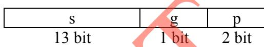

Trong đó: s là số thứ tự đoạn, g cho biết đoạn thuộc GDT (g=0) hay LDT(g=1), p cho biết chế độ bảo vệ (p=0 là chế độ nhân, p=3 là chế độ người dùng).

Địa chỉ tuyến tính được tạo ra như sau: trước hết phần selector được sử dụng để tìm ô tương ứng trong GDT, LDT chứa mô tả đoạn (descriptor) (hình 3.20 a); phần mô tả đoạn sau đó được kết hợp với độ dịch trong đoạn để tạo ra địa chỉ tuyến tính theo cơ chế mô tả trên hình 3.20 b. PTIT

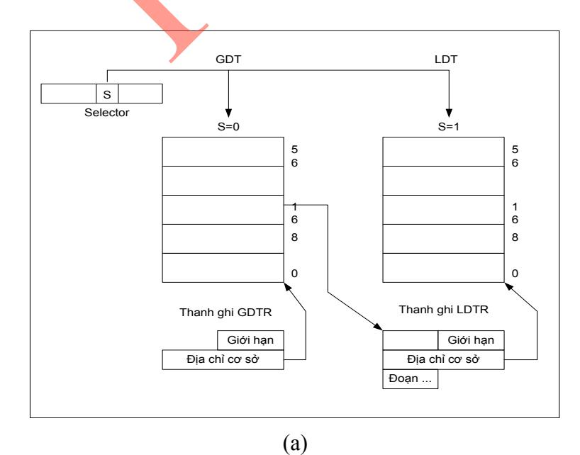

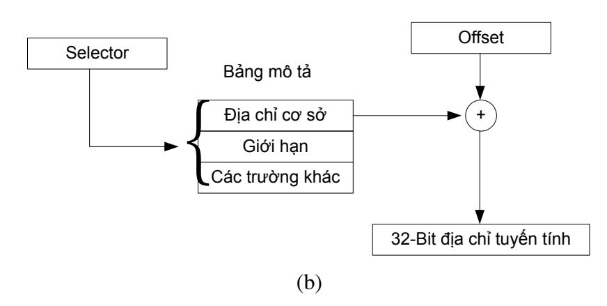

Hình 3.20: Biến đổi địa chỉ lô gic thành địa chỉ tuyến tính

#### **Phân trang**

Vi xử lý Pentium hỗ trợ bảng kích thước trang bằng 4KB hoặc 4MB, tùy thuộc giá trị cờ kích thước trang (Page Size flag). Trong trường hợp kích thước trang bằng 4KB, bảng trang được tổ chức thành hai mức, bảng trang mức một và mức hai đều có kích thước 4KB. Địa chỉ tuyến tính kích thước 32 bit có cấu trúc như sau:

Phần p1 cho phép tìm bảng trang mức hai (trong Pentium được gọi là *page directory*), phần p2 cho phép tìm ô tương ứng trong bảng trang mức hai để kết hợp với độ dịch o tạo ra địa chỉ vật lý. Cơ chế biến đổi từ địa chỉ tuyến tính thành địa chỉ vật lý được thể hiện trên hình 3.21.

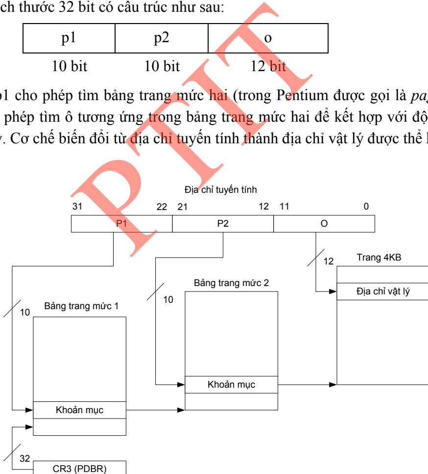

Hình 3.21: Cơ chế ánh xạ địa chỉ tuyến tính thành địa chỉ vật lý của Pentium

Trong trường hợp trang nhớ kích thước trang bằng 4MB, bảng trang chỉ có một mức với phần p kích thước 10bit và phần độ dịch o kích thước 22 bit cho phép trỏ tới vị trí cụ thể trong trang nhớ 4MB.

Toàn bộ cơ chế ánh xạ từ địa chỉ lô gic sang địa chỉ vật lý được thể hiện chi tiết trên hình 3.22.

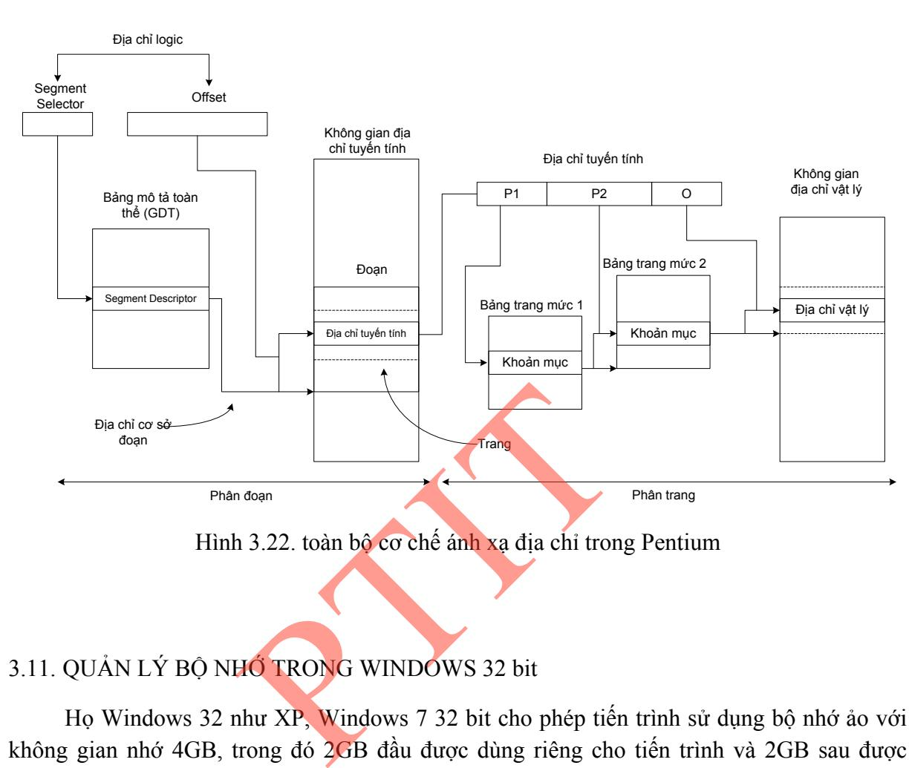

Hình 3.22. toàn bộ cơ chế ánh xạ địa chỉ trong Pentium

## 3.11. QUẢN LÝ BỘ NHỚ TRONG WINDOWS 32 bit

Họ Windows 32 như XP, Windows 7 32 bit cho phép tiến trình sử dụng bộ nhớ ảo với không gian nhớ 4GB, trong đó 2GB đầu được dùng riêng cho tiến trình và 2GB sau được dùng chung cho hệ thống.

Bộ nhớ ảo được thực hiện bằng kỹ thuật nạp trang theo nhu cầu và đổi trang. Kích thước trang nhớ bằng 4KB và bảng trang được tổ chức thành hai mức để sử dụng triệt để sự hỗ trợ của vi xử lý Intel x86. Cách tổ chức bảng trang và ánh xạ địa chỉ hoàn toàn giống như mô tả trong phần phân trang của Pentium ở phần trên.

Để tăng hiệu quả nạp trang, Windows XP sử dụng kỹ thuật nạp trang theo cụm. Khi xảy ra thiếu trang, thay vì chỉ nạp trang bị thiếu, hệ điều hành nạp cả cụm, bao gồm một số trang nằm sau trang bị thiếu.

Hệ điều hành kiểm soát số lượng trang mà tiến trình có trong bộ nhớ bằng cách gán cho mỗi tiến trình *số lượng trang tối đa* và *tối thiểu*. Tiến trình được đảm bảo có số lượng khung không nhỏ hơn số lượng tối thiểu nhưng không được lớn hơn số lượng tối đa. Số lượng khung tối đa và tối thiểu đối với tiến trình ứng dụng thường được đặt tương ứng là 345 và 50.

Trong quá trình thực hiện, số lượng trang tối đa và tối thiểu cấp cho tiến trình được thay đổi tùy vào tình trạng bộ nhớ trống. Hệ điều hành lưu danh sách khung trống, đồng thời sử dụng một ngưỡng an toàn. Khi số khung trống ít hơn ngưỡng này, hệ điều hành xem xét các tiến trình đang thực hiện. Tiến trình có số trang lớn hơn số lượng tối thiểu sẽ bị giảm số trang cho tới khi đạt tới số lượng tối thiểu của mình.

Tùy vào vi xử lý, Windows XP sử dụng thuật toán đổi trang khác nhau. Khi thực hiện trên hệ thống Intel x86 với một CPU, Windows XP sử dụng thuật toán đồng hồ để chọn trang bị đổi. Trong trường hợp khác, hệ điều hành sử dụng thuật toán FIFO.

#### 3.12. CÂU HỎI VÀ BÀI TẬP CHƯƠNG

- 1. Hãy nêu điểm khác nhau giữa địa chỉ logic và địa chỉ vật lý. Địa chỉ do CPU sinh ra là địa chỉ logic hay vật lý ?
- 2. Lợi ích của việc chọn kích thước trang nhớ bằng lũy thừa của 2 là gì?
- 3. Giả sử không gian nhớ logic của tiến trình gồm 512 trang, mỗi trang có kích thước 1024 B. Bộ nhớ vật lý gồm 64 khung. Hãy cho biết địa chỉ logic dài bao nhiêu bit, trong đó phần số thứ tự trang và phần độ dịch trong trang có độ dài lần lượt là bao nhiêu bit. Hãy cho biết địa chỉ vật lý dài bao nhiêu bit.
- 4. Một đoạn có thể thuộc về hai tiến trình được không ? Nếu được thì thông tin gì là chung trong cơ chế ánh xạ địa chỉ của hai tiến trình có chung một đoạn ?
- 5. Cho hai đoạn chương trình sau char a[128][128];//kiểu char có kích thước 1B Đoạn 1: for( i = 0; i < 128; i++) for( j = 0; j < 128; j++) a[i][j] = 0; Đoạn 2: for(i = 0; i < 128; i++) for(j = 0; j < 128; j++) PTIT

a[j][i] = 0;

Tiến trình chỉ được cấp 127 khung, mỗi khung có kích thước 128B. Câu hỏi: đoạn chương trình nào gây đổi trang nhiều hơn? Giải thích tại sao? Gợi ý: để trả lời được câu này cần hiểu về cách cấp phát bộ nhớ cho mảng hai chiều và vị trí các phần tử của mảng trong bộ nhớ.

- 6. Cho hệ thống phân trang, kích thước trang = 1024B. Bảng phân trang hiện thời như sau:

| 3 | 0 |
|---|---|
| 2 | 4 |
| 0 | 1 |

Hãy tính địa chỉ vật lý cho các địa chỉ lô gic sau:

- a. 1020
- b. 2060

- 7. Tiến trình được cấp 4 khung. Các trang nhớ của tiến trình được truy cập theo thứ tự sau: 0 1 3 2 4 6 1 7 3 6 1 5 6 1.

Hãy xác định quá trình nạp và đổi trang khi sử dụng các chiến lược đổi trang OPT, FIFO, LRU, CLOCK.

PTIT

## **CHƯƠNG 4: HỆ THỐNG FILE**

Trong các thành phần của hệ điều hành, hệ thống file (file system) là phần mà người dùng thường xuyên tiếp xúc và làm việc một cách trực quan nhất. Tất cả các thao tác chạy chương trình, lưu trữ thông tin ra đĩa, đọc thông tin từ đĩa vào, sao chép, dịch chuyển thông tin đều liên quan đến hệ thống file. Để tổ chức lưu trữ thông tin trên bộ nhớ ngoài, hệ điều hành có thể sử dụng đồng thời một hoặc nhiều hệ thống file khác nhau trong cùng một hệ thống máy tính.

Hệ thống file gồm có các file, các thư mục và cấu trúc dữ liệu đặc thù cho hệ thống file đó, cũng như phần mềm (mô đun của hệ điệu hành) quản lý các file và cấu trúc dữ liệu đó.

Có thể nhìn hệ thống file theo hai cách. Từ phía người dùng, hệ thống file bao gồm tập hợp các file chứa dữ liệu hoặc chương trình và hệ thống thư mục cho phép tổ chức và lưu trữ thông tin về các file đó. Người dùng chỉ quan tâm tới các vấn đề như: cấu trúc thư mục ra sao, giớí hạn kích thước file là bao nhiêu, quy tắc đặt tên file thế nào, có thể thực hiện các thao tác gì với file v.v. Đây chính là biểu hiện bên ngoài của hệ thống file. Trong khi đó, từ phía hệ điều hành, với vai trò quản lý file và thư mục, các vấn đề được quan tâm là phương pháp ánh xạ file lên các đĩa, tổ chức bên trong của file và thư mục, cấu trúc dữ liệu dùng cho biểu diễn file. Nói cách khác, đối với hệ điều hành, hệ thống file được nhìn từ bên trong.

Trong chương này, hệ thống file sẽ được trình bầy lần lượt theo hai cách nhìn nói trên. Trước hết, các vấn đề liên quan đến file và thư mục theo cách nhìn của người dùng sẽ được xem xét. Sau đó, chúng ta sẽ xem xét các phương pháp tổ chức bên trong hệ thống file: cách ánh xạ file lên các đĩa, tổ chức dữ liệu bên cho thư mục. Cuối cùng, các vấn đề liên quan tới độ tin cậy và bảo mật cho hệ thống file sẽ được đề cập. PTIT

Bên cạnh cái khái niệm về hệ thống file, trong chương cũng đề cập tới các khái niệm về vào/ra trong hệ thống máy tính và phân hệ quản lý vào/ra của hệ điều hành. Phần lớn các nội dung về vào/ra được tập trung cho vào/ra với đĩa cứng, nơi lưu trữ chủ yếu của hệ thống file.

#### 4.1. KHÁI NIỆM FILE

#### **4.1.1. File là gì ?**

Bộ nhớ ngoài bao gồm các thiết bị khác nhau như đĩa từ, băng từ, đĩa quang, đĩa quang từ, thẻ nhớ dùng cổng USB… Bộ nhớ ngoài có nhiều ưu điểm như dung lượng lớn, giá thành rẻ hơn bộ nhớ trong, nội dung lưu trữ không bị mất ngay cả khi không được cấp điện.

Việc truy cập bộ nhớ ngoài đòi hỏi thông tin chi tiết về đặc điểm của từng loại thiết bị và cách tổ chức lưu trữ dữ liệu trên đó. Chẳng hạn để đọc và ghi lên đĩa cứng cần biết các cồng tương ứng của bộ điều khiển đĩa, cũng như số lượng đầu đọc, số rãnh trên đĩa v.v. của đĩa đang sử dụng. Việc cần biết những chi tiết này gây khó khăn cho thao tác lưu trữ thông tin trên bộ nhớ ngoài.

Để thuận tiện, giúp người dùng không phải quan tâm đến chi tiết thiết bị nhớ, hệ điều hành tránh những chi tiết cụ thể đó bằng cách trừu tượng hoá các thiết bị nhớ ngoài. Thông tin lưu trữ trên bộ nhớ ngoài được nhìn một cách thống nhất dưới dạng file. Mỗi file là một phần thông tin lưu trên bộ nhớ, được đặt tên để dễ xác định và phân biệt với các thông tin khác. File là khái niệm lôgic, không phụ thuộc vào thiết bị lưu trữ cụ thể. Hệ điều hành sẽ đảm nhiệm việc ánh xạ lên các thiết bị lưu trữ.

*File được định nghĩa như tập hợp các thông tin liên quan đến nhau được đặt tên và được lưu trữ trên bộ nhớ ngoài*.

Có thể thấy, định nghĩa này rất tổng quát. Trên thực tế, file có thể chứa chương trình (mã nguồn hoặc mã chạy được), hoặc dữ liệu. Dữ liệu trong file có thể có dạng số, dạng ký tự hay dạng nhị phân, có thể có cấu trúc, có thể không. Nói một cách chung nhất, file là tập hợp các bit, các byte, các dòng văn bản hay các bản ghi. ý nghĩa các đơn vị thành phần này của file hoàn toàn do người tạo ra file và người sử dụng file quy định. Việc định nghĩa file một cách tổng quát, do vậy, là hợp lý và cần thiết.

Nhờ có khái niệm file, người dùng có thể quy định cấu trúc, ý nghĩa, cách sử dụng cho thông tin cần lưu trữ và đặt tên cho tập các thông tin này. Người sử dụng có thể không quan tâm tới việc file được lưu trữ cụ thể ở đâu, ra sao.

## **4.1.2. Thuộc tính của file**

Ngoài thông tin và dữ liệu được lưu trữ trong file, hệ điều hành còn gắn cho file các thông tin có tác dụng mô tả. Các thông tin này gọi là thuộc tính (attribute) của file. Các thuộc tính cụ thể có thể thay đổi ở những hệ điều hành khác nhau. Dưới đây liệt kê một số thuộc tính file có thể gặp trong những hệ điều hành thông dụng:

- **Tên file**: Là thuộc tính rất quan trọng và thường được người dùng sử dụng khi truy cập file
- **Kiểu file**: Một số hệ điều hành phân biệt các kiểu file khác nhau. Ví dụ, trong Linux, file có thể là file thông thường chứa dữ liệu hay là file chứa thông tin về thư mục và được dùng cho mục đích quản lý file.
- **Kích thước file**: Kích thước hiện thời của file. Kích thước này thường tính bằng byte nhưng cũng có thể tính theo đơn vị từ (word) hay bản ghi (record). Kích thước file có thể bao gồm kích thước thực và kích thước mà file chiếm trên đĩa. Do đặc điểm lưu trữ dữ liệu trên đĩa, trong đó mỗi file chiếm một số nguyên các khối hay cung nên kịch thước thực và kích thước mà file được cấp phát trên đĩa có thể khác nhau.
- **Người tạo file, người sở hữu file**: Chứa tên hoặc số định danh của người đã tạo ra và người đang có quyền sở hữu file. Người tạo file và người sở hữu có thể không trùng nhau. Ví dụ, trong Windows NT và các hệ điều hành sau trong cùng họ này, quản trị hệ thống có thể chiếm quyền sở hữu file từ người tạo file trong trường hợp cần thiết.
- **Quyền truy cập file**: Chứa thông tin về việc ai có quyền thực hiện đọc, thay đổi nội dung, xoá file v.v.
- **Thời gian tạo file, sửa file, truy cập file lần cuối**: Bao gồm thời gian, ngày tháng tạo, ssửa, truy cập lần cuối. Các thông tin này có thể cần thiết cho việc quản lý sao lưu, bảo mật, đồng bộ nội dung file. PTIT

- **Vị trí file**: Cho biết dữ liệu của file được lưu trữ ở đâu trên bộ nhớ ngoài. Thông tin này cần thiết cho hệ điều hành khi truy cập tới file.

Có hai cách lưu trữ thuộc tính file trên đĩa. Theo cách thứ nhất, thuộc tính file được lưu trữ trong khoản mục ứng với file trong thư mục (sẽ đề cập tới trong phần về thư mục). Theo cách thứ hai, thuộc tính được lưu trữ luôn cùng với dữ liệu file, chẳng hạn trong phần tiêu đề (header) nằm ở đầu file.

Để đọc và thay đổi các thông tin về thuộc tính file, hệ điều hành thường cung cấp các lời gọi hệ thống tương ứng. Ví dụ, MS-DOS cho phép đọc và thay đổi thuộc tính file bằng hàm 43h của ngắt 21h, thời gian sửa file lần cuối có thể thay đổi bằng hàm 57h của ngắt 21h.

## **Đặt tên cho file**

Trong số các thuộc tính, tên file là thuộc tính rất quan trọng cho phép xác định file, và là thông tin mà người dùng thường sử dụng nhất khi làm việc với file. Tên tồn tại cùng với file và cho phép truy cập tới file khi cần. Trong quá trình tồn tại của file, tên có thể thay đổi nếu cần thiết. Nói chung không có quy tắc đặt tên file thống nhất cho các hệ điều hành. DOS chỉ hỗ trợ tên file độ dài 8 ký tự cộng 3 ký tự phần mở rộng, không phân biệt chữ hoa với chữ thường (nghĩa là file VIDU.TXT với file vidu.txt được coi là một), trong khi LINUX lại hỗ trợ tên file tới 255 ký tự, có phân biệt chữ hoa với chữ thường.

Các lựa chọn khi quy định việc đặt tên cho file bao gồm độ dài cho phép của tên file, các ký tự có thể dùng trong tên file, có phân biệt chữ hoa và chữ thường không, có sử dụng phần mở rộng không. Ví dụ quy tắc đặt tên cho hệ thống file của MS-DOS phiên bản cũ (FAT), Windows NT (FAT32, NTFS) và Linux (EXT3) được cho trong bảng sau: PTIT

**Bảng 4.1**: Quy tắc đặt tên file của một số hệ điều hành

Rất nhiều hệ điều hành hỗ trợ việc chia tên file thành hai phần, cách nhau bởi dấu chấm (.). Phần sau dấu chấm là phần mở rộng và chứa một số thông tin bổ sung về file (thường là kiểu file). Ví dụ, phần mở rộng của tên file trong FAT phiên bản cũ có độ dài tối đa là 3 và cho biết kiểu file như progrm.c là file chương trình nguồn trên C. UNIX và LINUX hỗ trợ phần mở rộng có số lượng và độ dài tuỳ ý. Tên file có thể có nhiều hơn một phần mở rộng, chẳng hạn myfile.tar.z. Việc gán phần mở rộng cho tên file có thể có ích trong một số trường hợp. Ví dụ, một số chương trình dịch có thể phân biệt file chương trình nguồn với các file khác thông qua phần mở rộng.

#### **4.1.3. Cấu trúc file**

File là tập hợp các thông tin do người tạo file định ra. Các thông tin này có thể rất khác nhau: văn bản, mã nguồn chương trình, chương trình đã được dịch và liên kết, hình ảnh từ máy quét, các bản ghi của cơ sở dữ liệu v.v. Cấu trúc của file do vậy cũng rất khác nhau và phụ thuộc vào thông tin chứa trong file. File văn bản sẽ gồm các ký tự xếp liền nhau trong khi file cơ sở dữ liệu là các bản ghi có cấu trúc nhất định.

Vậy hệ điều hành có cần biết và hỗ trợ các kiểu cấu trúc file hay không?

Việc hỗ trợ cấu trúc file ở mức hệ điều hành có một số ưu điểm sau. Thứ nhất, các thao tác với file sẽ dễ dàng hơn đối với người lập trình ứng dụng. Thứ hai, hệ điều hành có thể kiểm soát được các thao tác với file. Việc kiểm soát được các thao tác với file cho phép hạn chế một số lỗi. Ví dụ, khi ta vô tình in một file chương trình (đã được dịch và lưu trữ dưới dạng nhị phân) ra máy in, hệ điều hành sẽ phát hiện ra rằng file kiểu nhị phân không hỗ trợ in ấn và ngăn chặn việc in ra như vậy. PTIT

Tuy nhiên, hỗ trợ cấu trúc file ở mức hệ điều hành có các hạn chế là làm tăng kích thước hệ thống. Có bao nhiêu kiểu cấu trúc file được hệ điều hành hỗ trợ thì phải có bấy nhiêu đoạn chương trình được thêm vào hệ điều hành để thao tác với những kiểu cấu trúc này. Một số lượng lớn cấu trúc file sẽ khiến kích thước hệ điều hành tăng lên đáng kể.

Nhược điểm thứ hai quan trọng hơn là tính mềm dẻo của hệ điều hành bị giảm. Các chương trình chỉ có thể sử dụng các file có cấu trúc do hệ điều hành định sẵn. Việc tạo ra một file có cấu trúc khác với các cấu trúc mà hệ thống hỗ trợ sẽ bị ngăn cản. Ta hãy xem xét ví dụ sau. Giả sử hệ điều hành chỉ hỗ trợ các file văn bản và file chương trình. Do yêu cầu bảo mật, người dùng muốn tạo ra một file văn bản đã được mã hoá. Sau khi mã hoá, file văn bản sẽ có dạng như một file nhị phân, tức là giống với file chương trình hơn file văn bản. Hệ điều hành khi đó có thể nhầm và xếp file đã mã hoá vào kiểu file chương trình và ngăn cản việc đọc file này để giải mã.

Do các nhược điểm nêu trên, đa số hệ điều hành không hỗ trợ và quản lý kiểu cấu trúc file. Cấu trúc file sẽ do chương trình ứng dụng và người dùng tự quản lý. UNIX, DOS, WINDOWS là các hệ điều hành như vậy. Trong các hệ điều hành này, các file được xem như tập hợp (không có cấu trúc) các byte 1 . Các chương trình ứng dụng khác nhau sẽ tạo ra và tự

1 Tuy nhiên hệ điều hành vẫn phải nhận biết và hỗ trợ một số loại file nhất định. Ví dụ như file chương trình phải có cấu trúc phù hợp cho việc tải vào bộ nhớ và chạy chương trình đó. Các ví dụ là file kiểu EXE của Windows.

quản lý cấu trúc file riêng của mình. Chẳng hạn, hệ thống quản lý dữ liệu sẽ tạo ra file bao gồm các bản ghi, chương trình xử lý đồ hoạ lưu file dưới dạng mã nhị phân đã được nén v.v. Cách tổ chức như vậy cho phép chương trình ứng dụng hoàn toàn tự do trong việc tổ chức lưu trữ thông tin của mính.

#### 4.2. CÁC PHƯƠNG PHÁP TRUY CẬP FILE

Để đọc thông tin từ file hay ghi thông tin ra file hệ điều hành phải quy định cách thức truy cập tới nội dung file. Có thể có nhiều cách truy cập thông tin như vậy. Mỗi hệ điều hành có thể hỗ trợ một hoặc nhiều cách truy cập khác nhau. Dưới đây là những phương pháp truy cập thường gặp:

#### **4.2.1. Truy cập tuần tự**

Đa số các hệ điều hành cổ điển chỉ hỗ trợ cách truy cập này. Truy cập tuần tự là phương pháp trong đó thông tin chứa trong file được đọc hoặc ghi lần lượt từ đầu file, ví dụ theo từng byte hay từng bản ghi. Chẳng hạn, ta không thể đọc byte thứ 2 sau đó bỏ qua byte thứ 3 và đọc thẳng byte thứ 4 được.

Một con trỏ được sử dụng để định vị ví trí hiện thời trong file. Thao tác đọc trả về nội dung byte hoặc bản ghi ở vị trí hiện thời. Tương tự, thao tác ghi sẽ ghi dữ liệu lên vị trí hiện thời. Sau mỗi thao tác đọc hoặc ghi con trỏ sẽ được tăng lên 1 để trỏ tới vị trí tiếp theo. Thông thường khi mới mở file, con trỏ vị trí được đặt trỏ tới vị trí đầu tiên của file. Để truy cập vị trí nằm trước vị trí hiện thời cần đặt lại con trỏ về đầu file, sau đó di chuyển tiến tới vị trị cần truy cập. PTIT

Cách thức truy cập này rất phù hợp với các file được lưu trữ trên băng từ. Thông tin được ghi hoặc đọc lần lượt theo chiều quay của băng.

Mặc dù các hệ điều hành ngày nay hỗ trợ những kiểu truy cập phức tạp và ưu điểm hơn song rất nhiều chương trình ứng dụng vẫn truy cập file theo kiểu tuần tự. Ví dụ, các trình soạn thảo văn bản hoặc chương trình dịch thường đọc và xử lý dữ liệu lần lượt từ đầu file. Tuy nhiên, đối với ứng dụng đòi hỏi đọc/ghi một số thông tin trong file, kiểu truy cập trực tiếp không thích hợp do mất thời gian duyệt qua phần trước thông tin cần truy cập.

#### **4.2.2. Truy cập trực tiếp**

Việc lưu trữ file trên đĩa cho phép sử dụng phương pháp truy cập trực tiếp (direct access), hay còn gọi là truy cập tương đối. Trong phương pháp này, file được xem như gồm các khối hay các bản ghi được đánh số (khối có thể chỉ gồm 1 byte). Việc đọc ghi các khối được tiến hành theo thứ tự tùy ý. Chẳng hạn ta có thể đọc khối thứ 50 sau đó đọc khối thứ 13 rồi khối thứ 101.

Việc truy cập trực tiếp dựa trên đặc điểm của đĩa cho phép truy cập các khối bất kỳ. File được chứa trong các khối khác nhau của đĩa do vậy cũng cho phép truy cập không cần tuân theo thứ tự.

Phương pháp truy cập trực tiếp rất quan trọng đối với những ứng dụng sử dụng file có kích thước lớn như ứng dụng cơ sở dữ liệu. Giả sử ta có cơ sở dữ liệu về sách trong thư viện. Khi người đọc cần thông tin về quyển sách nào đó, hệ thống sẽ tiến hành đọc trực tiếp bản ghi chứa thông tin này chứ không phải đọc tất cả các bản ghi đứng trước nó.

Để có thể truy cập trực tiếp, các thao tác với file cần có khả năng sử dụng số thứ tự của byte hay bản ghi như một thông số làm việc. Có hai cách để đọc ghi trực tiếp khối. Trong cách thứ nhất, lệnh đọc, ghi chứa số thứ tự khối cần đọc. Chẳng hạn, ta có lệnh READ n, trong đó n là số thứ tự của khối hay bản ghi cần đọc. Trong cách thứ hai, trước tiên ta dùng các lệnh định vị SEEK để nhảy tới vị trí cần đọc, sau đó mới tiến hành đọc bản ghi. Trong trường hợp sử dụng cách thứ 2, *n* có thể là số thứ tự tuyệt đối tính từ đầu file hoặc cuối file, hoặc cũng có thể là khoảng cách tương đối tính từ vị trí hiện thời về phía đầu file hoặc cuối file.

Các khối hoặc bản ghi của file thường được đánh số bắt đầu từ đầu file. Chẳng hạn, đa số hệ điều hành coi byte thứ nhất có số thứ tự là 0, byte thứ 2 là 1 v.v.

Đa số hệ điều hành ngày nay đều hỗ trợ truy cập file trực tiếp. Một số hệ điều hành yêu cầu chỉ rõ chế độ truy cập khi tạo file. File được quy định là file truy cập tuần tự sẽ không thể truy cập trực tiếp và ngược lại. Tuy nhiên nếu file có thể truy cập trực tiếp thì việc truy cập tuần tự có thể được mô phỏng dễ dàng nếu cần. PTIT

## **4.2.3. Truy cập dựa trên chỉ số**

Phương pháp truy cập dựa trên chỉ số cho phép truy cập tới bản ghi trong file không theo số thứ tự hoặc vị trí của bản ghi trong file mà theo một khoá ứng với bản ghi đó. Trong phương pháp này, mỗi file có chứa một chỉ số riêng của mình. Chỉ số gồm các khoá và con trỏ chỉ tới các bản ghi trong file. Để truy cập tới bản ghi, ta tìm khoá tương ứng trong chỉ số, sau đó theo con trỏ chỉ số để xác định bản ghi và tiến hành truy nhập trực tiếp bản ghi này.

Ví dụ, để tìm kiếm bản ghi về một người trong cơ sở dữ liệu, ta có thể cung cấp cho hệ thống tên của người đó. Hệ thống sẽ duy trì chỉ số trong đó tên được sử dụng làm khoá và được sắp xếp cho dễ tìm kiếm. Cùng với khoá này là số thứ tự bản ghi. Sau khi tìm được tên cần thiết trong chỉ số, hệ thống có thể truy cập trực tiếp tới bản ghi theo số thứ tự bản ghi tìm được cùng với khoá. Hình 4.1 minh hoạ cách đánh chỉ số như vậy

Một ví dụ sử dụng chỉ số khác là việc đánh chỉ số các từ khoá (các thuật ngữ) ở cuối các sách. Các thuật ngữ được sắp theo vần chữ cái, bên cạnh là số trang trong đó thuật ngữ xuất hiện.

Hình 4.1: Truy cập theo khối chỉ số

Các chỉ số có thể được đọc trước vào bộ nhớ để tăng tốc độ cho việc tìm kiếm và truy cập file tiếp theo.

Phương pháp truy cập theo chỉ số rất hay được dùng trong file cơ sở dữ liệu để giúp cho việc định vị và truy cập bản ghi theo một khóa nào đó thực hiện nhanh hơn.

## 4.3. CÁC THAO TÁC VỚI FILE

Như đã nói ở trên, file là một kiểu dữ liệu lô gic, là nơi có thể lưu trữ và truy cập thông tin. Hệ điều hành cũng quy định ra các thao tác mà người dùng và ứng dụng có thể thực hiện với file. Các thao tác này được hệ điều hành thực hiện khi chương trình ứng dụng gọi lời gọi hệ thống tương ứng. Những thao tác với file thường gặp trong các hệ điều hành bao gồm:

§ **Tạo file**. Một file trống chưa có dữ liệu được tạo ra. File được dành một chỗ trong thư mục kèm theo một số thuộc tính như thời gian tạo file, tên file, người tạo file v.v. § **Xoá file**. Thao tác xoá file bao gồm giải phóng không gian mà file chiếm trên đĩa, sau đó giải phóng chỗ của file trong thư mục. Việc giải phóng không gian có thể đơn thuần là đánh dấu không gian đó như không gian tự do. § **Mở file**. Thao tác mở file được tiến hành trước khi đọc hoặc ghi file. Hệ điều hành căn cứ vào tên file cần mở để tìm kiếm thông tin về file chứa trong thư mục. Thực chất của việc mở file là đọc các thuộc tính của file và vị trí file trên đĩa vào bộ nhớ để tăng tốc độ cho các thao tác đọc ghi tiếp theo. Hệ điều hành sẽ lưu trữ một bảng chứa thông tin liên quan tới các file đang được mở trong bộ nhớ. Mỗi khi cần đọc ghi các file đang mở, hệ điều hành sẽ lấy thông tin cần thiết (chẳng hạn vị trí file trên đĩa) từ bảng này chứ không phải tìm kiếm trong thư mục nữa. Lệnh mở file thường trả về con trỏ tới mục chứa thông tin về file trong bảng các file đang mở. Con trỏ này sẽ được sử dụng làm thông số cho các thao tác tiếp theo với file. § **Đóng file**. Sau khi hoàn thành tất cả các thao tác đọc ghi file, file cần được đóng, có nghĩa là các thông tin về file chứa trong bảng nói trên bị xoá để nhường chỗ cho các file sắp mở. Rất nhiều hệ điều hành hạn chế số lượng file có thể mở cùng một lúc, do đó, việc đóng các file đã truy cập xong là rất quan trọng. § **Ghi vào file**. Vị trí của file trên đĩa được xác định từ thông tin ghi trong thuộc tính của file. Thông thường, thông tin này đã đọc vào bộ nhớ khi tiến hành thao tác mở file. Dữ liệu được ghi vào vị trí hiện thời (xem phần phương pháp truy cập file). Nếu vị trí hiện thời là cuối file, thông tin sẽ được thêm vào và kích thước file tăng lên. Nếu vị trí này PTIT

Tên n

Số thứ tự

bản ghi An

Bắc

Giang

File dữ liệu

**. . .**

3

không phải cuối file, thông tin ở vị trí đó sẽ bị ghi đè lên. Lệnh ghi file cần cung cấp thông tin cần ghi.

§ **Đọc file**. Thông tin ở vị trí hiện thời sẽ được đọc. Lệnh đọc file cần cung cấp thông tin về số lượng byte hoặc bản ghi cần đọc và nơi chứa dữ liệu được đọc từ file (ví dụ vị trí bộ đệm). § **Định vị (seek)**. Đối với file truy cập trực tiếp, thao tác định vị cho phép xác định vị trí hiện thời để tiến hành đọc hoặc ghi. § **Đọc thuộc tính của file**. Một số chương trình trong quá trình làm việc cần đọc các thuộc tính của file. Ví dụ thông tin về những người có quyền truy cập file rất cần cho hệ thống bảo mật. § **Thay đổi thuộc tính của file**. Một số thuộc tính của file có thể được đặt lại giá trị. Thông tin về quyền truy cập file là một ví dụ thuộc tính loại này. Hệ điều hành cung cấp lời gọi hệ thống cho phép xác lập hoặc thay đổi giá trị thuộc tính đó. § **Cắt bỏ nội dung file**. Đây là thao tác xoá bỏ nội dung file và giải phòng vùng không gian do file chiếm nhưng vẫn giữ lại các thuộc tính của file trừ độ dài và vị trí. Thao tác này giúp người dùng không phải xoá file cũ rồi tạo lại.

Cần nói thêm về thao tác mở file. Đây là thao tác không mang tính bắt buộc khi thiết kế hệ thống file của hệ điều hành nhưng thường được thêm vào do nó giúp tăng hiệu quả thao tác vào ra với file.

Giả sử file không được mở trước khi đọc ghi. Để thực hiện mỗi thao tác đọc ghi khi đó hệ điều hành sẽ phải tìm kiếm file trong thư mục, đọc các thuộc tính của file, xác định vị trí của file trên đĩa (được lưu như một thuộc tính của file trong thư mục) sau đó mới thực hiện thao tác đọc ghi. Để tránh lặp đi lặp lại các công đoạn này, file được mở trước khi truy cập. Thao tác mở file bao gồm tìm file (theo tên file) trong thư mục, sau đó đọc một phần thông tin từ khoản mục của file vào một bảng trong bộ nhớ gọi là *bảng các file đang mở* (Hình 4.2). Các thông tin thường được đọc là tên file, quyền truy cập, chủ sở hữu file và vị trí các khối chứa nội dung file trên đĩa. PTIT

Hình 4.2: Một ví dụ bảng các file đang mở

Sau khi đã đọc khoản mục vào bảng các file mở, thao tác mở file trả về chỉ số ứng với file trong bảng đó. Chỉ số có thể là số thứ tự của file trong bảng hoặc con trỏ tới dòng chứa thông tin về file. Chỉ số này được sử dụng làm thông số cho các thao tác đọc ghi về sau. Các hệ điều hành khác nhau gọi chỉ số bằng những tên khác nhau. Trong MS-DOS chỉ số được gọi là *khối quản lý file* (*file control block*) hoặc *file handle*, trong Windows NT, chỉ số cũng được gọi là *file handle*, trong khi đó UNIX sử dụng thuật ngữ *số mô tả file* (*file descriptor*) cho thông số này.

Với các hệ điều hành cho phép nhiều người dùng cùng sử dụng, thao tác mở file phức tạp hơn do có thể xẩy ra trường hợp nhiều người cùng yêu cầu mở file một lúc. Trong trường hợp đó, hệ điều hành sẽ xây dựng một bảng lưu trữ các thông tin chung về file như tên, vị trí v.v. và xây dựng riêng cho mỗi tiến trình một bảng chứa thông tin riêng liên quan đến việc sử dụng file của tiến trình đó như vị trí hiện thời ở trong file.

Nhìn chung, mỗi file đang mở thường có các thông tin sau đi kèm:

- *Con trỏ tới vị trí hiện thời trong file*: dùng xác định vị trí đọc, ghi hiện thời trong file. Thông tin này đặc thù cho mỗi phiên làm việc với file và do vậy không thể lưu trữ cùng các thuộc tính khác trên đĩa.
- *Vị trí file trên đĩa*: giúp cho việc đọc ghi ra đĩa thực hiện nhanh hơn.
- *Số tiến trình mở file*. Một file có thể được nhiều tiến trình mở, số lượng tiến trình đang mở file tăng lên khi có tiến trình mới mở file và giảm khi đóng file. Khi số lượng này giảm tới không, hệ điều hành sẽ xóa thông tin về file khỏi bảng các file đang mở.
- *Quyền truy cập*. Mỗi file được gắn một danh sách người dùng và quyền truy cập của người dùng đó. Thông tin về quyền truy cập được sử dụng để xác định xem một yêu cầu truy cập với file có được phép hay không.

**Khóa file** (**lock**). Trong trường hợp nhiều tiến trình đồng thời thay đổi nội dung một file, việc thay đổi có thể dẫn tới kết quả không mong đợi. Để không xẩy ra tình huống này, một số hệ điều hành cho phép khóa file. Khi một tiến trình mở file, tiến trình đó có thể yêu cầu khóa file, tức là không cho các tiến trình khác truy cập. Chế độ khóa file có thể xác định với từng loại thao tác cụ thể, chẳng hạn tiến trình khác có thể đọc file bị khóa nhưng không thể ghi vào file đó. PTIT

#### 4.4. THƯ MỤC

## **4.4.1. Khái niệm thư mục**

Trong một hệ thống tính toán, số lượng file lưu trữ trên đĩa có thể rất lớn (nhiều nghìn file). Để dễ dàng quản lý, truy cập, các file phải được tổ chức theo một cách nào đó. Nói chung, không gian của đĩa được chia thành các phần (partition) gọi là đĩa lôgic 2 . Các đĩa lôgic có thể sử dụng với hai mục đích. Thứ nhất, đĩa lôgic cho phép chia không gian đĩa thành những vùng riêng biệt, có kích thước nhỏ hơn kích thước đĩa vật lý. Các vùng riêng biệt này được quản lý và sử dụng độc lập, không phụ thuộc vào các phần khác. Ngược với cách trên, người ta có thể tạo ra đĩa lôgic từ những vùng không gian khác nhau trên các đĩa vật lý khác nhau. Kích thước đĩa lôgic khi đó có thể lớn hơn kích thước của mỗi đĩa vật lý.

Để quản lý các file trên mỗi đĩa lôgic, thông tin về file được lưu trong hệ thống *thư mục* (directory hay folder). Thư mục được tạo thành từ các *khoản mục* (entry), mỗi khoản mục ứng với một file. Khoản mục chứa các thông tin về file như tên file, kích thước, vị trí, kiểu file và các thuộc tính khác hoặc chứa con trỏ tới nơi lưu trữ những thông tin này. Bằng cách xếp file vào các thư mục, người dùng có thể nhóm các file thành các nhóm riêng biệt.

2 Có thể có các tên gọi khác nhau như đĩa nhỏ (minidisk) hoặc volume

Có thể hình dung thư mục như một bảng, trong đó mỗi dòng là khoản mục ứng với một file. Việc tìm ra dòng cần thiết được thực hiện theo tên file. Nói cách khác, thư mục cho phép ánh xạ từ tên file vào bản thân file đó.

Với các hệ điều hành khác nhau, có nhiều cách khác nhau để lưu thông tin về file trong thư mục. Theo cách thứ nhất, toàn bộ thuộc tính của file được lưu trong thư mục, bản thân file chỉ chứa dữ liệu (Hình 4.3.a). MS-DOS sử dụng kiểu tổ chức thư mục này. Kích thước của mỗi khoản mục và cả thư mục nói chung khi đó rất lớn. Theo cách thứ hai, một phần thuộc tính được lưu trữ luôn cùng với dữ liệu của file. Thư mục chỉ lưu thông tin tối thiểu cần thiết cho việc tìm vị trí của file trên đĩa (Hình 4.3.b). Kích thước thư mục do vậy giảm xuống. Toàn bộ hoặc một phần lớn của thư mục có thể được đọc vào bộ nhớ để tăng tốc độ xử lý. Đây là cách tổ chức thư mục sử dụng trong hệ thống file EXT2 và EXT3 của Linux.

Hình 4.3: Lưu trữ thuộc tính file (a) Trong thư mục; (b) cùng với file

Khi thực hiện thao tác mở file, hệ điều hành tìm trong thư mục khoản mục tương ứng với tên file cần mở. Sau đó hệ điều hành đọc các thuộc tính và vị trí dữ liệu của file vào một bảng chứa thông tin về các file đang mở. Bảng này nằm ở bộ nhớ trong và được sử dụng để cung cấp thông tin nhanh chóng cho thao tác đọc ghi file sau đó. Nếu khoản mục trỏ tới cấu trúc khác chứa thuộc tính file, cấu trúc này sẽ được đọc vào bảng nói trên. PTIT

#### **4.4.2. Các thao tác với thư mục**

Có rất nhiều cách xây dựng và tổ chức thư mục khác nhau. Tuy nhiên, dù là cách tổ chức như thế nào thì phải hỗ trợ các thao tác với thư mục cho thuận lợi. Trước khi đề cập kỹ đến các cách tổ chức và xây dựng thư mục, việc xem xét các thao tác cần thực hiện với thư mục là rất cần thiết. Nói chung, thư mục phải cho phép tìm kiếm, tạo file, xoá file, liệt kê các thông tin về file trong thư mục. Sau đây ta sẽ xem xét cụ thể các thao tác đó:

§ **Tìm kiếm file**: Cấu trúc thư mục phải cho phép tìm kiếm file theo tên file hay chính xác hơn là tìm kiếm khoản mục ứng với file theo tên file đó. Trong trường hợp cần tìm một nhóm file có tên tương tự hoặc tìm kiếm file mà không nhớ chính xác tên, hệ thống cần cung cấp khả năng tìm các file có tên phù hợp với mẫu yêu cầu. Các kỹ tự thường được sử dụng để xây dựng mẫu là ký tự "\*" thay thế cho một chuỗi kỹ tự bất kỳ và ký tự "?" thay thế cho một ký tự bất kỳ. Ví dụ, trong Windows, mẫu "\*.c" ứng với tất cả các file có phần mở rộng là "c".

| Thu | ộ | c | tính    |
|-----|---|---|---------|
| Thu | ộ | c | tính    |
| Thu | ộ | c | tính    |
| Thu | ộ | c | tính    |
| (a) |   |   | (b)     |
|     |   |   | thu ộ c |
|     |   |   | thu ộ c |
|     |   |   | thu ộ c |
|     |   |   | thu ộ c |

§ **Tạo file**: như đã nói trong phần các thao tác với file, việc tạo file đòi hỏi phải tạo ra khoản mục mới và thêm vào thư mục. § **Xoá file**: ngoài việc giải phóng không gian mà file chiếm, thông tin về file và khoản mục tương ứng cũng bị xoá khỏi thư mục. § **Duyệt thư mục**: một thao tác quan trọng với thư mục là liệt kê tất cả các file chứa trong thư mục cũng như thông tin chứa trong khoản mục của file. § **Đổi tên file**: người dùng cần có khả năng thay đổi tên file khi có nhu cầu (chẳng hạn để phản ánh nội dung mới của file sau khi thay đổi). Thao tác đổi tên chỉ cần thực hiện với thư mục chứ không liên quan tới dữ liệu của file. Tuỳ theo cách tổ chức bên trong của thư mục, việc đổi tên file có thể gây ra sự sắp xếp lại thứ tự file trong thư mục.

#### **4.4.3. Cấu trúc hệ thống thư mục**

Như đã nói ở trên, thư mục chứa các khoản mục biểu diễn cho file. Khi số lượng file trong hệ thống tăng lên, kích thước của thư mục cũng tăng, việc tìm được file trong thư mục đó trở nên khó khăn. Các vấn đề khác cũng nảy sinh. Chẳng hạn hệ thống có nhiều người dùng và những người dùng khác nhau có thể chọn tên file trùng nhau. Để giải quyết các vấn đề tương tự, nhiều cách tổ chức khác nhau của hệ thống thư mục đã được sử dụng. Trong phần này, ta sẽ xem xét một số cấu trúc thông dụng nhất.

#### **a. Thư mục một mức và hai mức**

Thư mục một mức là kiểu tổ chức thư mục đơn giản nhất hay nói chính xác hơn là không có cấu trúc gì cả. Hệ thống chỉ có một thư mục duy nhất và tất cả các file được giữ trong thư mục này. Thư mục một mức được minh hoạ trên hình 4.4.a.

Cách tổ chức thư mục một mức có một số nhược điểm lớn. Do các file được sắp xếp trong một thư mục duy nhất nên để có thể phân biệt, tên file không được phép trùng nhau. Khi số lượng file tăng, việc tìm các tên khác nhau cho file là không dễ dàng. Đặc biệt, khi có nhiều người cùng sử dụng hệ thống rất dễ xẩy ra khả năng nhiều người chọn tên file giống nhau. Một ví dụ dễ thấy khi tất cả sinh viên một lớp cùng lập trình một bài tập và lưu chương trình của mình trong thư mục duy nhất. Ngoài ra, trong trường hợp độ dài file bị hạn chế tương đối ngắn, số tổ hợp tên file có thể cũng không cho phép chọn nhiều tên file vừa có nghĩa vừa khác nhau. PTIT

Hình 4.4**:** Tổ chức thư mục (a) Một mức. (b) Hai mức

Một nhược điểm nữa của thư mục một mức là số lượng file trong thư mục rất lớn, do vậy việc tìm được file trong thư mục sẽ tốn nhiều thời gian.

Để tránh tình trạng nhiều người sử dụng chọn cùng tên file, một giải pháp đơn giản là phân cho mỗi người một thư mục riêng chỉ chứa các file do người đó tạo. Mặc dù tất cả các file vẫn được chứa trên cùng một đĩa, chúng được chia thành các nhóm lôgic theo từng người dùng. Hệ thống vẫn duy trì một thư mục gọi là thư mục gốc. Các khoản mục ứng với thư mục người dùng được chứa trong thư mục gốc này. Đây là phương pháp tổ chức thư mục hai mức (Hình 4.4.b). PTIT

Mỗi khi người dùng truy cập file, file sẽ được tìm kiếm trong thư mục ứng với tên người đó (tên đăng nhập). Do vậy, những người dùng khác nhau có thể đặt tên file trùng nhau mà không sợ lẫn lộn. Tên file chỉ cần khác nhau trong từng thư mục.

Các thư mục người dùng có thể được tạo ra và xoá đi nếu cần. Thông thường việc tạo và xoá thư mục người dùng sẽ được giao cho quản trị mạng. Đây là người dùng có các quyền đặc biệt, trong đó có các quyền liên quan tới quản lý hệ thống thư mục.

Sau khi đã chia thư mục thành hai mức, mỗi người dùng sẽ làm việc với tập hợp các file trong thư mục của mình. Cách phân chia file độc lập như vậy rất thuận tiện khi người sử dụng làm việc độc lập với nhau. Tuy nhiên trong quá trình làm việc, có thể xuất hiện nhu cầu sử dụng chung file. Một số hệ thống cho phép người dùng truy cập thư mục người dùng khác nếu được cấp quyền. Một số hệ thống hạn chế người dùng trong thư mục của mình.

Nếu việc truy cập thư mục của người khác được cho phép thì ngoài tên file, người dùng phải chỉ rõ file cần truy cập nằm trong thư mục nào. Nói cách khác, người dùng phải cung cấp đường dẫn tới file. Chi tiết về đường dẫn sẽ được trình bầy trong phần sau.

Ngoài các file do người dùng tạo ra, trong hệ thống còn tồn tại một loạt những file thường được nhiều người dùng truy cập tới như file hệ thống, những tiện ích v.v.. Để sử dụng được các chương trình như vậy có thể chép chúng vào từng thư mục của từng người dùng. Cách này rõ ràng gây lãng phí không gian nhớ vì phải lưu nhiều bản sao của chương trình.

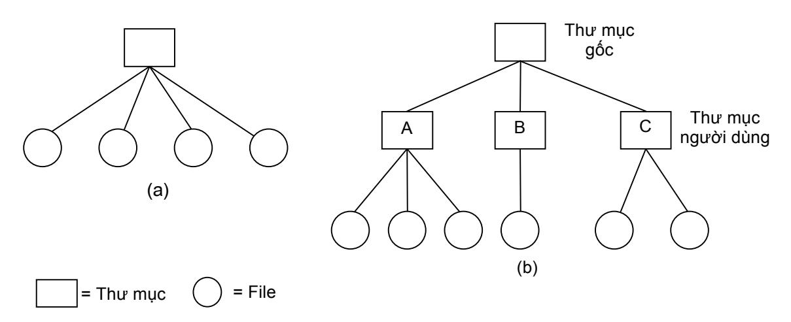

Một cách giải quyết tốt hơn và được nhiều hệ điều hành sử dụng là lưu các chương trình dùng chung vào một thư mục đặc biệt. Thư mục này có thể tạo ra như dành cho một người dùng đặc biệt nào đó. Khi người chạy một chương trình. Chương trình đó trước tiên được tìm trong thư mục của người dùng. Nếu không tìm thấy, hệ điều hành sẽ chuyển sang tìm kiếm trong thư mục đặc biệt. Hệ điều hành UNIX (và tất nhiên là Linux) cũng sử dụng kỹ thuật tương tự.

#### **b. Thư mục cấu trúc cây**

Cấu trúc cây là phát triển ý tưởng của cấu trúc hai mức. Thay chỉ chứa các file, mỗi thư mục con lại có thể chứa các thư mục con khác và các file. Thư mục con được nhóm một cách lôgic theo một tiêu chí nào đó, chẳng hạn thư mục con chứa các file của cùng một người dùng, thư mục con chứa các chương trình và dữ liệu liên quan tới một ứng dụng v.v. Hệ thống thư mục khi đó có thể biểu diễn phân cấp như một cây. Các cành là thư mục, còn lá là các file. Dễ dàng nhận thấy, thư mục hai mức là trường hợp riêng của cấu trúc cây này.

**Hình 4.5:** Thư mục dạng cây

Mỗi thư mục hoặc thư mục con khi đó sẽ chứa tập hợp các file và các thư mục con mức dưới. Để phân biệt khoản mục của file với khoản mục chỉ tới thư mục con mức dưới, người ta thường sử dụng một bit đặc biệt chứa trong khoản mục. Nếu bit này bằng 1, thì đó là khoản mục của thư mục mức dưới, nếu bằng 0, đó là khoản mục của file.

Bản thân thư mục (hoặc thư mục con) cũng được lưu trữ trên đĩa như một file song được hệ điều hành sử dụng khác với các file thông thường. Để tạo và xoá thư mục con, hệ điều hành định nghĩa những lời gọi hệ thống riêng, khác với lời gọi hệ thống dành việc tạo và xoá file.

Trong trường hợp thư mục có chứa thư mục mức dưới hoặc file, việc xoá thư mục sẽ ảnh hưởng tới các thư mục mức dưới và file đó. Nói chung có hai cách giải quyết trong trường hợp này. Một số hệ điều hành như MS-DOS đòi hỏi người dùng phải chỉ rõ việc xoá

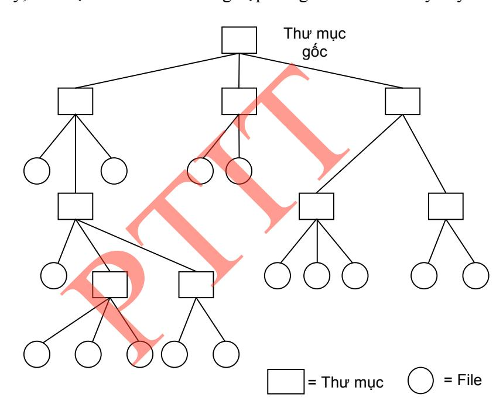

thư mục không rỗng một cách có chủ đích bằng cách dùng lệnh riêng hoặc thêm tham số một cách tường minh (lệnh rm với tham số /s). Nếu dùng lệnh xoá thư mục thông thường, người dùng phải xoá hết các file và thư mục mức dưới của một thư mục trước khi xoá thư mục đó. Ngược lại, một số hệ điều hành như UNIX, Linux cho phép xoá các thư mục không rỗng bằng lệnh thông thường như các thư mục rỗng. Khi một thư mục bị xoá (bằng lệnh rm), tất cả các các file và thư mục mức dưới chứa trong đó cũng bị xoá theo. Cách này rất tiện lợi, cho phép tiết kiệm thời gian và công sức khi cần xoá số lượng thư mục. Tuy nhiên việc cho phép xoá thư mục không rỗng có thể gây mất mát nhiều file và thư mục con do một lệnh xoá vô ý có thể xoá cả một nhánh lớn của cây thư mục. Người dùng phải hết sức cẩn thận khi sử dụng nhãng lệnh xoá như vậy.

Tại mỗi thời điểm, người dùng làm việc với một thư mục gọi là thư mục hiện thời hay thư mục làm việc. Trong quá trình làm việc, người dùng có thể di chuyển sang thư mục khác tức là thay đổi thư mục hiện thời. Việc thay đổi thư mục được thực hiện bằng lời gọi hệ thống tương ứng. Nếu người dùng gõ lệnh đổi thư mục từ bộ dịch lệnh (shell) thì bộ dịch lệnh sẽ gọi lời gọi hệ thống này. Trong trường hợp người dùng truy cập một file mà không thông báo cụ thể thư mục chứa file đó thì file được tìm kiếm trước tiên trong thư mục hiện thời sau đó mở rộng sang các thư mục được quy định trong đường tìm kiếm (search path) như mô tả trong phần thư mục hai mức.

Một số hệ điều hành như Linux, Windows NT cho phép quy định thư mục hiện thời khi người dùng mới đăng nhập vào hệ thống. Thư mục này thường chứa phần lớn các file mà người dùng sẽ sử dụng và còn được gọi là thư mục theo mặc định. Thông tin về thư mục mặc định được ghi trong tài khoản người dùng cùng với các thông tin bảo mật khác và được hệ điều hành đọc khi người dùng đăng nhập. PTIT

\* *Tổ chức cây thư mục cho từng đĩa*: Trong một số hệ thống file như FAT của DOS cây thư mục được xây dựng cho từng đĩa. Hệ thống thư mục sẽ được được coi như "rừng" trong đó mỗi cây "mọc" trên một đĩa. Muốn tới được một cây thư mục, trước tiên ta phải chỉ ra đĩa tương ứng. Trong các hệ điều hành khác như Linux, toàn hệ thống chỉ gồm một cây thư mục to, các đĩa sẽ là các cành mọc ra từ cây này. Thực chất, mỗi đĩa là một hệ thống file và được gắn (mount) vào hệ thống thư mục chung. Rõ ràng cách tổ chức sau mang tính trừu tượng hoá cao hơn cách đầu. Người dùng thậm chí không cần quan tâm tới việc hệ thống có bao nhiêu đĩa và file đang được lưu trữ trên đĩa nào.

#### **c. Thư mục cấu trúc đồ thị không có chu trình**

Ta hãy xét ví dụ sau. Hai người cùng cần sử dụng một số file, chẳng hạn khi cả hai cùng làm việc với một dự án nào đó. Những file này có thể được cất vào một thư mục con dành riêng cho dự án. Tuy nhiên, để thuận tiện cho công việc, cần phải làm sao để thư mục con này có mặt trong cả hai thư mục riêng của hai người. Đồng thời, đó phải là bản chính của thư mục chứ không phải các bản sao. Việc tạo bản sao có thể gây mất đồng bộ dữ liệu - khi người này sửa đổi, người khác không thấy ngay được sửa đổi đó và vẫn làm việc với bản cũ. Để hai (hoặc nhiều) người có thể sử dụng chung file và thư mục, cần chia sẻ file và thư mục đó sao cho chúng có thể xuất hiện ở nhiều thư mục riêng khác nhau. Cấu trúc cây trình bầy ở phần trước không cho phép thực hiện chia sẻ kiểu này.

Hình 4.6**:** Thư mục cấu trúc đồ thị không chu trình

Một cấu trúc thư mục cho phép file hoặc thư mục con xuất hiện trong nhiều thư mục khác nhau được gọi là cấu trúc graph không tuần hoàn (acyclic graph). Đây là một cấu trúc graph không chứa vòng (Hình 4.6). Dễ dàng nhận thấy, cấu trúc graph không tuần hoàn là dạng mở rộng của cấu trúc cây, trong đó lá và cành có thể đồng thời thuộc về những cành khác nhau.

Cách thuận tiện nhất để triển khai graph không tuần hoàn - được sử dụng trong Linux là sử dụng liên kết (link). Liên kết thực chất là con trỏ tới thư mục hoặc file khác. Trong ví dụ nói trên, hai thư mục của hai người dùng sẽ không chứa thư mục con có các chương trình dùng chung mà chỉ chứa các liên kết (con trỏ) tới thư mục con này. Liên kết có thể được sử dụng dưới dạng đường dẫn tuyệt đối hoặc tương đối tới thư mục cần liên kết. Khi một khoản mục của thư mục được đánh dấu là liên kết, thay vì tìm file trong thư mục đó, đường dẫn tới file sẽ được sử dụng để truy cập. PTIT

Một cách khác cũng cho phép tạo cấu trúc kiểu này là tạo ra các bản sao của các file và thư mục cần chia sẻ rồi chứa vào những thư mục khác nhau. Hệ điều hành sau đó phải theo dõi để đảm bảo tính đồng bộ và nhất quán cho các bản sao đó. Khi một bản sao bị thay đổi, hệ điều hành phải chép thay đổi này sang các bản sao khác.

Mặc dù thư mục cấu trúc graph không tuần hoàn cho phép quản lý hệ thống thư mục mềm dẻo hơn cấu trúc cây song cũng phức tạp hơn cấu trúc cây rất nhiều. Do file và thư mục có mặt ở nhiều nơi khác nhau trong hệ thống thư mục, trong quá trình sao lưu và thống kê, chẳng hạn khi ta cần đếm số lượng file, phải tính tới các liên kết để tránh sao lưu hoặc thống kê cùng một file nhiều lần.

Một vấn đề cần quan tâm nữa liên quan tới việc xoá file. Việc xoá file đã được chia sẻ phải bao gồm xoá các liên kết trỏ tới file đó. Trong các trường hợp liên kết không bị xoá, các liên kết này tiếp tục trỏ tới một file đã không tồn tại hoặc vào vùng không gian đĩa đã được giải phóng. Các thao tác truy cập tiếp theo thữc hiện với liên kết sẽ sinh ra lỗi. Thông thường vấn đề này được giải quyết bằng cách tìm và xoá tất cả các liên kết đến file sau khi đã xoá file.

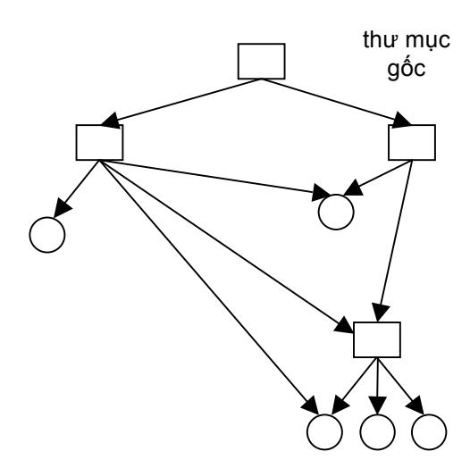

#### **4.4.4. Tên đường dẫn**

Với cấu trúc thư mục từ hai mức trở lên, để xác định file, ngoài tên file, ta còn cần chỉ ra vị trí file đó trong cây thư mục. Thông tin về vị trí của file được gọi là đường dẫn được thêm vào trước tên file. Có hai kiểu đường dẫn: đường dẫn tuyệt đối và đường dẫn tương đối.

Đường dẫn tuyệt đối là đường dẫn đi từ gốc của cây thư mục dẫn tới file, bao gồm tất cả các thư mục ở giữa. Các thành phần của đường dẫn, tức là tên các thư mục ở giữa, được ngăn cách với nhau và với tên file bởi các ký tự đặc biệt. Trong DOS và Windows, ký tự này là \ còn trong UNIX và Linux, ký tự ngăn cách là /. Ví dụ tên file với đường dẫn đầy đủ trong DOS là c:\bc\bin\bc.exe được hiểu như sau: đĩa c chứa thư mục bc, thư mục này chứa thư mục con bin, trong đó có file bc.exe. Trong Linux đường dẫn tuyệt đối có thể là /usr/ast/mailbox. Đường dẫn này xuất phát từ thư mục gốc (ký hiệu /), thư mục gốc chứa thư mục con usr, usr chứa ast, ast chứa file mailbox.

Việc sử dụng đường dẫn thuyệt đối cho phép chỉ ra vị trí của file trong cây thư mục mà không cần biết thư mục hiện thời là thư mục nào.

Đường dẫn tương đối là đường dẫn tính từ thư mục hiện thời. Để có thể sử dụng đường dẫn tương đối, đa số hệ điều hành đưa thêm vào mỗi thư mục hai khoản mục đặc biệt "." và "..". "." biểu diễn thư mục hiện tại còn ".." biểu diễn thư mục mức trên (tức là thư mục bố). Ta hãy xem ví dụ về đường dẫn tương đối. Giả sử ta đang ở trong thư mục /usr. Khi đó để chỉ tới file mailbox ta chỉ cần sử dụng đường dẫn tương đối ast/mailbox là đủ. Nếu ta đang ở trong /usr/etc, đường dẫn tương đối sẽ là ../ast/mailbox. PTIT

## 4.5. CẤP PHÁT KHÔNG GIAN CHO FILE

Một nhiệm vụ quan trọng của hệ điều hành trong việc quản lý hệ thống file là cấp phát không gian trên đĩa và các thiết bị nhớ ngoài khác để lưu trữ file và thư mục, đồng thời ghi lại vị trí các khối nhớ đã cấp phát để có thể tiến hành truy cập file về sau. Nói cách khác, hệ thống quản lý file phải thực hiện ánh xạ file lên đĩa (hoặc thiết bị nhớ ngoài khác). Việc cấp phát các khối nhớ cho file phải được thực hiện sao cho tiết kiệm không gian đĩa và tăng tốc độ truy cập file.

Toàn bộ không gian đĩa được chia thành các khối nhớ (sector), đây là đơn vị thông tin nhỏ nhất mà chương trình điều khiển đĩa (disk driver) cho phép đọc hoặc ghi. Khối nhớ do chương trình điều khiển đĩa xác định được gọi là khối vật lý. Thông thường, hệ điều hành không cấp phát trực tiếp khối vật lý mà kết hợp một hoặc nhiều khối vật lý để tạo thành khối lô gic có kích thước lớn hơn. Mỗi khối lô gic bao gồm một số lượng khối vật lý bằng lũy thừa của 2, chẳng hạn 1, 2, 4 khối vật lý. Các khối lôgic được đánh số liên tục, bắt đầu từ 0 hoặc 1. Khối lôgic là đơn vị thông tin nhỏ nhất mà hệ điều hành cấp phát cho file và là đơn vị nhỏ nhất cho phép đọc từ đĩa hoặc ghi ra đĩa. Trong hệ điều hành MS-DOS và Windows, khối lôgic được gọi là *cluster 3* (Một số tài liệu gọi khối vật lý là *cung* va khối lôgic là *liên cung*).

3 Một số tài liệu gọi khối vật lý là cung va khối lôgic là liên cung

Trong khi trình bầy về các phương pháp cấp phát khối cho file, khối cấp phát sẽ được hiểu là khối lôgic.

## **4.5.1. Cấp phát các khối liên tiếp**

Mỗi file được cấp một khoảng không gian gồm các khối nằm liên tiếp trên đĩa. Vị trí file trên đĩa được xác định bởi vị trí khối đầu tiên và độ dài hoặc số khối mà file đó chiếm. Chẳng hạn, nếu file được cầp phát n khối bắt đầu từ khối thứ s, khi đó các khối của file sẽ là s, s+1, s+2, ..., s+n-1. Khoản mục của file trong thư mục sẽ chứa địa chỉ khối đầu tiên và số khối mà file chiếm (Hình 4.7)

Hình 4.7: Cấp phát cho file các khối liên tục

Trong trường hợp cấp phát khối liên tiếp, việc truy cập file có thể thực hiện dễ dàng theo cả hai cách truy cập trực tiếp và truy cập tuần tự. Để truy cập tuần tự, hệ điều hành ghi nhớ địa chỉ khối vừa được truy cập cuối cùng. Khối tiếp theo sẽ được đọc khi cần thiết. Việc truy cập trực tiếp khối thứ i của một file bắt đầu tại địa chỉ s được thực hiện bằng cách truy cập khối thứ s+i của đĩa.

Ngoài việc hỗ trợ cả hai phương pháp truy cập và dễ dàng lưu trữ vị trí file trong thư mục, phương pháp cấp phát cho file các khối liên tiếp còn cho phép tiết kiệm thời gian di chuyển đầu từ khi đọc các khối của file. Để đọc một khối trên đĩa, đầu từ cần di chuyển tới vị trí khối đó bằng cách di chuyển tới rãnh tương ứng và chờ cho tới khi cung chứa khối quay đến nơi. Trong trường hợp các khối của file nằm kề nhau có thể đọc liên tiếp mà không thực hiện các di chuyển nói trên. Trong trường hợp các khối nằm trên các rãnh khác nhau (ví dụ fileC trên hình 4.7) thì đầu từ cũng chỉ phải di chuyển sang rãnh bên cạnh. Do không phải di chuyển đầu đọc nên tốc độ truy cập file sẽ tăng lên.

Ngoài các ưu điểm nói trên, việc cấp phát cho file các khối liên tiếp có một số nhược điểm lớn. Khó khăn đầu tiên liên quan tới việc tìm ra khoảng không gian trống đủ lớn trên đĩa để cấp phát cho file. Sau một thời gian sử dụng, các khối được cấp phát khi tạo file và giải phóng khi xoá file sẽ tạo ra các vùng trống trên đĩa. Khi có yêu cầu cấp phát, hệ điều hành phải kiểm tra các vùng trống để tìm ra vùng có kích thước thích hợp. Việc này đòi hỏi một

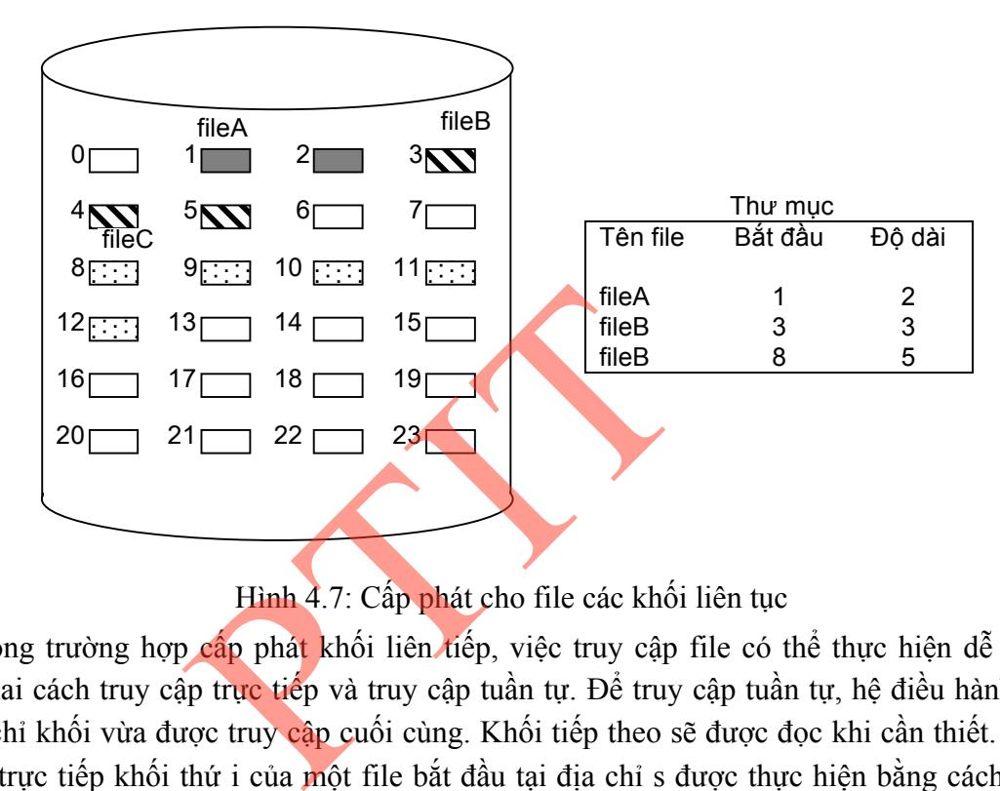

thời gian nhất định. Việc lựa chọn ô trống để cấp phát cho file có thể thực hiện theo một trong các chiến lược cấp phát bộ nhớ động đã được trình bầy trong phần phân đoạn bộ nhớ. Chiến lược thường được sử dụng là tìm vùng trống đầu tiên thích hợp (first fit) hoặc tìm vùng trống thích hợp nhất (best fit).

Tương tự như trong trường hợp cấp phát bộ nhớ động, phương pháp cấp phát khối liên tiếp gây ra lãng phí không gian đĩa do hiện tượng phân mảnh ngoài (external fragmentation). Đó là hiện tượng các vùng trống còn lại trên đĩa có kích thước quá nhỏ và do vậy không thể cấp phát cho file có kích thước lớn hơn. Ví dụ, trên hình 4.7, vùng trống nằm trước fileA có kích thước 1 khối và không thể cấp phát cho file kích thước lớn hơn. Những vùng trống như vậy do đó bị bỏ phí. Tuỳ thuộc vào kích thước đĩa, độ dài khối và độ dài trung bình của file, hiện tượng phân mảnh ngoài sẽ gây lãng phí không gian nhiều hay ít. Mặc dù hiện tượng này có thể khắc phục bằng cách chuyển các file lại gần nhau để tập trung tất cả vùng trống về cuối đĩa nhưng việc di chuyển file cần khá nhiều thời gian, đặc biệt khi kích thước đĩa lớn, và do vậy không thể tiến hành thường xuyên.

Một nhược điểm khác của phương pháp này là cần phải biết kích thước file khi tạo file. Trong một số trường hợp như khi chép file từ nơi này sang nơi khác, ta biết trước kích thước file cần tạo. Tuy nhiên, trong đa số trường hợp, kích thước file không được biết trước mà chỉ biết sau khi ghi thông tin vào file. Mặt khác, kích thước file luôn luôn thay đổi. Sau khi file đã được tạo, việc tăng độ dài file có thể gặp khó khăn nếu các khối nằm sau vị trí của file đã bị file khác chiếm. Giải pháp duy nhất để tăng kích thước file là chuyển toàn bộ file sang vùng không gian trống lớn hơn. PTIT

## **4.5.2. Sử dụng danh sách kết nối**

Các phân tích ở phần trên cho thấy, việc cấp phát khối liên tiếp có nhiều nhược điểm đáng kể và do vậy ít khi được sử dụng. Một phương pháp cho phép khắc phục những nhược điểm này là sử dụng *danh sách kết nối* (*linked list*).

Trong phương pháp này, các khối thuộc về mỗi file được nối với nhau thành một danh sách móc nối. Trên hình 4.8 là ví dụ một file bắt đầu từ khối 1 và bao gồm các khối 1,3, 8,17,6. Mỗi khối chứa con trỏ tới khối tiếp theo. Để chứa con trỏ, hệ điều hành dành ra một số byte ở đầu mỗi khối. Chẳng hạn, với khối kích thước là 512 byte, ta có thể dành 508 byte chứa dữ liệu của file, còn 4 byte chứa con trỏ tới khối tiếp theo. Khác với cách cấp phát khối ở phần trước, các khối thuộc về một file có thể nằm bất cứ chỗ nào trên đĩa chứa không nhất thiết nằm liền kề nhau.

Để xác định vị trí file trên đĩa, khoản mục của thư mục sẽ chứa con trỏ tới khối đầu tiên của file. Khi mới tạo file, con trỏ này có giá trị nil (dấu hiệu kết thúc file và có thể có các giá trị khác nhau tuỳ vào hệ thống cụ thể). Mỗi khi file được cấp thêm khối mới, khối vừa cấp được thêm vào cuối danh sách. Để truy cập file, hệ điều hành đọc lần lượt từng khối và sử dụng con trỏ để xác định khối tiếp theo.

Do các khối thuộc về một file có thể nằm bất cứ chỗ nào trên đĩa, không nhất thiết phải nằm cạnh nhau nên phương pháp cấp phát này cho phép tránh được hiện tượng phân mảnh ngoài. Không có khối trống nào bị bỏ phí. Phương pháp cấp phát này cũng không yêu cầu biết trước kích thước khi tạo file. Kích thước file có thể tăng dễ dàng sau khi đã được tạo. Để tăng kích thước file, hệ điều hành chỉ việc thêm khối trống vào danh sách và sửa lại con trỏ ở khối cuối.

Mặc dù giải khắc phục được các nhược điểm của phương pháp cấp khối liên tục, sử dụng danh sách kết nối cũng có một số nhược điểm. Nhược điểm lớn nhất là phương pháp này chỉ hỗ trợ truy cập tuần tự mà khôngcho phép truy cập file trực tiếp. Để đọc một khối nào đó ta phải theo tất cả các con trỏ từ khối đầu tiên cho tới khối cần đọc. Do con trỏ nằm ngay trong các khối và khối là đơn vị nhỏ nhất có thể tiến hành đọc nên để xác định con trỏ, ta phải đọc cả khối. Như vậy, Để đọc một khối, ta phải đọc lần lượt tất cả các khối nằm trước bắt đầu từ khối đầu tiên.

Hình 4.8: Các khối của file được kết nối thành danh sách

Nhược điểm thứ hai liên quan tới tốc độ truy cập file. Do các khối thuộc về một file có thể nằm rải rác ở nhiều nơi trên đĩa nên đầu từ của đĩa phải thực hiện nhiều thao tác di chuyển mới truy cập được hết dữ liệu của file.

Việc liên kết các khối thuộc về một file bằng con trỏ cũng làm giảm độ tin cậy và tính toàn vẹn của hệ thống file. Trong trường hợp giá trị các con trỏ bị thay đổi không đúng do lỗi việc xác định khối nào thuộc file nào sẽ không chính xác. Chi tiết về tính toàn vẹn của hệ thống file sẽ được trình bầy trong một phần sau.

# **4.5.3. Sử dụng danh sách kết nối trên bảng chỉ số**

Vấn đề không hỗ trợ truy cập trực tiếp của phương pháp dùng danh sách kết nối có thể khắc phục bằng cách sử dụng danh sách kết nối trên bảng chỉ số. Bảng chỉ số là một bảng trong đó mỗi ô ứng với một khối của đĩa. Con trỏ tới khối tiếp theo của file không chứa ngay trong khối nữa mà được chứa trong ô tương ứng của bảng này (hình 4.9). Mỗi đĩa lôgic có một bảng chỉ số được lưu ở vị trí xác định, thường ở phần đầu đĩa. Để tránh trường hợp bảng này bị hỏng, gây mất thông tin về khối, nhiều hệ điều hành tạo ra các bản sao của bảng. Bản sao được sử dụng trong trường hợp bảng chính bị hư hỏng.

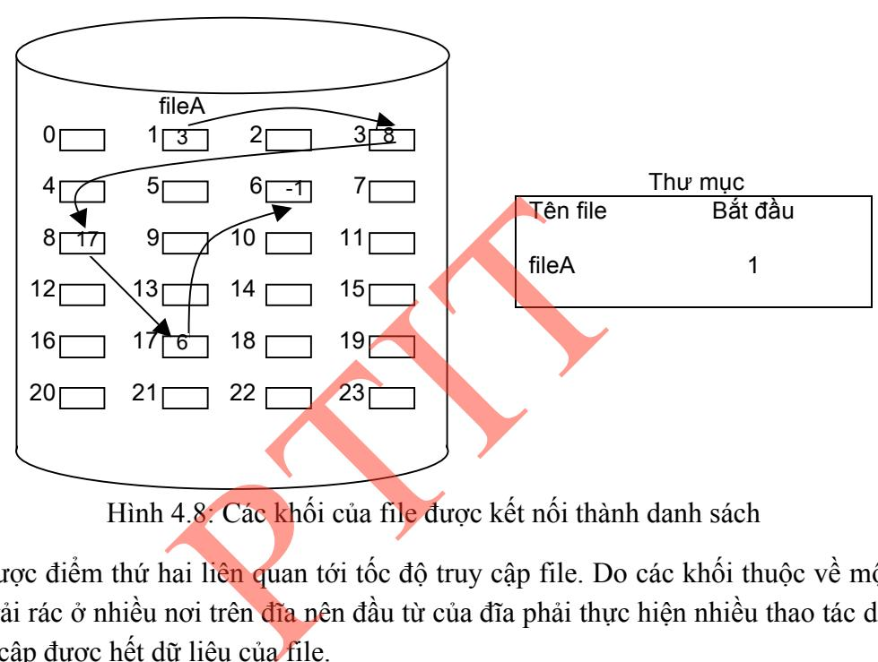

Kích thước mỗi ô trong bảng phụ thuộc vào số lượng khối trên đĩa. Ví dụ, ô kích thước 4 byte cho phép chứa con trỏ tới một trong 232 khối. Việc sử dụng bảng chỉ số cho phép tiếp hành truy cập file trực tiếp. Thay vì đọc tất cả các khối nằm trước khối cần truy cập, ta chỉ cần đi theo chuỗi con trỏ chứa trong bảng chỉ mục. Để tránh phải đọc bảng chỉ số nhiều lần, hệ điều hành có thể đọc và cache cả bảng này trong bộ nhớ. Tuy nhiên, việc đọc toàn bộ bảng chỉ mục vào bộ nhớ đòi hỏi một lượng bộ nhớ đáng kể. Giả sử đĩa có 220 khối. Bảng chỉ mục sử dụng 4 byte cho mỗi ô. Kích thước bảng khi đó sẽ là 220\*4B=4MB.

Một ví dụ bảng chỉ số được sử dụng rất thành công là bảng FAT (file allocation table) của hệ điều hành MS-DOS, OS/2 và Windows (trừ các bản Windows sử dụng NTFS). Bảng FAT và các bản sao được lưu trữ ở đầu mỗi đĩa lôgic sau sector khởi động (BOOT). Tuỳ vào phiên bản FAT 12, FAT 16 hay FAT 32, mỗi ô của bảng FAT có kích thước 12, 16 hay 32 bit và cho phép quản lý tối đa 212, 216, 232 khối.

Hình 4.9: Danh sách kết nối các khối sử dụng bảng chỉ số

## **4.5.4. Sử dụng khối chỉ số**

Khối chỉ số (Index block hay Index node – I-node) là phương pháp trong đó tất cả con trỏ tới các khối thuộc về một file được tập trung một chỗ cho tiện việc truy cập trực tiếp đến từng khối của file.

Trong phương pháp này, mỗi file có một mảng riêng của mình chứa trong một khối gọi là khối chỉ số (I-node). Mảng này chứa thuộc tính của file và vị trí các khối của file trên đĩa (xem hình 4.10). Ô thứ i của mảng này chứa con trỏ tới khối thứ i của file. Việc đọc khối thứ i của file do vậy được thực hiện theo địa chỉ chứa trong ô thứ i của khối chỉ số. Khi mới tạo file, tất cả các ô này có giá trị nil. Để thêm khối mới vào file, khối được lấy từ danh sách các khối trống, sau đó địa chỉ khối được thêm vào ô tương ứng trong chỉ số.

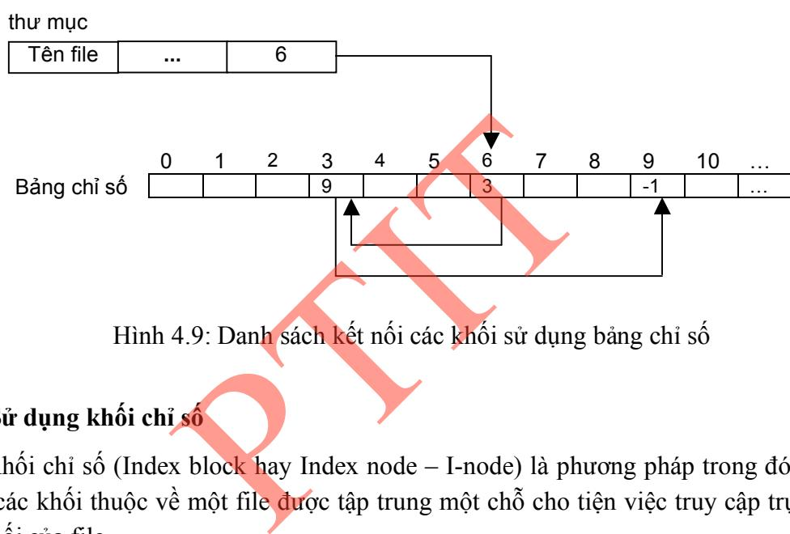

Hình 4.10: Phương pháp sử dụng khối chỉ số

Để xác định khối chỉ số ứng với file, khoản mục của file trong thư mục chứa con trỏ tới khối chỉ số này. Sau khi xác định được khối chỉ số tương ứng, khối này có thể được đọc vào và cache trong bộ nhớ (ví dụ khi mở file) để giảm thời gian cho thao tác đọc ghi file tiếp theo.

Việc sử dụng khối chỉ số cho phép tiến hành truy cập trực tiếp các khối trong file mà không phải đọc các khối trước đó. Các khối thuộc về một file cũng không cần phải nằm gần nhau do đó không gây ra hiện tượng phân mảnh ngoài.

Một vấn đề quan trọng đặt ra là chọn kích thước cho i-node. I-node càng nhỏ thì càng tiết kiệm không gian. Tuy nhiên, i-node nhỏ không cho phép chứa đủ con trỏ tới các khối nếu file lớn. Ngược lại nếu i-node lớn (có hàng trăm ô) trong khi file nhỏ chỉ chiếm 1 hoặc 2 ô thì các ô còn lại không được sử dụng và gây lãng phí bộ nhớ. Có hai cách giải quyết vấn đề này. PTIT

- § Cách 1: Cho phép thay đổi kích thước i-node bằng cách sử dụng danh sách kết nối. Mỗi i-node sẽ được cấp phát một khối trên đĩa để lưu các ô của mình. Nếu kích thước i-node tăng lên, hệ điều hành sẽ liên kết các i-node để tạo thành i-node có kích thước lớn hơn. Khi đó, các ô phía trên của i-node chứa con trỏ tới các khối của file trong khi ô cuối cùng chứa con trỏ tới i-node tiếp theo. § Cách 2: Sử dụng i-node nhiều mức có cấu trúc như sau. I-node bao gồm một số ô chứa địa chỉ các khối nhớ trên đĩa. Trong hệ thống file Ext2 của Linux và phiên bản BSD UNIX i-node có 15 ô như vậy. 12 ô đầu tiên của i-node trỏ trực tiếp tới khối nhớ chứa dữ liệu của file trên đĩa. Nếu kích thước file lớn và số lượng các ô này không đủ, 3 ô cuối của i-node chứa con trỏ tới các khối chỉ số gián tiếp. Ô dầu tiên trong 3 ô (ô thứ
  - 13) chứa địa chỉ một khối chỉ số khác gọi là chỉ số gián tiếp mức 1. Các ô của chỉ số này không chứa dữ liệu mà con trỏ tới các khối chứa dữ liệu của file. Trong trường hợp vẫn không đủ định vị hết các khối của file, ô tiếp theo của i-node sẽ được sử dụng để trỏ tới khối chỉ số gián tiếp mức 2. Các ô của khối này trỏ tới khối địa chỉ gián tiếp mức 1 khác. Nếu chỉ số gián tiếp mức 2 vẫn chưa đủ, chỉ số gián tiếp mức 3 sẽ được

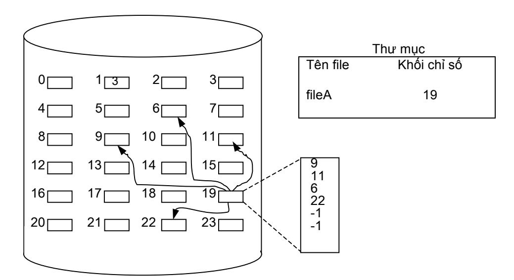

sử dụng. Với khối chỉ số gian tiếp mức 3 như vậy, hệ điều hành có thể định vị các file kích thước đủ lớn. Kích thước tối đa của file phụ thuộc vào số ô của khối chỉ số gián tiếp và kích thước khối chứa dữ liệu của file (hình 4.11).

Phương pháp sử dụng khối chỉ số cũng bị nhược điểm tương tự như sử dụng danh sách kết nối. Đó là do các khối thuộc về một file không nằm gần nhau, tốc độ truy cập file bị giảm vì phải di chuyển đầu đọc nhiều lần.

## 4.6. QUẢN LÝ KHÔNG GIAN TRÊN ĐĨA

Không gian trên đĩa được cấp phát theo từng khối không phân chia. Để quản lý hiệu quả không gian trên đĩa, ngoài phương pháp cấp phát khối nhớ cho file, cần chú ý tới hai vấn đề: vấn đề lựa chọn kích thước cho khối, và cách quản lý những khối trống (hiện không cấp phát cho file nào).

# **4.6.1. Kích thước khối**

Khối là đơn vị cấp phát nhỏ nhất của hệ điều hành, mỗi file bao gồm một số nguyên các khối nhớ. Trong trường hợp kích thước file không bằng bội số kích thước khối, khối cuối cùng của file sẽ không được sử dụng hết và bị bỏ phí. Hiện tượng này gọi là *phân mảnh trong* (internal segmentation). Ví dụ, nếu kích thước khối là 1KB và file có kích thước 5,6KB thì file sẽ cần tất cả 6 khối, trong đó khối cuối cùng có 0,4KB không được sử dụng. Hệ thống file NTFS của Windows NT hoặc Windows thế hệ sau cho phép hiển thị kích thước chính xác của file cũng như kích thước mà file chiếm trên đĩa được tính dựa trên số khối cấp phát cho file.

Hình 4.11: Khối chỉ số nhiều mức

Việc lựa chọn kích thước khối ảnh hưởng trực tiếp tới hiệu quả lưu trữ và truy cập dữ liệu trên đĩa. Nếu chọn khối nhớ có kích thước lớn, không gian bị bỏ phí do phân mảnh trong

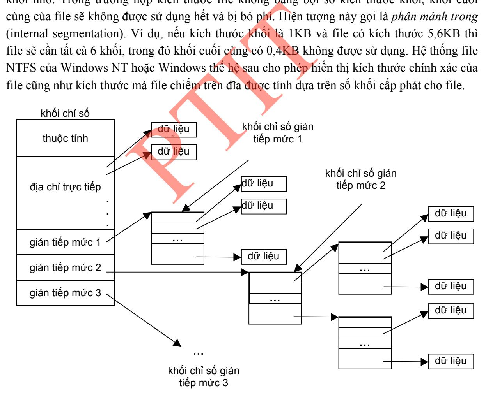

sẽ tăng lên. Việc lựa chọn khối nhớ kích thước nhỏ cho phép tiết kiệm không gian nhờ giảm ảnh hưởng của phân mảnh trong. Tuy nhiên, kích thước khối nhỏ đồng nghĩa với việc mỗi file sẽ bao gồm nhiều khối hơn. Nếu các khối này nằm rải rác trên đĩa, thời gian cần thiết cho việc đọc/ghi file sẽ tăng lên. Ngoài ra, hệ điều hành sẽ phải dành nhiều không gian hơn để lưu thông tin quản lý khối.

Như vậy, yêu cầu về tránh phân mảnh trong mâu thuẫn với yêu cầu về tốc độ truy cập và đòi hỏi giải pháp dung hòa hai yêu cầu này. Đối với đĩa có dung lượng lớn, việc tiết kiệm không quan trọng bằng tốc độ nên có thể chọn khối kích thước lớn. Ngược lại, với đĩa dung lượng nhỏ, khối sẽ có kích thước nhỏ hơn. Hệ điều hành có thể lựa chọn kích thước khối tự động dựa trên dung lượng đĩa hoặc cho phép người dùng lựa chọn khi format đĩa.

Trên thực tế, kích thước khối vật lý (sector) nhỏ nhất thường được chọn bằng 512B và kích thước khối lô gic là lũy thừa 2 của kích thước khối vật lý, thường nằm trong khoảng từ 512B tới 32KB.

# **4.6.2. Quản lý các khối trống**

Để có thể cấp phát khối nhớ trên đĩa cho file, hệ điều hành cần biết khối nào hiện đang trống. Các khối trống bao gồm những khối chưa được cấp phát lần nào hoặc cấp phát rồi nhưng đã được giải phóng. Để quản lý khối trống này, hệ điều hành thường sử dụng danh sách khối trống hoặc duy trì một kiểu bản đồ các khối trên đĩa. Khi cần thiết, các khối được lấy từ danh sách này và cấp phát cho file. Sau khi file bị xoá hoặc giảm kích thước, các khối được giải phóng lại được trả về danh sách khối trống. Sau đây là một số phương pháp thường dùng để lưu trữ danh sách hoặc bản đồ khối trống này. PTIT

**Bảng bit**. Bảng bit hay bản đồ bit (bit map) là một mảng một chiều. Mỗi ô của mảng có kích thước 1 bit và ứng với 1 khối nhớ trên đĩa. Khối đã được cấp phát có bit tương ứng là 0, khối chưa được cấp phát có bit tương ứng là 1 (hoặc ngược lại).

Ví dụ: Trong trường hợp sau, các khối 0, 1, 8, 9, 10 đã được cấp phát, các khối còn lại chưa bị sử dụng:

00111111000111111...

Do nhiều bộ vi xử lý cung cấp các lệnh cho phép tìm ra các bit đầu tiên có giá trị 1 hoặc 0 trong một từ nhớ (ví dụ vi xử lý Intel bắt đầu từ 80386 và Motorola bắt đầu từ 68020) nên việc tìm ra vùng các khối trống có thể thực hiện rất nhanh ở mức phần cứng. Hệ điều hành có thể chia vectơ bit thành các từ và kiểm tra xem từ đó có khác. Sau đó vị trí bit đầu tiên bằng 0 được xác định. Khối tương ứng chính là khối trống cần tìm.

Tuy nhiên, việc tìm kiếm như trên chỉ có thể thực hiện nếu toàn bộ vectơ bit được chứa trong bộ nhớ. Với những đĩa kích thước lớn, việc đọc toàn bộ vectơ bit vào bộ nhớ như vậy có thể đòi hỏi khá nhiều bộ nhớ. Ví dụ một đĩa kích thước 8GB với nếu chia thành khối kích thước 1KB sẽ có vectơ bit tương ứng là 1Mb.

**Danh sách kết nối**. Tương tự như trong trường hợp sử dụng danh sách kết nối cho file, các khối trống được liên kết với nhau thành danh sách. Mỗi khối trống chứa địa chỉ của khối trống tiếp theo. Địa chỉ khối trống đầu tiên trong danh sách này được lưu trữ ở một vị trí đặc biệt trên đĩa và được hệ điều hành giữ trong bộ nhớ khi cần làm việc với các file.

Giống như trường hợp danh sách kết nối cho file, việc sử dụng danh sách kết nối để quản lý khối trống đòi hỏi truy cập lần lượt các khối trống khi cần duyệt danh sách này. Tuy nhiên, trong đa số trường hợp, hệ điều hành ít khi phải duyệt danh sách mà có thể cấp phát ngay các khối ở đầu danh sách. Việc duyệt chỉ cần thiết khi cần tìm các khối trống nằm kề nhau như trong phương pháp cấp phát khối liên tiếp.

**Danh sách vùng trống**. Phương pháp này lợi dụng một đặc điểm là các khối nằm liền nhau thường được cấp phát và giải phóng đồng thời. Do đó, thay vì lưu trữ địa chỉ từng khối trống, hệ điều hành lưu vị trí khối trống đầu tiên của vùng các khối trống liên tiếp và số lượng các khối trống nằm liền ngay sau đó. Hai thông số này sau đó sẽ được lưu trong một danh sách riêng. Vì số lượng vùng trống ít hơn số lượng từng khối trống nên danh sách vùng trống có kích thước bé hơn danh sách từng khối trống rất nhiều.

Một số hệ thống file có thể không sử dụng các cấu trúc riêng nói trên để quản lý khối trống mà kết hợp luôn vào cấu trúc quản lý không gian trung của đĩa. Ví dụ, hệ thống file FAT của MS-DOS và Windows quản lý ngay khối trống trong FAT bằng cách đánh dấu các khối này một cách đặc biệt: ô tương ứng với khối trống trong bảng FAT có giá trị 0. Không có cấu trúc dữ liệu nào được tạo riêng để quản lý khối trống nữa.

# 4.7. TỔ CHỨC BÊN TRONG CỦA THƯ MỤC

Như đã nói trong các phần trước, file được biểu diễn bởi khoản mục trong thư mục. Để tiến hành thao tác mở file, xoá file, tạo file, trước tiên hệ điều hành duyệt thư mục và tìm ra khoản mục tương ứng. Khoản mục này sẽ cung cấp thông tin về vị trí file trên đĩa cho phép ta thực hiện các thao tác tiếp theo với file. PTIT

Hiệu quả việc tạo, xoá, tìm kiếm khoản mục trong thư mục phụ thuộc rất nhiều vào cách tổ chức bên trong, cách lưu trữ và quản lý thư mục. Phần này sẽ đề cập tới một số phương pháp xây dựng thư mục.

# **4.7.1. Danh sách**

Cách đơn giản nhất là tổ chức thư mục dưới dạng danh sách các khoản mục. Danh sách này có thể là bảng, danh sách kết nối hay một câu trúc khác. Việc tìm kiếm khoản mục khi đó được thực hiện bằng cách duyệt lần lượt danh sách. Để thêm file mới vào thư mục, trước tiên ta phải duyệt cả thư mục để kiểm tra xem khoản mụcvới tên file như vậy đã có chưa. Khoản mục mới sau đó được thêm vào cuối danh sách hoặc một ô trong bảng nếu ô này chưa được sử dụng. Để mở file hoặc xóa file, ta cũng tiến hành tìm tuần tự khoản mục tương ứng.

Nhược điểm cơ bản của phương pháp tổ chức thư mục này là việc tìm kiếm trong danh sách rất chậm do phải duyệt lần lượt. Khi số lượng file trong thư mục tăng lên, thời gian tìm kiếm có thể rất lớn (ở mức người dùng có thể nhận biết được). Việc cache thư mục trong bộ nhớ mà nhiều hệ điều hành thực hiện chỉ cho phép tiết kiệm thời gian đọc thư mục từ đĩa chứ không giảm được thời gian tìm kiếm trong thư mục.

Để tăng tốc độ tìm kiếm cần dùng cấu trúc dữ liệu có hỗ trợ sắp xếp. Cấu trúc dữ liệu thường được dùng để xây dựng thư mục là cây nhị phân (*B tree*) hoặc cây nhị phân cân bằng. Khi thêm khoản mục mới vào thư mục, hệ thống sắp xếp khoản mục vào nhánh tương ứng của cây. Việc tìm kiếm trong cây đã sắp xếp nhanh hơn rất nhiều. Hệ thống file NTFS của Windows NT là một ví dụ sử dụng thư mục kiểu này.

#### **4.7.3. Bảng băm**

Một kiểu cấu trúc dữ liệu khác có thể dùng cho thư mục là bảng băm (hash table). Bảng băm là cấu trúc dữ liệu cho phép dùng hàm băm để tính vị trí của khoản mục trong thư mục theo tên file. Thời gian tìm kiếm trong thư mục do đó giảm xuống rất nhiều so với dùng danh sách như ở phần trên. Việc tạo và xoá file cũng được thực hiện đơn giản bằng cách tính vị trí của khoản mục cần tạo hay xoá trong bảng băm. Trường hợp nhiều ên file cùng băm tới một vị trí được giải quyết như trong các bảng băm thông thường.

Nhược điểm lớn nhất của cấu trúc này là hàm băm phụ thuộc vào kích thước của bảng băm do đó bảng phải có kích thước cố định. Nếu số lượng khoản mục vượt quá kích thước chọn cho bảng băm thì phải chọn lại hàm băm. Ví dụ, ta có bảng băm với 128 khoản mục. Hàm băm biến đổi tên file thành các số nguyên từ 0 đến 127 bằng cách lấy phần dư sau khi chia cho 128. Nếu số lượng file trong thư mục tăng lên quá 128, chẳng hạn 130 file, kích thước bảng băm cũng phải tăng lên, chẳng hạn thành 150 khoản mục. Khi đó ta cần xây dựng hàm băm mới cho phép ánh xạ tên file sang khoảng mới từ 0 đến 149. PTIT

### **4.7.4. Tổ chức thư mục của DOS (FAT)**

Mỗi đĩa lôgic trong MS-DOS có cây thư mục riêng của mình. Cây thư mục bắt đầu từ thư mục gốc ROOT. Thư mục gốc được đặt ở phần đầu của đĩa, ngay sau sector khởi động BOOT và bảng FAT. Thư mục gốc chứa các file và thư mục con. Thư mục con đến lượt mình có thể chứa file và thư mục mức dưới.

Hình 4.12: Nội dung khoản mục trong thư mục của hệ thống file FAT

Thư mục của MS-DOS được tổ chức dưới dạng bảng. Mỗi khoản mục chiếm một dòng trong bảng này và có độ dài cố định là 32 byte. Cấu trúc của khoản mục được thể hiện trên hình 4.12 (dùng trong phiên bản cũ, cấu trúc phiên bản mới xem trong phần mô tả hệ thống file FAT ở cuối chương).Các khoản mục có thể trỏ tới file hoặc trỏ tới thư mục con mức dưới. Số lượng khoản mục trong thư mục gốc bị hạn chế không được vượt quá một số lượng cho trước. Ví dụ thư mục gốc của đĩa mềm thường chỉ chứa tối đa 128 khoản mục.

Một số phiên bản cải tiến của FAT cho phép sử dụng tên file có độ dài tối đa là 255 ký tự. Trong trường hợp đó, khoản mục dài 32 byte không đủ để chứa hết các tên file dài. Để

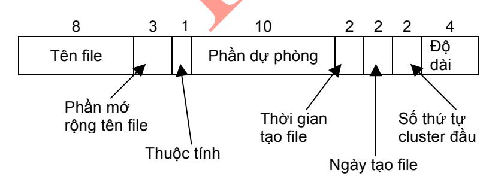

chứa hết tên file, hệ điều hành sử dụng nhiều khoản mục cho một file. Mỗi khoản mục độ dài 32 byte sẽ chứa một phần tên file. Chỉ có khoản mục cuối cùng chứa vị trí bắt đầu file và các thuộc tính khác.

# **4.7.5. Thư mục của Linux**

Thư mục hệ thống file Ext2 của Linux có cách tổ chức bên trong đơn giản. Mỗi khoản mục chứa tên file và địa chỉ i-node. Toàn bộ thông tin còn lại về thuộc tính và vị trí các khối dữ liệu của file được lưu trong i-node chứ không phải trong thư mục. Kích thước khoản mục không cố định mà phụ thuộc vào độ dài tên file. Do vậy, phần đầu mỗi khoản mục có một trường cho biết kích thước của khoản mục này (xem hình 4.13).

Hình 4.13: Cấu trúc khoản mục trong thư mục hệ thống file Linux Ext

## 4.8. ĐỘ TIN CẬY CỦA HỆ THỐNG FILE

File là nơi lưu giữ thông tin mang tính lâu bền. Các thông tin này có thể rất quan trọng đối với người dùng, thậm chí quan trọng hơn chính bản thân hệ thống tính toán. Hệ thống file, do vậy, phải có tính bền vững cao, nghĩa là phải đảm bảo lưu trữ thông tin sao cho thông tin được toàn vẹn và không bị mất mát.

Thông tin của hệ thống file lưu trên đĩa và các thiết bị nhớ ngoài khác có thể bị sai lệch hoặc mất mát do nhiều nguyên nhân: lỗi phần cứng, lỗi phần mềm, sự cố kỹ thuật (mất điện) v.v. Mặc dù không thể ngăn chặn các sự cố như vậy, hệ thống file cần được được xây dựng sao cho có khả năng phát hiện và khắc phục hậu quả trong khả năng cao nhất có thể. Trong phần này ta sẽ xem xét một số vấn đề liên quan tới độ tin cậy và tính toàn vẹn của hệ thống file.

# **4.8.1. Phát hiện và loại trừ các khối hỏng**

Trong quá trình sản xuất cũng như sử dụng, đĩa có thể chứa các khối hỏng, không thể dùng cho ghi, đọc thông tin. Đối với đĩa mềm, các khối hỏng thường xuất hiện trong quá trình sử dụng. Đĩa cứng, ngược lại, thường có các khối hỏng ngay trong quá trình sản xuất. Những

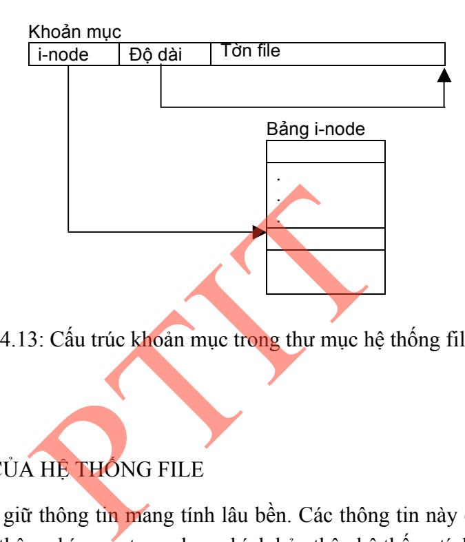

khối hỏng này được nhà sản xuất phát hiện trong quá trình kiểm tra đĩa và được lưu trong danh sách khối hỏng đi cùng với đĩa.

Để tránh mất thông tin do các khối hỏng gây ra cần phát hiện khối hỏng và tránh ghi thông tin lên đó. Có hai phương pháp thường được sử dụng cho phép thực hiện việc này. Trong phương pháp thứ nhất, một sector trên đĩa được dành riêng chứa danh sách các khối hỏng. Một số khối không hỏng được dành riêng để dự trữ. Các khối hỏng sẽ được thay thế bằng các khối dự trữ bằng cách thay thế địa chỉ khối dự trữ thành địa chỉ khối hỏng. Mọi truy cập tới khối hỏng do vậy sẽ trở thành truy cập tới khối dự trữ.

Phương pháp thứ hai đơn giản hơn. Hệ điều hành tập trung tất cả các khối hỏng thành một file. Do thuộc về file, các khối này được đánh dấu như đã cấp phát và do vậy không được sử dụng nữa.

## **4.8.2. Sao dự phòng**

Sao dự phòng (backup) hay sao lưu là tạo ra một bản sao của đĩa trên một vật mang khác. Trong trường hợp đĩa cần sao là đĩa mềm, nội dung đĩa có thể sao sang một đĩa mềm khác. Với đĩa cứng, đặc biệt các đĩa có dung lượng lớn, vật mang được chọn cho bản sao dự phòng thường là băng từ. Ưu điểm của băng từ là dung lượng lớn, giá thành rẻ. Mặc dù tốc độ truy cập băng từ thấp hơn đĩa và băng từ không hỗ trợ truy cập trực tiếp, xong việc truy cập tới băng từ ít khi xảy ra (chỉ trong trường hợp đĩa gốc bị hư hỏng), do đó nhược điểm này không phải là vấn đề lớn lắm. Băng dùng sao lưu có thể là băng video thông thường với thiết bị ghi đi kèm. PTIT

Có hai phương pháp sao lưu được sử dụng. Phương pháp thứ nhất là sao lưu toàn bộ (full backup). Tất cả thông tin trên đĩa sẽ được sao sang băng từ. Phương pháp này thường khá tốn thời gian nếu dung tích của đĩa lớn.

Phương pháp thứ hai cho phép tiếp kiệm thời gian sao lưu và có tên gọi là sao lưu tăng dần (incremental backup). Sao lưu tăng dần được sử dụng sau khi đã tiến hành sao lưu toàn bộ ít nhất một lần. Thay vì sao lưu toàn đĩa, phương pháp này chỉ sao các file đã bị thay đổi sau lần sao lưu cuối cùng.

Thường thường người ta áp dụng cả 2 phương pháp trên. Sao lưu toàn bộ được tiến hành hàng tuần hoặc hàng tháng, còn sao lưu tăng dần được tiến hành hàng ngày.

Để sử dụng phương pháp sao lưu thứ hai, hệ thống lưu trữ thông tin về các lần lưu trữ file. Nếu sau lần lưu trữ cuối file bị thay đổi thì file sẽ được sao lưu lại. Hệ điều hành quản lý việc sao lưu bằng cáh kiểm tra thời gian sao lưu cuối này. Trong một số hệ thống như MS-DOS, thay vì ghi lại thời gian lần sao lưu cuối cùng, hệ thống sử dụng một bit đặc biệt gắn với mỗi file gọi là *archive bit*. Sau khi sao dự phòng, các bit này được xoá về 0. Mỗi khi nội dung file thay đổi, bit được đặt lại bằng 1. Trong lần sao lưu tiếp theo, hệ điều hành kiểm tra archive bit của các file. File có bit tương ứng bằng 1 là file đã bị thay đổi và cần phải sao lưu.

# **4.8.3. Tính toàn vẹn của hệ thống file**

Như đã trình bày ở các phần trên, hệ thống file chứa nhiều cấu trúc dữ liệu có các mối liên kết với nhau. Chẳng hạn, phần quản lý không gian chưa sử dụng chứa danh sách các khối trống được liên kết với nhau, thư mục chứa con trỏ tới các i-node, i-node lại chứa liên kết tới các khối v.v. Nếu thông tin về các liên kết này bị hư hại, tính toàn vẹn của hệ thống cũng bị phá vỡ.

Trong quá trình làm việc, hệ thống file thường phải đọc các khối chứa thông tin về các liên kết vào bộ nhớ, thay đổi các liên kết này, sau đó ghi ngược ra đĩa. Ví dụ, khi xoá file, hệ thống file đọc địa chỉ các khối thuộc về file, đánh dấu khối thành khối trống sau đó giải phóng khoản mục chứa file.

Trong nhiều trường hợp, các liên kết này có thể bị phá vỡ và trở nên không toàn vẹn đặc biệt trong trường hợp thư mục, i-node hoặc danh sách khối trống bị hư hại. Việc hư hại xảy ra khi vùng đĩa chứa các thông tin này bị hỏng hoặc khi hệ thống bị sự cố khi đang thay đổi các cấu trúc nói trên.

Ta hãy xem xét một số trường hợp phá vỡ tính toàn vẹn. Trường hợp thứ nhất, các khối không có mặt trong danh sách các khối trống, đồng thời cũng không có mặt trong một file nào. Hệ thống, do đó, mất quyền kiểm soát với các khối này. Trong trường hợp khác, một khối có thể vừa thuộc về một file nào đó vừa có mặt trong danh sách khối trống và do đó có thể bị hệ điều hành cấp phát lần thứ hai cho một file khác. Nếu một khối đồng thời thuộc về hai file cùng một lúc sẽ dẫn đến mâu thuẫn và gây mất dữ liệu. Đối với file, file có thể bị xoá trong khi khoản mục ứng với file trong thư mục vẫn còn. Có thể xảy ra trường hợp ngược lại, khoản mục ứng với file bị xoá còn file thì chưa. PTIT

Để giải quyết các vấn đề nói trên, hệ điều hành thường có các chương trình kiểm tra tính toàn vẹn của hệ thống. Các chương trình này được chạy khi hệ thống khởi động, đặc biệt khởi động lại sau các sự cố. Ví dụ được biết đến rộng rãi của chương trình loại này là chương trình SCANDISK của Windows và DOS.

Ví dụ chương trình kiểm tra tính toàn vẹn trong Unix làm việc như sau:

**Kiểm tra tính toàn vẹn của khối**. Tạo hai số đếm cho mỗi khối. Số đếm thứ nhất chứa số lần khối đó xuất hiện trong danh sách khối trống. Số đếm thứ hai chứa số lần khối xuất hiện trong file. Khởi đâu, tất cả số đếm được khởi tạo bằng 0. Chương trình lần lượt duyệt danh sách khối trống và toàn bộ i-node của các file. Nếu một khối xuất hiện trong danh sách khối trống, số đếm tương ứng thứ nhất được tăng một đơn vị. Nếu khối xuất hiện trong i-node của file, số đếm tương ứng thứ hai được tăng một đơn vị. Trên hình 4.14 là ví dụ số đếm của một số khối sau khi duyệt xong toàn hệ thống. Với mỗi khối cụ thể có thể xẩy ra ba trường hợp sau:

- Tổng số đếm thứ nhất và thứ hai của khối bằng 1 như với các khối 1, 2: kết quả bình thường, cho thấy khối đang trống hoặc đã được cấp phát cho duy nhất 1 file.
- Tổng số đếm thứ nhất và thứ hai của khối bằng 0 như với khối 0: kết quả lỗi, cho thấy khối hiện không thuộc danh sách khối trống, đồng thời cũng không thuộc file nào. Có thể khắc phục lỗi này bằng cách thêm khối vào danh sách khối trống.
- Tổng số đếm thứ nhất và thứ hai của khối lớn hơn 1 như với khối 3, 4, 5: kết quả lỗi, cho thấy file vừa được đánh dấu còn trống, vừa được đánh dấu đã cấp phát cho file,

hoặc đã được cấp cho nhiều hơn một file. Trong trường hợp này việc khắc phục có thể gây mất dữ liệu nếu khối thuộc về nhiều file và đã được ghi dữ liệu lên đó.

Hình 4.14: Kết quả kiểm tra tính toàn vẹn của khối

#### **4.8.4. Đảm bảo tính toàn vẹn bằng cách sử dụng giao tác**

Mặc dù có thể kiểm tra tính toàn vẹn của các liên kết trong hệ thống file như vừa trình bày trong phần trước, nhưng phương pháp này có một số nhược điểm. Thứ nhất, việc kiểm tra toàn bộ hệ thống file, chẳng hạn bằng cách chạy SCANDISK, đòi hỏi khá nhiều thời gian. Thứ hai, việc kiểm tra chỉ cho phép phát hiện lỗi sau khi đã xảy ra và không đảm bảo khôi phục dữ liệu đối với một số lỗi.

Một số hệ thống file hiện nay sử dụng kỹ thuật tiên tiến hơn, cho phép hạn chế những nhược điểm nói trên. Kỹ thuật này dựa trên khái niệm giao tác (*transaction*), một khái niệm có nguồn gốc từ lĩnh vực cơ sở dữ liệu. Giao tác là một tập hợp các thao tác cần phải được thực hiện trọn vẹn cùng với nhau. Nếu bất cứ một thao tác nào chưa hoàn thành, thì coi như toàn bộ giao tác chưa được thực hiện. Đối với hệ thống file, mỗi giao tác sẽ bao gồm những thao tác thay đổi liên kết cần thực hiện cùng nhau, ví dụ các thao tác cập nhật liên kết liên quan với một khối trên đĩa. PTIT

Toàn bộ trạng thái hệ thống file, cụ thể là những thay đổi thực hiện với các liên kết và cấu trúc quản lý file, được hệ thống ghi lại trong một file log (một dạng file nhật ký ghi lại thông tin về hệ thống theo thời gian). Mỗi khi thực hiện giao tác, hệ thống kiểm tra xem giao tác có được thực hiện trọn vẹn không. Nếu giao tác không được thực hiện trọn vẹn do sự cố, hệ điều hành sẽ sử dụng thông tin từ log để khôi phục hệ thống file về trạng thái không lỗi, trước khi bắt đầu thực hiện giao tác. Phương pháp sử dụng giao tác cho phép đưa hệ thống file về một trạng thái không lỗi trong khi không phải kiểm tra toàn bộ liên kết của file và thư mục.

Hệ thống file NTFS của Windows NT và các phiên bản sau sử dụng kỹ thuật giao tác vừa trình bầy. Tuy nhiên, hệ thống chỉ áp dụng giao tác với thay đổi liên kết, và không sử dụng kỹ thuật này cho thay đổi nội dung file.

## 4.9. BẢO MẬT CHO HỆ THỐNG FILE

Bảo mật cho hệ thống file là ngăn cản việc truy cập trái phép các thông tin lưu trữ trong file và thư mục. Đối với các hệ thống nhỏ dành cho một người dùng, vấn đề bảo mật tương đối đơn giản và có thể thực hiện bằng các biện pháp vật lý, ví dụ, không cho những người

|                                      | S | ố th ứ | t ự    | kh ố i |   |
|--------------------------------------|---|--------|--------|--------|---|
|                                      | S | ố th ứ | t ự kh | ố i    |   |
| 0                                    | 1 | 2      | 3      | 4      | 5 |
| 0                                    | 0 | 1      | 1      | 3      | 2 |
| 0                                    | 1 | 2      | 3      | 4      | 5 |
| 0 S ố l ầ n xu ấ t hi ệ n trong danh | 1 | 0      | 1      | 0      | 1 |
| sách tr ố ng                         |   |        |        |        |   |
| S ố l ầ n xu ấ t hi ệ n trong file   |   |        |        |        |   |

khác tiếp cận tới hệ thống. Trong những hệ thống tính toán đa người dùng, việc bảo mật cho file và thư mục thực hiện bằng cách kiểm soát quyền truy cập tới các tài nguyên này.

Hệ thống quản lý quyền truy cập bằng cách hạn chế các thao tác truy cập tới file hoặc thư mục. Các thao tác thường được xem xét hạn chế là đọc, ghi, thực hiện (đối với file chương trình), thêm vào file, xoá file. Đối với thư mục, các thao tác cần kiểm soát là xem nội dung thư mục, thêm file vào thư mục, xoá file khỏi thư mục.

Dưới đây ta sẽ đề cập tới một số cơ chế bảo mật thường gặp.

#### **4.9.1. Sử dụng mật khẩu**

Mỗi file sẽ có một mật khẩu gắn với một số quyền nào đó. Khi người dùng hoặc chương trình ứng dụng truy cập file để đọc, ghi hoặc thực hiện thao tác khác, hệ thống sẽ yêu cầu cùng cấp mật khẩu tương ứng và việc truy cấp chỉ được thực hiện nếu mật khẩu đúng. Ví dụ sử dụng cơ chế bảo mật kiểu này được sử dụng trong Windows 95/98 để chia sẻ các thư mục giữa các máy nối mạng theo mô hình nhóm (workgroup).

Nhược điểm chủ yếu của phương pháp này là việc nhớ mật khẩu cho từng file hoặc từng thư mục là vô cùng khó khăn nếu số lượng file lớn. Ngoài ra, do mỗi thao tác truy cập đều đòi hỏi cung cấp mật khẩu nên rất mất thời gian và không tiện lợi.

#### **4.9.2. Danh sách quản lý truy cập**

Mỗi file sẽ được gắn một danh sách đi kèm gọi là *danh sách quản lý truy cập* ACL (Access Control List). Danh sách này chứa thông tin định danh người dùng và các quyền mà người dùng đó được thực hiện với file. Thông tin định danh người dùng có thể chứa tên người dùng hoặc số nhận dạng mà hệ điều hành cấp khi người dùng đó đăng nhập vào hệ thống. Danh sách quản lý quyền truy cập thường được lưu trữ như một thuộc tính của file hoặc thư mục. PTIT

Phương pháp sử dụng ACL thường được sử dụng cùng với cơ chế đăng nhập. Người dùng được hệ thống cấp một số định danh *uid*, gắn với tên và mật khẩu. Sau khi đăng nhập thành công, uid sẽ gắn với người dùng trong phiên làm việc. Khi người dùng (hoặc chương trình ứng dụng của người dùng) truy cập file, hệ thống file đối chiếu uid với các quyền ghi trong ACL của file tương ứng để quyết cho phép hay không cho phép truy cập

Hình 4.15: Ví dụ danh sách quản lý truy cập cho hai file

Các quyền truy cập thường sử dụng với file bao gồm:

- *Quyền đọc* (Read): người có quyền này được phép đọc nội dung file.

|           | File 1 |      |           |      |
|-----------|--------|------|-----------|------|
| A         | B      | C    |           |      |
| ch ủ file |        |      |           |      |
| đọ c      | đọ c   | đọ c |           |      |
| ghi       |        | ghi  |           |      |
|           |        |      | File 2    |      |
|           |        |      | B         | C    |
|           |        |      | ch ủ file |      |
|           |        |      | đọ c      | đọ c |

- *Quyền ghi, thay đổi* (Write, Change): được phép ghi vào file, tức là thay đổi nội dung file.
- *Quyền xóa* (Delete): được phép xóa file. Thực chất, quyền này tương đương với quyền thay đổi file.
- *Quyền thay đổi chủ file* (Change owner)

Quyền thứ tư được nhắc tới ở trên liên quan tới khái niệm *chủ file* (owner). Chủ file là người có quyền cao nhất với file, trong đó có *quyền cấp quyền* cho người dùng khác đối với file do mình làm chủ.

Những quyền liệt kê ở trên là những quyền cơ sở và có thể được tổ hợp với nhau để tạo ra quyền mới. Chẳng hạn, nếu người dùng có quyền đọc file thì sẽ có quyền thực hiện file, thực chất là đọc và tải nội dung file chương trình vào bộ nhớ để thực hiện.

Trong trường hợp số lượng người dùng có quyền với file lớn, kích thước ACL có thể rất đáng kể. Đồng thời, việc gán quyền cho từng người dùng riêng lẻ tốn rất nhiều thời gian. Do đó, hệ điều hành sử dụng thêm khái niệm nhóm người dùng. Nhóm người dùng bao gồm những người có quyền giống nhau đối với file hoặc thư mục. Ta có thể thêm từng nhóm người dùng vào ACL của file (Windows NT) hoặc thêm người dùng vào nhóm gắn với file (Linux).

Dưới đây là ví dụ giao diện làm việc với quyền truy cập trong Windows (sử dụng hệ thống file NTFS). Đối với Windows, quyền truy cập được hiển thị và thay đổi thông qua giao diện đồ họa như trên hình 4.16.

## 4.10. HỆ THỐNG FILE FAT

Hệ thống file FAT được thiết kế ban đầu để sử dụng trong hệ điều hành DOS, và sau đó đã được sử dụng trong một số phiên bản của hệ điều hành Windows như Windows 3.0, 3.1, 95/98, ME. Hiện nay, FAT không được dùng làm hệ thống file cho đĩa cứng trong những phiên bản mới nhất của Windows do có một số nhược điểm như tốc độ và độ tin cậy không cao, không hỗ trợ cơ chế bảo mật. Tuy nhiên, FAT vẫn là hệ thống file thông dụng nhất, được sử dụng trong hầu hết các hệ điều hành hiện nay để quản lý thẻ nhớ, đĩa mềm, đĩa CD, và được sử dụng như phương tiện trung gian thuận tiện khi cần trao đổi file giữa các hệ điều hành khác nhau. Ngoài ra, rất nhiều hệ thống nhúng sử dụng FAT để quản lý file do sự đơn giản của hệ thống file này. PTIT

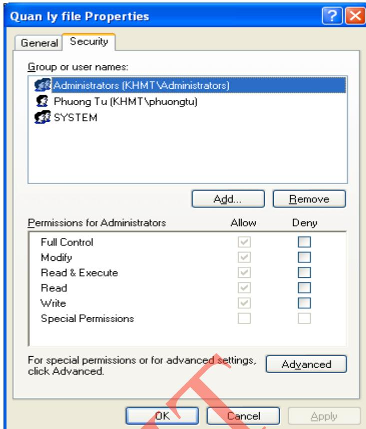

Hình 4.16: Giao diện phần quản lý quyền truy cập file của Windows Vista

Hệ thống file FAT có ba phiên bản là FAT12, FAT16, và FAT32, trong đó chữ số sau phần chữ chỉ kích thước ô của bảng FAT tương ứng là 12, 16, và 32 bit. Hiện nay, đa số FAT được sử dụng cho đĩa cứng là FAT32, trong khi FAT16 được sử dụng cho thiết bị nhớ ngoài có dung lượng nhỏ hơn như CD, thẻ nhớ ngoài. PTIT

## **4.10.1. Đĩa lôgic**

Đơn vị tổ chức trong hệ thống file FAT là đĩa lôgic (logical disk). Đối với đĩa cứng, toàn bộ đĩa được chia thành các vùng (partition), bao gồm vùng chính (primary partition) và vùng mở rộng (extended partition). Vùng mở rộng được chia tiếp thành một số đĩa lô gic. Bản thân vùng chính cũng được coi là đĩa lô gic với khác biệt là có thể khởi động hệ điều hành từ đây.

Đối với thiết bị nhớ ngoài khác, mỗi đĩa mềm, CD, thẻ nhớ ngoài được coi là một đĩa lô gic với đầy đủ cấu trúc quản lý đĩa lô gic của mình. Đĩa lô gic được đặt tên bằng các chữ cái A,B,C,D, v.v. với một số quy ước như A là ổ đĩa mềm, C là đĩa lô gic đầu tiên trên ổ cứng.

Đơn vị cấp phát không gian trên đĩa (khối lô gic) là cluster. Mỗi cluster chứa một số lượng sector bằng lũy thừa của 2. Kích thước cluster cùng với phiên bản FAT (12, 16, hay 32) quyết định kích thước tối đa của đĩa lô gic mà FAT có thể quản lý. Thông thường, kích thước cluster nằm trong khoảng tự 512B đến 32KB.

Hình 4.17: Cấu trúc đĩa lô gic

Kích thước các vùng, tính bằng số sector mà vùng đó chiếm, có thể xác định bằng cách đọc thông tin ghi trong phần boot sector như sau.

- Boot Sector và dự phòng: bằng số lượng sector dự phòng.
- FAT1+FAT2: số lượng bảng FAT x kích thước FAT.
- Thư mục gốc: (số lượng khoản mục trong thư mục gốc x 32)/kích thước sector. Qua hình vẽ, ta thấy đĩa lô gic của hệ thống file FAT gồm 4 phần chính:
- **1) Boot sector các các sector dự phòng**. Sector đầu tiên trong phần này đồng thời là sector đầu tiên của đĩa lô gic là boot sector. Boot sector chứa thông tin mô tả cấu trúc đĩa lô gic như kích thước sector, cluster, kích thước bảng FAT v.v. Ngoài ra, nếu đĩa lô gic là đĩa khởi động hệ điều hành thì boot sector còn chứa mã của chương trình mồi (loader) dùng để tải hệ điều hành. Do chương trình mồi có thể dài, hoặc hệ thống cần phải chứa thêm một số thông tin khác, nên ngoài boot sector, vùng này có thể bao gồm thêm một số sector dự phòng khác. Kích thước toàn bộ vùng này được ghi trong cấu trúc thông tin chứa trong boot sector.
- **2) FAT:** Vùng này chứa bảng FAT, thực chất là bảng chỉ số dùng cho việc quản lý các khối và các file. Do thông tin trong bảng FAT rất quan trọng nên hệ điều hành thường duy trì hai bảng FAT, trong đó một bảng là bản sao của bản kia. Tuy nhiên, số lượng bảng FAT có thể thay đổi và không phải là hai. Số lượng bảng FAT cho đĩa cụ thể được ghi trong boot sector.
- **3) Thư mục gốc (root directory).** Trong phiên bản FAT12 và FAT16, vùng này chứa các thư mục gốc, tức là thư mục trên cùng của đĩa. Kích thước vùng này được xác định bằng số lượng tối đa khoản mục trong thư mục gốc và được ghi trong boot sector. FAT32 không sử dụng vùng này mà lưu trữ thư mục gốc như các file và thư mục thông thường.
- **4) Vùng dữ liệu:** chiếm toàn bộ không gian còn lại trên đĩa, chứa các file và thư mục của đĩa lô gic. Thông thường, vùng này bắt đầu từ cluster số 2. PTIT

## **4.10.2. Boot sector**

Boot sector là sector đầu tiên trên đĩa và chứa thông tin mô tả cấu trúc đĩa cùng với mã để tải hệ điều hành đối với đĩa mồi hệ điều hành. Cấu trúc cụ thể của boot sector như sau:

| V ị 0 3 | trí Độ dài 3 8 | L ệ nh ph ầ Tên Bytes 512 | Jump. n mã hãng per đố i v | Ch m ồ i c s ả n v.v. sector. ớ i đĩ a | ỉ th ị ủ a h xu ấ t, c ứ | ệ b Kích ng. | cho đ ổ | i ề    | CPU u sung th ướ | hành d c | b ấ u | ỏ n ế tr sector | Ý qua u ắ | ngh đ ây ng tính | ĩ ph ở     | a ầ là cu b | n ằ | đĩ a ố i ng | thông m cho | tin ồ i đủ byte. | h | ệ Giá | và đ 8B. | nh i ề u tr | ẩ y t ớ i th ự c hi ệ n hành. Ví d ụ : IBM 3.3, ị th ườ ng g ặ p là |
|---------|----------------|---------------------------|----------------------------|----------------------------------------|--------------------------|--------------|---------|--------|------------------|----------|-------|-----------------|-----------|------------------|------------|-------------|-----|-------------|-------------|------------------|---|-------|----------|-------------|---------------------------------------------------------------------|
| 11      | 2              |                           |                            |                                        |                          |              |         |        |                  |          |       |                 |           |                  |            |             |     |             |             |                  |   |       |          |             |                                                                     |
|         |                | Đ ây                      | c ũ ng                     | là v ị                                 | trí b                    | ắ t          | đầ      |        | u c              | ủ a      | Kh    | ố               | i Thông   |                  |            |             |     | s ố         | BIOS        |                  |   | (BIOS |          |             | Parameter                                                           |
|         |                | Block,                    | vi ế                       | t t ắ t là                             | BPB)                     |              |         |        |                  |          |       |                 |           |                  |            |             |     |             |             |                  |   |       |          |             |                                                                     |
| 13      | 1              | Sectors                   | per                        | cluster.                               |                          | S            | ố       | sector |                  |          | trong |                 | m         | ộ                | t cluster, |             |     |             |             | luôn             |   | là    |          | l ũ y       | th ừ a c ủ a 2 và                                                   |
|         |                | không                     | l ớ n                      | h ơ n                                  | 128.                     |              |         |        |                  |          |       |                 |           |                  |            |             |     |             |             |                  |   |       |          |             |                                                                     |
| 14      | 2              | Reserved                  |                            | sectors.                               | S                        | ố            | l       | ượ     | ng               | sector   |       |                 | dành      |                  | cho        |             |     | vùng        |             | đầ               |   | u     | đĩ       | a           | đế n tr ướ c FAT,                                                   |
|         |                | bao                       | g ồ m boot                 | sector                                 |                          |              | và      |        | các              | sector   |       |                 | d ự       | phòng.           |            |             |     |             |             |                  |   |       |          |             |                                                                     |
| 16      | 1              | S ố l ượ                  | ng                         | b ả ng                                 | FAT.                     |              | Th      |        | ườ               | ng       | b ằ   | ng              | 2.        |                  |            |             |     |             |             |                  |   |       |          |             |                                                                     |
| 17      | 2              | S ố kho                   | ả n                        | m ụ c t                                | ố i đ                    | a            | trong   |        |                  | th ự     | m     | ụ               | c         | g ố              | c          | ROOT.       |     |             |             | Ch               | ỉ | s     | ử        | d ụ         | ng cho FAT12                                                        |
|         |                | và FAT16.                 |                            | B ằ ng                                 | 0                        | v ớ          | i       | FAT32. |                  |          |       |                 |           |                  |            |             |     |             |             |                  |   |       |          |             |                                                                     |
| 19      | 2              | Total                     | sector.                    | T ổ                                    | ng s                     | ố            | sector  |        |                  | trên     |       | đĩ              | a.        | N                | ế          | u           | b   | ằ ng        | không       |                  |   |       | thì      |             | s ố l ượ ng sector                                                  |
|         |                | đượ c                     | ghi b                      | ằ ng 4                                 | byte                     |              | t       | ạ i    | v ị              | trí      | 0x20. |                 |           |                  |            |             |     |             |             |                  |   |       |          |             |                                                                     |
| 21      | 1              |                           |                            |                                        |                          |              |         |        |                  |          |       |                 |           |                  |            |             |     |             |             |                  |   |       |          |             |                                                                     |
|         |                | Mô                        | t ả lo ạ i                 | đĩ a.                                  | Ví d                     | ụ            | 0xF0    |        |                  | là       | đĩ    | a m             | ề         | m                | 3.5”       |             |     | hai         | m           | ặ                | t | v ớ   | i        | 80          | rãnh trên m ỗ i                                                     |
|         |                | m ặ t,                    | 0xF1                       | là đĩ                                  | a c ứ                    | ng           |         | v.v.   |                  |          |       |                 |           |                  |            |             |     |             |             |                  |   |       |          |             |                                                                     |
| 22      | 2              | Sectors                   | per                        | FAT.                                   | Kích                     |              |         | th     | ướ               | c        | FAT   |                 | tính      |                  | b          | ằ           | ng  |             | sector      |                  | ( | đố    |          | i v         | ớ i FAT12/16)                                                       |
| 24      | 2              | Sectors                   | per                        | track.                                 | S                        | ố            | sector  |        |                  | trên     |       | m               | ộ t       | rãnh.            |            |             |     |             |             |                  |   |       |          |             |                                                                     |
| 26      | 2              | Number                    | of                         | heads.                                 | S                        | ố            | l       | ượ     | ng               | đầ       | u     | đọ              | c         | (m               | ặ          | t           | đĩ  | a           | đượ         | c                | s | ử     | d        | ụ ng)       |                                                                     |
| 28      | 4              | Hidden                    | sectors.                   |                                        | S ố                      | l ượ         |         | ng     | sector           |          |       | ẩ n.            |           |                  |            |             |     |             |             |                  |   |       |          |             |                                                                     |
| 32      | 4              | Total                     | sector.                    | T ổ                                    | ng s                     | ố            | sector  |        |                  | trên     |       | đĩ              | a         | cho              |            | tr          | ườ  |             | ng          | h ợ              | p | có    |          | nhi         | ề u h ơ n 65535.                                                    |

Phần còn lại có cấu trúc khác nhau đối với FAT12/16 và FAT32. Cụ thể, các byte tiếp theo trong FAT12/16 chứa các thông tin sau:

| V ị trí | Độ |                                                                                     |
|---------|----|-------------------------------------------------------------------------------------|
|         |    | Ý ngh ĩ a                                                                           |
| 36      | 1  | S ố th ứ t ự v ậ t l ý c ủ a đĩ a (0: đĩ a m ề m, 80h: đĩ a c ứ ng v.v.)            |
| 37      | 1  | D ự phòng                                                                           |
| 38      | 1  | D ấ u hi ệ u c ủ a ph ầ n mã m ồ i. Ch ứ a giá tr ị 0x29 (k ý t ự ‘)’) ho ặ c 0x28. |
| 39      | 4  | S ố xê ri c ủ a đĩ a (Volume Serial Number) đượ c t ạ o lúc format đĩ a             |

| 43  | 11  | Volume Label. Nhãn c ủ a đĩ a đượ c t ạ o khi format.                                      |
|-----|-----|--------------------------------------------------------------------------------------------|
| 54  | 8   | Tên h ệ th ố ng file FAT, ví d ụ "FAT12 ", "FAT16 ".                                       |
| 62  | 448 | Mã m ồ i h ệ đ i ề u hành, đ ây là ph ầ n ch ươ ng trình t ả i h ệ đ i ề u hành khi kh ở i |
|     |     | độ ng.                                                                                     |
| 510 | 2   | D ấ u hi ệ u Boot sector (0x55 0xAA)                                                       |

Đối với FAT32, các byte tiếp theo có ý nghĩa khác, và chứa thông tin sau:

| V ị   | trí Độ |          |                                                                            |
|-------|--------|----------|----------------------------------------------------------------------------|
|       |        |          | Ý ngh ĩ a                                                                  |
| 36    | 4      | Sectors  | per FAT. Kích th ướ c FAT tính b ằ ng sector.                              |
| 0x28  | 2      | C ờ c    | ủ a FAT                                                                    |
| 0x2a  | 2      | Version. | Phiên b ả n.                                                               |
| 0x2c  | 4      | S ố th   | ứ t ự c ủ a cluster đầ u tiên c ủ a th ư m ụ c g ố c root.                 |
| 0x30  | 2      | S ố      | sector c ủ a Information Sector. Đ ây là ph ầ n n ằ m trong s ố sector d ự |
|       |        | phòng    | ngay sau boot sector.                                                      |
| 0x32  | 2      | S ố th   | ứ t ự sector đầ u tiên c ủ a b ả n sao c ủ a boot sector (n ế u có)        |
| 0x34  | 12     | D ự      | phòng                                                                      |
| 0x40  | 1      | S ố th   | ứ t ự v ậ t l ý c ủ a đĩ a                                                 |
| 0x41  | 1      | D ự      | phòng                                                                      |
| 0x42  | 1      | D ấ u    | hi ệ u c ủ a ph ầ n mã m ồ i m ở r ộ ng.                                   |
| 0x43  | 4      | S ố xê   | ri c ủ a đĩ a (Volume Serial Number)                                       |
| 0x47  | 11     | Volume   | Label                                                                      |
| 0x52  | 8      | "FAT32   | "                                                                          |
| 0x5a  | 420    | Mã       | m ồ i h ệ đ i ề u hành                                                     |
| 0x1FE | 2      | D ấ u    | hi ệ u Boot sector (0x55 0xAA)                                             |

## **4.10.3. Bảng FAT**

Bảng FAT là bảng chỉ số, dùng để quản lý các khối (cluster) trên đĩa và các file theo nguyên tắc các khối thuộc về một file được liên kết với nhau thành danh sách móc nối và con trỏ được chứa trong ô tương ứng của bảng FAT. Phương pháp này đã được mô tả trong phần cấp phát không gian cho file ở trên.

Cụ thể, mỗi ô trong bảng FAT tương ứng với một cluster trên đĩa. Chẳng hạn, ô số 2 của FAT tương ứng với cluster số 2. Mỗi ô trong bảng FAT chứa một trong các thông tin sau:

- Dấu hiệu kết thúc danh sách nếu ô tương ứng với cluster cuối cùng trong file.
- Dấu hiệu đánh dấu cluster bị hỏng, không được sử dụng.
- Dấu hiệu đánh dấu cluster dự phòng.
- Bằng 0 nếu cluster trống, chưa được cấp phát cho file nào.

Mỗi ô của FAT có thể chứa giá trị cụ thể như liệt kê dưới đây.

| FAT12 | FAT16  | FAT32      |         |    |     | Ý ngh ĩ a                                 |
|-------|--------|------------|---------|----|-----|-------------------------------------------|
| 0x000 | 0x0000 | 0x00000000 | Cluster | tr | ố   | ng                                        |
| 0x001 | 0x0001 | 0x00000001 | Cluster | d  | ự   | phòng, không đượ c s ử d ụ ng             |
|       |        |            | Cluster | đ  | ã   | đượ c c ấ p cho file. Ch ứ a s ố th ứ t ự |
|       |        |            | cluster | ti | ế p | theo c ủ a file.                          |
|       |        | 0x0FFFFFF6 | Cluster | d  | ự   | phòng                                     |
| 0xFF7 | 0xFFF7 | 0x0FFFFFF7 | Cluster | h  | ỏ   | ng.                                       |
|       |        | 0x0FFFFFFF | Cluster | cu |     | ố i cùng c ủ a file                       |

FAT12, 16, 32 dành tương ứng 12, 16, và 32 bit cho mỗi ô của FAT. Kích thước mỗi ô càng lớn thì càng quản lý được nhiều cluster, đồng thời cũng đòi hỏi nhiều không gian hơn để lưu bảng FAT. Các hệ thống FAT32 hiện nay chỉ sử dụng 28 bit thấp. 4 bit cao dùng làm dự phòng và có giá trị bằng 0. PTIT

Do cluster đầu tiên của vùng dữ liệu được đánh số thứ tự bằng 2 nên hai ô đầu tiên của bảng FAT không được sử dụng.

## **4.10.4. Thư mục gốc**

Mỗi thư mục được lưu trong bảng thư mục, thực chất là một file đặc biệt chứa các khoản mục của thư mục. Mỗi khoản mục có kích thước 32 byte chửa thông tin về một file hoặc thư mục con thuộc thư mục đang xét. Đối với FAT12/16, thư mục trên cùng của đĩa được chứa trong một vùng đặc biệt gọi là thư mục gốc (root). Các thư mục mức thấp hơn cũng như thư mục gốc của FAT 32 được chứa trong vùng dữ liệu của đĩa cùng với file.

Mỗi thư mục bao gồm các khoản mục 32 byte xếp liền nhau. Mỗi khoản mục đối với trường hợp tên file ngắn 8.3 có cấu trúc như sau:

| V ị trí |   | Độ dài | Mô t ả                                                                          |    |   |
|---------|---|--------|---------------------------------------------------------------------------------|----|---|
| 0       | 8 |        | Tên file, thêm b ằ ng d ấ u tr ắ ng ở cu ố i n ế u ng ắ n h ơ n 8 byte          |    |   |
| 8       | 3 |        | Ph ầ n m ở r ộ ng, thêm b ằ ng d ấ u tr ắ ng ở cu ố i n ế u ng ắ n h ơ n 3 byte |    |   |
| 11      | 1 |        | Byte thu ộ c tính c ủ a file. Các bit c ủ a byte này n ế u b ằ ng 1 s ẽ         | có | ý |
|         |   |        | ngh ĩ a nh ư sau:                                                               |    |   |

| Bit                          | 0:   | file  |         | ch    | ỉ       |         | đượ c đọ c                                                           |
|------------------------------|------|-------|---------|-------|---------|---------|----------------------------------------------------------------------|
| Bit                          | 1:   | file  | ẩ       | n     |         |         |                                                                      |
| Bit                          | 2:   | file  |         | h ệ   |         | th      | ố ng                                                                 |
| Bit                          | 3:   |       | Volume  |       |         |         | label                                                                |
| Bit                          | 4:   | th    | ư       | m     | ụ c     |         | con                                                                  |
| Bit                          | 5:   |       | archive |       |         |         |                                                                      |
| Bit                          | 6:   | thi   | ế t     | b     | ị       | nh      | ớ khác (dùng cho h ệ đ i ề u hành)                                   |
| Bit                          | 7:   |       | không   |       | s       | ử       | d ụ ng                                                               |
|                              | Byte | thu   | ộ c     |       | tính    |         | b ằ ng 0x0F là d ấ u hi ệ u c ủ a file tên dài.                      |
| 12 1 D                       | ự    | phòng |         |       |         |         |                                                                      |
| 13 1 Th                      | ờ i  | gian  | t       | ạ     | o       | file    | tính theo đơ n v ị 10ms, giá tr ị t ừ 0 đế n 199                     |
| 14 2 Th                      | ờ i  | gian  |         | t     | ạ o     |         | file theo format sau: bit 15-11: gi ờ (0-23); bit 10-5:              |
|                              | phút |       | (0-59); |       | bit     |         | 4-0: giây/2 (0-29)                                                   |
| 16 2                         | Ngày | t ạ   | o       | file  |         |         | theo format sau. Bit 15-9: n ă m (0-1980, 127 =2107); bit            |
|                              | 8-5: | tháng |         |       |         | (1-12); | bit 4-0: ngày (1-31)                                                 |
| 18 2                         | Ngày | truy  |         | c     | ậ p     |         | cu ố i, theo format nh ư ngày t ạ o file                             |
| 20 2 2                       | byte |       | cao     | c     | ủ a     | s       | ố th ứ t ự cluster đầ u tiên c ủ a file trong FAT32                  |
| 22 2 Th                      | ờ i  | gian  |         | s ử   | a       |         | file l ầ n cu ố i, theo format th ờ i gian t ạ o file                |
| 24 2                         | Ngày | s ử   | a       | file  |         | l ầ     | n cuôi, theo format nh ư ngày t ạ o file                             |
| 26 2 S                       | ố th | ứ t   | ự       |       | cluster |         | đầ u tiên c ủ a file trong FAT12/16. 2 byte th ấ p c ủ a s ố         |
| th                           | ứ t  | ự     | cluster |       |         | đầ      | u tiên trong FAT32                                                   |
| 28 4                         | Kích | th    | ướ c    |       | file    |         | tính b ằ ng byte. B ằ ng 0 v ớ i th ư m ụ c con                      |
| Tên file dài C ấ u           | trúc | trên  |         | ch    | ỉ       | cho     | phép l ư u tên file và ph ầ n m ở r ộ ng không quá 8 và 3            |
| byte. Để s ử d ụ ng tên file | dài  | t ớ   | i       | 255   |         | k       | ý t ự , m ỗ i kho ả n m ụ c c ủ a file đượ c t ạ o thành b ằ ng cách |
| ghép nhi ề u c ấ u trúc 32   | byte | v ớ i |         | nhau. |         |         |                                                                      |

# 4.11. TỔ CHỨC THÔNG TIN TRÊN BỘ NHỚ THỨ CẤP

Bộ nhớ thứ cấp, hay bộ nhớ ngoài, gồm các thiết bị nhớ như đĩa cứng, đĩa mềm, thẻ nhớ, đĩa quang (CD, DVD), đĩa quang từ, băng từ, là nơi lưu trữ các hệ thống file. Thông tin lưu trên các thiết bị nhớ này không bị mất đi kể cả khi máy tính không được cấp điện. Các thiết bị nhớ như đĩa cứng, thẻ nhớ, băng từ thường có dung lượng nhớ lớn hơn nhiều so với bộ nhớ trong ROM và RAM, trong đó đĩa cứng và thẻ nhớ là những dạng thiết bị nhớ ngoài được dùng chủ yếu hiện nay. Trong phần này ta sẽ xem xét về tổ chức thông tin trên đĩa cứng và thẻ nhớ SSD - hai dạng thiết bị nhớ ngoài chính của máy tính.

# **4.11.1. Tổ chức đĩa cứng**

**Cấu tạo đĩa**. Đĩa cứng được tạo thành từ nhiều đĩa mỏng được phủ lớp vật liệu từ tính. Các đĩa này được gắn vào cũng một trục và được đặt trong một vỏ cứng bảo vệ. Thông tin trên các đĩa được đọc và ghi nhờ các đầu từ, mỗi đầu từ đảm nhiệm việc đọc/ghi cho một mặt của một đĩa. Các đầu từ được gắn trên các tay đỡ và có thể di chuyển từ tâm của các đĩa ra ngoài hoặc ngược lại để đọc ghi các vùng khác nhau trên đĩa. Toàn bộ các đĩa được quay nhờ một động cơ với tốc độ cao, thường là 5400, 7200, 10000, hay 15000 vòng/phút. Đĩa quay càng nhanh thì tốc độ truy cập và truyền dữ liệu càng lớn.

**Tổ chức thông tin**. Trên mỗi mặt đĩa, thông tin được ghi theo những đường tròn đồng tâm, mỗi đường như vậy gọi là rãnh (track), tương ứng với một vị trí của đầu từ. Tập hợp các rãnh có cùng bán kính hay các rãnh nằm thẳng hàng với nhau tạo thành hình trụ (cylinder). Mỗi rãnh lại được chia tiếp thành các phần hình quạt gọi là *cung* (sector). Thông tin được lưu trữ trên đĩa theo từng sector. Sector cũng là đơn vị thông tin nhỏ nhất có thể đọc hay ghi từ đĩa cứng, tức là mỗi lần đọc hoặc ghi chỉ có thể đọc một số nguyên các sector. Mỗi sector được xác định bằng cách cung cấp ba thông tin: số thứ tự đầu đọc (số thứ tự mặt đĩa), số thứ tự rãnh, và số thứ tự sector trên rãnh.

Hệ điều hành thường coi đĩa như một dãy khối nhớ logic được đánh số lần lượt từ 0, mỗi khối bao gồm một hoặc một số sector nằm liền nhau, được gọi là *cluster* hay *đơn vị cấp phát* (allocation unit). Mỗi cluster bao gồm 2n sector (n ≥ 0), như vậy cluster nhỏ nhất chỉ gồm 1 sector trong khi một số hệ thống sử dụng cluster có kích thước tới 128 sector. Với việc sử dụng khái niệm khối nhớ logic, toàn bộ đĩa được coi như một mảng một chiều, mỗi phần tử là một khối nhớ và vị trí khối nhớ được xác định bằng số thứ tự khối, thay vì phải sử dụng ba thông tin như với sector vật lý.

Để đọc hoặc ghi thông tin trên một sector, đầu từ cần nằm ở vị trí sector đó. Thời gian để định vị đầu từ từ vị trí hiện thời tới sector cần truy cập được chia thành hai phần. Trước tiên, đầu từ di chuyển tới rãnh chứa sector cần đọc. Thời gian để thực hiện di chuyển này được gọi lại *thời gian định vị* (seek time). Sau đó, cần phải chờ đĩa quay tới khi sector cần đọc di chuyển tới vị trí của đầu từ, thời gian chờ đĩa quay như vậy gọi là *thời gian trễ* (rotational latency). Như vậy tổng số thời gian chuẩn bị bằng thời gian định vị + thời gian trễ. PTIT

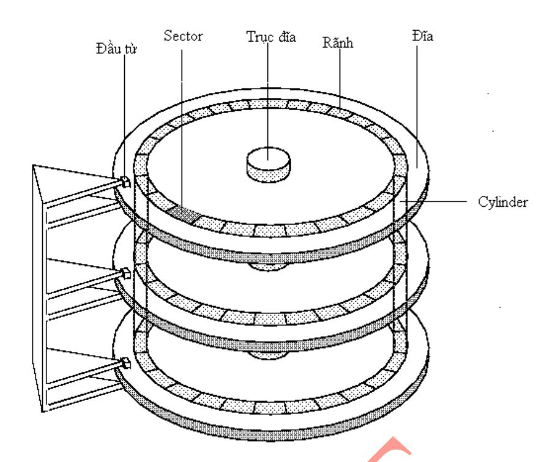

Hình 4.18. Hình ảnh chụp ổ đĩa cứng đã bỏ lớp vỏ bảo vệ và tổ chức thông tin trên đĩa cứng.

Trước đây, kích thước phổ biến và mặc định của sector là 512B. Hiện nay, các đĩa cứng có kích thước sector mặc định là 4KB, trong khi các thẻ nhớ USB vẫn sử dụng kích thước sector là 512B như đĩa cứng trước đây. Một số hệ thống đĩa cứng cho phép thay đổi kích thước mặc định, ví dụ thành 1024B thay cho 512B, bằng cách format lại đĩa cứng ở mức thấp. Chức năng format mức thấp đối với PC được thực hiện qua giao diện của BIOS mà người dùng có thể sử dụng trong quá trình khởi động máy. Đối với đĩa CD và DVD, kích thước sector thông thường là 2KB. PTIT

**Format đĩa ở mức thấp và cấu trúc sector**. Trước khi sử dụng, đĩa cứng cần được format ở mức thấp hay còn gọi là format ở mức vật lý. Công đoạn này thường được nhà sản xuất thực hiện luôn, tuy nhiên một số đĩa cứng cho phép người sử dụng tự format mức thấp lại với các thay đổi về số lượng rãnh hay kích thước của sector.

Format mức thấp là quá trình phân chia đĩa thành các sector và điền vào sector một số thông tin mà bộ điều khiển đĩa sẽ sử dụng khi đọc/ghi thông tin. Thông thường, mỗi sector sẽ có phần đầu, phần đuôi, và phần giữa chứa dữ liệu kích thước 512B hoặc thay đổi theo tham số được đặt khi format. Phần đầu và đuôi chứa thông tin mô tả sector, trong đó quan trọng nhất là số thứ tự sector và mã sửa sai. Số thứ tự của sector được sử dụng để xác định sector trên mỗi rãnh. Mã sửa sai được sử dụng để kiểm tra tính đúng đắn và toàn vẹn của dữ liệu ghi trên sector, cũng như cho phép khôi phục dữ liệu trong trường hợp có hư hỏng nhẹ. Sau mỗi thao tác ghi dữ liệu, bộ điều khiển đĩa sẽ tính lại mã sửa sai từ nội dung mới của sector và cập nhật lại thông tin này vào phần đuôi sector. Khi đọc, bộ điều khiển tính toán lại mã sửa sai từ dữ liệu đọc được từ phần dữ liệu của sector và so sánh với mã sửa sai lưu ở đuôi. Nếu mã tính được không trùng với mã đã lưu thì nội dung phần dữ liệu đã bị sai lệch và sector sẽ bị đánh dấu là sector hỏng. Mã sửa sai được thiết kế sao cho bộ điều khiển đĩa có thể dùng để khôi phục dữ liệu bị hỏng nếu như số lượng dữ liệu hỏng không quá nhiều.

**Phân hoạch đĩa và format mức cao**. Sau khi đã format ở mức thấp, trước khi có thể sử dụng, đĩa cứng còn được phân chia thành các đĩa logic hay còn gọi là phân hoạch (partition) và được format ở mức cao. Hai công đoạn này do hệ điều hành thực hiện.

Phân hoạch là phân chia đĩa cứng thành các phân vùng (partition) gồm các cylinder nằm liền nhau, mỗi vùng được hệ điều hành coi như một đĩa riêng biệt. Trong quá trình chia đĩa, các thông tin về vị trí bắt đầu, kích thước, tính chất của các vùng đĩa được lưu trong một cấu trúc gọi là bảng chia đĩa (partition table) nằm trong sector đầu tiên trên đĩa gọi là MBR (master boot record). Trên hình 4.19 là hình chụp giao diện chương trình Disk manager của Windows 7 với các đĩa cứng được chia thành phân vùng và đĩa logic.

Hình 4.19. Giao diện chương trình Disk manager của Windows với đĩa cứng và thẻ SSD được chia thành các phân vùng (partition) và đĩa logic. PTIT

Sau khi kết thúc phân hoạch, mỗi phân vùng hay đĩa logic được format ở mức cao. Thực chất của việc format mức cao là tạo ra hệ thống file trên đĩa logic. Trong quá trình format mức cao, các cấu trúc dữ liệu cần thiết cho hệ thống file sẽ được ghi lên đĩa. Kích thước cluster cũng được xác định trong quá trình này. Thông thường, quá trình format mức cao bao gồm việc xác định các cluster, xác định các cluster đã sử dụng, các cluster còn trống và tạo ra thư mục gốc. Nếu hệ thống file sử dụng bảng chỉ số (như bảng FAT), thì bảng sẽ được tạo trong giai đoạn format này.

## **Thiết bị nhớ ngoài SSD**

Thẻ nhớ SSD (Solid-State Disk) hay còn gọi là đĩa điện tử (electronic disk) là dạng thiết bị nhớ ngoài đang dần được sử dụng rộng rãi trong máy tính hiện nay, đặc biệt là trong máy tính xách tay và thiết bị di động với vai trò tương tự đĩa cứng (cần phân biệt với thẻ nhớ USB). Khác với đĩa thông thường, thẻ nhớ SSD không có phần chuyển động và đầu đọc mà được tạo thành từ các mạch nhớ sử dụng công nghệ tương tự như DRAM, hay EEPROM, hoặc mạch nhớ flash. Trong trường hợp sử dụng công nghệ DRAM, thẻ nhở SSD có nguồn nuôi riêng để không bị mất nội dung khi máy tính không được cấp điện.

Về mặt giao tiếp vật lý và logic, thẻ nhớ SSD sử dụng cùng giao diện cho phép đọc ghi dữ liệu theo khối giống như đĩa cứng thông thường. Do vậy, đối với hệ thống vào/ra của máy tính và hệ điều hành, thẻ nhớ SSD không khác biệt so với đĩa cứng.

Trong khi có đặc điểm tương tự đĩa cứng, thẻ nhớ SSD ít bị hỏng hơn do không có phần chuyển động. Tốc độ truy cập SSD cũng nhanh hơn đĩa cứng truyền thống do không mất thời gian định vị đầu đọc tới sector cần truy cập. Ổ SSD cũng tiêu thụ ít điện năng hơn đĩa cứng. Tuy nhiên, thẻ SSD thường có dung lượng nhỏ hơn đĩa cứng trong khi giá thành tính trên một đơn vị nhớ, ví dụ trên mỗi megabyte dung lượng, lại cao hơn đĩa cứng. Do những đặc điểm này, thẻ nhớ SSD thường được sử dụng cho các thiết bị di động, máy tính xách tay, cũng như dùng lưu những dạng dữ liệu cần có thời gian truy cập nhanh. Nhiều máy tính sử dụng kết hợp thiết bị SSD với đĩa cứng, trong đó SSD được dùng để lưu dữ liệu khôi phục máy từ trạng thái nghỉ, để dùng cho việc trao đổi từ bộ nhớ trong ra bộ nhớ ngoài. Một số hệ thống máy tính sử dụng thẻ nhớ SSD làm bộ nhớ cache giữa bộ nhớ trong và đĩa cứng thông thường để tăng tốc độ trao đổi thông tin giữa bộ nhớ trong và bộ nhớ ngoài.

#### **4.11.2. Điều độ đĩa**

Điều độ đĩa (disk scheduling) là quyết định thứ tự các thao tác đọc/ghi đĩa.

Trong quá trình hoạt động, các tiến trình gửi cho hệ điều hành các yêu cầu đọc/ghi đĩa thông qua các lời gọi hệ thống tương ứng. Nếu tại thời điểm nhận được yêu cầu, hệ thống không bận thực hiện thao tác với đĩa, yêu cầu đó sẽ được xử lý ngay. Ngược lại, nếu đĩa cứng đang thực hiện thao tác đọc/ghi khác, yêu cầu sẽ được xếp vào hàng đợi. Khi kết thúc thao tác vào/ra hiện thời, hệ thống chọn trong hàng đợi một yêu cầu để thực hiện. Nếu trong hàng đợi có nhiều hơn một yêu cầu, hệ điều hành sẽ lựa chọn yêu cầu nào được thực hiện trước. Như đã nói trong phần trước, trước khi có thể đọc/ghi cần mất thời gian để di chuyển đầu từ của đĩa (seek time) và chờ cho sector cần đọc quay tới vị trí đầu từ (latency time). Do vậy, việc lựa chọn thứ tự thực hiện các yêu cầu hợp lý có thể tối ưu thời gian thực hiện các yêu cầu đọc/ghi đĩa do tiết kiệm thời gian định vị đầu từ. Việc lựa chọn này được tiến hành dựa trên chiến lược điều độ đĩa, và thường được lựa chọn dựa trên một tiêu chí nào đó, ví dụ tiêu chí về thời gian, hay về tính công bằng. PTIT

Để điều độ đĩa, hệ điều hành sử dụng các thông tin về yêu cầu đọc/ghi. Các thông tin này có trong lời gọi hệ thống mà tiến trình gửi cho hệ điều hành để yêu cầu và thường bao gồm các thành phần sau: 1) dạng yêu cầu (đọc hay ghi); 2) vị trí cần đọc trên đĩa; 3) số lượng sector hay cluster cần đọc; 4) địa chỉ vùng bộ nhớ trong để chứa thông tin ghi ra hoặc đọc vào.

Sau đây, ta sẽ xem xét một số chiến lược điều độ đĩa thông dụng. Cần lưu ý rằng do thẻ nhớ SSD không mất thời gian định vị nên không cần quan tâm tới điều độ đĩa, yêu cầu tới trước sẽ được xử lý trước.

Đây là chiến lược điều độ đơn giản nhất. Các yêu cầu vào/ra được xếp vào hàng đợi FIFO và được xử lý theo đúng thứ tự xuất hiện. Chiến lược này đảm bảo tính công bằng, tuy nhiên nếu các yêu cầu xuất hiện liền nhau đòi hỏi truy cập các vùng đĩa nằm xa nhau thì sẽ tốn nhiều thời gian để định vị đầu từ và do vậy có tốc độ chậm.

Xét ví dụ sau, trong đó đầu từ hiện đang nằm tại cylinder 50 và hàng đợi chứa các yêu cầu truy cập tại các cylinder sau: 95, 180, 34, 119, 11, 123, 62, 64. Đĩa gồm 200 cylinder được đánh số từ 0 đến 199. Trên hình 4.20 thể hiện chuyển động của đầu từ nếu sử dụng chiến lược điều độ FCFS. Trước tiên đầu từ di chuyển từ cylinder 50 tới 95 (qua |50-95| cylinder), sau đó di chuyển tới cylinder 180 (|95-180|), tiếp theo quay lại cylinder 34 (180-34|) v.v. Dưới đây, ta sẽ thấy, so sánh với các phương pháp điều độ khác, quãng đường đầu từ di chuyển khi sử dụng FCFS là khá lớn.

Hình 4.20. Quãng đường di chuyển đầu từ trong điều độ FCFS

#### **Thời gian định vị ngắn trước (SSTF)**

Điều độ ưu tiên thời gian định vị ngắn trước (Shortest Seek Time First – SSTF) là phương pháp điều độ trong đó yêu cầu truy cập có vị trí gần vị trí hiện thời của đầu từ nhất sẽ được xử lý trước. Ở đây, khoảng cách tính bằng số cylinder, tức là tương ứng với thời gian định vị (seek time) nhỏ nhất. Với ví dụ ở trên, từ vị trí hiện thời ở cylinder 50, yêu cầu truy cập tại cylinder 62 là gần nhất và do vậy được chọn xử lý đầu tiên, tiếp theo là yêu cầu truy cập cylinder 64, rồi đến 34, 11, 95, 119, 123, 180 (hình 4.21).

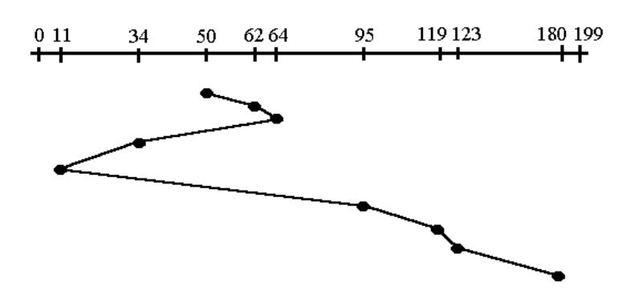

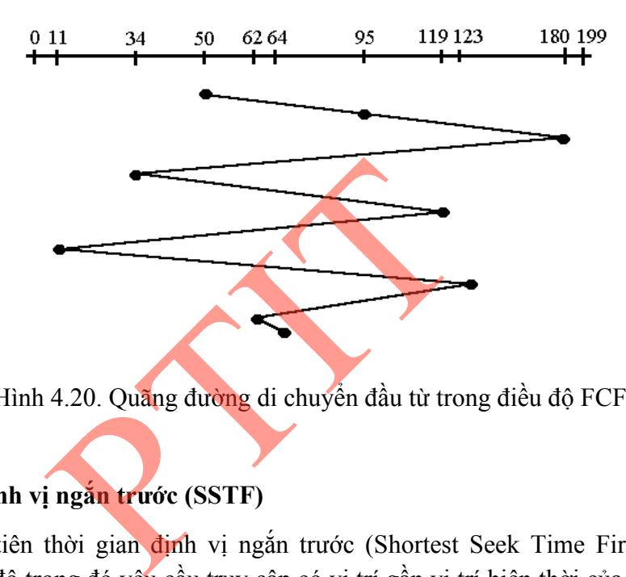

Điều độ SSTF thường có tốc độ cao hơn FCFS do tổng thời gian di chuyển đầu từ giữa các cylinder nhỏ hơn. Tuy nhiên, kiểu điều độ này có thể gây đói, tức là một số yêu cầu sẽ rất lâu không được xử lý. Giả sử trong ví dụ trên, khi đầu từ ở cylinder 34, xuất hiện thêm nhiều yêu cầu mới nằm gần cylinder 34, khi đó hệ thống sẽ xử lý các yêu cầu này vào do vậy các yêu cầu truy cập cylinder ở cuối đĩa (cylinder 180) sẽ phải chờ rất lâu mới đến lượt.

#### **SCAN**

Điều độ SCAN, hay còn gọi là điều độ kiểu thang máy (elevator) là kiểu điều độ trong đó đầu từ di chuyển từ cylinder ngoài cùng vào cylinder trong cùng, sau đó di chuyển ngược lại. Trên đường đi, tới mỗi cylinder, đầu từ sẽ xử lý yêu cầu vào ra tại cylinder đó nếu có. Hình 4.22 thể hiện thứ tự xử lý các yêu cầu trong ví dụ ở trên với điều độ SCAN. Phương pháp này có tên SCAN do đầu từ lần lượt quét tất cả các cylinder, và có tên thang máy do cách xử lý giống thang máy tại một số nhà cao tầng đi lần lượt từ tầng dưới cùng lên tầng trên cùng rồi lại đi ngược lại. Điều độ SCAN cũng có tổng thời gian định vị nhỏ hơn FCFS, trong khi đó đảm bảo không yêu cầu nào phải chờ đợi quá lâu.

Hình 4.22. Chuyển động của đầu từ trong điều độ SCAN

#### **C-SCAN**

C-SCAN là viết tắt của SCAN quay vòng (circular SCAN). Theo phương pháp này, đầu từ chỉ xử lý các yêu cầu khi di chuyển theo một chiều, ví dụ từ trong ra ngoài đĩa (từ cylinder số thứ tự cao đến cylinder số thứ tự thấp). Sau khi đã ra tới mép đĩa, đầu từ di chuyển ngược vào tâm đĩa và không xử lý gì trên đường đi. Khi đã vào tới tâm đĩa, đầu từ lặp lại chu trình xử lý như trên (hình 4.23). Như vậy danh sách các cylinder được hình dung như một danh sách vòng, tức là đầu của danh sách gắn với đuôi của danh sách, sau cylinder 0 sẽ là cylinder 199 (xem ví dụ trên hình dưới). Do vậy, phương pháp này được gọi là phương pháp SCAN quay vòng.

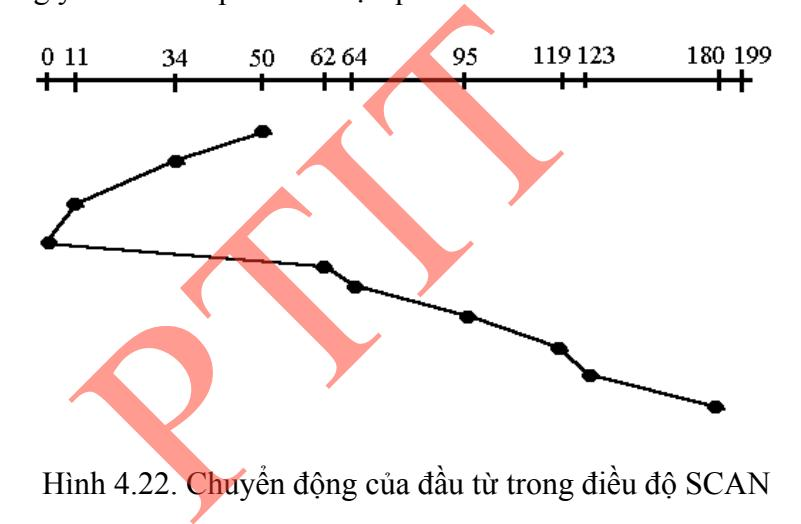

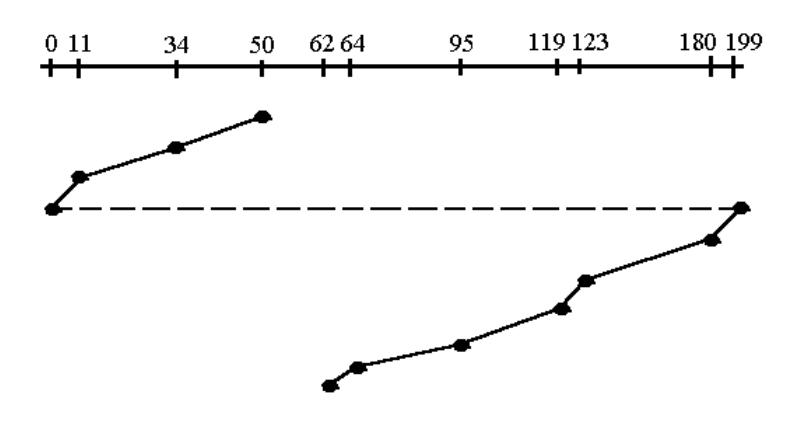

Hình 4.23: Chuyển động và thứ tự xử lý yêu cầu của đầu từ trong điều độ C-SCAN

#### **LOOK và C-LOOK**

Phương pháp điều độ LOOK và C-LOOK là biến thể của SCAN và C-SCAN, trong đó thay vì chuyển động tới cylinder trong cùng (gần tâm nhất) hoặc ngoài cùng (gần mép nhất) thì đầu từ chỉ chuyển động tới vị trí của yêu cầu xa nhất về phía trong tâm hoặc phía ngoài mép đĩa. Hình 4.24 minh họa cho điều độ C-LOOK. Như vậy, so với kiểu điều độ SCAN, điều độ LOOK tiết kiệm thời gian hơn do không phải di chuyển qua khoảng cách giữa yêu cầu xa nhất về mỗi hướng và cylinder ngoài cùng về mỗi hướng.

Hình 4.24. Chuyển động của đầu từ và thứ tự xử lý yêu cầu trong điều độ C-LOOK

#### **Lựa chọn phương pháp điều độ phù hợp**

Ảnh hưởng của phương pháp điều độ tới tốc độ xử lý vào ra phụ thuộc nhiều vào đặc điểm của hệ thống cụ thể. Với những hệ thống có tần suất vào ra không cao, tại mỗi thời điểm, trong hàng đợi thường chỉ có một yêu cầu vào/ra duy nhất. Khi đó, tất cả cả phương pháp điều độ sẽ cho kết quả giống như FCFS, tức là thực chất không điều độ gì cả. Đối với phương pháp cấp phát trong đó mỗi file gồm những khối nằm liền nhau, việc đọc/ghi file tuần tự sẽ tương đương với đọc ghi các khổi nằm liên tiếp, tương tự như SSTF hay SCAN hay LOOK.

Trong trường hợp nói chung, SSTF và LOOK có thể sử dụng như phương pháp điều độ mặc định, hoặc hệ thống có thể sử dụng một vài phương pháp điều độ tùy theo tình huống cụ thể.

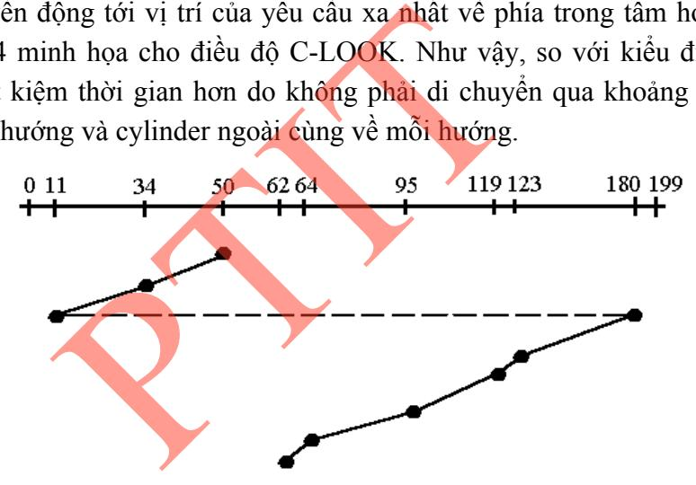

Các phương pháp điều độ nói trên chỉ có ý nghĩa đối với đĩa cứng. Thiết bị nhớ SSD, như đã nói ở trên, không đòi hỏi thời gian định vị trước khi ghi hay đọc, và do vậy các yêu cầu vào/ra được điều độ theo kiểu FCFS.

#### 4.12. QUẢN LÝ VÀO/RA

Trong phần trên, ta mới xem xét về vấn đề tổ chức và trao đổi thông tin với đĩa. Phần này sẽ đề cập rộng hơn tới việc quản lý vào/ra nói chung của toàn hệ thống máy tính.

Quản lý vào/ra là một trong những nhiệm vụ quan trọng của hệ điều hành. Các hoạt động chính của máy tính bao gồm tính toán và vào/ra dữ liệu hoặc thông tin khác. Vào/ra là quá trình dịch chuyển thông tin giữa bộ nhớ trong hoặc CPU với thiết bị vào/ra. Các thiết bị vào/ra dữ liệu rất đa dạng về chủng loại và tính chất, từ những thiết bị thông dụng như chuột, bàn phím, màn hình, các ổ đĩa, thẻ nhớ, card mạng, máy in, loa, microphone, màn cảm ứng, tới những thiết bị đặc thù như joystick trên máy tính game, bút điện tử, bảng vẽ điện tử v.v.

Do sự quan trọng của vào/ra thông tin và dữ liệu, nhiệm vụ quản lý vào/ra được phụ trách bởi một phân hệ; phân hệ này thường nằm trong nhân của hệ điều hành.

**Các yêu cầu đối với quản lý vào/ra**. Phân hệ quản lý vào/ra phải giải quyết được một số yêu cầu sau.

- Thứ nhất, thiết bị vào/ra rất khác nhau về chủng loại và tính chất. Hệ điều hành cần tạo ra các giao diện chung và chuẩn cho phép làm việc với nhiều kiểu thiết bị mà không phải quan tâm tới đặc điểm cụ thể của thiết bị. Do ngày càng có nhiều kiểu thiết bị mới xuất hiện, các giao diện chuẩn có thể không phù hợp với thiết bị mới, đòi hỏi khả năng mở rộng.
- Thứ ba, tốc độ vào ra ảnh hưởng tới tốc độ toàn hệ thống. Phân hệ quản lý vào/ra cần có biện pháp nâng cao hiệu năng vào/ra dữ liệu. PTIT

Dưới đây, ta sẽ xem xét cách tổ chức phân hệ vào/ra dữ liệu và các kỹ thuật cho phép đáp ứng các yêu cầu nói trên.

## **4.12.1. Phần cứng**

Phần cứng phục vụ vào/ra gồm: thiết bị vào/ra, các bộ điều khiển (controller) thiết bị, bus hoặc kết nối dưới dạng cổng (port).

Thiết bị vào/ra có thể phân loại theo nhiều cách. Theo mục đích sử dụng, thiết bị vào/ra được chia thành: thiết bị lưu trữ như đĩa, thẻ USB; thiết bị mạng như card mạng, modem; giao diện người dùng như chuột, bàn phím, màn hình, máy in.

Ngoài ra, thiết bị vào/ra được phân loại theo một số tiêu chí khác như dưới đây:

- Theo *chế độ truyền dữ liệu*, thiết bị được phân thành thiết bị dạng *ký tự* hay dạng *khối*. Thiết bị dạng ký tự truyền dữ liệu theo từng byte, điển hình là thiết bị giao diện như chuột, bàn phím. Thiết bị dạng khối truyền dữ liệu theo từng khối, như các đĩa.

- Theo *chế độ truy cập*, thiết bị được phân thành thiết bị truy cập tuần tự như băng từ và modem, hay truy cập trực tiếp như đĩa.
- Theo *thời gian truyền* dữ liệu, thiết bị được chia thành thiết bị đồng bộ (synchronous) hay dị bộ (asynchronous). Thiết bị đồng bộ, còn gọi là thiết bị gây khóa (blocking), yêu cầu sự phối hợp của các thành phần khác của máy tính và có thời gian phản hồi xác định, trong khi thiết bị bộ, còn gọi là non-blocking có thời gian đáp ứng không xác định. Nói cách khác, khi một tiến trình gửi yêu cầu vào/ra tới thiết bị đồng bộ như đĩa, tiến trình sẽ bị khóa và chuyển sang trạng thái chờ đợi cho tới khi yêu cầu vào/ra được xử lý song. Tiến trình thực hiện vào/ra với thiết bị dị bộ sẽ không bị khóa và vẫn có thể tiếp tục các công việc khác, chẳng hạn tiến trình có giao tiếp với bàn phím.
- Theo *khả năng chia sẻ*, thiết bị được chia thành loại có thể dùng chung như bàn phím hay thiết bị dành riêng như đĩa. Tại mỗi thời điểm, thiết bị dùng chung có thể phục vụ nhiều tiến trình khác nhau, trong khi thiết bị dành riêng chỉ có thể phục vụ một tiến trình hay một dòng.
- Theo *tốc độ*, thiết bị có thể có tốc độ vào/ra từ vài byte một giây tới hàng gigabit một giây.
- Theo *chế độ vào/ra*, ta có thiết bị chỉ đọc như bàn phím, thiết bị chỉ ghi như màn hình, hay thiết bị có thể cả đọc cả ghi như modem hay các đĩa.

## **4.12.2. Tổ chức phân hệ quản lý vào/ra**

#### *Nguyên tắc chung*

Như đã nói ở trên, yêu cầu đặt ra với quản lý vào/ra là cho phép các ứng dụng và tiến trình giao tiếp với thiết bị theo một chuẩn chung, tổng quát, không cần quan tâm tới đặc điểm cụ thể của thiết bị. Ví dụ, ứng dụng cần có khả năng đọc file mà không cần quan tâm tới đặc điểm cụ thể của đĩa hay thẻ nhớ nơi lưu file đó. Để thỏa mãn yêu cầu này, phân hệ vào/ra được thiết kế dựa trên hai kỹ thuật chính: PTIT

- Thứ nhất, phần quản lý vào/ra được phân lớp, các lớp ở mức trên có mức độ trừu tượng hóa cao hơn lớp mức dưới. Nói cách khác, càng lên mức cao hơn mức độ chuẩn hóa càng cao, càng ít liên quan tới chi tiết cụ thể của thiết bị.
- Thứ hai, mỗi thiết bị cụ thể được quản lý bởi một chương trình quản lý thiết bị riêng, được gọi là *driver*. Driver được lập trình theo các chi tiết kỹ thuật của thiết bị nhưng có giao diện giống nhau dưới dạng các hàm mà mô đun mức trên có thể gọi để giao tiếp với thiết bị. Như vậy, khi thiết bị thay đổi, ta chỉ cần thay đổi driver trong khi vẫn giữ nguyên các lớp trên. Sau khi được cài đặt, driver trở thành một thành phần của nhân và là lớp dưới cùng của phân hệ quản lý vào/ra.

Trên hình 4.25 thể hiện cấu trúc phân lớp của phân hệ vào/ra với các driver cho thiết bị.

# *Phân loại driver*

Do chủng loại và tính chất thiết bị rất khác nhau, không thể có giao diện chung cho tất cả các driver. Ví dụ, driver cho thiết bị vào/ra dạng khối như đĩa, sẽ cung cấp các hàm như read() hay write() cho phép đọc ghi từng khối dữ liệu. Trong khi đó, driver cho thiết bị vào/ra dạng ký tự, điển hình là bàn phím, sẽ cung cấp hàm get() hay put() cho phép gửi và nhận từng

byte. Để đảm bảo mức độ trừu tượng cao hơn, thuận lợi hơn cho các ứng dụng, các driver được nhóm lại thành những nhóm tương tự nhau, mỗi nhóm như vậy được chuẩn hóa để có cùng giao diện. Các nhóm driver thường gặp bao gồm:

- Nhóm vào/ra theo khối, cho các driver thiết bị như đĩa, thẻ USB. Giao diện cho driver thuộc nhóm này gồm các lệnh read(), write(), seek(), trong đó seek() chỉ dùng với thiết bị cho phép truy cập trực tiếp.
- Nhóm vào/ra theo chuỗi ký tự, bao gồm driver chuột, bàn phím hoặc thiết bị tương tự.
- Nhóm driver mạng. Ví dụ điển hình của giao diện với driver cho thiết bị mạng là giao diện dưới dạng *socket*. Giao diện dạng này gồm các hàm cho phép một ứng dụng tạo ra socket
  - có thể hiểu là điểm kết nối với ứng dụng ở xa tới một địa chỉ nào đó. Sau đó socket sẽ lắng nghe cho tới khi ứng dụng ở xa kết nối vào socket. Tiếp theo, giao diện cung cấp các hàm cho phép gửi và nhận dữ liệu với ứng dụng ở xa thông quan socket được tạo.

| m ề m n           |     | Ph       | ầ | n còn l ạ i c ủ | a h ệ đ i ề u hành      |
|-------------------|-----|----------|---|-----------------|-------------------------|
| ầ h P             |     |          |   | Phân h ệ qu ả   | n l ý vào/ra            |
| thi ế t b ị       |     |          |   |                 |                         |
| thi Driver        | ế   | t Driver | b | ị               | Driver Driver           |
|                   |     |          |   |                 | thi ế t b ị             |
|                   |     |          |   |                 | thi ế t b ị             |
| ứ ng              |     |          |   |                 |                         |
| B ộ đ i ề u       |     |          |   |                 |                         |
| khi ể n thi ế t   |     |          |   |                 |                         |
| b ị               |     |          |   |                 |                         |
| B ộ               | đ   | i        | ề | u               |                         |
| khi               | ể n | thi      |   | ế t             |                         |
|                   | b   | ị        |   |                 |                         |
|                   |     |          |   |                 | B ộ đ i ề u             |
|                   |     |          |   |                 | khi ể n thi ế t         |
|                   |     |          |   |                 | b ị                     |
|                   |     |          |   |                 | B ộ đ i ề u             |
|                   |     |          |   |                 | khi ể n thi ế t         |
| c n ầ h           |     |          |   |                 | b ị                     |
| Thi ế t b ị Thi P | ế   | t        | b | ị               | Thi ế t b ị Thi ế t b ị |

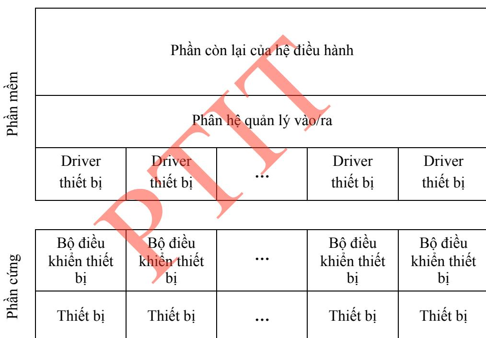

Hình 4.25: Cấu trúc phân hệ vào/ra

# *Các thao tác do driver thiết bị thực hiện*

Driver thiết bị chịu trách nhiệm thực hiện các công việc sau:

- Khởi tạo thiết bị.
- Giải mã các lệnh (lời gọi hệ thống) từ hệ điều hành.
- Quản lý việc truyền dữ liệu vào/ra thiết bị.
- Nhận và xử lý ngắt liên quan tới thiết bị.

- Đảm bảo tính nhất quán giữa các cấu trúc dữ liệu do driver và các mô đun khác của hệ điều hành sử dụng.

*Các bước xử lý yêu cầu vào/ra do driver thực hiện*.

Quy trình xử lý yêu cầu vào/ra của driver có thể tóm tắt một cách đơn giản với các thao tác sau:

- Kiểm tra tính hợp lệ của tham số trong yêu cầu vào/ra và dịch yêu cầu vào ra sang ngôn ngữ phù hợp với thiết bị.
- Kiểm tra xem thiết bị có rỗi không. Nếu thiết bị bận, tiến trình đưa yêu cầu xử lý có thể bị phong tỏa để chờ cho tới khi thiết bị hết bận.
- Sinh các lệnh điều khiển thiết bị: ghi vào thanh ghi tương ứng của bộ điều khiển thiết bị, kiểm tra độ sẵn sàng của thiết bị sau mỗi lệnh.
- Phong tỏa và chờ đến khi bộ điều khiển thiết bị thực hiện xong lệnh.
- Kiểm tra lỗi.
- Trả về thông tin trạng thái và kết thúc việc xử lý.

# **4.12.3. Quản lý vào/ra mức trên**

Trong phần trên, ta đã xem xét tổ chức chung phân hệ vào/ra và vai trò của driver. Trong phần này, ta sẽ xem xét một số chức năng khác của phân hệ vào/ra, thường do lớp trên của mô đun vào/ra đảm nhiệm. Các chức năng này hướng vào việc nâng cao tốc độ và độ ổn định vào/ra thông tin, bao gồm các công việc sau: điều độ vào/ra, đệm vào/ra với buffer và cache, xử lý lỗi. PTIT

Điều độ vào/ra là xác định thứ tự xử lý các yêu cầu vào/ra sao cho đạt được các tiêu chí về tốc độ, tính công bằng v.v. Ví dụ về điều độ vào/ra đã được trình bầy trong phần điều độ đĩa. Trong phần này ta sẽ xem xét đệm vào/ra và xử lý lỗi.

## **Đệm nhớ buffer**

Đệm nhớ buffer là kỹ thuật trong đó dữ liệu truyền giữa hai thiết bị hoặc giữa một thiết bị với một ứng dụng được ghi tạm thời vào một vùng bộ nhớ gọi là bộ đệm buffer. Thường dữ liệu được lưu vào buffer khi mới đọc vào từ thiết bị (ví dụ từ bàn phím), hoặc được giữ trong buffer trước khi ghi ra thiết bị (ví dụ trước khi ghi ra đĩa). Buffer cũng được sử dụng khi truyền dữ liệu giữa hai tiến trình.

Đệm nhớ buffer được sử dụng để giải quyết một số vấn đề sau:

- Sự khác nhau về tốc độ giữa thiết bị truyền và nhận dữ liệu. Ví dụ, khi cần lưu dữ liệu truyền qua modem vào đĩa cứng. Do modem chậm hơn đĩa nên dữ liệu từ modem được lưu tạm vào đệm nhớ cho tới khi đủ nhiều mới được ghi cùng nhau ra đĩa. Thông thường sẽ có hai đệm nhớ buffer được sử dụng trong trường hợp này. Khi đệm nhớ thứ nhất đầy, dữ liệu được ghi ra đĩa, trong khi đó dữ liệu nhận được từ modem tiếp tục được lưu vào đệm nhớ thứ hai. Khi đệm nhớ thứ hai đầy, vai trò hai đệm nhớ lại thay đổi. Cơ chế đệm kép như vậy được minh họa trên hình 4.26.

Hình 4.26. Cơ chế đệm kép

- Vấn đề khác nhau về kích thước dữ liệu truyền và nhận. Khi truyền dữ liệu qua mạng, dữ liệu được chia thành gói. Sau đó các gói sẽ được tập hợp và sắp xếp lại theo đúng thứ tự. Trong lúc chờ đợi để nhận đủ các gói cần cho việc sắp xếp lại, dữ liệu được lưu trong bộ đệm buffer.

## **Đệm nhớ cache**

Đệm nhớ cache là phần bộ nhớ tốc độ cao dùng làm bộ nhớ trung gian khi truyền dữ liệu giữa thiết bị nhớ tốc độ thấp với thiết bị nhớ tốc độ cao. Trước tiên, dữ liệu được truyền từ bộ nhớ tốc độ thấp (ví dụ đĩa cứng) vào bộ nhớ cache, sau đó được chuyển từ cache vào bộ nhớ tốc độ cao (ví dụ bộ nhớ trong). Khi thực hiện thao tác đọc tiếp theo, nếu phần dữ liệu cần đọc nằm trong cache thì dữ liệu đó được đọc từ cache, thay vì đọc từ đĩa, và do vậy sẽ nhanh hơn nhiều. Do nguyên lý cục bộ về thời gian, tức là thường một dữ liệu được truy cập lại trong tương lai gần, hoặc dữ liệu nằm gần nhau thường được truy cập trong những khoảng thời gian liền nhau, sử dụng cache cho phép tăng tốc độ truy cập dữ liệu. PTIT

Như vậy, điểm khác biệt chính giữa bộ đệm cache với bộ đệm buffer là cùng một dữ liệu trong cache hoặc láng giềng của dữ liệu đó được truy cập nhiều lần trong khoảng thời gian ngắn, trong khi dữ liệu trong buffer không như vậy. Tuy nhiên, trên thực tế, bộ đệm buffer cũng có thể dùng luôn làm bộ đệm cache.

#### **Spooling**

Spooling là kỹ thuật cho phép nhiều tiến trình cùng ghi thông tin ra những thiết bị chỉ có khả năng phục vụ một tiến trình tại một thời điểm như máy in. Khi tiến trình gửi dữ liệu ra máy in, hệ điều hành sẽ nhận dữ liệu này thay vì gửi trực tiếp ra máy in. Dữ liệu từ mỗi tiến trình được ghi vào một đệm nhớ buffer riêng, thường là một file. Khi tiến trình đã hoàn thành việc ghi dữ liệu ra file, file sẽ được xếp vào hàng đợi để chuyển ra máy in khi đến lượt. Như

vậy, nhiều tiến trình có thể đồng thời thực hiện thao tác in, trong khi trên thực tế, tại mỗi thời điểm chỉ một file đệm được ghi ra máy in.

## **Xử lý lỗi**

Thiết bị vào/ra, cũng như bản thân thao tác vào/ra dữ liệu có thể gặp nhiều dạng lỗi khác nhau. Có những lỗi không nghiêm trọng, có thể dễ dàng khắc phục, ví dụ lỗi không đọc được dữ liệu do đĩa cứng chưa quay đủ tốc độ cần thiết, hay lỗi do mạng bị quá tải nên tạm thời không truyền được dữ liệu. Có những lỗi nghiêm trọng hơn, ví dụ lỗi hỏng bộ điều khiển đĩa.

Hệ điều hành thường được thiết kế để tự xử lý một số lỗi đơn giản. Ví dụ, khi thao tác đọc đĩa bị lỗi, hệ điều hành sẽ lặp lại thao tác đọc một số lần nhất định để chờ đĩa được chuyển sang trạng thái sẵn sàng.

Với những lỗi nghiêm trọng hơn, hệ điều hành thường không thể tự xử lý. Cách giải quyết thông thường là với mỗi thao tác vào/ra, hệ điều hành trả về thông tin trạng thái. Thông tin này cho biết thao tác vào/ra có được thực hiện thành công hay không và một số thông tin cụ thể về dạng lỗi xẩy ra (nếu có). Các ứng dụng sẽ tự quyết định phải làm gì, dựa trên những thông tin về lỗi do lời gọi hệ thống trả lại.

## 4.13. CÂU HỎI VÀ BÀI TẬP CHƯƠNG

- 1. Hệ điều hành có nên nhận biết và hỗ trợ các kiểu file khác nhau không, ví dụ file văn bản, file chương trình, file cơ sở dữ liệu v.v.? Trong câu trả lời hãy phân tích ưu nhược điểm của việc hỗ trợ và không hỗ trợ kiểu file. Lấy ví dụ việc hỗ trợ/không hỗ trợ kiểu file trên một hệ điều hành thông dụng.
- 2. Giải thích ý nghĩa thao tác mở file và đóng file.
- 3. Hãy lấy ví dụ một vài ứng dụng đòi hỏi truy cập file theo phương pháp truy cập: 1) tuần tự; 2) trực tiếp.
- 4. Giả sử hợp hệ thống chỉ hỗ trợ thư mục một mức nhưng cho phép sử dụng tên file dài tùy ý. Có thể mô phỏng thư mục nhiều mức trong trường hợp này không? Hãy giải thích cách làm nếu câu trả lời là "có" hoặc giải thích nguyên nhân không mô phỏng được nếu câu trả lời là "không".
- 5. Thay vì sử dụng ACL (Access Control List danh sách quản lý truy cập) gắn với mỗi file có thể sử dụng UCL (User Control List – danh sách quản lý người dùng) gắn với mỗi người dùng và quy định người đó được truy cập file nào. Hãy cho biết trong trường nào dùng UCL ưu điểm hơn so với dùng ACL ?
- 6. Giả sử hệ thống file hỗ trợ cả ba phương pháp cấp phát không gian: cấp phát khối liên tiếp, sử dụng danh sách kết nối, và sử dụng khối chỉ số. Cần xem xét các tiêu chí nào khi lựa chọn phương pháp cấp phát cho một file cụ thể. PTIT

- 7. Viết chương trình đọc và in các tham số chính trong BOOT từ đĩa logic trên thẻ nhớ USB với FAT16 sử dụng hàm đọc sector mức thấp absread. Lưu ý: để chạy được absread, cần sử dụng các hệ điều hành không phân biệt chế độ đặc quyền và chế độ người dùng như Windows 98; có thể cài Windows 98 trên máy ảo để thực hiện bài tập này.
- 8. Giải thích các bước và viết chương trình đọc và in nội dung 100 ô đầu tiên của bảng FAT trên USB, biết rằng FAT là FAT16. Chương trình cần sử dụng hàm đọc ghi sector mức thấp absread như ở câu trên.
- 9. Giải thích các bước và viết chương trình in ra tên, phần mở rộng, ngày tháng tạo file, kích thước file, số thứ tự cluster đầu tiên của các file nằm trong thư mục gốc trên USB. Giả sử tất cả tên file là tên file ngắn (không quá 8 ký tự), FAT là FAT 16. Chương trình cần sử dụng hàm đọc ghi sector mức thấp absread như ở câu trên.

## **TÀI LIỆU THAM KHẢO**

- 1. A. Silbeschatz, P.B. Galvin, G. Gagne. Operating system concepts. 9th edition. John Wiley & Sons. 2013.
- 2. W. Stallings. Operating Systems: Internals and Design Principles. 7th edition. Prentice Hall 2012.
- 3. A.S. Tanenbaum. Modern operating systems. 3rd edition. Prentice Hall 2008.
- 4. Nguyễn Thanh Tùng. Giáo trình Hệ điều hành. ĐHBK Hà nội 1999.
- 5. Hà Quang Thụy. Giáo trình Nguyên lý các hệ điều hành. In lần thứ ba. NXB KHKT 2009.
- 6. C. Crowley. Operating systems: A design-oriented approach. Irwin Professional Publishing 1996.
- 7. Từ Minh Phương. Bài giảng hệ điều hành. Học viện Công nghệ bưu chính viễn thông 2009.

PTIT

